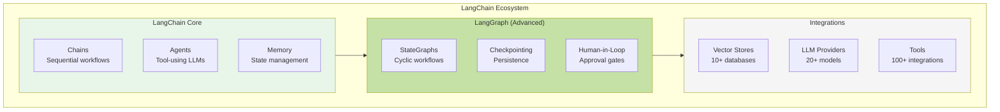
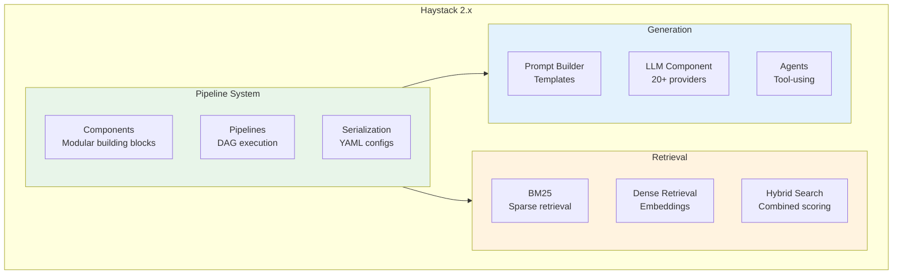
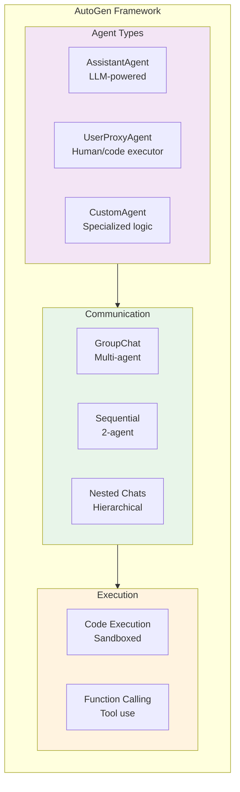
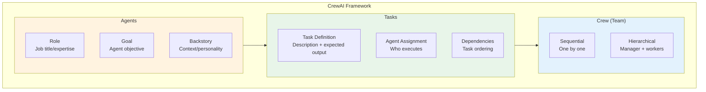
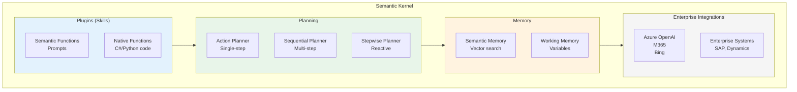
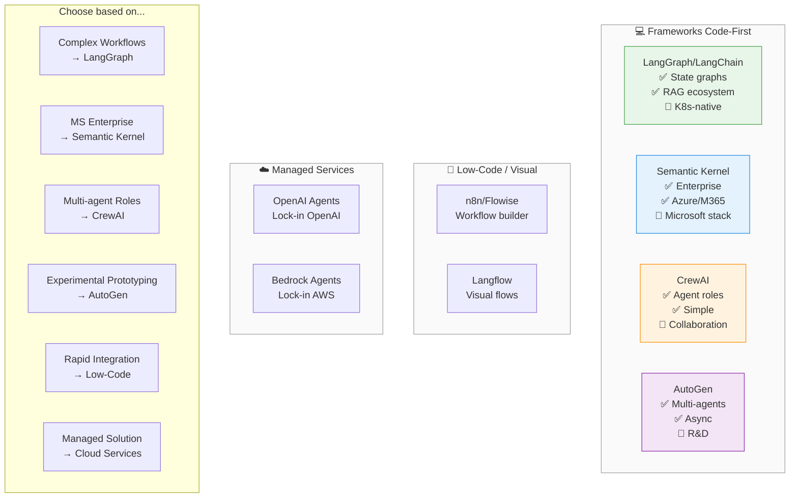

```mermaid
flowchart TB
    subgraph LlamaIndex_Stack["LlamaIndex Ecosystem"]
        subgraph DataLayer["Data Layer"]
            Loaders["Data Loaders<br/>100+ connectors"]
            Parsers["Parsers<br/>PDF, HTML, Code"]
            Transformers["Transformers<br/>Chunking, metadata"]
        end
        
        subgraph IndexLayer["Index Layer"]
            VectorIndex["Vector Index<br/>Dense retrieval"]
            GraphIndex["Knowledge Graph<br/>Structured retrieval"]
            TreeIndex["Tree Index<br/>Hierarchical"]
        end
        
        subgraph QueryLayer["Query Layer"]
            Retriever["Retrievers<br/>Hybrid search"]
            QueryEngine["Query Engines<br/>RAG pipelines"]
            ChatEngine["Chat Engines<br/>Conversational"]
        end
        
        subgraph AgentLayer["Agent Layer"]
            ReAct["ReAct Agents<br/>Tool-using"]
            FunctionCalling["Function Calling<br/>Structured output"]
        end
    end
    
    DataLayer --> IndexLayer
    IndexLayer --> QueryLayer
    QueryLayer --> AgentLayer
    
    style DataLayer fill:#e3f2fd
    style IndexLayer fill:#fff3e0
    style QueryLayer fill:#e8f5e9
    style AgentLayer fill:#f3e5f5
```

```mermaid
flowchart TB
    subgraph n8n_Stack["n8n Platform"]
        subgraph Visual["Visual Editor"]
            Canvas["Drag-Drop Canvas<br/>Node-based workflows"]
            Nodes["400+ Nodes<br/>Pre-built integrations"]
            Triggers["Triggers<br/>Webhook, schedule, manual"]
        end
        
        subgraph AI_Nodes["AI & Agent Nodes"]
            LLMNode["LLM Nodes<br/>OpenAI, Anthropic, local"]
            AgentNode["AI Agent Node<br/>ReAct, conversational"]
            VectorStore["Vector Store Nodes<br/>Pinecone, Qdrant, Supabase"]
            MemoryNode["Memory Nodes<br/>Conversation buffer"]
        end
        
        subgraph Execution["Execution"]
            Queue["Job Queue<br/>Redis/PostgreSQL"]
            SelfHosted["Self-hosted<br/>Docker/K8s"]
            Cloud["n8n Cloud<br/>Managed service"]
        end
        
        subgraph Integrations["Enterprise Integrations"]
            APIs["REST/GraphQL APIs"]
            Databases["Databases<br/>PostgreSQL, MongoDB"]
            Services["SaaS Tools<br/>Slack, Notion, GitHub"]
        end
    end
    
    Visual --> AI_Nodes
    AI_Nodes --> Execution
    Execution --> Integrations
    
    style Visual fill:#e8f5e9
    style AI_Nodes fill:#fff3e0
    style Execution fill:#e3f2fd
    style Integrations fill:#f5f5f5
```

```mermaid
flowchart TB
    subgraph Flowise_Stack["Flowise Platform"]
        subgraph Visual_Flow["Visual Builder"]
            Drag["Drag-Drop Canvas<br/>LangChain components"]
            Templates["Templates<br/>Pre-built flows"]
            CustomNodes["Custom Nodes<br/>Extend with code"]
        end
        
        subgraph LangChain_Nodes["LangChain Components as Nodes"]
            LLMs["LLM Nodes<br/>20+ providers"]
            Chains["Chain Nodes<br/>Sequential, RAG"]
            Agents_F["Agent Nodes<br/>ReAct, OpenAI Functions"]
            Memory_F["Memory Nodes<br/>Buffer, summary, vector"]
            VectorDB_F["Vector DB Nodes<br/>10+ databases"]
            Tools_F["Tool Nodes<br/>Web search, calculator, API"]
        end
        
        subgraph Deployment["Deployment"]
            API["REST API<br/>Auto-generated"]
            Embed["Embedded Chat<br/>Widget"]
            Docker_F["Docker<br/>Self-hosted"]
        end
    end
    
    Visual_Flow --> LangChain_Nodes
    LangChain_Nodes --> Deployment
    
    style Visual_Flow fill:#c5e1a5
    style LangChain_Nodes fill:#fff9c4
    style Deployment fill:#e3f2fd
```

```mermaid
flowchart TB
    subgraph Langflow_Stack["Langflow Platform"]
        subgraph Builder["Flow Builder"]
            GraphEditor["Graph Editor<br/>Component-based"]
            ComponentLib["Component Library<br/>Extensible"]
            Playground["Playground<br/>Test flows live"]
        end
        
        subgraph Components["Built-in Components"]
            LLM_L["LLMs<br/>OpenAI, Anthropic, local"]
            Prompts["Prompt Templates<br/>Dynamic prompts"]
            Agents_L["Agents<br/>Tool-using, multi-agent"]
            VectorStores_L["Vector Stores<br/>15+ databases"]
            DataLoaders["Data Loaders<br/>PDF, web, API"]
            Memory_L["Memory<br/>Conversation, entity"]
        end
        
        subgraph Enterprise["Enterprise Features"]
            Versioning["Version Control<br/>Flow history"]
            Sharing["Sharing<br/>Team collaboration"]
            Monitoring["Monitoring<br/>Usage analytics"]
        end
        
        subgraph Deploy["Deployment"]
            API_L["REST API<br/>Production endpoints"]
            Docker_L["Docker/K8s<br/>Self-hosted"]
            Cloud_L["DataStax Cloud<br/>Managed"]
        end
    end
    
    Builder --> Components
    Components --> Enterprise
    Enterprise --> Deploy
    
    style Builder fill:#e8f5e9
    style Components fill:#fff3e0
    style Enterprise fill:#f3e5f5
    style Deploy fill:#e3f2fd
```

# AI Agent Frameworks: Comprehensive Comparison

## Overview

This document provides an in-depth comparison of AI agent frameworks for building production GenAI applications. We analyze 10+ frameworks across architecture, features, performance, and enterprise readiness.

**Framework Categories**:
1. **Code-First (Python/TypeScript)**: LangChain/LangGraph, LlamaIndex, Haystack, AutoGen, CrewAI, Semantic Kernel
2. **Low-Code/Visual**: n8n, Flowise, Langflow
3. **Managed Services**: OpenAI Agents, Amazon Bedrock Agents, Vertex AI Agent Builder

## Executive Summary

| Framework | Best For | Maturity | Enterprise | License |
|-----------|----------|----------|------------|----------|
| **LangChain/LangGraph** | Complex workflows, RAG | 🟢 Production | ✅ Yes | MIT |
| **LlamaIndex** | RAG-first, data ingestion | 🟢 Production | ✅ Yes | MIT |
| **Haystack** | Production search+QA | 🟢 Production | ✅ Yes | Apache 2.0 |
| **AutoGen** | Multi-agent research | 🟡 Experimental | ⚠️ Limited | MIT |
| **CrewAI** | Role-based agents | 🟡 Growing | ⚠️ Limited | MIT |
| **Semantic Kernel** | Microsoft ecosystem | 🟢 Production | ✅ Yes | MIT |
| **n8n/Flowise** | Visual workflows | 🟢 Production | ✅ Yes | Fair-code/MIT |
| **OpenAI Agents** | Managed, simple | 🟢 Production | ✅ Yes | Proprietary |
| **Bedrock Agents** | AWS ecosystem | 🟢 Production | ✅ Yes | Proprietary |

---

## Detailed Framework Profiles

### LangChain / LangGraph

**Positioning**: Industry-leading agent orchestration with stateful workflows

**Architecture**:

**Key Components**:
- **LangChain**: Foundation library (chains, agents, memory, tools)
- **LangGraph**: State machine for complex agent workflows
- **LangSmith**: Observability, debugging, evaluation (commercial)
- **LangServe**: Deploy chains as REST APIs

**Strengths**:
- ✅ **Largest ecosystem** (100+ integrations)
- ✅ **Production-ready** (used by 1000s of companies)
- ✅ **Stateful workflows** (LangGraph cycles, checkpoints)
- ✅ **Observability** (LangSmith tracing)
- ✅ **Active development** (weekly releases)
- ✅ **Enterprise support** (LangChain Inc.)

**Limitations**:
- ❌ **Complexity** (steep learning curve)
- ❌ **Breaking changes** (frequent API updates)
- ❌ **Abstraction overhead** (verbose code)
- ❌ **LangSmith cost** (observability not free)

**Best For**:
- Complex multi-step workflows
- RAG with advanced retrieval
- Production deployments at scale
- Teams needing observability

**Maturity**: 🟢 Production (v0.3.x, 2+ years)

**Community**: 90K+ GitHub stars, 2K+ contributors

---

### LlamaIndex

**Positioning**: RAG-first framework with data ingestion focus

**Architecture**:

**Key Components**:
- **Data Loaders**: 160+ connectors (S3, Notion, Google Drive, databases)
- **Indexes**: Vector, knowledge graph, tree, list, keyword
- **Query Engines**: RAG pipelines with various retrieval strategies
- **Agents**: ReAct, function calling, workflow agents

**Strengths**:
- ✅ **Best RAG library** (data ingestion focus)
- ✅ **160+ data connectors** (most in ecosystem)
- ✅ **Multiple index types** (vector, graph, hierarchical)
- ✅ **Production observability** (LlamaCloud tracing)
- ✅ **Structured outputs** (Pydantic validation)
- ✅ **Active development** (weekly releases)

**Limitations**:
- ❌ **Agent capabilities limited** (focus is RAG, not agents)
- ❌ **Less flexible workflows** vs LangGraph
- ❌ **Documentation gaps** (fast-moving project)
- ❌ **LlamaCloud cost** (managed service not free)

**Best For**:
- RAG-first applications
- Complex data ingestion pipelines
- Knowledge graph + vector hybrid
- Structured data extraction

**Maturity**: 🟢 Production (v0.11.x, 2+ years)

**Community**: 36K+ GitHub stars, 900+ contributors

---

### Haystack

**Positioning**: Production-grade NLP framework for search and QA

**Architecture**:

**Key Components**:
- **Pipelines**: DAG-based component orchestration
- **Components**: Reusable, composable building blocks
- **Document Stores**: Elasticsearch, OpenSearch, Weaviate, Qdrant
- **Agents**: Tool-using agents with memory

**Strengths**:
- ✅ **Enterprise-ready** (deepset.ai company backing)
- ✅ **Production stability** (mature, tested)
- ✅ **Clean architecture** (v2.x redesign)
- ✅ **YAML pipelines** (declarative configs)
- ✅ **Hybrid search** (BM25 + dense)
- ✅ **Strong documentation** (comprehensive)

**Limitations**:
- ❌ **Smaller ecosystem** vs LangChain/LlamaIndex
- ❌ **Limited agent features** (focus is retrieval)
- ❌ **Less community content** (fewer examples)
- ❌ **Opinionated** (specific patterns enforced)

**Best For**:
- Production search systems
- Hybrid retrieval pipelines
- Enterprise deployments
- Teams valuing stability over features

**Maturity**: 🟢 Production (v2.x, 4+ years)

**Community**: 17K+ GitHub stars, 250+ contributors

---

### AutoGen

**Positioning**: Microsoft Research multi-agent framework

**Architecture**:

**Key Components**:
- **Agents**: Conversational agents with roles
- **GroupChat**: Multi-agent coordination
- **Code Execution**: Sandboxed Python execution
- **Human-in-Loop**: Approval workflows

**Strengths**:
- ✅ **Multi-agent native** (built for agent collaboration)
- ✅ **Code execution** (built-in sandboxing)
- ✅ **Microsoft backing** (research-driven)
- ✅ **Async support** (concurrent agents)
- ✅ **Experimentation-friendly** (research use cases)

**Limitations**:
- ❌ **Experimental** (frequent breaking changes)
- ❌ **Limited production use** (mostly research)
- ❌ **Documentation incomplete** (fast-moving)
- ❌ **No commercial support** (research project)
- ❌ **Complex debugging** (multi-agent interactions)

**Best For**:
- Research and experimentation
- Multi-agent prototypes
- Code generation workflows
- Academic projects

**Maturity**: 🟡 Experimental (v0.2.x, 1+ year)

**Community**: 32K+ GitHub stars, 500+ contributors

---

### CrewAI

**Positioning**: Role-based multi-agent framework

**Architecture**:

**Key Components**:
- **Agents**: Role-based with goals and backstories
- **Tasks**: Discrete work units with outputs
- **Crews**: Teams of agents with coordination
- **Tools**: LangChain tools integration

**Strengths**:
- ✅ **Simplest API** (easy to learn)
- ✅ **Role-based abstraction** (intuitive mental model)
- ✅ **Process templates** (sequential, hierarchical)
- ✅ **LangChain compatible** (reuse tools)
- ✅ **Growing community** (active development)

**Limitations**:
- ❌ **Limited to roles** (not flexible workflows)
- ❌ **No state management** (unlike LangGraph)
- ❌ **Young project** (<1 year)
- ❌ **Limited observability** (basic logging)
- ❌ **Production gaps** (error handling, retries)

**Best For**:
- Simple multi-agent prototypes
- Business process automation
- Content creation workflows
- Teams new to agents

**Maturity**: 🟡 Growing (v0.x, <1 year)

**Community**: 20K+ GitHub stars, 300+ contributors

---

### Semantic Kernel

**Positioning**: Microsoft's enterprise agent orchestrator

**Architecture**:

**Key Components**:
- **Plugins**: Reusable skills (semantic + native functions)
- **Planners**: Automatic task decomposition
- **Memory**: Vector-based semantic memory
- **Connectors**: Azure, M365, enterprise systems

**Strengths**:
- ✅ **Enterprise-focused** (Microsoft backing)
- ✅ **Azure/M365 integration** (native connectors)
- ✅ **Multi-language** (C#, Python, Java)
- ✅ **Production-ready** (GA release)
- ✅ **Security model** (enterprise auth)
- ✅ **Semantic memory** (built-in vector store)

**Limitations**:
- ❌ **Microsoft-centric** (Azure bias)
- ❌ **Smaller ecosystem** vs LangChain
- ❌ **Complex concepts** (planners, plugins)
- ❌ **Limited multi-agent** (single-agent focus)

**Best For**:
- Microsoft/Azure environments
- Enterprise integrations (SAP, Dynamics)
- .NET/C# teams
- Copilot-style applications

**Maturity**: 🟢 Production (v1.x, 2+ years)

**Community**: 21K+ GitHub stars, 400+ contributors

---

## Low-Code / Visual Agent Frameworks

### n8n

**Positioning**: Open-source workflow automation with AI agent capabilities

**Architecture**:

**Key Components**:
- **Visual Workflow Editor**: Drag-and-drop canvas with 400+ pre-built nodes
- **AI Agent Node**: Built-in ReAct and conversational agents
- **LLM Integrations**: OpenAI, Anthropic, Cohere, HuggingFace, Ollama
- **Vector Store Nodes**: Pinecone, Qdrant, Supabase, Weaviate
- **Execution Modes**: Self-hosted (Docker/K8s) or managed cloud

**Strengths**:
- ✅ **400+ integrations** (REST APIs, databases, SaaS tools)
- ✅ **Self-hostable** (full control, Docker/K8s deployment)
- ✅ **Fair-code license** (open source with managed offering)
- ✅ **Enterprise features** (SSO, RBAC, audit logs)
- ✅ **Active community** (30K+ GitHub stars)
- ✅ **No vendor lock-in** (export workflows as JSON)
- ✅ **Production-ready** (used by 10K+ companies)

**Limitations**:
- ❌ **Not AI-first** (workflow tool with AI nodes, not agent framework)
- ❌ **Limited agent patterns** (basic ReAct, no complex state machines)
- ❌ **Visual debugging complexity** (large workflows hard to debug)
- ❌ **Performance overhead** (node-based execution slower than code)
- ❌ **Learning curve** (workflow paradigm different from coding)

**Best For**:
- Integration-heavy workflows (APIs, databases, SaaS)
- Business users needing visual builder
- Teams wanting self-hosted solution
- Rapid prototyping with existing systems
- Enterprise automation (approval workflows, notifications)

**Pricing**:
- **Self-hosted**: Free (fair-code license)
- **Cloud**: $20-$500/month (based on executions)
- **Enterprise**: Custom pricing (SSO, SLA, support)

**Maturity**: 🟢 Production (v1.x, 4+ years)

**Community**: 30K+ GitHub stars, 600+ contributors

---

### Flowise

**Positioning**: Open-source visual LangChain builder

**Architecture**:

**Key Components**:
- **Visual LangChain Builder**: Drag-and-drop LangChain components
- **LLM Nodes**: OpenAI, Anthropic, Azure, Cohere, HuggingFace, Ollama
- **Agent Nodes**: ReAct, OpenAI Functions, conversational
- **Vector DB Nodes**: Pinecone, Chroma, Weaviate, Qdrant, Supabase
- **Auto API Generation**: REST API for each flow
- **Embedded Chat**: Pre-built chat widget

**Strengths**:
- ✅ **LangChain-native** (all LangChain features accessible)
- ✅ **Rapid prototyping** (build RAG in minutes)
- ✅ **Auto API generation** (deploy flows as REST endpoints)
- ✅ **Embedded chat widget** (drop-in chatbot UI)
- ✅ **Open source** (MIT license, self-hostable)
- ✅ **Growing ecosystem** (community nodes)
- ✅ **Easy for non-developers** (visual, no coding)

**Limitations**:
- ❌ **Limited to LangChain** (can't use other frameworks)
- ❌ **Young project** (less mature than n8n)
- ❌ **Limited enterprise features** (no RBAC, basic auth only)
- ❌ **Scalability concerns** (single-instance deployment)
- ❌ **No workflow orchestration** (focused on chains/agents only)
- ❌ **Debugging difficult** (visual abstraction hides complexity)

**Best For**:
- LangChain prototyping
- RAG chatbot demos
- Internal AI tools (no coding required)
- Teams transitioning from code to visual
- Proof-of-concept projects

**Pricing**:
- **Self-hosted**: Free (MIT license)
- **Cloud**: Not yet available (community project)

**Maturity**: 🟡 Growing (v1.x, 1+ year)

**Community**: 25K+ GitHub stars, 200+ contributors

---

### Langflow

**Positioning**: Visual framework for building multi-agent and RAG applications

**Architecture**:

**Key Components**:
- **Visual Flow Builder**: Component-based graph editor
- **Component Library**: 100+ pre-built components (extensible with Python)
- **Multi-agent Support**: Coordinate multiple agents visually
- **RAG Components**: Document loaders, splitters, embeddings, retrievers
- **Playground**: Test flows with real-time feedback
- **Version Control**: Track flow changes over time

**Strengths**:
- ✅ **Component-based** (reusable, composable blocks)
- ✅ **Python extensible** (create custom components)
- ✅ **Multi-agent visual** (coordinate agents graphically)
- ✅ **Enterprise-ready** (DataStax backing, managed cloud)
- ✅ **Version control** (track flow changes)
- ✅ **Playground testing** (iterate quickly)
- ✅ **Growing fast** (active development, weekly releases)

**Limitations**:
- ❌ **LangChain dependency** (built on LangChain)
- ❌ **Young project** (<1 year old)
- ❌ **Limited integrations** vs n8n (focused on AI/ML)
- ❌ **Managed cloud new** (DataStax partnership just launched)
- ❌ **Documentation gaps** (fast-moving project)

**Best For**:
- Visual multi-agent systems
- RAG application prototyping
- Teams wanting Python extensibility + visual builder
- DataStax Astra DB users
- Experimentation and iteration

**Pricing**:
- **Self-hosted**: Free (MIT license)
- **DataStax Cloud**: Pay-as-you-go (new offering)

**Maturity**: 🟡 Growing (v1.x, <1 year)

**Community**: 22K+ GitHub stars, 150+ contributors

---

### No-Code/Low-Code Comparison

| Aspect | n8n | Flowise | Langflow |
|--------|-----|---------|----------|
| **Primary Focus** | Workflow automation + AI | LangChain visual builder | Multi-agent + RAG |
| **Integrations** | 400+ (REST, DBs, SaaS) | LangChain ecosystem | AI/ML focused |
| **Agent Capabilities** | Basic (ReAct) | LangChain agents | Multi-agent coordination |
| **Enterprise Features** | ✅ SSO, RBAC, audit | ⚠️ Limited | ✅ Version control, monitoring |
| **Self-hostable** | ✅ Docker/K8s | ✅ Docker | ✅ Docker/K8s |
| **Managed Cloud** | ✅ n8n Cloud | ❌ Not yet | ✅ DataStax Cloud |
| **Extensibility** | JavaScript functions | Custom nodes (code) | Python components |
| **Maturity** | 🟢 Production (4+ years) | 🟡 Growing (1+ year) | 🟡 Growing (<1 year) |
| **Best For** | Integration-heavy workflows | LangChain prototyping | Visual multi-agent |
| **License** | Fair-code | MIT | MIT |
| **Community** | 30K+ stars | 25K+ stars | 22K+ stars |

**Key Insights**:
- **n8n**: Best for **integration-heavy** workflows (connect AI to existing systems)
- **Flowise**: Best for **LangChain** users wanting visual builder
- **Langflow**: Best for **multi-agent** experimentation with visual coordination

**When to Choose No-Code/Low-Code**:
- ✅ Business users need to build AI workflows
- ✅ Rapid prototyping required
- ✅ Integration with existing systems critical
- ✅ Team has limited coding resources
- ✅ Visual debugging preferred

**When Code-First is Better**:
- ❌ Complex state management needed (use LangGraph)
- ❌ Custom algorithms required
- ❌ Performance critical
- ❌ Advanced debugging needed
- ❌ Version control for code preferred

---

## AI Agent Framework Landscape

## Frameworks code‑first (Python/TypeScript)

- LangGraph / LangChain : très adapté if tu veux des workflows agentiques explicites (graphes, nœuds, état, multi‑agents), with un gros écosystème RAG, outils and intégrations.[^4][^5][^1]
- Semantic Kernel (Microsoft) : orienté “enterprise orchestration” with notions de skills, planners, policies and intégration profonde Azure / M365, utile if tu es déjà très Microsoft.[^3][^4]
- CrewAI : pratique for des “teams” d’agents with rôles (researcher, writer, reviewer), focus on collaboration between agents plutôt que on la structure du graphe.[^6][^1][^4]
- AutoGen : très bon for multi‑agents expérimentaux and asynchrones, plutôt orienté R\&D and prototypage poussé.[^7][^1][^6]

## Frameworks visuels / low‑code

- n8n, Flowise, Make, Langflow : utiles for composer rapidement des workflows où l’agent is un bloc parmi d’autres (APIs, files, webhooks), pratique for intégrer in ton SI existant without tout recoder.[^2][^8][^9][^10]
- Plateformes d’orchestration agentique (Vellum, GenFuse, etc.) : plus orientées produit SaaS with observabilité, évals and gouvernance intégrées if tu veux une solution clef en main plutôt qu’un framework pur.[^11][^12][^6]

## Services managés d’agents

- OpenAI Agents / Agent Builder, Amazon Bedrock Agents : conviennent if tu acceptes le lock‑in cloud and veux un service managé with scaling, security and monitoring déjà intégrés.[^11][^2][^6]

## Recommendation according to ton profil

- Pour un usage dev / plateforme internal Kubernetes, with need de control fort on les graphes, la gestion d’état and l’observabilité : LangGraph (+ LangChain) is un très bon candidat.[^5][^1][^4]
- Pour du multi‑agents orienté rôles and process métier (researcher, coder, reviewer) with code Python simple : CrewAI + éventuellement LangGraph comme orchestrateur sous‑jacent.[^1][^4][^6]
- Si ton stack is très Azure / Microsoft : Semantic Kernel for l’orchestration, combiné à un framework multi‑agents (CrewAI, AutoGen) if nécessaire.[^4][^3]

Si tu me donnes un cas d’usage cible (ex. “agent for tickets ITSM on K8s with RAG internal”), je peux te proposer un trio concret “framework agentique + orchestrateur + libs RAG” with quelques blocs d’archi.
[^13][^14][^15][^16][^17][^18][^19][^20][^21]

⁂

[^1]: https://www.codecademy.com/article/top-ai-agent-frameworks-in-2025

[^2]: https://blog.n8n.io/ai-agent-orchestration-frameworks/

[^3]: https://www.turing.com/resources/ai-agent-frameworks

[^4]: https://servicesground.com/blog/ai-orchestration-frameworks-comparison/

[^5]: https://www.zenml.io/blog/semantic-kernel-alternatives

[^6]: https://www.multimodal.dev/post/ai-orchestration-platforms

[^7]: https://research.aimultiple.com/agentic-frameworks/

[^8]: https://www.langflow.org/blog/the-complete-guide-to-choosing-an-ai-agent-framework-in-2025

[^9]: https://www.linkedin.com/posts/daviscon_everyones-hyping-ai-agents-but-hardly-activity-7395420626301173760-vJBH

[^10]: https://blog.n8n.io/llm-agents/

[^11]: https://www.vellum.ai/blog/top-ai-agent-frameworks-for-developers

[^12]: https://genfuseai.com/blog/best-ai-agent-frameworks

[^13]: https://www.index.dev/blog/best-mcp-ai-agent-frameworks

[^14]: https://www.reddit.com/r/AI_Agents/comments/1hq9il6/best_ai_agent_frameworks_in_2025_a_comprehensive/

[^15]: https://sintra.ai/blog/best-ai-agents-in-2025-top-15-tools-platforms-frameworks

[^16]: https://pub.towardsai.net/the-ultimate-guide-to-agentic-ai-frameworks-in-2025-which-one-should-you-choose-to-build-the-a1f861f403d8

[^17]: https://www.shakudo.io/blog/top-9-ai-agent-frameworks

[^18]: https://langfuse.com/blog/2025-03-19-ai-agent-comparison

[^19]: https://akka.io/blog/agentic-ai-frameworks

[^20]: https://www.reddit.com/r/LangChain/comments/1i8ypo3/langchain_vs_crewai_vs_others_which_framework_is/

[^21]: https://botpress.com/blog/ai-agent-frameworks

