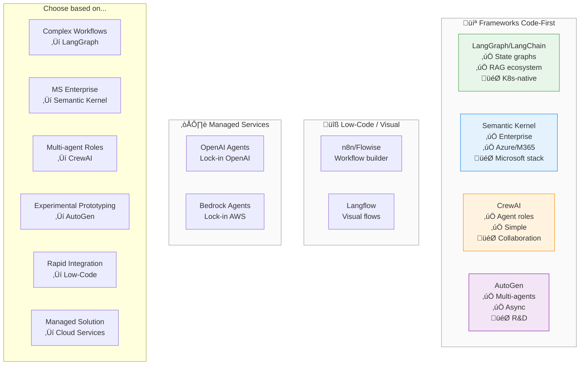

# AI Agent Frameworks: Comprehensive Comparison

## Overview

This document provides an in-depth comparison of AI agent frameworks for building production GenAI applications. We analyze 10+ frameworks across architecture, features, performance, and enterprise readiness.

**Framework Categories**:
1. **Code-First (Python/TypeScript)**: LangChain/LangGraph, LlamaIndex, Haystack, AutoGen, CrewAI, Semantic Kernel
2. **Low-Code/Visual (10)**: 
   - Visual Agent Builders: n8n, Flowise, Langflow
   - Enterprise-Grade: Dify, Microsoft Copilot Studio, Botpress, VectorShift
   - Specialized: Voiceflow, Google Vertex AI Agent Builder, Lindy
3. **Managed Services**: OpenAI Agents, Amazon Bedrock Agents

## Executive Summary

| Framework | Best For | Maturity | Enterprise | License |
|-----------|----------|----------|------------|----------|
| **LangChain/LangGraph** | Complex workflows, RAG | 🟢 Production | ✅ Yes | MIT |
| **LlamaIndex** | RAG-first, data ingestion | 🟢 Production | ✅ Yes | MIT |
| **Haystack** | Production search+QA | 🟢 Production | ✅ Yes | Apache 2.0 |
| **AutoGen** | Multi-agent research | 🟡 Experimental | ⚠️ Limited | MIT |
| **CrewAI** | Role-based agents | 🟡 Growing | ⚠️ Limited | MIT |
| **Semantic Kernel** | Microsoft ecosystem | 🟢 Production | ✅ Yes | MIT |
| **Dify** | Open-source low-code | 🟢 Production | ✅ Yes | MIT |
| **Copilot Studio** | Microsoft low-code | 🟢 Production | ✅ Yes | Proprietary |
| **n8n/Flowise/Langflow** | Visual builders | 🟢 Production | ✅ Yes | Fair-code/MIT |
| **OpenAI Agents** | Managed, simple | 🟢 Production | ✅ Yes | Proprietary |
| **Bedrock Agents** | AWS ecosystem | 🟢 Production | ✅ Yes | Proprietary |

---

## Detailed Framework Profiles

### LangChain / LangGraph

**Positioning**: Industry-leading agent orchestration with stateful workflows

**Architecture**:

**Key Components**:
- **LangChain**: Foundation library (chains, agents, memory, tools)
- **LangGraph**: State machine for complex agent workflows
- **LangSmith**: Observability, debugging, evaluation (commercial)
- **LangServe**: Deploy chains as REST APIs

**Strengths**:
- ✅ **Largest ecosystem** (100+ integrations)
- ✅ **Production-ready** (used by 1000s of companies)
- ✅ **Stateful workflows** (LangGraph cycles, checkpoints)
- ✅ **Observability** (LangSmith tracing)
- ✅ **Active development** (weekly releases)
- ✅ **Enterprise support** (LangChain Inc.)

**Limitations**:
- ❌ **Complexity** (steep learning curve)
- ❌ **Breaking changes** (frequent API updates)
- ❌ **Abstraction overhead** (verbose code)
- ❌ **LangSmith cost** (observability not free)

**Best For**:
- Complex multi-step workflows
- RAG with advanced retrieval
- Production deployments at scale
- Teams needing observability

**Maturity**: 🟢 Production (v0.3.x, 2+ years)

**Community**: 90K+ GitHub stars, 2K+ contributors

---

### LlamaIndex

**Positioning**: RAG-first framework with data ingestion focus

**Architecture**:

**Key Components**:
- **Data Loaders**: 160+ connectors (S3, Notion, Google Drive, databases)
- **Indexes**: Vector, knowledge graph, tree, list, keyword
- **Query Engines**: RAG pipelines with various retrieval strategies
- **Agents**: ReAct, function calling, workflow agents

**Strengths**:
- ✅ **Best RAG library** (data ingestion focus)
- ✅ **160+ data connectors** (most in ecosystem)
- ✅ **Multiple index types** (vector, graph, hierarchical)
- ✅ **Production observability** (LlamaCloud tracing)
- ✅ **Structured outputs** (Pydantic validation)
- ✅ **Active development** (weekly releases)

**Limitations**:
- ❌ **Agent capabilities limited** (focus is RAG, not agents)
- ❌ **Less flexible workflows** vs LangGraph
- ❌ **Documentation gaps** (fast-moving project)
- ❌ **LlamaCloud cost** (managed service not free)

**Best For**:
- RAG-first applications
- Complex data ingestion pipelines
- Knowledge graph + vector hybrid
- Structured data extraction

**Maturity**: 🟢 Production (v0.11.x, 2+ years)

**Community**: 36K+ GitHub stars, 900+ contributors

---

### Haystack

**Positioning**: Production-grade NLP framework for search and QA

**Architecture**:

**Key Components**:
- **Pipelines**: DAG-based component orchestration
- **Components**: Reusable, composable building blocks
- **Document Stores**: Elasticsearch, OpenSearch, Weaviate, Qdrant
- **Agents**: Tool-using agents with memory

**Strengths**:
- ✅ **Enterprise-ready** (deepset.ai company backing)
- ✅ **Production stability** (mature, tested)
- ✅ **Clean architecture** (v2.x redesign)
- ✅ **YAML pipelines** (declarative configs)
- ✅ **Hybrid search** (BM25 + dense)
- ✅ **Strong documentation** (comprehensive)

**Limitations**:
- ❌ **Smaller ecosystem** vs LangChain/LlamaIndex
- ❌ **Limited agent features** (focus is retrieval)
- ❌ **Less community content** (fewer examples)
- ❌ **Opinionated** (specific patterns enforced)

**Best For**:
- Production search systems
- Hybrid retrieval pipelines
- Enterprise deployments
- Teams valuing stability over features

**Maturity**: 🟢 Production (v2.x, 4+ years)

**Community**: 17K+ GitHub stars, 250+ contributors

---

### AutoGen

**Positioning**: Microsoft Research multi-agent framework

**Architecture**:

**Key Components**:
- **Agents**: Conversational agents with roles
- **GroupChat**: Multi-agent coordination
- **Code Execution**: Sandboxed Python execution
- **Human-in-Loop**: Approval workflows

**Strengths**:
- ✅ **Multi-agent native** (built for agent collaboration)
- ✅ **Code execution** (built-in sandboxing)
- ✅ **Microsoft backing** (research-driven)
- ✅ **Async support** (concurrent agents)
- ✅ **Experimentation-friendly** (research use cases)

**Limitations**:
- ❌ **Experimental** (frequent breaking changes)
- ❌ **Limited production use** (mostly research)
- ❌ **Documentation incomplete** (fast-moving)
- ❌ **No commercial support** (research project)
- ❌ **Complex debugging** (multi-agent interactions)

**Best For**:
- Research and experimentation
- Multi-agent prototypes
- Code generation workflows
- Academic projects

**Maturity**: 🟡 Experimental (v0.2.x, 1+ year)

**Community**: 32K+ GitHub stars, 500+ contributors

---

### CrewAI

**Positioning**: Role-based multi-agent framework

**Architecture**:

**Key Components**:
- **Agents**: Role-based with goals and backstories
- **Tasks**: Discrete work units with outputs
- **Crews**: Teams of agents with coordination
- **Tools**: LangChain tools integration

**Strengths**:
- ✅ **Simplest API** (easy to learn)
- ✅ **Role-based abstraction** (intuitive mental model)
- ✅ **Process templates** (sequential, hierarchical)
- ✅ **LangChain compatible** (reuse tools)
- ✅ **Growing community** (active development)

**Limitations**:
- ❌ **Limited to roles** (not flexible workflows)
- ❌ **No state management** (unlike LangGraph)
- ❌ **Young project** (<1 year)
- ❌ **Limited observability** (basic logging)
- ❌ **Production gaps** (error handling, retries)

**Best For**:
- Simple multi-agent prototypes
- Business process automation
- Content creation workflows
- Teams new to agents

**Maturity**: 🟡 Growing (v0.x, <1 year)

**Community**: 20K+ GitHub stars, 300+ contributors

---

### Semantic Kernel

**Positioning**: Microsoft's enterprise agent orchestrator

**Architecture**:

**Key Components**:
- **Plugins**: Reusable skills (semantic + native functions)
- **Planners**: Automatic task decomposition
- **Memory**: Vector-based semantic memory
- **Connectors**: Azure, M365, enterprise systems

**Strengths**:
- ✅ **Enterprise-focused** (Microsoft backing)
- ✅ **Azure/M365 integration** (native connectors)
- ✅ **Multi-language** (C#, Python, Java)
- ✅ **Production-ready** (GA release)
- ✅ **Security model** (enterprise auth)
- ✅ **Semantic memory** (built-in vector store)

**Limitations**:
- ❌ **Microsoft-centric** (Azure bias)
- ❌ **Smaller ecosystem** vs LangChain
- ❌ **Complex concepts** (planners, plugins)
- ❌ **Limited multi-agent** (single-agent focus)

**Best For**:
- Microsoft/Azure environments
- Enterprise integrations (SAP, Dynamics)
- .NET/C# teams
- Copilot-style applications

**Maturity**: 🟢 Production (v1.x, 2+ years)

**Community**: 21K+ GitHub stars, 400+ contributors

---

## Low-Code / Visual Agent Frameworks

### n8n

**Positioning**: Open-source workflow automation with AI agent capabilities

**Architecture**:

**Key Components**:
- **Visual Workflow Editor**: Drag-and-drop canvas with 400+ pre-built nodes
- **AI Agent Node**: Built-in ReAct and conversational agents
- **LLM Integrations**: OpenAI, Anthropic, Cohere, HuggingFace, Ollama
- **Vector Store Nodes**: Pinecone, Qdrant, Supabase, Weaviate
- **Execution Modes**: Self-hosted (Docker/K8s) or managed cloud

**Strengths**:
- ✅ **400+ integrations** (REST APIs, databases, SaaS tools)
- ✅ **Self-hostable** (full control, Docker/K8s deployment)
- ✅ **Fair-code license** (open source with managed offering)
- ✅ **Enterprise features** (SSO, RBAC, audit logs)
- ✅ **Active community** (30K+ GitHub stars)
- ✅ **No vendor lock-in** (export workflows as JSON)
- ✅ **Production-ready** (used by 10K+ companies)

**Limitations**:
- ❌ **Not AI-first** (workflow tool with AI nodes, not agent framework)
- ❌ **Limited agent patterns** (basic ReAct, no complex state machines)
- ❌ **Visual debugging complexity** (large workflows hard to debug)
- ❌ **Performance overhead** (node-based execution slower than code)
- ❌ **Learning curve** (workflow paradigm different from coding)

**Best For**:
- Integration-heavy workflows (APIs, databases, SaaS)
- Business users needing visual builder
- Teams wanting self-hosted solution
- Rapid prototyping with existing systems
- Enterprise automation (approval workflows, notifications)

**Pricing**:
- **Self-hosted**: Free (fair-code license)
- **Cloud**: $20-$500/month (based on executions)
- **Enterprise**: Custom pricing (SSO, SLA, support)

**Maturity**: 🟢 Production (v1.x, 4+ years)

**Community**: 30K+ GitHub stars, 600+ contributors

---

### Flowise

**Positioning**: Open-source visual LangChain builder

**Architecture**:

**Key Components**:
- **Visual LangChain Builder**: Drag-and-drop LangChain components
- **LLM Nodes**: OpenAI, Anthropic, Azure, Cohere, HuggingFace, Ollama
- **Agent Nodes**: ReAct, OpenAI Functions, conversational
- **Vector DB Nodes**: Pinecone, Chroma, Weaviate, Qdrant, Supabase
- **Auto API Generation**: REST API for each flow
- **Embedded Chat**: Pre-built chat widget

**Strengths**:
- ✅ **LangChain-native** (all LangChain features accessible)
- ✅ **Rapid prototyping** (build RAG in minutes)
- ✅ **Auto API generation** (deploy flows as REST endpoints)
- ✅ **Embedded chat widget** (drop-in chatbot UI)
- ✅ **Open source** (MIT license, self-hostable)
- ✅ **Growing ecosystem** (community nodes)
- ✅ **Easy for non-developers** (visual, no coding)

**Limitations**:
- ❌ **Limited to LangChain** (can't use other frameworks)
- ❌ **Young project** (less mature than n8n)
- ❌ **Limited enterprise features** (no RBAC, basic auth only)
- ❌ **Scalability concerns** (single-instance deployment)
- ❌ **No workflow orchestration** (focused on chains/agents only)
- ❌ **Debugging difficult** (visual abstraction hides complexity)

**Best For**:
- LangChain prototyping
- RAG chatbot demos
- Internal AI tools (no coding required)
- Teams transitioning from code to visual
- Proof-of-concept projects

**Pricing**:
- **Self-hosted**: Free (MIT license)
- **Cloud**: Not yet available (community project)

**Maturity**: 🟡 Growing (v1.x, 1+ year)

**Community**: 25K+ GitHub stars, 200+ contributors

---

### Langflow

**Positioning**: Visual framework for building multi-agent and RAG applications

**Architecture**:

**Key Components**:
- **Visual Flow Builder**: Component-based graph editor
- **Component Library**: 100+ pre-built components (extensible with Python)
- **Multi-agent Support**: Coordinate multiple agents visually
- **RAG Components**: Document loaders, splitters, embeddings, retrievers
- **Playground**: Test flows with real-time feedback
- **Version Control**: Track flow changes over time

**Strengths**:
- ✅ **Component-based** (reusable, composable blocks)
- ✅ **Python extensible** (create custom components)
- ✅ **Multi-agent visual** (coordinate agents graphically)
- ✅ **Enterprise-ready** (DataStax backing, managed cloud)
- ✅ **Version control** (track flow changes)
- ✅ **Playground testing** (iterate quickly)
- ✅ **Growing fast** (active development, weekly releases)

**Limitations**:
- ❌ **LangChain dependency** (built on LangChain)
- ❌ **Young project** (<1 year old)
- ❌ **Limited integrations** vs n8n (focused on AI/ML)
- ❌ **Managed cloud new** (DataStax partnership just launched)
- ❌ **Documentation gaps** (fast-moving project)

**Best For**:
- Visual multi-agent systems
- RAG application prototyping
- Teams wanting Python extensibility + visual builder
- DataStax Astra DB users
- Experimentation and iteration

**Pricing**:
- **Self-hosted**: Free (MIT license)
- **DataStax Cloud**: Pay-as-you-go (new offering)

**Maturity**: 🟡 Growing (v1.x, <1 year)

**Community**: 22K+ GitHub stars, 150+ contributors

---

## Enterprise-Grade Low-Code Platforms

### Dify

**Positioning**: Open-source low-code platform for production-grade AI applications

**Architecture**:

**Key Components**:
- **Visual Workflow Builder**: Drag-and-drop canvas for AI workflows
- **Dual Modes**: Agent mode (ReAct) + Workflow mode (DAG)
- **Multi-LLM Support**: 100+ LLMs (OpenAI, Anthropic, Claude, local models)
- **RAG Pipeline**: Built-in document ingestion, chunking, embeddings
- **Backend-as-Service**: Auto-generate APIs for any workflow
- **LLMOps**: Logs, tracing, analytics, continuous improvement

**Specifications**:
| Metric | Value |
|--------|-------|
| **GitHub Stars** | 93K+ (most popular open-source) |
| **Contributors** | 500+ |
| **License** | MIT (open source) |
| **Maturity** | 🟢 Production (2+ years) |
| **Pricing** | Free (self-hosted), $59-$599/mo (cloud) |
| **LLM Support** | 100+ models (OpenAI, Anthropic, local) |
| **Deployment** | Docker, K8s, managed cloud |

**Strengths**:
- ✅ **Most popular open-source** (93K+ stars, largest community)
- ✅ **Model-agnostic** (100+ LLMs, no vendor lock-in)
- ✅ **Dual interface** (no-code visual + Python SDK)
- ✅ **Production-ready** (Backend-as-Service, auto APIs)
- ✅ **Full observability** (LLMOps, logs, tracing, annotations)
- ✅ **Enterprise features** (self-hosted, data privacy)
- ✅ **Active development** (weekly releases, used by Volvo, etc.)

**Limitations**:
- ❌ **Complex for simple tasks** (feature-rich can be overwhelming)
- ❌ **Limited enterprise auth** (basic RBAC, no SSO in open-source)
- ❌ **Node-based overhead** (visual workflows slower than pure code)
- ❌ **Documentation in flux** (fast-moving project)

**Best For**:
- Teams wanting **open-source + visual builder**
- **Model-agnostic** deployments (avoid vendor lock-in)
- **Production RAG applications** (built-in pipeline)
- **Non-technical users** needing AI workflow builder
- **Enterprises wanting self-hosted** solution

**Pricing**:
- **Self-hosted**: Free (MIT license)
- **Cloud Sandbox**: 200 free GPT-4 calls
- **Cloud Professional**: $59/mo (10K messages)
- **Cloud Team**: $159/mo (40K messages)
- **Enterprise**: Custom pricing

**Real-World Adoption**:
- Volvo Cars (rapid AI validation)
- Educational Assessment Institute (NLP pipelines)
- 120+ countries, Fortune 500 companies

**Maturity**: 🟢 Production (v0.x, 2+ years, 93K+ stars)

**Community**: 93K+ GitHub stars, 500+ contributors, active Discord

---

### Microsoft Copilot Studio

**Positioning**: Enterprise low-code AI agent builder for Microsoft ecosystem

**Architecture**:

**Key Components**:
- **Visual Copilot Builder**: No-code conversation designer
- **Generative AI**: GPT-4 powered responses
- **Power Automate Integration**: 1000+ connector actions
- **Microsoft 365 Native**: Teams, SharePoint, Office deep integration
- **Enterprise Security**: Azure AD, compliance (SOC 2, HIPAA, GDPR)

**Specifications**:
| Metric | Value |
|--------|-------|
| **Maturity** | 🟢 Production (Microsoft backing) |
| **License** | Proprietary (Microsoft commercial) |
| **Pricing** | Included in M365 Copilot ($30/user) + usage |
| **LLM Support** | Azure OpenAI (GPT-3.5, GPT-4) only |
| **Deployment** | Cloud only (Microsoft Cloud) |
| **Integrations** | 1000+ via Power Platform |

**Strengths**:
- ✅ **Microsoft ecosystem** (Teams, SharePoint, Office native)
- ✅ **Enterprise-grade** (security, compliance, governance)
- ✅ **No-code interface** (accessible to business users)
- ✅ **1000+ connectors** (Power Platform integrations)
- ✅ **Included in M365** (some features in existing subscription)
- ✅ **Enterprise support** (Microsoft SLAs, global scale)

**Limitations**:
- ❌ **Microsoft lock-in** (Azure OpenAI only, no model choice)
- ❌ **Cloud-only** (no self-hosted option)
- ❌ **Limited to chatbots** (not full workflow automation)
- ❌ **Complex pricing** (M365 + Power Platform + Azure AI + Dataverse)
- ❌ **Rigid structure** (predefined flows, less flexible than code)
- ❌ **External integrations costly** (need Power Automate licenses)

**Best For**:
- **Microsoft-centric organizations** (Teams, Office 365, Azure)
- **Enterprise chatbots** (customer service, internal support)
- **Business users** building conversational AI
- **Regulated industries** (healthcare, finance, government)
- **Organizations already using Power Platform**

**Pricing**:
- **M365 Copilot**: $30/user/month (includes basic Copilot Studio)
- **Standalone**: Pay-as-you-go (messages + AI Builder capacity)
- **Power Automate**: $15-$40/user/month (for actions)
- **Dataverse**: $40/user/month or pay-per-use
- **Azure AI**: Separate LLM API costs

**Typical Total Cost**: $50-$150/user/month (all services combined)

**Real-World Adoption**:
- Fortune 500 enterprises
- Government agencies
- Healthcare systems
- Financial services firms

**Maturity**: 🟢 Production (evolved from Power Virtual Agents)

**Community**: Microsoft enterprise support, no open-source community

---

### Botpress

**Positioning**: Open-source conversational AI platform with visual flow builder

**Architecture**:

**Key Components**:
- **Visual Flow Builder**: Node-based conversation designer
- **LLMz Engine**: Custom inference engine (instruction, memory, tools)
- **Multi-channel**: Web, Teams, Slack, WhatsApp, Telegram
- **Autonomous & Static Nodes**: Mix AI decisions with structured logic
- **Tools & Integrations**: Function calling, custom APIs

**Specifications**:
| Metric | Value |
|--------|-------|
| **GitHub Stars** | 12K+ (open-source v12) |
| **Contributors** | 300+ |
| **License** | MIT (v12 open-source), Proprietary (Cloud) |
| **Maturity** | 🟢 Production (6+ years) |
| **Pricing** | Free (5 bots, 2K msgs), $10/1K messages |
| **LLM Support** | OpenAI, Anthropic, Azure, local models |
| **Deployment** | Cloud (v13+), Self-hosted (v12 only) |

**Strengths**:
- ✅ **Conversational AI focus** (best for chatbots, not workflows)
- ✅ **Visual + code** (low-code with scripting capability)
- ✅ **Multi-channel** (Web, Teams, Slack, WhatsApp)
- ✅ **Node-based flows** (clear handoffs, testable)
- ✅ **Active community** (300+ contributors, G2 leader)
- ✅ **Free tier generous** (5 bots, 2K messages)

**Limitations**:
- ❌ **Chatbot-focused** (not for complex workflows or multi-agent)
- ❌ **Self-hosting only v12** (v13 cloud-only, no self-host yet)
- ❌ **Limited enterprise features** (basic RBAC, no SSO in free)
- ❌ **Not workflow automation** (unlike n8n or Dify)
- ❌ **Steep learning for advanced** (node logic can be complex)

**Best For**:
- **Conversational AI** (customer support, internal chatbots)
- **Structured conversations** (clear flows, defined logic)
- **Multi-channel deployments** (Teams, Slack, WhatsApp)
- **Developers + business users** (visual + scripting)
- **Agencies building chatbots** (white-label, client delivery)

**Pricing**:
- **Free Tier**: 5 bots, 2K messages/month
- **Pay-as-you-go**: $10 per 1K messages
- **Enterprise**: Custom pricing (SSO, SLA, support)

**Real-World Adoption**:
- G2 Top 50 AI Products 2024
- Agencies and freelancers
- Customer support teams
- Internal IT helpdesks

**Maturity**: 🟢 Production (v13 cloud, v12 open-source, 6+ years)

**Community**: 12K+ GitHub stars (v12), 300+ contributors, active Discord

---

### VectorShift

**Positioning**: Y Combinator-backed no-code AI automation platform

**Architecture**:

**Key Components**:
- **Visual Pipeline Builder**: Drag-and-drop AI workflow canvas
- **Multi-LLM Support**: OpenAI, Anthropic, Mistral, HuggingFace
- **Knowledge Base**: Live-sync with Google Drive, Notion, OneDrive
- **Automation**: Triggers (webhook, email, Slack) + actions
- **Python SDK**: Code-first alternative to visual builder

**Specifications**:
| Metric | Value |
|--------|-------|
| **Founded** | 2023 (Y Combinator S23) |
| **Maturity** | 🟡 Growing (<2 years) |
| **License** | Proprietary (commercial SaaS) |
| **Pricing** | Free tier, $49-$399/mo |
| **LLM Support** | 20+ models (OpenAI, Anthropic, Mistral) |
| **Deployment** | Cloud only, API/SDK |
| **Integrations** | 6000+ apps (Zapier-style) |

**Strengths**:
- ✅ **Dual interface** (no-code visual + Python SDK)
- ✅ **Knowledge base live-sync** (Google Drive, Notion, OneDrive)
- ✅ **6000+ integrations** (event-driven triggers)
- ✅ **Y Combinator backed** (strong funding, rapid development)
- ✅ **Marketplace** (pre-built templates, community workflows)
- ✅ **SOC 2, GDPR, HIPAA** (enterprise compliance)

**Limitations**:
- ❌ **No self-hosting** (cloud-only, vendor lock-in)
- ❌ **Young platform** (<2 years, less mature than competitors)
- ❌ **Limited community** (no open-source, small user base)
- ❌ **Single-instance only** (no multi-region, HA concerns)
- ❌ **Pricing can escalate** (based on usage, not transparent)

**Best For**:
- **No-code + code flexibility** (visual builder + Python SDK)
- **Knowledge base automation** (live-sync with existing data)
- **Rapid prototyping** (marketplace templates, fast iteration)
- **Startups and SMBs** (Y Combinator ecosystem, modern platform)
- **Non-technical teams** wanting AI automation

**Pricing**:
- **Free Tier**: Limited (sandbox)
- **Starter**: $49/month
- **Professional**: $149/month
- **Business**: $399/month
- **Enterprise**: Custom pricing

**Real-World Adoption**:
- Y Combinator S23 portfolio companies
- Sales teams (proposal generation)
- Customer support automation
- Content creation workflows

**Maturity**: 🟡 Growing (2023, Y Combinator S23, <2 years)

**Community**: Closed-source, Y Combinator network, growing user base

---

## Specialized Low-Code Platforms

### Voiceflow

**Positioning**: Voice-first conversational AI platform for chat and voice agents

**Architecture**:

**Key Components**:
- **Visual Conversation Designer**: Flow-based canvas for voice/chat
- **Voice-First**: Alexa, Google Assistant, phone/IVR
- **Multi-channel**: Web chat, WhatsApp, SMS, Slack
- **LLM-Powered**: GPT-4, Claude for conversational AI
- **Knowledge Base**: Document-based Q&A

**Specifications**:
| Metric | Value |
|--------|-------|
| **Maturity** | 🟢 Production (5+ years) |
| **License** | Proprietary (commercial SaaS) |
| **Pricing** | Free tier, $50-$625/mo |
| **LLM Support** | OpenAI, Anthropic (GPT-4, Claude) |
| **Deployment** | Cloud only |
| **Channels** | Voice (Alexa, Google), Chat (web, WhatsApp) |

**Strengths**:
- ✅ **Voice-first** (Alexa, Google Assistant, IVR)
- ✅ **Telephony integration** (call centers, IVR systems)
- ✅ **Intuitive designer** (flow-based, non-technical friendly)
- ✅ **Multi-channel** (voice + chat unified)
- ✅ **Free tier** (sandbox for prototyping)
- ✅ **Active community** (tutorials, templates)

**Limitations**:
- ❌ **Voice-centric** (not for complex workflows or multi-agent)
- ❌ **No self-hosting** (cloud-only)
- ❌ **Limited to conversations** (not workflow automation)
- ❌ **Pricing by conversations** (can get expensive at scale)
- ❌ **Basic enterprise features** (limited RBAC, SSO)

**Best For**:
- **Voice-first applications** (Alexa skills, Google Actions)
- **Call center automation** (IVR, phone support)
- **Omnichannel customer support** (voice + chat unified)
- **Non-technical teams** building conversational AI
- **Prototyping voice interfaces**

**Pricing**:
- **Sandbox**: Free (limited usage)
- **Pro**: $50/month (10K conversations)
- **Team**: $250/month (50K conversations)
- **Enterprise**: $625+/month (custom)

**Real-World Adoption**:
- Call centers and customer support
- Voice assistant skills (Alexa, Google)
- Healthcare (appointment booking)
- Retail (product inquiries)

**Maturity**: 🟢 Production (5+ years, used by Fortune 500)

**Community**: Proprietary, active user forums, extensive documentation

---

### Google Vertex AI Agent Builder

**Positioning**: GCP-native low-code platform for building conversational agents

**Architecture**:

**Key Components**:
- **Agent Designer**: No-code + low-code interface
- **Gemini Native**: Google's Gemini 1.5 Pro and Flash models
- **Playbook-Based**: Define agent logic step-by-step
- **GCP Integration**: BigQuery, Cloud Storage, Vertex AI native
- **Multi-agent Support**: Subagents for complex workflows

**Specifications**:
| Metric | Value |
|--------|-------|
| **Maturity** | 🟢 Production (Google Cloud) |
| **License** | Proprietary (GCP service) |
| **Pricing** | Pay-per-use (Gemini API costs) |
| **LLM Support** | Gemini models (1.5 Pro, Flash) |
| **Deployment** | GCP only (Cloud-based) |
| **Integrations** | GCP ecosystem (BigQuery, Cloud Storage) |

**Strengths**:
- ✅ **GCP-native** (seamless integration with Google Cloud)
- ✅ **Gemini models** (latest Google AI, multimodal)
- ✅ **No-code creation** (natural language agent builder)
- ✅ **Enterprise-grade** (security, compliance, global scale)
- ✅ **Playbook-based** (structured, testable logic)
- ✅ **Multi-agent** (subagents for complex tasks)

**Limitations**:
- ❌ **GCP lock-in** (Gemini only, no other LLMs)
- ❌ **Complex interface** ("GCP wonderland", steep learning curve)
- ❌ **Limited to Google Cloud** (no multi-cloud, no self-hosted)
- ❌ **Young offering** (evolving rapidly, docs lag)
- ❌ **Gemini-centric** (can't use OpenAI, Anthropic)

**Best For**:
- **GCP-standardized organizations** (existing Google Cloud users)
- **Gemini-powered applications** (leverage latest Google AI)
- **Enterprise requiring GCP** (compliance, data residency)
- **Teams familiar with GCP** (BigQuery, Cloud Storage integration)
- **Prototyping with Gemini** (fast experimentation)

**Pricing**:
- **Pay-per-use**: Based on Gemini API calls
- **Gemini 1.5 Pro**: $3.50-$7/1M tokens (input)
- **Gemini 1.5 Flash**: $0.075-$0.30/1M tokens (input)
- **No platform fees**: Only pay for Gemini usage

**Real-World Adoption**:
- Google Cloud enterprise customers
- Gemini early adopters
- GCP-native applications
- Government/regulated industries on GCP

**Maturity**: 🟢 Production (announced 2024, evolving)

**Community**: Google Cloud documentation, GCP support channels

---

### Lindy

**Positioning**: SOC 2/HIPAA compliant no-code AI agent builder for business automation

**Architecture**:

**Key Components**:
- **Visual Workflow Builder**: Block-based interface (no coding)
- **Lindy App Builder**: Natural language app creation
- **Multi-agent Collaboration**: Agents work together (lead qual, follow-up, CRM)
- **4000+ Integrations**: HubSpot, Gmail, Slack, Salesforce
- **Enterprise Compliance**: SOC 2, HIPAA certified

**Specifications**:
| Metric | Value |
|--------|-------|
| **Maturity** | 🟡 Growing (2-3 years) |
| **License** | Proprietary (commercial SaaS) |
| **Pricing** | Free trial, $49.99/mo (Pro) |
| **LLM Support** | OpenAI, Anthropic (GPT-4, Claude) |
| **Deployment** | Cloud only |
| **Integrations** | 4000+ apps (HubSpot, Gmail, Slack) |

**Strengths**:
- ✅ **Compliance-focused** (SOC 2, HIPAA certified)
- ✅ **Multi-agent collaboration** (agents work as teams)
- ✅ **4000+ integrations** (business tools: HubSpot, Gmail, Slack)
- ✅ **Non-technical friendly** (drag-drop + natural language)
- ✅ **Business automation focus** (sales, support, operations)
- ✅ **Free to start** (40 tasks in free tier)

**Limitations**:
- ❌ **No self-hosting** (cloud-only, vendor dependency)
- ❌ **Young platform** (2-3 years, less mature)
- ❌ **Limited customization** (vs code-first frameworks)
- ❌ **Task-based pricing** (can get expensive at scale)
- ❌ **Not for complex workflows** (simple automation focus)

**Best For**:
- **Regulated industries** (healthcare, finance needing SOC 2/HIPAA)
- **Business automation** (sales, support, CRM workflows)
- **Non-technical teams** (marketing, sales, operations)
- **Multi-agent workflows** (lead qualification → follow-up → CRM)
- **Small to medium businesses** (affordable, easy to start)

**Pricing**:
- **Free Trial**: 40 tasks
- **Pro**: $49.99/month (1,500 tasks)
- **Business**: Custom pricing

**Real-World Adoption**:
- Sales teams (lead qualification, follow-up)
- Customer support (ticket triage, routing)
- Healthcare (HIPAA-compliant automation)
- Small businesses (operations automation)

**Maturity**: 🟡 Growing (2-3 years, growing user base)

**Community**: Closed-source, customer support, growing tutorials

---

### No-Code/Low-Code Comparison

#### Visual Agent Builders (Original 3)

| Aspect | n8n | Flowise | Langflow |
|--------|-----|---------|----------|
| **Primary Focus** | Workflow automation + AI | LangChain visual builder | Multi-agent + RAG |
| **Integrations** | 400+ (REST, DBs, SaaS) | LangChain ecosystem | AI/ML focused |
| **Agent Capabilities** | Basic (ReAct) | LangChain agents | Multi-agent coordination |
| **Enterprise Features** | ✅ SSO, RBAC, audit | ⚠️ Limited | ✅ Version control, monitoring |
| **Self-hostable** | ✅ Docker/K8s | ✅ Docker | ✅ Docker/K8s |
| **Managed Cloud** | ✅ n8n Cloud | ❌ Not yet | ✅ DataStax Cloud |
| **Extensibility** | JavaScript functions | Custom nodes (code) | Python components |
| **Maturity** | 🟢 Production (4+ years) | 🟡 Growing (1+ year) | 🟡 Growing (<1 year) |
| **Best For** | Integration-heavy workflows | LangChain prototyping | Visual multi-agent |
| **License** | Fair-code | MIT | MIT |
| **Community** | 30K+ stars | 25K+ stars | 22K+ stars |

---

#### Enterprise-Grade Platforms (4)

| Aspect | Dify | Copilot Studio | Botpress | VectorShift |
|--------|------|----------------|----------|-------------|
| **Primary Focus** | Open-source AI builder | Microsoft ecosystem | Conversational AI | Y Combinator SaaS |
| **Stars/Maturity** | 93K+ (🟢 Production) | Microsoft (🟢 Production) | 12K+ (🟢 Production) | YC S23 (🟡 Growing) |
| **LLM Support** | 100+ models | Azure OpenAI only | OpenAI, Anthropic, local | 20+ models |
| **Self-hostable** | ✅ Docker/K8s | ❌ Cloud-only | ✅ v12 only | ❌ Cloud-only |
| **Managed Cloud** | ✅ Dify Cloud | ✅ Microsoft Cloud | ✅ Botpress Cloud | ✅ VectorShift Cloud |
| **License** | MIT (open source) | Proprietary | MIT (v12), Proprietary (v13) | Proprietary |
| **Pricing** | Free/$59-$599/mo | $30-$150/user/mo | Free/$10 per 1K msgs | $49-$399/mo |
| **Enterprise Features** | ⚠️ Basic RBAC | ✅ Full (AAD, compliance) | ⚠️ Limited (cloud only) | ✅ SOC 2, HIPAA |
| **Integrations** | AI/ML focused | 1000+ (Power Platform) | Multi-channel (Teams, Slack) | 6000+ apps |
| **Best For** | Open-source, model-agnostic | Microsoft orgs | Chatbots, agencies | Startups, rapid prototyping |
| **Key Strength** | Most popular OSS (93K stars) | Enterprise Microsoft | Conversational AI leader | Dual interface (visual + SDK) |

---

#### Specialized Platforms (3)

| Aspect | Voiceflow | Vertex AI Agent Builder | Lindy |
|--------|-----------|------------------------|-------|
| **Primary Focus** | Voice-first (Alexa, IVR) | GCP-native Gemini | SOC 2/HIPAA business automation |
| **Maturity** | 🟢 Production (5+ years) | 🟢 Production (2024) | 🟡 Growing (2-3 years) |
| **LLM Support** | OpenAI, Anthropic | Gemini only | OpenAI, Anthropic |
| **Self-hostable** | ❌ Cloud-only | ❌ GCP-only | ❌ Cloud-only |
| **License** | Proprietary | Proprietary (GCP) | Proprietary |
| **Pricing** | Free/$50-$625/mo | Pay-per-use (Gemini API) | Free trial/$49.99/mo |
| **Enterprise Features** | ⚠️ Limited RBAC, SSO | ✅ Full GCP compliance | ✅ SOC 2, HIPAA |
| **Integrations** | Voice (Alexa, Google), Chat | GCP ecosystem (BigQuery) | 4000+ apps (HubSpot, Gmail) |
| **Best For** | Voice assistants, call centers | GCP orgs, Gemini users | Healthcare, sales automation |
| **Key Strength** | Voice-first + telephony | Gemini multimodal | Compliance-focused |

---

### Decision Guide: Choosing Your Low-Code Platform

#### By Primary Use Case

**Open-Source + Self-Hosted**:
- ➡️ **Dify** (most popular, 93K+ stars, model-agnostic)
- ➡️ **n8n** (workflow automation, 400+ integrations)
- ➡️ **Langflow** (multi-agent, Python extensible)
- ➡️ **Flowise** (LangChain-native)

**Enterprise + Cloud-Only**:
- ➡️ **Microsoft Copilot Studio** (Microsoft ecosystem, Teams/Office)
- ➡️ **Google Vertex AI** (GCP-native, Gemini models)
- ➡️ **Botpress** (conversational AI, multi-channel)

**Startups + Rapid Development**:
- ➡️ **VectorShift** (Y Combinator, dual interface)
- ➡️ **Lindy** (business automation, SOC 2/HIPAA)

**Specialized Niches**:
- ➡️ **Voiceflow** (voice-first, Alexa, IVR)
- ➡️ **Vertex AI** (Gemini, GCP-only)
- ➡️ **Lindy** (compliance-focused, healthcare)

---

#### By Technical Requirements

**Model Flexibility** (avoid vendor lock-in):
1. **Dify** – 100+ LLMs (OpenAI, Anthropic, local)
2. **VectorShift** – 20+ LLMs
3. **Botpress** – OpenAI, Anthropic, local
4. **n8n** – Multiple LLM providers

**❌ Avoid**: Copilot Studio (Azure OpenAI only), Vertex AI (Gemini only)

**Self-Hosting Required**:
1. **Dify** – Docker/K8s, MIT license
2. **n8n** – Docker/K8s, fair-code
3. **Flowise** – Docker, MIT
4. **Langflow** – Docker/K8s, MIT
5. **Botpress** – v12 only (v13 cloud-only)

**❌ No Self-Hosting**: Copilot Studio, VectorShift, Voiceflow, Vertex AI, Lindy

**Enterprise Compliance** (SOC 2, HIPAA, GDPR):
1. **Microsoft Copilot Studio** – Full enterprise (AAD, compliance)
2. **Vertex AI** – GCP compliance
3. **Lindy** – SOC 2, HIPAA certified
4. **VectorShift** – SOC 2, GDPR, HIPAA
5. **Dify** – Self-hosted (control your data)

**Integration-Heavy Workflows**:
1. **VectorShift** – 6000+ apps
2. **Lindy** – 4000+ apps (HubSpot, Gmail, Slack)
3. **Microsoft Copilot Studio** – 1000+ (Power Platform)
4. **n8n** – 400+ (REST, DBs, SaaS)

**Multi-Agent Coordination**:
1. **Langflow** – Visual multi-agent coordination
2. **Dify** – Agent mode + workflow mode
3. **Lindy** – Multi-agent collaboration (lead → follow-up → CRM)
4. **Vertex AI** – Subagents for complex tasks

---

#### By Organization Type

**Microsoft-Centric Organizations**:
- ✅ **Microsoft Copilot Studio** (Teams, SharePoint, Office native)
- ⚠️ Trade-off: Azure OpenAI lock-in, $50-$150/user/month

**Google Cloud / GCP Users**:
- ✅ **Vertex AI Agent Builder** (BigQuery, Cloud Storage native)
- ⚠️ Trade-off: Gemini-only, GCP lock-in

**AWS / Multi-Cloud**:
- ✅ **Dify** (self-hosted, model-agnostic)
- ✅ **n8n** (self-hosted, 400+ integrations)

**Healthcare / Regulated Industries**:
- ✅ **Lindy** (SOC 2, HIPAA certified)
- ✅ **Microsoft Copilot Studio** (healthcare compliance)
- ✅ **Dify** (self-hosted for data control)

**Agencies / Consultants**:
- ✅ **Botpress** (white-label, client delivery)
- ✅ **Dify** (open-source, client self-hosting)
- ✅ **VectorShift** (rapid prototyping, marketplace)

**Startups / SMBs**:
- ✅ **VectorShift** (Y Combinator, $49-$399/mo)
- ✅ **Lindy** ($49.99/mo, 1500 tasks)
- ✅ **Dify** (free self-hosted or $59/mo cloud)

**Call Centers / Voice**:
- ✅ **Voiceflow** (Alexa, IVR, telephony)
- ✅ **Botpress** (multi-channel: voice + chat)

---

#### When to Choose No-Code/Low-Code

✅ **Use Low-Code Platforms When**:
- Business users need to build AI workflows
- Rapid prototyping required (days, not months)
- Integration with existing systems critical
- Team has limited coding resources
- Visual debugging preferred
- Compliance/governance critical (SOC 2, HIPAA)

❌ **Use Code-First Instead When**:
- Complex state management needed (use LangGraph)
- Custom algorithms required
- Performance critical (latency <100ms)
- Advanced debugging needed
- Version control for code preferred
- Multi-region HA deployment required

---

#### Platform Selection Matrix

| If You Need... | Choose... | Why |
|----------------|-----------|-----|
| **Most popular open-source** | **Dify** | 93K+ stars, largest community |
| **Microsoft ecosystem** | **Copilot Studio** | Teams, Office, Power Platform native |
| **GCP-native** | **Vertex AI** | Gemini models, BigQuery integration |
| **Conversational AI** | **Botpress** | Multi-channel chatbots (Teams, Slack, WhatsApp) |
| **Voice-first** | **Voiceflow** | Alexa, Google Assistant, IVR |
| **Workflow automation** | **n8n** | 400+ integrations, self-hostable |
| **LangChain prototyping** | **Flowise** | LangChain-native visual builder |
| **Multi-agent visual** | **Langflow** | Visual agent coordination, Python extensible |
| **Rapid startup dev** | **VectorShift** | Y Combinator, dual interface (visual + SDK) |
| **Compliance-focused** | **Lindy** | SOC 2, HIPAA, healthcare-ready |

---

### Key Takeaways

**For Open-Source Enthusiasts**:
- **Dify** is the clear winner (93K+ stars, most mature)
- **n8n** for workflow automation focus
- **Langflow**/**Flowise** for LangChain users

**For Enterprise Cloud**:
- **Microsoft Copilot Studio** (Microsoft orgs)
- **Vertex AI** (GCP orgs)
- **VectorShift** / **Lindy** (startups, SMBs)

**For Specialized Use Cases**:
- **Voiceflow** (voice-first, call centers)
- **Botpress** (conversational AI, agencies)
- **Lindy** (healthcare, compliance)

**Cost Considerations**:
- **Cheapest**: Dify (free self-hosted), Flowise/Langflow (MIT license)
- **Mid-Range**: VectorShift ($49-$399/mo), Lindy ($49.99/mo), Voiceflow ($50-$625/mo)
- **Most Expensive**: Copilot Studio ($50-$150/user/mo), Vertex AI (pay-per-use Gemini)

**Model Flexibility (Avoid Lock-In)**:
- ✅ **Best**: Dify (100+ models), VectorShift (20+ models)
- ⚠️ **Limited**: n8n, Botpress, Langflow, Flowise (multi-LLM but less than Dify)
- ❌ **Locked-In**: Copilot Studio (Azure OpenAI), Vertex AI (Gemini only)

---

## AI Agent Framework Landscape

## Frameworks code‑first (Python/TypeScript)

- LangGraph / LangChain : très adapté if tu veux des workflows agentiques explicites (graphes, nœuds, état, multi‑agents), with un gros écosystème RAG, outils and intégrations.[^4][^5][^1]
- Semantic Kernel (Microsoft) : orienté “enterprise orchestration” with notions de skills, planners, policies and intégration profonde Azure / M365, utile if tu es déjà très Microsoft.[^3][^4]
- CrewAI : pratique for des “teams” d’agents with rôles (researcher, writer, reviewer), focus on collaboration between agents plutôt que on la structure du graphe.[^6][^1][^4]
- AutoGen : très bon for multi‑agents expérimentaux and asynchrones, plutôt orienté R\&D and prototypage poussé.[^7][^1][^6]

## Frameworks visuels / low‑code

- n8n, Flowise, Make, Langflow : utiles for composer rapidement des workflows où l’agent is un bloc parmi d’autres (APIs, files, webhooks), pratique for intégrer in ton SI existant without tout recoder.[^2][^8][^9][^10]
- Plateformes d’orchestration agentique (Vellum, GenFuse, etc.) : plus orientées produit SaaS with observabilité, évals and gouvernance intégrées if tu veux une solution clef en main plutôt qu’un framework pur.[^11][^12][^6]

## Services managés d’agents

- OpenAI Agents / Agent Builder, Amazon Bedrock Agents : conviennent if tu acceptes le lock‑in cloud and veux un service managé with scaling, security and monitoring déjà intégrés.[^11][^2][^6]

## Recommendation according to ton profil

- Pour un usage dev / plateforme internal Kubernetes, with need de control fort on les graphes, la gestion d’état and l’observabilité : LangGraph (+ LangChain) is un très bon candidat.[^5][^1][^4]
- Pour du multi‑agents orienté rôles and process métier (researcher, coder, reviewer) with code Python simple : CrewAI + éventuellement LangGraph comme orchestrateur sous‑jacent.[^1][^4][^6]
- Si ton stack is très Azure / Microsoft : Semantic Kernel for l’orchestration, combiné à un framework multi‑agents (CrewAI, AutoGen) if nécessaire.[^4][^3]

Si tu me donnes un cas d’usage cible (ex. “agent for tickets ITSM on K8s with RAG internal”), je peux te proposer un trio concret “framework agentique + orchestrateur + libs RAG” with quelques blocs d’archi.
[^13][^14][^15][^16][^17][^18][^19][^20][^21]

⁂

[^1]: https://www.codecademy.com/article/top-ai-agent-frameworks-in-2025

[^2]: https://blog.n8n.io/ai-agent-orchestration-frameworks/

[^3]: https://www.turing.com/resources/ai-agent-frameworks

[^4]: https://servicesground.com/blog/ai-orchestration-frameworks-comparison/

[^5]: https://www.zenml.io/blog/semantic-kernel-alternatives

[^6]: https://www.multimodal.dev/post/ai-orchestration-platforms

[^7]: https://research.aimultiple.com/agentic-frameworks/

[^8]: https://www.langflow.org/blog/the-complete-guide-to-choosing-an-ai-agent-framework-in-2025

[^9]: https://www.linkedin.com/posts/daviscon_everyones-hyping-ai-agents-but-hardly-activity-7395420626301173760-vJBH

[^10]: https://blog.n8n.io/llm-agents/

[^11]: https://www.vellum.ai/blog/top-ai-agent-frameworks-for-developers

[^12]: https://genfuseai.com/blog/best-ai-agent-frameworks

[^13]: https://www.index.dev/blog/best-mcp-ai-agent-frameworks

[^14]: https://www.reddit.com/r/AI_Agents/comments/1hq9il6/best_ai_agent_frameworks_in_2025_a_comprehensive/

[^15]: https://sintra.ai/blog/best-ai-agents-in-2025-top-15-tools-platforms-frameworks

[^16]: https://pub.towardsai.net/the-ultimate-guide-to-agentic-ai-frameworks-in-2025-which-one-should-you-choose-to-build-the-a1f861f403d8

[^17]: https://www.shakudo.io/blog/top-9-ai-agent-frameworks

[^18]: https://langfuse.com/blog/2025-03-19-ai-agent-comparison

[^19]: https://akka.io/blog/agentic-ai-frameworks

[^20]: https://www.reddit.com/r/LangChain/comments/1i8ypo3/langchain_vs_crewai_vs_others_which_framework_is/

[^21]: https://botpress.com/blog/ai-agent-frameworks

