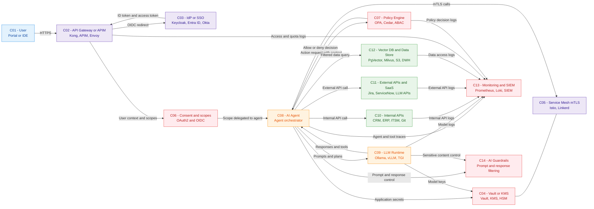

# Agentic AI Components Model (C01-C14)

Here is the updated Mermaid diagram with component IDs (C01…C14) in the labels.[^1][^2]

The IDs C01–C14 correspond to the rows in the previous table, which facilitates navigation between architecture docs, diagrams, and detailed specifications.[^3][^1]

⁂

[^1]: https://learn.microsoft.com/en-us/azure/cloud-adoption-framework/scenarios/ai/infrastructure/security

[^2]: https://nordicapis.com/top-10-api-gateways-in-2025/

[^3]: https://liveblocks.io/blog/whats-the-best-vector-database-for-building-ai-products

