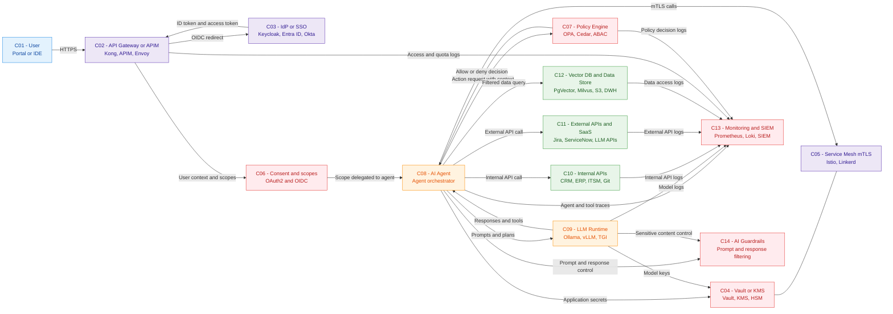

# Agentic AI Components Model (C01-C14)

| ID | Composant | Type | Rôle principal in l’architecture agentique | Examples de produits / outils |
| :-- | :-- | :-- | :-- | :-- |
| C01 | Utilisateur (U) | Humain / client | Initie les actions, fournit le contexte via UI or IDE sécurisé.  | VS Code, JetBrains, portail internal web, appli métier. |
| C02 | API Gateway / APIM (APIM) | Front sécurisé | Point d’entrée unique, TLS, routage, quotas, validation tokens, protection. | Kong Gateway, Azure API Management, NGINX, Apigee, Tyk, Gravitee, API7. |
| C03 | IdP / SSO (IDP) | Gestion identité humaine | Authentication, SSO, génération des tokens OIDC/OAuth2 with rôles and scopes.  | Keycloak, Microsoft Entra ID, Okta, Auth0, PingFederate. |
| C04 | Vault / KMS (VAULT) | Coffre-fort secrets / clés | Storage chiffré des secrets, clés API, certificats and clés de encryption.  | HashiCorp Vault, AWS KMS, Azure Key Vault, GCP KMS, Thales HSM. |
| C05 | Service Mesh (MESH) | Network de services | mTLS, identité de workload, observabilité and control network fin.  | Istio, Linkerd, Consul Connect, AWS App Mesh, Kuma. |
| C06 | Consentement \& scopes (CONS) | Gestion consentement | Définit les scopes délégués à l’agent (ce qu’il can faire for l’utilisateur).  | Flows OAuth2/OIDC in Keycloak, Entra ID, Okta, écrans de consent intégrés. |
| C07 | Policy Engine (PDP) | Moteur d’authorization | Décisions “allow/deny” for actions and accès de l’agent according to rules Zero Trust. | Open Policy Agent (OPA), Styra DAS, Cedar (AWS), AuthZ custom, Axiomatics. |
| C08 | AI Agent (A) | Orchestrateur d’agents | Porte l’identité applicative, planifie, appelle LLM, outils and data according to policies.  | LangChain / LangGraph, Semantic Kernel, CrewAI, AutoGen, OpenAI Agents. |
| C09 | LLM Runtime (LLM) | Moteur de modèle | Génère texte/plans/outils, local or via API, sous control des guardrails.  | vLLM, TGI, Ollama, llama.cpp, Azure OpenAI, OpenAI API, Anthropic Claude, Vertex AI. |
| C10 | APIs internals (T1) | Systèmes métier | Outils métiers que l’agent appelle for lire/écrire (tickets, clients, code). | ServiceNow, Jira DC, SAP, Salesforce, GitHub/GitLab API, outils internals REST/GraphQL. |
| C11 | APIs externals / SaaS (T2) | Services tiers | Capacités externals accessibles par l’agent with clés/scopes dédiés.  | Jira Cloud, ServiceNow SaaS, Slack, Notion, Google Workspace, LLM APIs managées. |
| C12 | Vector DB / Data Store (DATA) | Storage data IA | Stocke embeddings, documents, data interrogées via filtrage par droits.  | Pinecone, Qdrant, Weaviate, Milvus, pgvector, Chroma, Redis, OpenSearch, Elasticsearch. |
| C13 | Monitoring / SIEM (MON) | Observabilité \& audit | Centralise logs, traces, métriques for audit and détection d’anomalies.  | Prometheus, Grafana, Loki, OpenTelemetry, Splunk, Elastic/ELK, Datadog, New Relic. |
| C14 | Guardrails IA (IAS) | Security IA spécifique | Filtre prompts/réponses, détecte fuites de data and contenus risqués.  | Guardrails AI, Patronus AI, Protect AI, AI Gateway Cloudflare, models de modération/PII on Hugging Face. |

