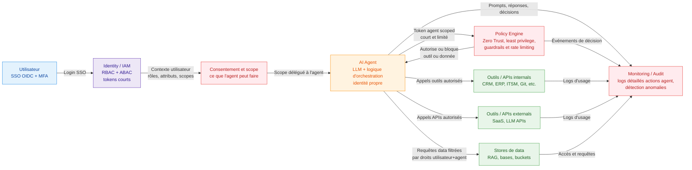

# un schema pour le cas d'usage AI Agentic

Pour un cas d’usage AI agentic, le schéma doit montrer clairement que l’agent est une identité à part entière, avec permissions minimales, audit complet et appels outillés sous control.[^1][^2]

## Schéma Mermaid en couleur pour AI agentic

Dans cette architecture :

- L’utilisateur délègue explicitement un scope à l’agent, traité comme une application tierce avec consentement et permissions strictes.[^3][^4]
- L’agent possède sa propre identité et ne peut appeler outils/data qu’à travers un moteur de politiques Zero Trust qui applique least privilege, tokens courts et garde‑fous.[^5][^6][^1]
- Toutes les actions (prompts, appels d’outils, accès data) sont journalisées et surveillées pour détecter anomalies, abus de privilèges ou attaques multi‑agents.[^2][^7][^8]
[^10][^11][^12][^13][^14][^15][^16][^17][^18][^19][^20][^9]

⁂

[^1]: https://blogs.cisco.com/security/zero-trust-in-the-era-of-agentic-ai

[^2]: https://www.getmonetizely.com/articles/zero-trust-architecture-for-agentic-ai-how-can-we-design-security-first-systems

[^3]: https://curity.io/blog/user-consent-best-practices-in-the-age-of-ai-agents/

[^4]: https://auth0.com/blog/access-control-in-the-era-of-ai-agents/

[^5]: https://www.sailpoint.com/identity-library/securing-ai-agents

[^6]: https://www.pingidentity.com/en/resources/identity-fundamentals/agentic-ai/iam-best-practices-ai-agents.html

[^7]: https://openreview.net/forum?id=SBgQTj5qOe

[^8]: https://www.emergentmind.com/topics/llm-based-multi-agent-systems-llm-mas

[^9]: https://securitybuzz.com/cybersecurity-news/why-zero-trust-must-evolve-for-the-age-of-agentic-ai/

[^10]: https://cloudsecurityalliance.org/blog/2025/09/12/fortifying-the-agentic-web-a-unified-zero-trust-architecture-against-logic-layer-threats

[^11]: https://www.flowforce.ai/blog/zero-trust-construction-using-agentic-ai-agents

[^12]: https://www.sorbonne-universite.fr/sites/default/files/media/2025-03/BOUZEFRANE Samia_PRD1.pdf

[^13]: https://www.hashicorp.com/blog/zero-trust-for-agentic-systems-managing-non-human-identities-at-scale

[^14]: https://atos.net/en/lp/unleashing-the-synergy-of-agentic-ai-and-zero-trust-to-secure-the-supply-chain

[^15]: https://www.biometricupdate.com/202510/agentic-ai-breaks-zero-trust-heres-how-to-fix-it

[^16]: https://www.wiz.io/academy/ai-agent-security

[^17]: https://arxiv.org/pdf/2402.03578.pdf

[^18]: https://arxiv.org/abs/2505.19301

[^19]: https://security.googlecloudcommunity.com/ciso-blog-77/10-tips-for-governing-ai-agents-6081

[^20]: https://developer.microsoft.com/blog/designing-multi-agent-intelligence

