```mermaid
flowchart LR
    subgraph OPEA["OPEA Architecture"]
        Gateway["API Gateway<br/>🚪"]
        Megaservice["Megaservices<br/>📦"]
        
        subgraph Microservices["Microservices Layer"]
            LLM["LLM Service"]
            VectorDB["Vector DB"]
            Embedding["Embedding"]
            Prompt["Prompt Engine"]
            Rerank["Reranking"]
        end
        
        Gateway --> Megaservice
        Megaservice --> Microservices
    end
    
    style Gateway fill:#bbdefb
    style Megaservice fill:#c5e1a5
    style Microservices fill:#fff9c4
```

# Enterprise AI Platforms: Deep Comparison

## Overview

This document provides an in-depth analysis of three enterprise AI platforms that target different layers of the AI stack: OPEA (Open Platform for Enterprise AI), Red Hat OpenShift AI, and NVIDIA AI Enterprise.

## Executive Summary

```mermaid
flowchart TB
    subgraph Application["🎯 Application Layer"]
        OPEA["OPEA<br/>GenAI/RAG Architecture<br/>Microservices & Blueprints"]
    end
    
    subgraph Platform["⚙️ Platform Layer"]
        OSAI["OpenShift AI<br/>MLOps/GenAIOps<br/>Kubernetes-native"]
    end
    
    subgraph Infrastructure["🔧 Infrastructure Layer"]
        NVAIE["NVIDIA AI Enterprise<br/>GPU-optimized Runtime<br/>CUDA-X & NIM"]
    end
    
    OPEA -->|Runs on| OSAI
    OSAI -->|Accelerated by| NVAIE
    
    style OPEA fill:#e1f5ff
    style OSAI fill:#fff3e0
    style NVAIE fill:#e8f5e9
```



**Key Insight**: These three platforms are complementary rather than competing solutions, operating at different architectural layers.

## Framework Profiles

### OPEA (Open Platform for Enterprise AI)

**Positioning**: Open, vendor-neutral architectural framework for GenAI applications

#### Core Characteristics

**Origin & Governance**
- Linux Foundation AI & Data sandbox project
- Initiated by Intel in 2024
- Community-driven, open-source development model
- Vendor-neutral by design

**Primary Focus**
- Generative AI and RAG (Retrieval-Augmented Generation) pipelines
- Composable microservice architecture
- Multi-provider ecosystem integration
- Reference implementations and blueprints

**Technical Architecture**


**Key Components**
1. **Microservices**: Single-purpose building blocks (embedding, LLM inference, vector search)
2. **Megaservices**: Composed workflows combining multiple microservices
3. **Gateways**: API orchestration and routing layer
4. **Connectors**: Integration with various AI providers and data sources

**Strengths**
- ✅ Vendor neutrality - not locked to any cloud or hardware vendor
- ✅ Composability - mix and match components
- ✅ Open source - transparent, auditable, community-driven
- ✅ Hardware agnostic - works across CPU, GPU, NPU, TPU
- ✅ Modular design - replace components without rewriting entire stack

**Limitations**
- ⚠️ Early stage - sandbox project, not production-hardened
- ⚠️ Limited commercial support - community-driven
- ⚠️ Integration burden - requires assembly and configuration
- ⚠️ No managed service - DIY deployment and operations
- ⚠️ Intel influence - while vendor-neutral, Intel has significant input

**Ideal Use Cases**
- Organizations requiring vendor neutrality
- Multi-cloud or hybrid deployments
- RAG/GenAI application development
- Research and experimentation
- Custom GenAI pipeline requirements

**Maturity Level**: 🟡 Emerging (LF AI & Data Sandbox)

---

### Red Hat OpenShift AI

**Positioning**: Enterprise-grade Kubernetes-native AI/ML platform

#### Core Characteristics

**Origin & Governance**
- Red Hat commercial product
- Built on OpenShift (Kubernetes distribution)
- Enterprise support and SLAs
- Part of Red Hat ecosystem

**Primary Focus**
- Complete AI/ML lifecycle management
- MLOps and GenAIOps workflows
- Data science collaboration
- Production model serving
- Hybrid cloud and edge deployment

**Technical Architecture**


**Key Components**
1. **Workbenches**: Jupyter notebooks, VS Code, RStudio for data science
2. **Model Training**: Distributed training, GPU/TPU acceleration
3. **Model Serving**: Production inference with KServe/ModelMesh
4. **Pipelines**: Kubeflow Pipelines for workflow orchestration
5. **Model Registry**: Versioning and lifecycle management
6. **Monitoring**: Observability for models in production

**Strengths**
- ✅ Enterprise support - Red Hat backing with SLAs
- ✅ Kubernetes-native - leverages OpenShift's security and operations
- ✅ Full lifecycle - end-to-end ML/AI workflow coverage
- ✅ Hybrid cloud - consistent experience across on-prem and cloud
- ✅ Security & compliance - built-in RBAC, auditing, certificates
- ✅ Integration - fits into existing Red Hat/OpenShift environments

**Limitations**
- ⚠️ OpenShift dependency - requires OpenShift as base platform
- ⚠️ Commercial license - subscription costs
- ⚠️ Opinionated - specific toolset and workflow patterns
- ⚠️ Complexity - full platform requires operational expertise
- ⚠️ Resource intensive - needs significant cluster resources

**Ideal Use Cases**
- Large enterprises already using OpenShift
- Regulated industries (finance, healthcare)
- Organizations requiring enterprise support
- Teams needing MLOps/GenAIOps governance
- Hybrid cloud or multi-cluster deployments

**Maturity Level**: 🟢 Production-ready (GA)

---

### NVIDIA AI Enterprise

**Positioning**: GPU-optimized AI infrastructure and microservices suite

#### Core Characteristics

**Origin & Governance**
- NVIDIA commercial product
- Licensed software suite
- Enterprise support from NVIDIA
- Tied to NVIDIA hardware ecosystem

**Primary Focus**
- Maximum GPU performance and utilization
- Optimized AI frameworks and libraries
- Production-ready microservices
- GPU infrastructure management
- Security and stability for production AI

**Technical Architecture**


**Key Components**
1. **CUDA-X Libraries**: Optimized libraries (cuDNN, cuBLAS, cuSPARSE)
2. **NIM (NVIDIA Inference Microservices)**: Prebuilt inference containers
3. **NeMo**: Framework for training large language models
4. **Triton Inference Server**: Production model serving
5. **TensorRT**: Inference optimization and acceleration
6. **RAPIDS**: GPU-accelerated data science
7. **GPU Operator**: Kubernetes GPU management

**Strengths**
- ✅ Performance - maximum GPU utilization and throughput
- ✅ Optimization - highly tuned libraries and frameworks
- ✅ Enterprise support - NVIDIA backing with SLAs
- ✅ Validated stacks - tested hardware/software combinations
- ✅ Security updates - CVE patches and security hardening
- ✅ Production-ready - battle-tested microservices

**Limitations**
- ⚠️ NVIDIA lock-in - requires NVIDIA GPUs
- ⚠️ License costs - commercial software with per-GPU licensing
- ⚠️ Hardware dependency - tied to specific GPU generations
- ⚠️ Vendor-specific - not portable to AMD, Intel accelerators
- ⚠️ Complexity - many components and integration points

**Ideal Use Cases**
- NVIDIA GPU-based infrastructure
- Performance-critical AI workloads
- Organizations requiring maximum ROI on GPU investment
- Production GenAI deployments
- Large-scale inference serving

**Maturity Level**: 🟢 Production-ready (GA)

---

## Detailed Comparison Matrix

### Strategic Positioning

| Dimension | OPEA | OpenShift AI | NVIDIA AI Enterprise |
|-----------|------|--------------|---------------------|
| **Business Model** | Open source community | Commercial subscription | Licensed software |
| **Target Customer** | Developers, architects | Enterprise IT | GPU infrastructure owners |
| **Lock-in Risk** | 🟢 Low | 🟡 Medium (OpenShift) | 🔴 High (NVIDIA GPUs) |
| **Total Cost** | 🟢 Low (DIY) | 🟡 Medium (subscription) | 🔴 High (license + GPU) |
| **Time to Value** | 🟡 Medium (assembly) | 🟢 Fast (integrated) | 🟢 Fast (optimized) |

### Technical Capabilities

| Capability | OPEA | OpenShift AI | NVIDIA AI Enterprise |
|-----------|------|--------------|---------------------|
| **GenAI/RAG** | 🟢 Primary focus | 🟡 Supported | 🟢 NIM microservices |
| **Model Training** | 🔴 Not included | 🟢 Distributed training | 🟢 NeMo framework |
| **Model Serving** | 🟡 Via components | 🟢 KServe/ModelMesh | 🟢 Triton Server |
| **MLOps/Pipelines** | 🔴 Not included | 🟢 Kubeflow Pipelines | 🟡 Partner solutions |
| **Data Science Tools** | 🔴 Not included | 🟢 Notebooks/IDE | 🟡 RAPIDS |
| **Observability** | 🔴 Not included | 🟢 Built-in monitoring | 🟡 Partner integration |

### Operational Characteristics

| Aspect | OPEA | OpenShift AI | NVIDIA AI Enterprise |
|--------|------|--------------|---------------------|
| **Deployment Model** | Container/K8s | OpenShift cluster | Any K8s + NVIDIA GPUs |
| **Multi-cloud** | 🟢 Excellent | 🟢 Good (hybrid) | 🟢 Cloud-agnostic |
| **Edge Support** | 🟢 Yes | 🟢 Yes | 🟢 Yes (with NVIDIA Edge) |
| **Air-gapped** | 🟢 Possible | 🟢 Supported | 🟢 Supported |
| **Upgrade Complexity** | 🟡 Component-by-component | 🟢 Integrated updates | 🟡 Coordinated updates |

### Hardware & Acceleration

| Hardware Type | OPEA | OpenShift AI | NVIDIA AI Enterprise |
|--------------|------|--------------|---------------------|
| **NVIDIA GPU** | ✅ Supported | ✅ Supported | ✅ **Optimized** |
| **AMD GPU** | ✅ Possible | ✅ Possible | ❌ Not supported |
| **Intel GPU** | ✅ **Optimized** | ✅ Supported | ❌ Not supported |
| **CPU-only** | ✅ Works | ✅ Works | ⚠️ Limited value |
| **NPU/TPU** | ✅ Extensible | ⚠️ Limited | ❌ Not supported |

### Support & Ecosystem

| Aspect | OPEA | OpenShift AI | NVIDIA AI Enterprise |
|--------|------|--------------|---------------------|
| **Vendor Support** | Community | Red Hat Enterprise | NVIDIA Enterprise |
| **SLA Availability** | ❌ No | ✅ Yes | ✅ Yes |
| **Training/Certs** | 🔴 Limited | 🟢 Extensive | 🟢 Available |
| **Partner Ecosystem** | 🟡 Growing | 🟢 Mature (Red Hat) | 🟢 Mature (NVIDIA) |
| **Community Size** | 🟡 Small (new) | 🟢 Large | 🟢 Large |

---

## Integration Patterns

### Pattern 1: Full Stack Integration

**Architecture**: OPEA on OpenShift AI with NVIDIA AI Enterprise


**Benefits**:
- 🎯 **OPEA** defines the GenAI application architecture
- ⚙️ **OpenShift AI** provides MLOps, security, and governance
- 🚀 **NVIDIA AI Enterprise** maximizes performance and GPU utilization

**Considerations**:
- Highest cost (3 license/subscription models)
- Maximum capabilities and support
- Best performance and enterprise features
- Complex integration and operational overhead

---

### Pattern 2: Platform + Runtime

**Architecture**: OpenShift AI with NVIDIA AI Enterprise (no OPEA)

**Use Case**: Traditional ML/AI workflows without specific GenAI/RAG focus

**Benefits**:
- Production-ready platform with MLOps
- Maximum GPU performance
- Enterprise support from both vendors

**Trade-offs**:
- No pre-built GenAI architectural patterns
- Must architect RAG/GenAI applications from scratch

---

### Pattern 3: Open Stack

**Architecture**: OPEA on vanilla Kubernetes (no OpenShift AI or NVAIE)

**Use Case**: Cost-conscious, cloud-native deployments

**Benefits**:
- Minimal licensing costs
- Maximum flexibility
- Vendor neutrality

**Trade-offs**:
- DIY MLOps and operations
- Limited enterprise support
- Must build tooling and governance

---

### Pattern 4: GPU-Optimized

**Architecture**: NVIDIA AI Enterprise only (no OPEA or OpenShift AI)

**Use Case**: GPU-intensive inference workloads, NIM deployment

**Benefits**:
- Maximum GPU performance
- Lowest complexity
- Pre-built inference microservices

**Trade-offs**:
- No MLOps platform
- Limited to NVIDIA ecosystem
- Must build orchestration layer

---

## Decision Framework

### Selection Criteria


### By Organization Type

| Organization Type | Recommended Stack | Rationale |
|-------------------|-------------------|-----------|
| **Large Enterprise (Red Hat shop)** | OpenShift AI + NVIDIA AIE | Leverages existing investments, enterprise support |
| **Large Enterprise (NVIDIA GPUs)** | NVIDIA AIE + OPEA | Maximum ROI on GPU investment, GenAI patterns |
| **Startup/SMB** | OPEA on managed K8s | Low cost, flexibility, cloud-native |
| **Regulated Industry** | OpenShift AI (full stack) | Compliance, audit trails, enterprise security |
| **AI Research Lab** | OPEA + NVIDIA AIE | Flexibility + performance, no platform constraints |
| **Multi-cloud Enterprise** | OpenShift AI | Consistent hybrid cloud experience |

### By Use Case

| Use Case | Primary Platform | Secondary Components |
|----------|-----------------|---------------------|
| **RAG/GenAI Applications** | OPEA | + OpenShift AI for production |
| **ML Model Training** | OpenShift AI | + NVIDIA AIE for GPU optimization |
| **High-throughput Inference** | NVIDIA AIE | + OPEA for orchestration |
| **MLOps/Model Governance** | OpenShift AI | + NVIDIA AIE for acceleration |
| **Multi-vendor Flexibility** | OPEA | + Managed K8s service |
| **Edge AI Deployment** | All three | Distributed architecture |

---

## Cost Analysis

### Total Cost of Ownership (3-Year Projection)

**Assumptions**: 
- 10-node GPU cluster (8x A100 GPUs per node = 80 GPUs)
- 100 data scientists/ML engineers
- Production GenAI applications

| Cost Category | OPEA Only | OpenShift AI Only | NVIDIA AIE Only | Full Stack |
|--------------|-----------|-------------------|-----------------|------------|
| **Software Licenses** | $0 | ~$500K | ~$800K | ~$1.3M |
| **Hardware (GPUs)** | $2.4M | $2.4M | $2.4M | $2.4M |
| **Professional Services** | $300K | $200K | $200K | $400K |
| **Training** | $50K | $100K | $100K | $150K |
| **Support** | $0 | $150K | $240K | $390K |
| **Operational Overhead** | $600K | $300K | $400K | $350K |
| **Total (3yr)** | **$3.35M** | **$3.65M** | **$4.14M** | **$4.99M** |

**Key Insights**:
- OPEA is lowest cost but highest operational burden
- Full stack has highest license costs but lowest operational overhead
- OpenShift AI provides balance of cost and support

---

## Technology Maturity & Roadmap

### Maturity Assessment

| Platform | Release Status | Production Readiness | Community Momentum |
|----------|---------------|---------------------|-------------------|
| **OPEA** | Sandbox (2024) | 🟡 Experimental | 🟢 Growing fast |
| **OpenShift AI** | GA (2023+) | 🟢 Production | 🟢 Stable |
| **NVIDIA AIE** | GA (2022+) | 🟢 Production | 🟢 Mature |

### Future Outlook (2025-2026)

**OPEA**
- Expected graduation from LF AI & Data sandbox
- Broader vendor adoption and contributions
- Integration with more cloud providers
- Enhanced security and governance features

**OpenShift AI**
- Deeper GenAI/LLM capabilities
- Multi-model governance
- Enhanced observability for AI workloads
- Edge AI orchestration improvements

**NVIDIA AI Enterprise**
- Expanded NIM microservice catalog
- Support for new GPU architectures (B100)
- Enhanced multi-tenant isolation
- Integration with more enterprise platforms

---

## Security & Compliance Considerations

### Security Posture

| Security Aspect | OPEA | OpenShift AI | NVIDIA AIE |
|----------------|------|--------------|------------|
| **Supply Chain** | 🟡 Community | 🟢 Red Hat verified | 🟢 NVIDIA signed |
| **Vulnerability Mgmt** | 🟡 Community | 🟢 CVE tracking | 🟢 CVE tracking |
| **Access Control** | ⚠️ DIY | 🟢 RBAC built-in | 🟡 K8s-dependent |
| **Secrets Management** | ⚠️ DIY | 🟢 Vault integration | 🟡 K8s-dependent |
| **Audit Logging** | ⚠️ DIY | 🟢 Comprehensive | 🟡 Limited |
| **Compliance Certs** | ❌ None | 🟢 SOC2, ISO | 🟢 Multiple |

### Compliance Support

**OpenShift AI** leads in compliance:
- FIPS 140-2 validated cryptography
- Common Criteria certification
- FedRAMP authorized
- HIPAA compliance support

**NVIDIA AI Enterprise** provides:
- Security updates for 3+ years
- CVE patching for frameworks
- Validated container images

**OPEA** requires:
- Self-assessment and hardening
- Third-party security scanning
- Custom compliance implementation

---

## Recommendations

### For Immediate Adoption

**Choose OpenShift AI if**:
- ✅ Already using Red Hat/OpenShift ecosystem
- ✅ Need enterprise support and SLAs
- ✅ Require comprehensive MLOps platform
- ✅ Operating in regulated industry
- ✅ Have budget for commercial platform

**Choose NVIDIA AI Enterprise if**:
- ✅ Have significant NVIDIA GPU investment
- ✅ Performance is critical success factor
- ✅ Need production-ready inference microservices
- ✅ Want maximum ROI on GPU infrastructure
- ✅ Require vendor support for AI stack

**Choose OPEA if**:
- ✅ Building GenAI/RAG applications
- ✅ Require vendor neutrality and flexibility
- ✅ Have strong engineering team for DIY approach
- ✅ Want to avoid vendor lock-in
- ✅ Experimental or research workloads

### For Combined Strategy

**Recommended Approach**: Phased adoption

**Phase 1** (0-6 months): Foundation
- Deploy OpenShift AI for MLOps platform
- Add NVIDIA AI Enterprise if using NVIDIA GPUs
- Establish governance and security

**Phase 2** (6-12 months): GenAI Layer
- Evaluate OPEA for GenAI/RAG applications
- Pilot OPEA microservices on OpenShift AI
- Compare with custom-built solutions

**Phase 3** (12+ months): Optimization
- Optimize based on actual usage patterns
- Consolidate or expand based on needs
- Re-evaluate vendor relationships

---

## GenAI Use Case Deep Dive

### Overview of GenAI Applications

Generative AI use cases fall into several categories, each with different infrastructure requirements and platform fit:

```mermaid
flowchart TB
    subgraph Personal["👤 Personal AI"]
        Assistant["Local Assistants<br/>Privacy-first"]
        Copilot["IDE Copilots<br/>Code completion"]
        Productivity["Productivity Tools<br/>Document analysis"]
    end
    
    subgraph Enterprise["🏢 Enterprise GenAI"]
        RAG["RAG Systems<br/>Knowledge retrieval"]
        Agents["AI Agents<br/>Task automation"]
        Chatbots["Enterprise Chatbots<br/>Customer service"]
    end
    
    subgraph Realtime["⚡ Real-time AI"]
        Voice["Voice Processing<br/>Low latency"]
        Vision["Computer Vision<br/>Edge inference"]
        Interactive["Interactive Apps<br/>AR/VR"]
    end
    
    subgraph Sensitive["🔒 Sensitive Data"]
        Healthcare["Healthcare<br/>HIPAA compliance"]
        Legal["Legal/HR<br/>Confidential docs"]
        Finance["Financial<br/>Regulated data"]
    end
    
    style Personal fill:#e3f2fd
    style Enterprise fill:#fff3e0
    style Realtime fill:#e8f5e9
    style Sensitive fill:#ffebee
```



---

### Use Case 1: Enterprise RAG System on Kubernetes

**Scenario**: RAG-based knowledge management system for internal documentation

**Architecture Stack**:


**Platform Fit**:

| Component | Platform | Rationale |
|-----------|----------|----------|
| **RAG Architecture** | OPEA | Pre-built microservices for embedding, retrieval, reranking |
| **Orchestration** | OpenShift AI | K8s management, StatefulSets for vector DB, persistent volumes |
| **Inference** | NVIDIA AIE | TensorRT optimization for embedding models, GPU-accelerated search |
| **Vector DB** | Qdrant/Milvus | Runs on OpenShift with NetApp storage (Trident CSI) |
| **Security** | OpenShift AI | Service mesh (Istio), RBAC, audit logs |

**Requirements**:
- **Latency**: < 500ms end-to-end (acceptable for knowledge search)
- **Throughput**: 100-500 concurrent users
- **Data**: Internal documents (confidential, on-prem only)
- **Compliance**: Data residency, audit trail

**Cost Profile** (3-year):
- OpenShift AI license: ~$150K
- NVIDIA AIE (4 GPUs): ~$200K
- Hardware (4x A100): ~$300K
- Storage (50TB NetApp): ~$100K
- **Total**: ~$750K

---

### Use Case 2: AI Agent for Infrastructure Management

**Scenario**: Agentic AI for NetApp NAS object management on Kubernetes

**Architecture Pattern**:


**Implementation Details**:

**OPEA Components**:
- LangGraph framework for agent state machine
- Microservices: LLM reasoning, RAG retriever, NetApp tools
- API Gateway for orchestration

**OpenShift AI Components**:
- Kubernetes deployment (FastAPI + LangGraph pods)
- StatefulSet for vector DB (pgvector/Qdrant)
- Service mesh for mTLS between components
- Secrets management (Vault integration)

**NVIDIA AIE Components**:
- vLLM runtime for LLM inference
- TensorRT for embedding optimization
- GPU acceleration for RAG retrieval

**Security Architecture**:
1. **User authentication**: SSO (OIDC) with MFA
2. **Agent identity**: Service account with minimal RBAC
3. **Consent model**: User explicitly delegates scope to agent
4. **Policy enforcement**: Zero Trust engine validates all tool calls
5. **Audit**: Complete logs of prompts, decisions, API calls
6. **Rate limiting**: Prevent abuse and runaway agents

**Key Features**:
- Agent can read NetApp volume status
- Agent can create/delete snapshots (with approval)
- Agent queries RAG for NetApp best practices
- All actions logged and auditable
- Dry-run mode for validation

---

### Use Case 3: Edge AI on Workstations

**Scenario**: Local LLM assistants for developers (privacy-first)

**Application Types**:

| Application | Latency Req | Privacy | Deployment |
|-------------|-------------|---------|------------|
| **IDE Copilot** | < 100ms | High | Local workstation |
| **Document Analysis** | < 2s | High | Local workstation |
| **Code Review Assistant** | < 5s | High | Local workstation |
| **Meeting Transcription** | Real-time | High | Local workstation |
| **Personal Knowledge Base** | < 1s | High | Local workstation |

**Platform Fit**:



```mermaid
flowchart TB
    subgraph Workstation["💻 Developer Workstation"]
        IDE["VS Code / IntelliJ<br/>With AI plugins"]
        Local_LLM["Ollama / LM Studio<br/>Quantized models"]
        VectorDB["ChromaDB<br/>Local vector store"]
        Docs["Local Documents<br/>Code, notes, docs"]
    end
    
    subgraph Models["📦 Models"]
        CodeLlama["CodeLlama 7B-Q4<br/>Code completion"]
        Mistral["Mistral 7B-Q4<br/>General assistant"]
        Embeddings["BGE-small<br/>Text embeddings"]
    end
    
    subgraph Hardware["⚙️ Hardware"]
        CPU["CPU: Intel/AMD<br/>16+ cores recommended"]
        GPU["GPU: NVIDIA RTX 4080<br/>Or AMD RX 7900"]
        RAM["RAM: 32GB+<br/>For model inference"]
        Storage["NVMe SSD<br/>Fast model loading"]
    end
    
    IDE --> Local_LLM
    Local_LLM --> Models
    Local_LLM --> VectorDB
    VectorDB --> Docs
    Models --> Hardware
    
    style Workstation fill:#e3f2fd
    style Models fill:#fff3e0
    style Hardware fill:#e8f5e9
```

**Why NOT the three platforms**:
- **OPEA**: Too complex for single-user workstation
- **OpenShift AI**: Overkill for local deployment
- **NVIDIA AIE**: Consumer GPUs not supported

**Alternative Stack**:
- **Runtime**: Ollama or LM Studio (free, easy setup)
- **Models**: Quantized 7B models (Q4_K_M format)
- **Vector DB**: ChromaDB or LanceDB (embedded)
- **Hardware**: Consumer GPU (RTX 4070+) or Apple Silicon

**When to graduate to enterprise platforms**:
- Team wants shared LLM service → Deploy OPEA on departmental server
- Need centralized management → Add OpenShift AI
- Scale to 50+ users → Add NVIDIA GPUs with NVAIE

---

### Use Case 4: Real-Time Voice Processing

**Scenario**: Customer service with voice transcription and sentiment analysis

**Requirements**:
- **Latency**: < 200ms (real-time conversation)
- **Throughput**: 500 concurrent calls
- **Availability**: 99.9% uptime
- **Compliance**: Call recording retention, GDPR

**Architecture**:


**Platform Selection**:

| Requirement | Platform | Rationale |
|-------------|----------|----------|
| **Low latency** | NVIDIA AIE | TensorRT-optimized Whisper, batch inference |
| **Orchestration** | OpenShift AI | K8s horizontal scaling, health checks |
| **Edge deployment** | OpenShift AI | Multi-cluster management, edge support |
| **GPU efficiency** | NVIDIA AIE | MIG (Multi-Instance GPU) for multi-tenancy |
| **Observability** | OpenShift AI | Prometheus metrics for latency monitoring |

**OPEA Not Required**: Simple pipeline (ASR → LLM → Storage), not RAG

**Optimization Techniques**:
1. **Model**: Whisper-large-v3 quantized to INT8 with TensorRT
2. **Batching**: Dynamic batching with 50ms max wait time
3. **GPU**: NVIDIA L4 GPUs with MIG (7 partitions per GPU)
4. **Scaling**: HPA based on queue depth and GPU utilization
5. **Caching**: LLM prompt cache for common queries

**Cost Profile** (per year):
- 20x L4 GPUs: ~$100K (cloud or on-prem)
- NVIDIA AIE licenses: ~$160K
- OpenShift AI: ~$50K
- **Total**: ~$310K/year

---

### Use Case 5: Regulated Industry (Healthcare RAG)

**Scenario**: Clinical decision support system with medical literature RAG

**Compliance Requirements**:
- **HIPAA**: Patient data isolation, encryption at rest/transit
- **Audit**: Complete audit trail of all queries and responses
- **Data residency**: On-premises only, no cloud
- **Retention**: 7-year log retention
- **Access control**: Role-based, principle of least privilege

**Architecture**:



```mermaid
flowchart TB
    subgraph Clinical["👨‍⚕️ Clinical Users"]
        Doctor["Physician<br/>Full access"]
        Nurse["Nurse<br/>Limited access"]
        Researcher["Researcher<br/>De-identified only"]
    end
    
    subgraph Security["🔒 Security Layer (OpenShift AI)"]
        Auth["Authentication<br/>SAML/LDAP + MFA"]
        RBAC_Layer["RBAC Engine<br/>Role validation"]
        Encryption["Encryption<br/>TLS 1.3 + FIPS 140-2"]
        Audit_Layer["Audit Service<br/>Immutable logs"]
    end
    
    subgraph RAG_System["📚 RAG System (OPEA)"]
        Query["Query Service<br/>Input validation"]
        Retrieval["Retrieval<br/>Vector search"]
        LLM_Service["LLM Service<br/>Response generation"]
        Compliance["Compliance Filter<br/>PHI detection"]
    end
    
    subgraph Data["💾 Data Layer"]
        Medical_Lit["Medical Literature<br/>PubMed, UpToDate"]
        Clinical_Notes["Clinical Notes<br/>Patient records"]
        Vector_Store["Vector Store<br/>Encrypted at rest"]
    end
    
    subgraph Infra["⚙️ Infrastructure"]
        Air_Gap["Air-gapped Network<br/>Isolated environment"]
        HSM["HSM<br/>Key management"]
        SIEM["SIEM Integration<br/>Security monitoring"]
    end
    
    Clinical --> Auth
    Auth --> RBAC_Layer
    RBAC_Layer --> Encryption
    Encryption --> Query
    
    Query --> Retrieval
    Retrieval --> LLM_Service
    LLM_Service --> Compliance
    
    Retrieval --> Vector_Store
    Vector_Store --> Medical_Lit
    Vector_Store --> Clinical_Notes
    
    RAG_System --> Audit_Layer
    Audit_Layer --> SIEM
    
    Data --> Air_Gap
    Air_Gap --> HSM
    
    style Clinical fill:#e3f2fd
    style Security fill:#ffebee
    style RAG_System fill:#fff3e0
    style Data fill:#f3e5f5
    style Infra fill:#ede7f6
```

**Why This Stack**:

**OpenShift AI** - **REQUIRED**:
- ✅ FIPS 140-2 validated cryptography
- ✅ FedRAMP authorized
- ✅ Comprehensive audit logging
- ✅ RBAC with attribute-based access control
- ✅ Air-gapped deployment support
- ✅ Red Hat support for compliance questions

**OPEA** - **RECOMMENDED**:
- ✅ Composable RAG pipeline (swap components for compliance)
- ✅ PHI filtering as microservice
- ✅ Open source (auditable codebase)
- ✅ No data exfiltration to vendor APIs

**NVIDIA AIE** - **OPTIONAL**:
- ✅ Security patches for 3+ years
- ✅ CVE tracking for all components
- ⚠️ Higher cost (~$10K per GPU license)
- ℹ️ Can use open source alternatives (vLLM) if budget-constrained

**Security Controls**:

| Control | Implementation | Platform |
|---------|----------------|----------|
| **Authentication** | SAML + MFA | OpenShift AI (Red Hat SSO) |
| **Authorization** | RBAC + ABAC | OpenShift AI (OPA integration) |
| **Encryption (transit)** | TLS 1.3, mTLS | OpenShift AI (Service Mesh) |
| **Encryption (rest)** | AES-256 | NetApp volumes with NVE |
| **Key Management** | HSM integration | OpenShift AI + external HSM |
| **Audit Logging** | Immutable logs | OpenShift AI + SIEM |
| **Data Loss Prevention** | PHI detection | OPEA microservice (Presidio) |
| **Network Isolation** | Air-gapped | Physical isolation + firewalls |

**Cost Profile** (5-year):
- Hardware (8x A100 GPUs, servers, storage): ~$1.2M
- OpenShift AI licenses: ~$750K
- NVIDIA AIE licenses (optional): ~$800K
- Professional services (compliance implementation): ~$500K
- Annual compliance audits: ~$200K
- **Total**: ~$3.45M (without NVAIE) or ~$4.25M (with NVAIE)

**Compliance Documentation**:
- Security architecture diagrams
- Data flow diagrams with PHI handling
- Risk assessment and mitigation
- Incident response procedures
- Business Associate Agreements (BAA) with vendors

---

### Use Case Comparison Matrix

| Use Case | OPEA | OpenShift AI | NVIDIA AIE | Complexity | Cost (3yr) |
|----------|------|--------------|------------|------------|------------|
| **Enterprise RAG** | ✅ Required | ✅ Required | ✅ Recommended | 🟡 Medium | $750K |
| **AI Agent** | ✅ Required | ✅ Required | 🟡 Optional | 🔴 High | $500K |
| **Edge Workstation** | ❌ Overkill | ❌ Overkill | ❌ Not supported | 🟢 Low | $5K |
| **Real-time Voice** | 🟡 Optional | ✅ Required | ✅ Required | 🟡 Medium | $930K |
| **Healthcare RAG** | ✅ Recommended | ✅ Required | 🟡 Optional | 🔴 High | $3.45M |

### Key Insights by Use Case

**When OPEA is Critical**:
- ✅ Building RAG applications
- ✅ Need composable microservices
- ✅ Multi-provider flexibility required
- ✅ Custom GenAI pipelines

**When OpenShift AI is Critical**:
- ✅ Enterprise scale (50+ users)
- ✅ Compliance requirements (HIPAA, FedRAMP)
- ✅ Need MLOps governance
- ✅ Multi-cluster/hybrid cloud

**When NVIDIA AIE is Critical**:
- ✅ Latency-sensitive (<200ms)
- ✅ High throughput (1000+ req/s)
- ✅ Maximum GPU utilization required
- ✅ NVIDIA GPU infrastructure

**When to Use Simpler Alternatives**:
- ✅ Single user / small team (<10)
- ✅ Experimental / R&D workloads
- ✅ Budget constraints
- ✅ Cloud-native only (managed services)

---

## License Optimization Strategies

### The Dual License Challenge

**Problem**: Using both OpenShift AI and NVIDIA AI Enterprise creates significant license overlap and cost:

```mermaid
flowchart TB
    subgraph Overlap["💰 License Overlap"]
        Both["Both Licenses<br/>$1.3M (3-year)"]
        OSAI_Cost["OpenShift AI: $500K<br/>K8s platform + MLOps"]
        NVAIE_Cost["NVIDIA AIE: $800K<br/>GPU stack + frameworks"]
        Duplicate["Overlapping Features:<br/>- Model serving (KServe vs Triton)<br/>- Monitoring<br/>- Container runtime<br/>- Some frameworks"]
    end
    
    style Overlap fill:#ffebee
    style Duplicate fill:#ffcdd2
```



**Key Question**: Do you need both commercial platforms, or can you mix open source with one commercial platform?

---

### Strategy 1: OPEA + Vanilla Kubernetes + Open Source GPU Stack

**Cost Savings**: ~$1.3M vs. full commercial stack

**Architecture**:


**Components**:

| Layer | Component | License | Cost |
|-------|-----------|---------|------|
| **Application** | OPEA | Apache 2.0 | FREE |
| **Orchestration** | Kubernetes | Apache 2.0 | FREE (managed service fees apply) |
| **MLOps** | Kubeflow | Apache 2.0 | FREE |
| **LLM Serving** | vLLM or TGI | Apache 2.0 | FREE |
| **Model Format** | GGUF / SafeTensors | Open | FREE |
| **Vector DB** | Qdrant / Milvus | Apache 2.0 | FREE |
| **Monitoring** | Prometheus/Grafana | Apache 2.0 | FREE |
| **GPU Drivers** | NVIDIA GPU Operator | Apache 2.0 | FREE |
| **Infrastructure** | GPUs | Hardware | $300K (4x A100) |

**3-Year TCO**:
- Hardware (4x A100): $300K
- Managed K8s (EKS/GKE): $150K (or $0 if self-managed)
- Storage: $100K
- Professional services: $200K (initial setup)
- Operations: $400K (staff time)
- **Total**: ~$1.15M (vs. $3.65M with both commercial platforms)

**Savings**: $2.5M (68% cost reduction)

**Trade-offs**:
- ❌ No enterprise support for AI stack
- ❌ Manual MLOps workflow integration
- ❌ Higher operational complexity
- ❌ No compliance certifications (FIPS, FedRAMP)
- ✅ Maximum flexibility
- ✅ No vendor lock-in
- ✅ Latest open source innovations

**Best For**:
- Startups and scale-ups
- Non-regulated industries
- Strong DevOps/MLOps team
- Cost-conscious deployments
- Experimental/R&D workloads

---

### Strategy 2: OPEA + OpenShift AI (No NVIDIA AIE)

**Cost Savings**: ~$800K vs. full stack

**Architecture**:


**What You Get**:
- ✅ OpenShift AI: Enterprise K8s platform, MLOps, security
- ✅ OPEA: GenAI/RAG microservices
- ✅ vLLM/TGI: Free, high-performance LLM serving
- ✅ Red Hat support for platform (not GPU stack)
- ✅ Compliance features (FIPS, audit logs)

**What You Lose** (vs. NVIDIA AIE):
- ❌ TensorRT optimization (~30% slower inference)
- ❌ NIM prebuilt microservices
- ❌ NVIDIA enterprise support for GPU stack
- ❌ CVE tracking for frameworks
- ❌ Multi-year security patches

**Performance Comparison**:

| Metric | vLLM (Free) | NVIDIA AIE (TensorRT) | Difference |
|--------|-------------|----------------------|------------|
| **Throughput** | 1,200 tok/s | 1,600 tok/s | -25% |
| **Latency (p50)** | 80ms | 60ms | +33% |
| **Latency (p99)** | 200ms | 120ms | +67% |
| **GPU Utilization** | 75% | 90% | -15% |
| **Cost/token** | Lower (no license) | Higher (with license) | -$200K/year |

**3-Year TCO**:
- Hardware (4x A100): $300K
- OpenShift AI: $500K
- Storage: $100K
- Professional services: $200K
- Operations: $350K
- **Total**: ~$1.45M

**Savings**: $800K vs. full stack (22% cost reduction)

**Best For**:
- Need enterprise K8s platform
- Compliance requirements
- Can accept 25-30% lower GPU performance
- Want Red Hat support
- Don't need absolute maximum throughput

**When to Upgrade to NVIDIA AIE**:
- Latency becomes critical (<100ms p99)
- GPU utilization is too low (<70%)
- Need enterprise support for GPU stack
- ROI on NVIDIA license justified by throughput gains

---

### Strategy 3: OPEA + NVIDIA AIE (No OpenShift AI)

**Cost Savings**: ~$500K vs. full stack

**Architecture**:


**What You Get**:
- ✅ OPEA: GenAI/RAG architecture
- ✅ NVIDIA AIE: Maximum GPU performance
- ✅ Vanilla/managed K8s: Flexible, cloud-native
- ✅ TensorRT optimization
- ✅ NIM prebuilt microservices
- ✅ NVIDIA support for GPU stack

**What You Lose** (vs. OpenShift AI):
- ❌ No integrated MLOps platform
- ❌ Manual security/RBAC configuration
- ❌ No compliance certifications
- ❌ No Red Hat support
- ❌ More DIY operations

**3-Year TCO**:
- Hardware (4x A100): $300K
- NVIDIA AIE: $800K
- Managed K8s: $150K
- Storage: $100K
- Professional services: $250K
- Operations: $500K (more complex)
- **Total**: ~$2.1M

**Savings**: $500K vs. full stack (14% cost reduction)

**Best For**:
- Performance is critical
- NVIDIA GPU infrastructure
- Don't need compliance features
- Strong K8s/DevOps team
- Cloud-native deployment
- Want NVIDIA support

**When to Add OpenShift AI**:
- Need compliance certifications
- Require enterprise MLOps governance
- Hybrid cloud deployment
- Limited K8s expertise

---

### Strategy 4: OPEA Only (Minimal Cost)

**Cost Savings**: ~$3M+ vs. full stack

**Architecture**:


**Extreme Cost Optimization**:
- OPEA: FREE
- Ollama/LM Studio: FREE
- ChromaDB: FREE
- Consumer GPU: $1,500-$2,500
- Workstation: $3,000-$5,000
- **Total**: $5K-$10K

**Best For**:
- Small teams (1-10 users)
- Department-level deployment
- Privacy-first use cases
- Development/testing
- Budget-constrained projects

---

### Decision Tree: License Optimization


---

### Cost Comparison Summary

| Strategy | Components | 3-Year Cost | vs. Full Stack | Best For |
|----------|-----------|-------------|----------------|----------|
| **Full Stack** | OPEA + OpenShift AI + NVIDIA AIE | $5.0M | Baseline | Compliance + performance |
| **OpenShift + Open GPU** | OPEA + OpenShift AI + vLLM | $1.45M | **-71%** | Compliance, moderate performance |
| **NVIDIA + Vanilla K8s** | OPEA + NVIDIA AIE + EKS/GKE | $2.1M | **-58%** | Performance, cloud-native |
| **Full Open Source** | OPEA + K8s + vLLM | $1.15M | **-77%** | Cost-conscious, no compliance |
| **OPEA Edge** | OPEA + Ollama + Local | $10K | **-99.8%** | Small teams, privacy |

---

### Hybrid Licensing Strategy (Recommended)

**Phased Approach** to avoid dual licensing:

**Phase 1** (Months 0-6): Foundation
- Deploy OPEA on vanilla Kubernetes (EKS/GKE/AKS)
- Use open source GPU stack (vLLM/TGI)
- Build GenAI applications
- Measure performance and requirements
- **Cost**: ~$200K setup + hardware

**Phase 2** (Months 6-12): Optimize for Bottleneck
- **If compliance is bottleneck** → Add OpenShift AI
- **If performance is bottleneck** → Add NVIDIA AIE
- **Don't add both** unless absolutely necessary
- **Cost**: +$500K (OpenShift) OR +$800K (NVIDIA)

**Phase 3** (Months 12-18): Scale
- Optimize chosen platform
- Consider second platform only if:
  - ROI is clear (>30% improvement)
  - Budget approved
  - Team can manage complexity

**Phase 4** (Months 18+): Continuous Optimization
- Re-evaluate annually
- Consider consolidation or migration
- Track cost per inference
- Optimize GPU utilization

---

### Open Source Alternatives Matrix

| Commercial | Open Source Alternative | Performance | Support | License |
|------------|------------------------|-------------|---------|----------|
| **OpenShift AI** | Kubeflow + Vanilla K8s | 80-90% | Community | Apache 2.0 |
| **NVIDIA Triton** | vLLM or TGI | 70-80% | Community | Apache 2.0 |
| **NVIDIA TensorRT** | ONNX Runtime + CPU opt | 50-70% | Microsoft/Community | MIT |
| **OpenShift Service Mesh** | Istio | 100% | Community | Apache 2.0 |
| **Red Hat SSO** | Keycloak | 100% | Community | Apache 2.0 |
| **NVIDIA NIM** | LangChain/LlamaIndex | 90% | Community | MIT |
| **Model Registry** | MLflow | 90% | Community | Apache 2.0 |

**Key Insight**: Open source alternatives provide 70-90% of commercial features at 0% license cost

---

### When Dual Licensing IS Justified

 Despite the cost, use both OpenShift AI + NVIDIA AIE when:

1. **Regulated Industry with Performance SLAs**
   - Healthcare with <100ms latency requirements
   - Financial services with compliance + high throughput
   - Government with FedRAMP + classified workloads

2. **Large Scale with Complex Requirements**
   - 1000+ concurrent users
   - Multi-region deployment
   - Both training and inference at scale
   - Need vendor support for both platform and GPU stack

3. **Risk Aversion**
   - Mission-critical production workloads
   - Cannot afford downtime
   - Limited in-house expertise
   - Prefer vendor-backed solutions

4. **ROI is Clear**
   - GPU utilization increase pays for NVIDIA license
   - Compliance certification pays for OpenShift
   - Reduced operational overhead justifies cost

**Break-even Analysis Example**:
- Full stack cost: $5M (3-year)
- Open source cost: $1.15M (3-year)
- Savings: $3.85M
- Required performance improvement to justify: >335% (unlikely)
- Required operational cost reduction: >$1.3M/year (possible in large teams)

---

### Recommended Path by Organization Type

| Organization | Recommended Stack | Rationale | 3-Year Cost |
|--------------|-------------------|-----------|-------------|
| **Startup (<50 people)** | OPEA + Open source | Minimize burn rate | $1.15M |
| **Scale-up (50-200)** | OPEA + OpenShift AI | Need platform, not max GPU perf | $1.45M |
| **Enterprise (200-1000)** | OPEA + NVIDIA AIE + EKS | Need GPU perf, have K8s team | $2.1M |
| **Large Enterprise (1000+)** | OPEA + OpenShift AI + NVIDIA AIE | Need both, can afford | $5M |
| **Regulated (any size)** | OPEA + OpenShift AI | Compliance required | $1.45M |
| **High-frequency Trading** | OPEA + NVIDIA AIE | Latency critical | $2.1M |
| **Research Lab** | OPEA only | Flexibility, experimentation | $10K |

---

## Alternative Accelerators: TPU and NPU Strategies

### Why Consider TPU/NPU for GenAI?

While NVIDIA GPUs dominate the AI acceleration market, TPUs (Tensor Processing Units) and NPUs (Neural Processing Units) offer compelling alternatives for specific GenAI workloads:


**Key Differences**:

| Aspect | GPU | TPU | NPU |
|--------|-----|-----|-----|
| **Primary Use** | Training + Inference | Training + Inference | Inference only |
| **Location** | On-prem + Cloud | Google Cloud only | Edge devices |
| **Power** | 300-700W | 200-450W | 5-50W |
| **Precision** | FP32, FP16, INT8, INT4 | BF16, INT8 | INT8, INT4, Binary |
| **Software Stack** | CUDA, ROCm | JAX, PyTorch/XLA | Vendor-specific |
| **Cost Model** | Per GPU license | Per TPU-hour | Embedded in hardware |
| **Best For** | Flexibility | Google Cloud workloads | Battery-powered edge |

---

### Strategy 5: OPEA + TPU (Google Cloud)

**Cost Optimization**: Escape NVIDIA license costs with Google TPUs

**Architecture**:


**Platform Compatibility**:

| Platform | TPU Support | Notes |
|----------|-------------|-------|
| **OPEA** | ✅ Compatible | Framework-agnostic, uses PyTorch/JAX |
| **OpenShift AI** | ❌ Not supported | GKE only, not on OpenShift |
| **NVIDIA AIE** | ❌ Not applicable | NVIDIA-only |

**Components**:

| Layer | Component | Cost |
|-------|-----------|------|
| **Application** | OPEA | FREE |
| **Orchestration** | GKE | $0.10/cluster/hour |
| **MLOps** | Vertex AI (optional) | Pay-per-use |
| **Acceleration** | TPU v5e | $1.10/TPU/hour (preemptible) |
| **Acceleration** | TPU v5p | $4.60/TPU/hour (on-demand) |
| **Storage** | Cloud Storage | $0.02/GB/month |
| **Monitoring** | Cloud Monitoring | $0.25/GB logs |

**3-Year TCO** (TPU v5e, 4 TPUs 24/7):
- TPU compute: $1.10 × 4 × 24 × 365 × 3 = $1.16M
- GKE: $10K
- Storage (50TB): $36K
- Networking: $100K
- Operations: $300K (simpler than on-prem)
- **Total**: ~$1.6M

**vs. NVIDIA GPU Stack**:
- 4x A100 on-prem: $300K hardware + $800K NVIDIA AIE = $1.1M + ops
- TPU cloud: $1.6M all-in (no hardware, no NVIDIA license)

**Performance Comparison**:

| Metric | NVIDIA A100 | TPU v5e | TPU v5p |
|--------|-------------|---------|----------|
| **LLM Inference (tok/s)** | 1,600 | 1,400 | 2,200 |
| **Training (TFLOPS)** | 312 (FP16) | 197 (BF16) | 459 (BF16) |
| **Memory Bandwidth** | 2TB/s (HBM2e) | 1.6TB/s | 4.8TB/s |
| **Cost/hour** | ~$3 (amortized) | $1.10 | $4.60 |
| **Power** | 400W | 200W | 450W |

**Advantages**:
- ✅ No NVIDIA license costs
- ✅ No hardware procurement
- ✅ Pay-per-use (scale to zero)
- ✅ Excellent for training (BF16 native)
- ✅ Lower power consumption
- ✅ Google-managed infrastructure

**Disadvantages**:
- ❌ Google Cloud lock-in (no on-prem)
- ❌ No OpenShift AI support
- ❌ Limited framework support (PyTorch/JAX, not TensorFlow optimized anymore)
- ❌ Learning curve (JAX preferred)
- ❌ Fewer third-party tools
- ❌ Cannot use with existing on-prem Kubernetes

**Best For**:
- Organizations already on Google Cloud
- Training-heavy workloads (TPU v5p excels)
- Want to avoid NVIDIA licensing
- Comfortable with cloud-only deployment
- Using JAX or PyTorch/XLA
- Batch inference workloads

**When to Choose TPU over GPU**:
1. **Training large models** (>10B parameters)
   - TPU Pods provide excellent multi-host scaling
   - BF16 native support reduces memory usage

2. **Google Cloud commitment**
   - Already using GCP services
   - Want unified billing

3. **Cost-sensitive inference**
   - Preemptible TPU v5e at $1.10/hour
   - Can handle interruptions

4. **Power/cooling constraints**
   - TPU uses ~50% less power than A100
   - Lower datacenter costs

**Migration Path**:
```
Phase 1: Prototype on GPUs
         ↓
Phase 2: Port to PyTorch/XLA or JAX
         ↓
Phase 3: Benchmark on TPU
         ↓
Phase 4: Production on TPU if cost-effective
```

**Framework Compatibility**:

| Framework | GPU | TPU | Notes |
|-----------|-----|-----|-------|
| **PyTorch** | ✅✅✅ | ✅✅ | Use PyTorch/XLA for TPU |
| **JAX** | ✅✅ | ✅✅✅ | Native TPU support |
| **TensorFlow** | ✅✅✅ | ✅ | Legacy, not recommended |
| **vLLM** | ✅✅✅ | ❌ | GPU-only |
| **Triton** | ✅✅✅ | ❌ | NVIDIA-only |

---

### Strategy 6: OPEA + NPU (Edge Deployment)

**Ultra-Low Power GenAI at the Edge**

**Architecture**:
```mermaid
flowchart TB
    subgraph EdgeDevice["🔌 Edge Device"]
        App["OPEA Lightweight<br/>Edge-optimized"]
        Runtime["ONNX Runtime<br/>NPU backend"]
        Models["Quantized Models<br/>INT8/INT4"]
    end
    
    subgraph NPU["⚡ NPU Hardware"]
        Intel_NPU["Intel Core Ultra<br/>NPU (10-13 TOPS)"]
        Qualcomm_NPU["Snapdragon NPU<br/>(45 TOPS)"]
        AMD_NPU["AMD Ryzen AI<br/>NPU (16 TOPS)"]
        Apple_ANE["Apple Neural Engine<br/>(15-17 TOPS)"]
    end
    
    subgraph UseCase["💡 Use Cases"]
        Local_LLM["Local LLM<br/>3B-7B models"]
        Voice["Voice Assistant<br/>Real-time"]
        Vision["Computer Vision<br/>On-device"]
    end
    
    App --> Runtime
    Runtime --> NPU
    Models --> Runtime
    NPU --> UseCase
    
    style EdgeDevice fill:#e1f5ff
    style NPU fill:#fff59d
    style UseCase fill:#c8e6c9
```

**NPU Landscape** (2025):

| Vendor | Product | TOPS | Power | Availability |
|--------|---------|------|-------|-------------|
| **Intel** | Core Ultra (Meteor Lake) | 10-13 | 5-15W | Available |
| **Intel** | Core Ultra (Lunar Lake) | 40-48 | 8-17W | Available |
| **AMD** | Ryzen AI 300 (Strix Point) | 50 | 15-54W | Available |
| **Qualcomm** | Snapdragon X Elite | 45 | 5-20W | Available |
| **Apple** | M4 Neural Engine | 38 | 10-20W | Available |
| **MediaTek** | Dimensity 9300 | 12 | 5-10W | Mobile only |

**Platform Compatibility**:

| Platform | NPU Support | Notes |
|----------|-------------|-------|
| **OPEA** | ✅ Possible | Via ONNX Runtime, OpenVINO |
| **OpenShift AI** | ⚠️ Limited | Experimental, not production |
| **NVIDIA AIE** | ❌ Not applicable | NVIDIA-only |

**Software Stack**:

```mermaid
flowchart TB
    subgraph App_Layer["Application"]
        OPEA_Edge["OPEA Edge<br/>Lightweight RAG"]
    end
    
    subgraph Framework["Framework"]
        ONNX["ONNX Runtime<br/>Cross-platform"]
        OpenVINO["OpenVINO<br/>Intel NPU optimized"]
        CoreML["Core ML<br/>Apple only"]
    end
    
    subgraph Backend["NPU Backend"]
        DirectML["DirectML<br/>Windows"]
        QNN["Qualcomm Neural Network SDK<br/>Snapdragon"]
        ANE["Apple Neural Engine<br/>macOS/iOS"]
    end
    
    OPEA_Edge --> ONNX
    OPEA_Edge --> OpenVINO
    ONNX --> DirectML
    ONNX --> QNN
    OpenVINO --> DirectML
    CoreML --> ANE
    
    style App_Layer fill:#e1f5ff
    style Framework fill:#c8e6c9
    style Backend fill:#fff59d
```

**Performance Characteristics**:

| Model Size | GPU (RTX 4090) | NPU (Intel Core Ultra) | Ratio |
|------------|----------------|------------------------|-------|
| **3B INT4** | 120 tok/s | 15 tok/s | 8x slower |
| **7B INT4** | 80 tok/s | 8 tok/s | 10x slower |
| **Power Draw** | 450W | 15W | 30x more efficient |
| **Cost** | $1,600 | $0 (built-in) | Included in laptop |

**Key Insight**: NPUs are 8-10x slower but 30x more power-efficient

**NPU Advantages**:
- ✅ Ultra-low power (5-20W vs 300-400W GPU)
- ✅ Always available (built into CPU)
- ✅ No additional hardware cost
- ✅ Silent operation (no fans)
- ✅ Battery-friendly for laptops
- ✅ Privacy (all on-device)

**NPU Disadvantages**:
- ❌ 8-10x slower than discrete GPU
- ❌ Limited to smaller models (<7B)
- ❌ INT8/INT4 quantization required
- ❌ Fragmented software ecosystem
- ❌ Vendor-specific optimizations needed
- ❌ Not suitable for training

**Best Use Cases for NPU**:

1. **Personal AI Assistants**
   - Background processing
   - Voice commands
   - Text completion
   - Battery-powered devices

2. **Edge RAG Systems**
   - Small knowledge bases (< 10K documents)
   - Latency acceptable (< 2s)
   - Privacy-critical data
   - Offline operation required

3. **Embedded AI**
   - IoT devices
   - Kiosks and terminals
   - Industrial equipment
   - Medical devices

4. **Mobile AI**
   - Smartphones and tablets
   - Always-on features
   - Wearables

**Cost Profile** (Edge NPU Deployment):
- Devices: $5K-$20K (NPU-capable laptops/workstations)
- OPEA: FREE
- ONNX Runtime/OpenVINO: FREE
- Models: FREE (open source, quantized)
- Operations: Minimal (self-contained)
- **Total**: $5K-$20K one-time

**vs. Edge GPU**:
- Edge GPU: $10K-$50K (workstations with RTX GPUs)
- Edge NPU: $5K-$20K (NPU built into CPU)
- Power savings: $500-$1K/year (if running 24/7)

**When to Choose NPU**:
1. Battery-powered devices (laptops, tablets)
2. Always-on inference (< 10 req/s)
3. Small models (< 7B parameters)
4. Privacy requirements (on-device only)
5. Silent operation needed
6. Power/cooling constraints

**When GPU is Better**:
1. Throughput > 50 req/s
2. Models > 10B parameters
3. Training or fine-tuning
4. Sub-100ms latency required
5. Desktop workstation (power not an issue)

---

### Accelerator Decision Matrix

```mermaid
flowchart TD
    Start["Select AI Accelerator"]
    
    Q1{"Workload Type?"}
    Q2{"Deployment?"}
    Q3{"Power Budget?"}
    Q4{"Cloud Provider?"}
    Q5{"Model Size?"}
    
    GPU["✅ NVIDIA GPU<br/>Flexible, high-performance<br/>CUDA ecosystem"]
    TPU["✅ Google TPU<br/>Training-optimized<br/>GCP only"]
    NPU["✅ NPU (Edge)<br/>Ultra-low power<br/>< 7B models"]
    CPU["✅ CPU<br/>Development/testing<br/>Very slow"]
    
    Start --> Q1
    Q1 -->|Training + Inference| Q2
    Q1 -->|Inference Only| Q3
    
    Q2 -->|On-prem| GPU
    Q2 -->|Cloud| Q4
    
    Q4 -->|Google Cloud| TPU
    Q4 -->|AWS/Azure/Other| GPU
    
    Q3 -->|< 50W| Q5
    Q3 -->|> 50W| GPU
    
    Q5 -->|< 7B| NPU
    Q5 -->|> 7B| GPU
    
    style GPU fill:#b3e5fc
    style TPU fill:#c5e1a5
    style NPU fill:#fff59d
    style CPU fill:#eeeeee
```

**Comprehensive Comparison**:

| Criteria | NVIDIA GPU | Google TPU | Intel/AMD NPU | Apple Silicon |
|----------|------------|------------|---------------|---------------|
| **Training** | ✅✅✅ | ✅✅✅ | ❌ | ✅ |
| **Inference** | ✅✅✅ | ✅✅ | ✅ | ✅✅ |
| **On-premises** | ✅✅✅ | ❌ | ✅✅✅ | ✅✅ |
| **Cloud** | ✅✅✅ | ✅✅✅ (GCP) | ⚠️ | ❌ |
| **Edge** | ✅ (power hungry) | ❌ | ✅✅✅ | ✅✅✅ |
| **Power Efficiency** | 🟡 (300-700W) | 🟢 (200-450W) | 🟢🟢 (5-50W) | 🟢🟢 (10-30W) |
| **Cost** | 🔴 (hardware + license) | 🟡 (pay-per-use) | 🟢 (included) | 🟡 (hardware) |
| **Software Ecosystem** | ✅✅✅ (CUDA) | 🟡 (JAX/PyTorch) | ⚠️ (fragmented) | 🟡 (Core ML) |
| **OPEA Support** | ✅✅✅ | ✅✅ | ✅ | ✅✅ |
| **OpenShift AI Support** | ✅✅✅ | ❌ | ⚠️ | ❌ |
| **NVIDIA AIE Support** | ✅✅✅ | ❌ | ❌ | ❌ |

---

### Multi-Accelerator Strategy

**Hybrid Approach**: Use different accelerators for different workloads

```mermaid
flowchart TB
    subgraph Training["🎓 Training (Cloud)"]
        TPU_Train["TPU v5p Pods<br/>Large model training<br/>Cost-effective"]
    end
    
    subgraph Cloud_Inference["☁️ Cloud Inference"]
        GPU_Cloud["NVIDIA GPU<br/>High-throughput serving<br/>Multi-tenant"]
    end
    
    subgraph Edge_Inference["📱 Edge Inference"]
        NPU_Edge["NPU<br/>On-device inference<br/>Privacy + Low power"]
    end
    
    subgraph Storage["💾 Model Repository"]
        Registry["Model Registry<br/>Multi-format<br/>(PyTorch, ONNX, TFLite)"]
    end
    
    TPU_Train -->|Export| Registry
    Registry -->|Deploy| GPU_Cloud
    Registry -->|Optimize + Deploy| NPU_Edge
    
    style Training fill:#c5e1a5
    style Cloud_Inference fill:#b3e5fc
    style Edge_Inference fill:#fff59d
    style Storage fill:#f5f5f5
```

**Example Architecture**:

**Training Pipeline** (TPU):
- Train LLM on TPU v5p Pods (Google Cloud)
- Cost: $4.60/TPU/hour × 256 TPUs × 100 hours = $117K per training run
- Export to PyTorch/ONNX format

**Cloud Deployment** (GPU):
- Serve via NVIDIA GPU with vLLM or Triton
- Cost: $800K NVIDIA AIE + $300K hardware (3-year)
- Throughput: 10K requests/hour per GPU

**Edge Deployment** (NPU):
- Quantize to INT4 for NPU
- Deploy to user devices (laptops, phones)
- Cost: $0 incremental (NPU built-in)
- Throughput: 100 requests/hour per device

**Total Cost** (3-year):
- Training: $117K × 10 runs = $1.17M
- Cloud inference: $1.1M
- Edge deployment: $50K (distribution)
- **Total**: $2.32M

**vs. GPU-Only**:
- Training on GPUs: $500K (less efficient)
- Cloud inference: $1.1M
- Edge with discrete GPUs: $500K (power/cost prohibitive)
- **Total**: $2.1M (but no edge deployment)

**Key Insight**: Hybrid accelerator strategy provides best TCO and coverage

---

### Platform Support Summary

| Accelerator | OPEA | OpenShift AI | NVIDIA AIE | Best Use Case |
|-------------|------|--------------|------------|---------------|
| **NVIDIA GPU** | ✅✅✅ | ✅✅✅ | ✅✅✅ | All workloads, most flexible |
| **AMD GPU** | ✅✅ | ✅ | ❌ | Cost alternative to NVIDIA |
| **Intel GPU** | ✅✅ | ✅ | ❌ | Intel-backed workloads |
| **Google TPU** | ✅✅ | ❌ | ❌ | GCP training/inference |
| **Intel/AMD NPU** | ✅ | ⚠️ | ❌ | Edge inference, low power |
| **Apple ANE** | ✅ | ❌ | ❌ | macOS/iOS edge inference |
| **CPU** | ✅✅✅ | ✅✅✅ | ✅ | Development, small models |

**Platform Recommendations**:

1. **OPEA Only**
   - Works with ALL accelerators
   - Maximum flexibility
   - No vendor lock-in
   - Best for experimentation

2. **OPEA + OpenShift AI**
   - NVIDIA GPU support (best)
   - AMD/Intel GPU support (limited)
   - No TPU/NPU production support

3. **OPEA + NVIDIA AIE**
   - NVIDIA GPU only
   - Maximum GPU performance
   - No TPU/NPU support

4. **Full Stack (OPEA + OpenShift + NVIDIA)**
   - NVIDIA GPU only
   - Most expensive
   - Best enterprise support
   - No accelerator flexibility

**Recommendation**: If using TPUs or NPUs, stick with OPEA + open source stack (no OpenShift AI or NVIDIA AIE)

---

## Conclusion

The three platforms address different enterprise AI needs:

- **OPEA**: Open architectural framework for GenAI applications
- **OpenShift AI**: Enterprise MLOps platform
- **NVIDIA AI Enterprise**: GPU-optimized runtime and microservices

**Key Takeaway**: These are not mutually exclusive choices. The most robust enterprise AI strategy often involves combining multiple platforms at different architectural layers, with OpenShift AI providing the platform foundation, NVIDIA AI Enterprise optimizing GPU performance, and OPEA defining GenAI application patterns.

**GenAI-Specific Insights**:
1. **RAG applications** benefit most from OPEA's composable architecture
2. **Regulated industries** require OpenShift AI for compliance and security
3. **Real-time applications** need NVIDIA AIE for latency optimization
4. **Edge deployments** work best with simpler stacks (not full enterprise platforms)
5. **AI agents** require all three platforms for security, orchestration, and performance

**Next Steps**:
1. Assess current infrastructure and investments
2. Define primary use cases (RAG, agents, real-time, edge, compliance)
3. Evaluate vendor relationships and support needs
4. Prototype with free/trial versions
5. Create TCO model for your specific scenario
6. Plan phased adoption strategy
7. Implement security and compliance controls early

---

## References

- OPEA Project: https://opea-project.github.io
- OpenShift AI: https://www.redhat.com/en/products/ai/openshift-ai
- NVIDIA AI Enterprise: https://www.nvidia.com/en-us/data-center/products/ai-enterprise/
