```mermaid
flowchart LR
    subgraph OPEA["OPEA Architecture"]
        Gateway["API Gateway<br/>🚪"]
        Megaservice["Megaservices<br/>📦"]
        
        subgraph Microservices["Microservices Layer"]
            LLM["LLM Service"]
            VectorDB["Vector DB"]
            Embedding["Embedding"]
            Prompt["Prompt Engine"]
            Rerank["Reranking"]
        end
        
        Gateway --> Megaservice
        Megaservice --> Microservices
    end
    
    style Gateway fill:#bbdefb
    style Megaservice fill:#c5e1a5
    style Microservices fill:#fff9c4
```

# Enterprise AI Platforms: Deep Comparison

## Overview

This document provides an in-depth analysis of three enterprise AI platforms that target different layers of the AI stack: OPEA (Open Platform for Enterprise AI), Red Hat OpenShift AI, and NVIDIA AI Enterprise.

## Executive Summary

```mermaid
flowchart TB
    subgraph Application["🎯 Application Layer"]
        OPEA["OPEA<br/>GenAI/RAG Architecture<br/>Microservices & Blueprints"]
    end
    
    subgraph Platform["⚙️ Platform Layer"]
        OSAI["OpenShift AI<br/>MLOps/GenAIOps<br/>Kubernetes-native"]
    end
    
    subgraph Infrastructure["🔧 Infrastructure Layer"]
        NVAIE["NVIDIA AI Enterprise<br/>GPU-optimized Runtime<br/>CUDA-X & NIM"]
    end
    
    OPEA -->|Runs on| OSAI
    OSAI -->|Accelerated by| NVAIE
    
    style OPEA fill:#e1f5ff
    style OSAI fill:#fff3e0
    style NVAIE fill:#e8f5e9
```

**Key Insight**: These three platforms are complementary rather than competing solutions, operating at different architectural layers.

## Framework Profiles

### OPEA (Open Platform for Enterprise AI)

**Positioning**: Open, vendor-neutral architectural framework for GenAI applications

#### Core Characteristics

**Origin & Governance**
- Linux Foundation AI & Data sandbox project
- Initiated by Intel in 2024
- Community-driven, open-source development model
- Vendor-neutral by design

**Primary Focus**
- Generative AI and RAG (Retrieval-Augmented Generation) pipelines
- Composable microservice architecture
- Multi-provider ecosystem integration
- Reference implementations and blueprints

**Technical Architecture**

**Key Components**
1. **Microservices**: Single-purpose building blocks (embedding, LLM inference, vector search)
2. **Megaservices**: Composed workflows combining multiple microservices
3. **Gateways**: API orchestration and routing layer
4. **Connectors**: Integration with various AI providers and data sources

**Strengths**
- ✅ Vendor neutrality - not locked to any cloud or hardware vendor
- ✅ Composability - mix and match components
- ✅ Open source - transparent, auditable, community-driven
- ✅ Hardware agnostic - works across CPU, GPU, NPU, TPU
- ✅ Modular design - replace components without rewriting entire stack

**Limitations**
- ⚠️ Early stage - sandbox project, not production-hardened
- ⚠️ Limited commercial support - community-driven
- ⚠️ Integration burden - requires assembly and configuration
- ⚠️ No managed service - DIY deployment and operations
- ⚠️ Intel influence - while vendor-neutral, Intel has significant input

**Ideal Use Cases**
- Organizations requiring vendor neutrality
- Multi-cloud or hybrid deployments
- RAG/GenAI application development
- Research and experimentation
- Custom GenAI pipeline requirements

**Maturity Level**: 🟡 Emerging (LF AI & Data Sandbox)

---

### Red Hat OpenShift AI

**Positioning**: Enterprise-grade Kubernetes-native AI/ML platform

#### Core Characteristics

**Origin & Governance**
- Red Hat commercial product
- Built on OpenShift (Kubernetes distribution)
- Enterprise support and SLAs
- Part of Red Hat ecosystem

**Primary Focus**
- Complete AI/ML lifecycle management
- MLOps and GenAIOps workflows
- Data science collaboration
- Production model serving
- Hybrid cloud and edge deployment

**Technical Architecture**

**Key Components**
1. **Workbenches**: Jupyter notebooks, VS Code, RStudio for data science
2. **Model Training**: Distributed training, GPU/TPU acceleration
3. **Model Serving**: Production inference with KServe/ModelMesh
4. **Pipelines**: Kubeflow Pipelines for workflow orchestration
5. **Model Registry**: Versioning and lifecycle management
6. **Monitoring**: Observability for models in production

**Strengths**
- ✅ Enterprise support - Red Hat backing with SLAs
- ✅ Kubernetes-native - leverages OpenShift's security and operations
- ✅ Full lifecycle - end-to-end ML/AI workflow coverage
- ✅ Hybrid cloud - consistent experience across on-prem and cloud
- ✅ Security & compliance - built-in RBAC, auditing, certificates
- ✅ Integration - fits into existing Red Hat/OpenShift environments

**Limitations**
- ⚠️ OpenShift dependency - requires OpenShift as base platform
- ⚠️ Commercial license - subscription costs
- ⚠️ Opinionated - specific toolset and workflow patterns
- ⚠️ Complexity - full platform requires operational expertise
- ⚠️ Resource intensive - needs significant cluster resources

**Ideal Use Cases**
- Large enterprises already using OpenShift
- Regulated industries (finance, healthcare)
- Organizations requiring enterprise support
- Teams needing MLOps/GenAIOps governance
- Hybrid cloud or multi-cluster deployments

**Maturity Level**: 🟢 Production-ready (GA)

---

### NVIDIA AI Enterprise

**Positioning**: GPU-optimized AI infrastructure and microservices suite

#### Core Characteristics

**Origin & Governance**
- NVIDIA commercial product
- Licensed software suite
- Enterprise support from NVIDIA
- Tied to NVIDIA hardware ecosystem

**Primary Focus**
- Maximum GPU performance and utilization
- Optimized AI frameworks and libraries
- Production-ready microservices
- GPU infrastructure management
- Security and stability for production AI

**Technical Architecture**

**Key Components**
1. **CUDA-X Libraries**: Optimized libraries (cuDNN, cuBLAS, cuSPARSE)
2. **NIM (NVIDIA Inference Microservices)**: Prebuilt inference containers
3. **NeMo**: Framework for training large language models
4. **Triton Inference Server**: Production model serving
5. **TensorRT**: Inference optimization and acceleration
6. **RAPIDS**: GPU-accelerated data science
7. **GPU Operator**: Kubernetes GPU management

**Strengths**
- ✅ Performance - maximum GPU utilization and throughput
- ✅ Optimization - highly tuned libraries and frameworks
- ✅ Enterprise support - NVIDIA backing with SLAs
- ✅ Validated stacks - tested hardware/software combinations
- ✅ Security updates - CVE patches and security hardening
- ✅ Production-ready - battle-tested microservices

**Limitations**
- ⚠️ NVIDIA lock-in - requires NVIDIA GPUs
- ⚠️ License costs - commercial software with per-GPU licensing
- ⚠️ Hardware dependency - tied to specific GPU generations
- ⚠️ Vendor-specific - not portable to AMD, Intel accelerators
- ⚠️ Complexity - many components and integration points

**Ideal Use Cases**
- NVIDIA GPU-based infrastructure
- Performance-critical AI workloads
- Organizations requiring maximum ROI on GPU investment
- Production GenAI deployments
- Large-scale inference serving

**Maturity Level**: 🟢 Production-ready (GA)

---

## Detailed Component Models

This section provides a comprehensive breakdown of the technical components within each platform.

### OPEA Component Model

**Architectural Layers**: 4-tier microservice architecture for GenAI applications

```mermaid
flowchart TB
    subgraph Gateway_Layer["🚪 Gateway Layer"]
        API_GW["API Gateway<br/>- Request routing<br/>- Auth/authz<br/>- Rate limiting"]
        Web_UI["Web UI<br/>- Admin console<br/>- User interface"]
    end
    
    subgraph Megaservice_Layer["📦 Megaservice Layer (Compositions)"]
        RAG_Mega["ChatQnA Megaservice<br/>- RAG pipeline<br/>- E2E workflow"]
        CodeGen_Mega["CodeGen Megaservice<br/>- Code generation<br/>- Context-aware"]
        Visual_Mega["VisualQnA Megaservice<br/>- Multimodal<br/>- Image+text"]
    end
    
    subgraph Microservice_Layer["⚙️ Microservice Layer (Building Blocks)"]
        subgraph Retrieval["Retrieval Services"]
            Embedding_MS["Embedding Service<br/>- Text embedding<br/>- Vector generation"]
            VectorDB_MS["Vector DB Service<br/>- ChromaDB<br/>- Milvus<br/>- Redis"]
            Rerank_MS["Reranking Service<br/>- Result reranking<br/>- Relevance scoring"]
        end
        
        subgraph Generation["Generation Services"]
            LLM_MS["LLM Service<br/>- Text generation<br/>- vLLM/TGI backend"]
            Guardrail_MS["Guardrail Service<br/>- Content filtering<br/>- Safety checks"]
        end
        
        subgraph Processing["Processing Services"]
            Prompt_MS["Prompt Service<br/>- Template management<br/>- Dynamic prompts"]
            DataPrep_MS["Data Prep Service<br/>- Document parsing<br/>- Chunking"]
            ASR_MS["ASR Service<br/>- Speech-to-text<br/>- Audio processing"]
            TTS_MS["TTS Service<br/>- Text-to-speech<br/>- Voice synthesis"]
        end
    end
    
    subgraph Integration_Layer["🔌 Integration Layer (Connectors)"]
        Model_Conn["Model Providers<br/>- HuggingFace<br/>- OpenAI<br/>- Anthropic<br/>- Local models"]
        Data_Conn["Data Sources<br/>- Object storage<br/>- Databases<br/>- APIs"]
        Infra_Conn["Infrastructure<br/>- Kubernetes<br/>- Docker<br/>- Cloud platforms"]
    end
    
    Gateway_Layer --> Megaservice_Layer
    Megaservice_Layer --> Microservice_Layer
    Microservice_Layer --> Integration_Layer
    
    style Gateway_Layer fill:#e3f2fd
    style Megaservice_Layer fill:#c5e1a5
    style Microservice_Layer fill:#fff9c4
    style Integration_Layer fill:#f3e5f5
    style Retrieval fill:#ffebee
    style Generation fill:#e8f5e9
    style Processing fill:#f3e5f5
```

**OPEA Component Catalog**:

| Component Type | Component Name | Purpose | Technology Options |
|----------------|----------------|---------|--------------------|
| **Gateway** | API Gateway | Request routing, auth | Kong, Envoy, NGINX |
| | Web UI | User interface | React, Vue.js |
| **Megaservice** | ChatQnA | RAG chat application | Pre-built workflow |
| | CodeGen | Code generation | Pre-built workflow |
| | DocSum | Document summarization | Pre-built workflow |
| | VisualQnA | Multimodal QA | Pre-built workflow |
| **Microservice** | Embedding | Text vectorization | TEI, Sentence-Transformers |
| | Vector DB | Similarity search | ChromaDB, Milvus, Redis, Qdrant |
| | Reranking | Result reordering | BGE, Cohere |
| | LLM | Text generation | vLLM, TGI, Ollama |
| | Prompt Engine | Prompt templating | LangChain, custom |
| | Guardrails | Safety/filtering | LlamaGuard, NeMo Guardrails |
| | Data Prep | Document processing | Unstructured, LlamaParse |
| | ASR | Speech-to-text | Whisper |
| | TTS | Text-to-speech | FastSpeech, VITS |
| **Connector** | Model Providers | External LLM APIs | OpenAI, Anthropic, Azure |
| | Data Sources | External data | S3, PostgreSQL, APIs |

**OPEA Deployment Models**:
1. **Docker Compose**: Single-node development
2. **Kubernetes**: Production multi-node
3. **Helm Charts**: Kubernetes packaging
4. **Cloud Marketplace**: AWS, Azure, GCP

**Key Design Principles**:
- **Composability**: Mix and match microservices
- **Replaceability**: Swap implementations without breaking contracts
- **Scalability**: Independent scaling of each microservice
- **Observability**: Distributed tracing with OpenTelemetry

---

### OpenShift AI Component Model

**Architectural Layers**: Full-stack AI/ML platform on OpenShift

**OpenShift AI Component Catalog**:

| Layer | Component | Purpose | Key Features |
|-------|-----------|---------|-------------|
| **UI** | Dashboard | Central console | Project mgmt, resource quotas |
| | Workbenches | Development env | Persistent, GPU-attached |
| **Development** | JupyterLab | Interactive notebooks | Extensions, kernels |
| | VS Code | Cloud IDE | Git, debugging, extensions |
| | RStudio | R environment | Statistical computing |
| **Training** | Distributed Training | Multi-GPU/node | Horovod, PyTorch DDP, Ray |
| | Katib | HPO | Grid, random, Bayesian search |
| | MLflow | Experiment tracking | Metrics, params, artifacts |
| **Pipeline** | Kubeflow Pipelines | Workflow orchestration | DAG execution, scheduling |
| | Data Pipelines | ETL workflows | Data validation, transformation |
| **Serving** | KServe | Single-model serving | Autoscaling, canary, A/B |
| | ModelMesh | Multi-model serving | Resource sharing, batching |
| | Triton | NVIDIA inference | TensorRT, multi-framework |
| **Management** | Model Registry | Version control | Metadata, lineage, promotion |
| | Prometheus/Grafana | Monitoring | Metrics, dashboards, alerts |
| | Model Monitoring | ML observability | Drift, performance, fairness |
| **Governance** | RBAC | Access control | Namespaces, roles, policies |
| | Audit Logging | Compliance | Security events, API calls |
| **Platform** | OpenShift | Kubernetes distro | Enterprise features, operators |
| | GPU Operator | GPU management | Drivers, monitoring, time-slicing |

**OpenShift AI Operators** (Kubernetes Operators):
1. **Data Science Operator**: Core orchestration
2. **KServe Operator**: Model serving management
3. **Model Registry Operator**: Registry lifecycle
4. **Dashboard Operator**: UI deployment
5. **Workbench Operator**: Notebook management
6. **Pipeline Operator**: Kubeflow Pipelines

**Integration Points**:
- **OpenShift GitOps**: ArgoCD for CI/CD
- **OpenShift Pipelines**: Tekton for build automation
- **OpenShift Service Mesh**: Istio for traffic management
- **OpenShift Data Foundation**: Ceph for storage

---

### NVIDIA AI Enterprise Component Model

**Architectural Layers**: GPU-accelerated AI software stack

**NVIDIA AI Enterprise Component Catalog**:

| Layer | Component | Purpose | Key Features |
|-------|-----------|---------|-------------|
| **NIM** | LLM NIMs | LLM inference containers | Llama, Mistral, Gemma optimized |
| | Vision NIMs | Vision model containers | CLIP, SD, ViT optimized |
| | Speech NIMs | Speech model containers | Whisper, Riva ASR/TTS |
| **Training** | NeMo Framework | LLM/multimodal training | Distributed, checkpointing |
| | PyTorch (CUDA) | Deep learning | Native GPU acceleration |
| **Inference** | Triton Server | Multi-model serving | Dynamic batching, ensembles |
| | TensorRT-LLM | LLM optimization | FP8, Flash Attention, KV cache |
| | TensorRT | Model optimization | Layer fusion, quantization |
| **Data Science** | RAPIDS | GPU data science | cuDF, cuML, cuGraph |
| | Spark RAPIDS | GPU Spark | Distributed ETL |
| **Libraries** | cuDNN | Neural networks | Convolution, attention, RNN |
| | cuBLAS | Linear algebra | GEMM, matrix ops |
| | NCCL | Multi-GPU | All-reduce, broadcast |
| **Runtime** | CUDA Runtime | GPU execution | Memory, streams, events |
| | Container Toolkit | GPU containers | Docker integration |
| **Infrastructure** | GPU Operator | K8s GPU mgmt | Drivers, plugin, monitoring |
| | DCGM | GPU telemetry | Metrics, health, diagnostics |
| | MIG Manager | GPU partitioning | Multi-instance GPU |
| **Driver** | NVIDIA Driver | GPU control | Validated, LTS versions |
| | CUDA Driver | GPU programming | Low-level API |
| **Hardware** | H100/A100/L40S | GPU compute | Tensor Cores, NVLink |

**NVIDIA AI Enterprise NIM Catalog** (Inference Microservices):

| NIM Type | Models Included | Optimization | Use Cases |
|----------|-----------------|--------------|------------|
| **LLM** | Llama 3.1 (8B, 70B, 405B) | TensorRT-LLM, FP8 | Chat, RAG, agents |
| | Mistral 7B, Mixtral 8x7B | TensorRT-LLM, FP8 | Efficient inference |
| | Gemma 2B, 7B | TensorRT-LLM | Edge deployment |
| | CodeLlama | TensorRT-LLM | Code generation |
| **Vision** | CLIP | TensorRT | Image-text embedding |
| | Stable Diffusion | TensorRT | Text-to-image |
| | ViT (Vision Transformer) | TensorRT | Image classification |
| **Speech** | Whisper (tiny-large) | TensorRT | Speech-to-text |
| | FastPitch/HiFi-GAN | TensorRT | Text-to-speech |
| | Riva | Custom optimization | Production ASR/TTS |
| **Multimodal** | LLaVA | TensorRT-LLM | Visual question answering |
| | BLIP | TensorRT | Image captioning |

**NVIDIA AI Enterprise Licensing Model**:
- **Per GPU socket**: Annual subscription
- **Includes**: All software, updates, support
- **Support tiers**: Standard, Premium
- **Validation**: Tested on specific NVIDIA GPUs

**Validated Hardware Platforms**:
- **On-premises**: DGX systems, HGX platforms, certified servers
- **Cloud**: AWS (P4d, P5), Azure (NC-series), GCP (A2, A3)
- **Edge**: Jetson AGX Orin, IGX Orin

---

### Cross-Platform Component Mapping

**How components map across the three platforms**:

| Function | OPEA | OpenShift AI | NVIDIA AI Enterprise |
|----------|------|--------------|---------------------|
| **LLM Inference** | LLM Microservice (vLLM, TGI) | KServe + Triton | NIM (TensorRT-LLM) |
| **Embedding** | Embedding Microservice (TEI) | Custom deployment | NIM (Embeddings) |
| **Vector DB** | Vector DB Microservice | Custom deployment | Not included (BYO) |
| **Model Training** | Not included (BYO) | Distributed Training | NeMo Framework |
| **Experiment Tracking** | Not included | MLflow | Not included (partner) |
| **Model Registry** | Not included | Model Registry | Not included (partner) |
| **Pipeline Orchestration** | Megaservices (workflow) | Kubeflow Pipelines | Not included (partner) |
| **Observability** | OpenTelemetry (DIY) | Prometheus/Grafana | DCGM (GPU only) |
| **GPU Management** | Kubernetes native | GPU Operator | GPU Operator (enhanced) |
| **Multi-GPU Training** | Not included | Horovod, PyTorch DDP | NCCL, NeMo |
| **Inference Optimization** | Model-dependent | TensorRT, OpenVINO | TensorRT, TensorRT-LLM |
| **Container Runtime** | Docker, containerd | CRI-O (OpenShift) | NVIDIA Container Toolkit |

**Key Insights**:
- **OPEA**: Application architecture layer, requires platform underneath
- **OpenShift AI**: Full platform, includes dev, training, serving, ops
- **NVIDIA AI Enterprise**: Optimized runtime + inference, requires platform

**Recommended Combinations**:
1. **OPEA + OpenShift AI + NVIDIA AIE**: Full stack, maximum capability
2. **OPEA + Kubernetes + Open Source**: Cost-optimized, vendor-neutral
3. **OpenShift AI + NVIDIA AIE**: Traditional ML + GenAI, no OPEA
4. **OPEA + Kubernetes + Gaudi**: Intel-backed, cost-effective

---

## Detailed Comparison Matrix

### Strategic Positioning

| Dimension | OPEA | OpenShift AI | NVIDIA AI Enterprise |
|-----------|------|--------------|---------------------|
| **Business Model** | Open source community | Commercial subscription | Licensed software |
| **Target Customer** | Developers, architects | Enterprise IT | GPU infrastructure owners |
| **Lock-in Risk** | 🟢 Low | 🟡 Medium (OpenShift) | 🔴 High (NVIDIA GPUs) |
| **Total Cost** | 🟢 Low (DIY) | 🟡 Medium (subscription) | 🔴 High (license + GPU) |
| **Time to Value** | 🟡 Medium (assembly) | 🟢 Fast (integrated) | 🟢 Fast (optimized) |

### Technical Capabilities

| Capability | OPEA | OpenShift AI | NVIDIA AI Enterprise |
|-----------|------|--------------|---------------------|
| **GenAI/RAG** | 🟢 Primary focus | 🟡 Supported | 🟢 NIM microservices |
| **Model Training** | 🔴 Not included | 🟢 Distributed training | 🟢 NeMo framework |
| **Model Serving** | 🟡 Via components | 🟢 KServe/ModelMesh | 🟢 Triton Server |
| **MLOps/Pipelines** | 🔴 Not included | 🟢 Kubeflow Pipelines | 🟡 Partner solutions |
| **Data Science Tools** | 🔴 Not included | 🟢 Notebooks/IDE | 🟡 RAPIDS |
| **Observability** | 🔴 Not included | 🟢 Built-in monitoring | 🟡 Partner integration |

### Operational Characteristics

| Aspect | OPEA | OpenShift AI | NVIDIA AI Enterprise |
|--------|------|--------------|---------------------|
| **Deployment Model** | Container/K8s | OpenShift cluster | Any K8s + NVIDIA GPUs |
| **Multi-cloud** | 🟢 Excellent | 🟢 Good (hybrid) | 🟢 Cloud-agnostic |
| **Edge Support** | 🟢 Yes | 🟢 Yes | 🟢 Yes (with NVIDIA Edge) |
| **Air-gapped** | 🟢 Possible | 🟢 Supported | 🟢 Supported |
| **Upgrade Complexity** | 🟡 Component-by-component | 🟢 Integrated updates | 🟡 Coordinated updates |

### Hardware & Acceleration

| Hardware Type | OPEA | OpenShift AI | NVIDIA AI Enterprise |
|--------------|------|--------------|---------------------|
| **NVIDIA GPU** | ✅ Supported | ✅ Supported | ✅ **Optimized** |
| **AMD GPU** | ✅ Possible | ✅ Possible | ❌ Not supported |
| **Intel GPU** | ✅ **Optimized** | ✅ Supported | ❌ Not supported |
| **CPU-only** | ✅ Works | ✅ Works | ⚠️ Limited value |
| **NPU/TPU** | ✅ Extensible | ⚠️ Limited | ❌ Not supported |

### Support & Ecosystem

| Aspect | OPEA | OpenShift AI | NVIDIA AI Enterprise |
|--------|------|--------------|---------------------|
| **Vendor Support** | Community | Red Hat Enterprise | NVIDIA Enterprise |
| **SLA Availability** | ❌ No | ✅ Yes | ✅ Yes |
| **Training/Certs** | 🔴 Limited | 🟢 Extensive | 🟢 Available |
| **Partner Ecosystem** | 🟡 Growing | 🟢 Mature (Red Hat) | 🟢 Mature (NVIDIA) |
| **Community Size** | 🟡 Small (new) | 🟢 Large | 🟢 Large |

---

## Integration Patterns

### Pattern 1: Full Stack Integration

**Architecture**: OPEA on OpenShift AI with NVIDIA AI Enterprise

**Benefits**:
- 🎯 **OPEA** defines the GenAI application architecture
- ⚙️ **OpenShift AI** provides MLOps, security, and governance
- 🚀 **NVIDIA AI Enterprise** maximizes performance and GPU utilization

**Considerations**:
- Highest cost (3 license/subscription models)
- Maximum capabilities and support
- Best performance and enterprise features
- Complex integration and operational overhead

---

### Pattern 2: Platform + Runtime

**Architecture**: OpenShift AI with NVIDIA AI Enterprise (no OPEA)

**Use Case**: Traditional ML/AI workflows without specific GenAI/RAG focus

**Benefits**:
- Production-ready platform with MLOps
- Maximum GPU performance
- Enterprise support from both vendors

**Trade-offs**:
- No pre-built GenAI architectural patterns
- Must architect RAG/GenAI applications from scratch

---

### Pattern 3: Open Stack

**Architecture**: OPEA on vanilla Kubernetes (no OpenShift AI or NVAIE)

**Use Case**: Cost-conscious, cloud-native deployments

**Benefits**:
- Minimal licensing costs
- Maximum flexibility
- Vendor neutrality

**Trade-offs**:
- DIY MLOps and operations
- Limited enterprise support
- Must build tooling and governance

---

### Pattern 4: GPU-Optimized

**Architecture**: NVIDIA AI Enterprise only (no OPEA or OpenShift AI)

**Use Case**: GPU-intensive inference workloads, NIM deployment

**Benefits**:
- Maximum GPU performance
- Lowest complexity
- Pre-built inference microservices

**Trade-offs**:
- No MLOps platform
- Limited to NVIDIA ecosystem
- Must build orchestration layer

---

## Decision Framework

### Selection Criteria

### By Organization Type

| Organization Type | Recommended Stack | Rationale |
|-------------------|-------------------|-----------|
| **Large Enterprise (Red Hat shop)** | OpenShift AI + NVIDIA AIE | Leverages existing investments, enterprise support |
| **Large Enterprise (NVIDIA GPUs)** | NVIDIA AIE + OPEA | Maximum ROI on GPU investment, GenAI patterns |
| **Startup/SMB** | OPEA on managed K8s | Low cost, flexibility, cloud-native |
| **Regulated Industry** | OpenShift AI (full stack) | Compliance, audit trails, enterprise security |
| **AI Research Lab** | OPEA + NVIDIA AIE | Flexibility + performance, no platform constraints |
| **Multi-cloud Enterprise** | OpenShift AI | Consistent hybrid cloud experience |

### By Use Case

| Use Case | Primary Platform | Secondary Components |
|----------|-----------------|---------------------|
| **RAG/GenAI Applications** | OPEA | + OpenShift AI for production |
| **ML Model Training** | OpenShift AI | + NVIDIA AIE for GPU optimization |
| **High-throughput Inference** | NVIDIA AIE | + OPEA for orchestration |
| **MLOps/Model Governance** | OpenShift AI | + NVIDIA AIE for acceleration |
| **Multi-vendor Flexibility** | OPEA | + Managed K8s service |
| **Edge AI Deployment** | All three | Distributed architecture |

---

## Cost Analysis

### Total Cost of Ownership (3-Year Projection)

**Assumptions**: 
- 10-node GPU cluster (8x A100 GPUs per node = 80 GPUs)
- 100 data scientists/ML engineers
- Production GenAI applications

| Cost Category | OPEA Only | OpenShift AI Only | NVIDIA AIE Only | Full Stack |
|--------------|-----------|-------------------|-----------------|------------|
| **Software Licenses** | $0 | ~$500K | ~$800K | ~$1.3M |
| **Hardware (GPUs)** | $2.4M | $2.4M | $2.4M | $2.4M |
| **Professional Services** | $300K | $200K | $200K | $400K |
| **Training** | $50K | $100K | $100K | $150K |
| **Support** | $0 | $150K | $240K | $390K |
| **Operational Overhead** | $600K | $300K | $400K | $350K |
| **Total (3yr)** | **$3.35M** | **$3.65M** | **$4.14M** | **$4.99M** |

**Key Insights**:
- OPEA is lowest cost but highest operational burden
- Full stack has highest license costs but lowest operational overhead
- OpenShift AI provides balance of cost and support

---

## Technology Maturity & Roadmap

### Maturity Assessment

| Platform | Release Status | Production Readiness | Community Momentum |
|----------|---------------|---------------------|-------------------|
| **OPEA** | Sandbox (2024) | 🟡 Experimental | 🟢 Growing fast |
| **OpenShift AI** | GA (2023+) | 🟢 Production | 🟢 Stable |
| **NVIDIA AIE** | GA (2022+) | 🟢 Production | 🟢 Mature |

### Future Outlook (2025-2026)

**OPEA**
- Expected graduation from LF AI & Data sandbox
- Broader vendor adoption and contributions
- Integration with more cloud providers
- Enhanced security and governance features

**OpenShift AI**
- Deeper GenAI/LLM capabilities
- Multi-model governance
- Enhanced observability for AI workloads
- Edge AI orchestration improvements

**NVIDIA AI Enterprise**
- Expanded NIM microservice catalog
- Support for new GPU architectures (B100)
- Enhanced multi-tenant isolation
- Integration with more enterprise platforms

---

## Security & Compliance Considerations

### Security Posture

| Security Aspect | OPEA | OpenShift AI | NVIDIA AIE |
|----------------|------|--------------|------------|
| **Supply Chain** | 🟡 Community | 🟢 Red Hat verified | 🟢 NVIDIA signed |
| **Vulnerability Mgmt** | 🟡 Community | 🟢 CVE tracking | 🟢 CVE tracking |
| **Access Control** | ⚠️ DIY | 🟢 RBAC built-in | 🟡 K8s-dependent |
| **Secrets Management** | ⚠️ DIY | 🟢 Vault integration | 🟡 K8s-dependent |
| **Audit Logging** | ⚠️ DIY | 🟢 Comprehensive | 🟡 Limited |
| **Compliance Certs** | ❌ None | 🟢 SOC2, ISO | 🟢 Multiple |

### Compliance Support

**OpenShift AI** leads in compliance:
- FIPS 140-2 validated cryptography
- Common Criteria certification
- FedRAMP authorized
- HIPAA compliance support

**NVIDIA AI Enterprise** provides:
- Security updates for 3+ years
- CVE patching for frameworks
- Validated container images

**OPEA** requires:
- Self-assessment and hardening
- Third-party security scanning
- Custom compliance implementation

---

## Recommendations

### For Immediate Adoption

**Choose OpenShift AI if**:
- ✅ Already using Red Hat/OpenShift ecosystem
- ✅ Need enterprise support and SLAs
- ✅ Require comprehensive MLOps platform
- ✅ Operating in regulated industry
- ✅ Have budget for commercial platform

**Choose NVIDIA AI Enterprise if**:
- ✅ Have significant NVIDIA GPU investment
- ✅ Performance is critical success factor
- ✅ Need production-ready inference microservices
- ✅ Want maximum ROI on GPU infrastructure
- ✅ Require vendor support for AI stack

**Choose OPEA if**:
- ✅ Building GenAI/RAG applications
- ✅ Require vendor neutrality and flexibility
- ✅ Have strong engineering team for DIY approach
- ✅ Want to avoid vendor lock-in
- ✅ Experimental or research workloads

### For Combined Strategy

**Recommended Approach**: Phased adoption

**Phase 1** (0-6 months): Foundation
- Deploy OpenShift AI for MLOps platform
- Add NVIDIA AI Enterprise if using NVIDIA GPUs
- Establish governance and security

**Phase 2** (6-12 months): GenAI Layer
- Evaluate OPEA for GenAI/RAG applications
- Pilot OPEA microservices on OpenShift AI
- Compare with custom-built solutions

**Phase 3** (12+ months): Optimization
- Optimize based on actual usage patterns
- Consolidate or expand based on needs
- Re-evaluate vendor relationships

---

