```mermaid
flowchart LR
    subgraph OPEA["OPEA Architecture"]
        Gateway["API Gateway<br/>🚪"]
        Megaservice["Megaservices<br/>📦"]
        
        subgraph Microservices["Microservices Layer"]
            LLM["LLM Service"]
            VectorDB["Vector DB"]
            Embedding["Embedding"]
            Prompt["Prompt Engine"]
            Rerank["Reranking"]
        end
        
        Gateway --> Megaservice
        Megaservice --> Microservices
    end
    
    style Gateway fill:#bbdefb
    style Megaservice fill:#c5e1a5
    style Microservices fill:#fff9c4
```

# Enterprise AI Platforms: Deep Comparison

## Overview

This document provides an in-depth analysis of three enterprise AI platforms that target different layers of the AI stack: OPEA (Open Platform for Enterprise AI), Red Hat OpenShift AI, and NVIDIA AI Enterprise.

## Executive Summary

```mermaid
flowchart TB
    subgraph Application["🎯 Application Layer"]
        OPEA["OPEA<br/>GenAI/RAG Architecture<br/>Microservices & Blueprints"]
    end
    
    subgraph Platform["⚙️ Platform Layer"]
        OSAI["OpenShift AI<br/>MLOps/GenAIOps<br/>Kubernetes-native"]
    end
    
    subgraph Infrastructure["🔧 Infrastructure Layer"]
        NVAIE["NVIDIA AI Enterprise<br/>GPU-optimized Runtime<br/>CUDA-X & NIM"]
    end
    
    OPEA -->|Runs on| OSAI
    OSAI -->|Accelerated by| NVAIE
    
    style OPEA fill:#e1f5ff
    style OSAI fill:#fff3e0
    style NVAIE fill:#e8f5e9
```

**Key Insight**: These three platforms are complementary rather than competing solutions, operating at different architectural layers.

## Framework Profiles

### OPEA (Open Platform for Enterprise AI)

**Positioning**: Open, vendor-neutral architectural framework for GenAI applications

#### Core Characteristics

**Origin & Governance**
- Linux Foundation AI & Data sandbox project
- Initiated by Intel in 2024
- Community-driven, open-source development model
- Vendor-neutral by design

**Primary Focus**
- Generative AI and RAG (Retrieval-Augmented Generation) pipelines
- Composable microservice architecture
- Multi-provider ecosystem integration
- Reference implementations and blueprints

**Technical Architecture**

**Key Components**
1. **Microservices**: Single-purpose building blocks (embedding, LLM inference, vector search)
2. **Megaservices**: Composed workflows combining multiple microservices
3. **Gateways**: API orchestration and routing layer
4. **Connectors**: Integration with various AI providers and data sources

**Strengths**
- ✅ Vendor neutrality - not locked to any cloud or hardware vendor
- ✅ Composability - mix and match components
- ✅ Open source - transparent, auditable, community-driven
- ✅ Hardware agnostic - works across CPU, GPU, NPU, TPU
- ✅ Modular design - replace components without rewriting entire stack

**Limitations**
- ⚠️ Early stage - sandbox project, not production-hardened
- ⚠️ Limited commercial support - community-driven
- ⚠️ Integration burden - requires assembly and configuration
- ⚠️ No managed service - DIY deployment and operations
- ⚠️ Intel influence - while vendor-neutral, Intel has significant input

**Ideal Use Cases**
- Organizations requiring vendor neutrality
- Multi-cloud or hybrid deployments
- RAG/GenAI application development
- Research and experimentation
- Custom GenAI pipeline requirements

**Maturity Level**: 🟡 Emerging (LF AI & Data Sandbox)

---

### Red Hat OpenShift AI

**Positioning**: Enterprise-grade Kubernetes-native AI/ML platform

#### Core Characteristics

**Origin & Governance**
- Red Hat commercial product
- Built on OpenShift (Kubernetes distribution)
- Enterprise support and SLAs
- Part of Red Hat ecosystem

**Primary Focus**
- Complete AI/ML lifecycle management
- MLOps and GenAIOps workflows
- Data science collaboration
- Production model serving
- Hybrid cloud and edge deployment

**Technical Architecture**

**Key Components**
1. **Workbenches**: Jupyter notebooks, VS Code, RStudio for data science
2. **Model Training**: Distributed training, GPU/TPU acceleration
3. **Model Serving**: Production inference with KServe/ModelMesh
4. **Pipelines**: Kubeflow Pipelines for workflow orchestration
5. **Model Registry**: Versioning and lifecycle management
6. **Monitoring**: Observability for models in production

**Strengths**
- ✅ Enterprise support - Red Hat backing with SLAs
- ✅ Kubernetes-native - leverages OpenShift's security and operations
- ✅ Full lifecycle - end-to-end ML/AI workflow coverage
- ✅ Hybrid cloud - consistent experience across on-prem and cloud
- ✅ Security & compliance - built-in RBAC, auditing, certificates
- ✅ Integration - fits into existing Red Hat/OpenShift environments

**Limitations**
- ⚠️ OpenShift dependency - requires OpenShift as base platform
- ⚠️ Commercial license - subscription costs
- ⚠️ Opinionated - specific toolset and workflow patterns
- ⚠️ Complexity - full platform requires operational expertise
- ⚠️ Resource intensive - needs significant cluster resources

**Ideal Use Cases**
- Large enterprises already using OpenShift
- Regulated industries (finance, healthcare)
- Organizations requiring enterprise support
- Teams needing MLOps/GenAIOps governance
- Hybrid cloud or multi-cluster deployments

**Maturity Level**: 🟢 Production-ready (GA)

---

### NVIDIA AI Enterprise

**Positioning**: GPU-optimized AI infrastructure and microservices suite

#### Core Characteristics

**Origin & Governance**
- NVIDIA commercial product
- Licensed software suite
- Enterprise support from NVIDIA
- Tied to NVIDIA hardware ecosystem

**Primary Focus**
- Maximum GPU performance and utilization
- Optimized AI frameworks and libraries
- Production-ready microservices
- GPU infrastructure management
- Security and stability for production AI

**Technical Architecture**

**Key Components**
1. **CUDA-X Libraries**: Optimized libraries (cuDNN, cuBLAS, cuSPARSE)
2. **NIM (NVIDIA Inference Microservices)**: Prebuilt inference containers
3. **NeMo**: Framework for training large language models
4. **Triton Inference Server**: Production model serving
5. **TensorRT**: Inference optimization and acceleration
6. **RAPIDS**: GPU-accelerated data science
7. **GPU Operator**: Kubernetes GPU management

**Strengths**
- ✅ Performance - maximum GPU utilization and throughput
- ✅ Optimization - highly tuned libraries and frameworks
- ✅ Enterprise support - NVIDIA backing with SLAs
- ✅ Validated stacks - tested hardware/software combinations
- ✅ Security updates - CVE patches and security hardening
- ✅ Production-ready - battle-tested microservices

**Limitations**
- ⚠️ NVIDIA lock-in - requires NVIDIA GPUs
- ⚠️ License costs - commercial software with per-GPU licensing
- ⚠️ Hardware dependency - tied to specific GPU generations
- ⚠️ Vendor-specific - not portable to AMD, Intel accelerators
- ⚠️ Complexity - many components and integration points

**Ideal Use Cases**
- NVIDIA GPU-based infrastructure
- Performance-critical AI workloads
- Organizations requiring maximum ROI on GPU investment
- Production GenAI deployments
- Large-scale inference serving

**Maturity Level**: 🟢 Production-ready (GA)

---

## Detailed Comparison Matrix

### Strategic Positioning

| Dimension | OPEA | OpenShift AI | NVIDIA AI Enterprise |
|-----------|------|--------------|---------------------|
| **Business Model** | Open source community | Commercial subscription | Licensed software |
| **Target Customer** | Developers, architects | Enterprise IT | GPU infrastructure owners |
| **Lock-in Risk** | 🟢 Low | 🟡 Medium (OpenShift) | 🔴 High (NVIDIA GPUs) |
| **Total Cost** | 🟢 Low (DIY) | 🟡 Medium (subscription) | 🔴 High (license + GPU) |
| **Time to Value** | 🟡 Medium (assembly) | 🟢 Fast (integrated) | 🟢 Fast (optimized) |

### Technical Capabilities

| Capability | OPEA | OpenShift AI | NVIDIA AI Enterprise |
|-----------|------|--------------|---------------------|
| **GenAI/RAG** | 🟢 Primary focus | 🟡 Supported | 🟢 NIM microservices |
| **Model Training** | 🔴 Not included | 🟢 Distributed training | 🟢 NeMo framework |
| **Model Serving** | 🟡 Via components | 🟢 KServe/ModelMesh | 🟢 Triton Server |
| **MLOps/Pipelines** | 🔴 Not included | 🟢 Kubeflow Pipelines | 🟡 Partner solutions |
| **Data Science Tools** | 🔴 Not included | 🟢 Notebooks/IDE | 🟡 RAPIDS |
| **Observability** | 🔴 Not included | 🟢 Built-in monitoring | 🟡 Partner integration |

### Operational Characteristics

| Aspect | OPEA | OpenShift AI | NVIDIA AI Enterprise |
|--------|------|--------------|---------------------|
| **Deployment Model** | Container/K8s | OpenShift cluster | Any K8s + NVIDIA GPUs |
| **Multi-cloud** | 🟢 Excellent | 🟢 Good (hybrid) | 🟢 Cloud-agnostic |
| **Edge Support** | 🟢 Yes | 🟢 Yes | 🟢 Yes (with NVIDIA Edge) |
| **Air-gapped** | 🟢 Possible | 🟢 Supported | 🟢 Supported |
| **Upgrade Complexity** | 🟡 Component-by-component | 🟢 Integrated updates | 🟡 Coordinated updates |

### Hardware & Acceleration

| Hardware Type | OPEA | OpenShift AI | NVIDIA AI Enterprise |
|--------------|------|--------------|---------------------|
| **NVIDIA GPU** | ✅ Supported | ✅ Supported | ✅ **Optimized** |
| **AMD GPU** | ✅ Possible | ✅ Possible | ❌ Not supported |
| **Intel GPU** | ✅ **Optimized** | ✅ Supported | ❌ Not supported |
| **CPU-only** | ✅ Works | ✅ Works | ⚠️ Limited value |
| **NPU/TPU** | ✅ Extensible | ⚠️ Limited | ❌ Not supported |

### Support & Ecosystem

| Aspect | OPEA | OpenShift AI | NVIDIA AI Enterprise |
|--------|------|--------------|---------------------|
| **Vendor Support** | Community | Red Hat Enterprise | NVIDIA Enterprise |
| **SLA Availability** | ❌ No | ✅ Yes | ✅ Yes |
| **Training/Certs** | 🔴 Limited | 🟢 Extensive | 🟢 Available |
| **Partner Ecosystem** | 🟡 Growing | 🟢 Mature (Red Hat) | 🟢 Mature (NVIDIA) |
| **Community Size** | 🟡 Small (new) | 🟢 Large | 🟢 Large |

---

## Integration Patterns

### Pattern 1: Full Stack Integration

**Architecture**: OPEA on OpenShift AI with NVIDIA AI Enterprise

**Benefits**:
- 🎯 **OPEA** defines the GenAI application architecture
- ⚙️ **OpenShift AI** provides MLOps, security, and governance
- 🚀 **NVIDIA AI Enterprise** maximizes performance and GPU utilization

**Considerations**:
- Highest cost (3 license/subscription models)
- Maximum capabilities and support
- Best performance and enterprise features
- Complex integration and operational overhead

---

### Pattern 2: Platform + Runtime

**Architecture**: OpenShift AI with NVIDIA AI Enterprise (no OPEA)

**Use Case**: Traditional ML/AI workflows without specific GenAI/RAG focus

**Benefits**:
- Production-ready platform with MLOps
- Maximum GPU performance
- Enterprise support from both vendors

**Trade-offs**:
- No pre-built GenAI architectural patterns
- Must architect RAG/GenAI applications from scratch

---

### Pattern 3: Open Stack

**Architecture**: OPEA on vanilla Kubernetes (no OpenShift AI or NVAIE)

**Use Case**: Cost-conscious, cloud-native deployments

**Benefits**:
- Minimal licensing costs
- Maximum flexibility
- Vendor neutrality

**Trade-offs**:
- DIY MLOps and operations
- Limited enterprise support
- Must build tooling and governance

---

### Pattern 4: GPU-Optimized

**Architecture**: NVIDIA AI Enterprise only (no OPEA or OpenShift AI)

**Use Case**: GPU-intensive inference workloads, NIM deployment

**Benefits**:
- Maximum GPU performance
- Lowest complexity
- Pre-built inference microservices

**Trade-offs**:
- No MLOps platform
- Limited to NVIDIA ecosystem
- Must build orchestration layer

---

## Decision Framework

### Selection Criteria

```mermaid
flowchart TD
    Start["Enterprise AI<br/>Platform Selection"]
    
    Q1{"Already using<br/>OpenShift?"}
    Q2{"NVIDIA GPU<br/>infrastructure?"}
    Q3{"Need GenAI/RAG<br/>architecture?"}
    Q4{"Require vendor<br/>neutrality?"}
    Q5{"Need enterprise<br/>support?"}
    
    OSAI["✅ OpenShift AI"]
    NVAIE["✅ NVIDIA AI Enterprise"]
    OPEA["✅ OPEA"]
    Full["✅ All Three<br/>(Full Stack)"]
    OSAIplus["✅ OpenShift AI<br/>+ NVIDIA AIE"]
    OPEAonly["✅ OPEA<br/>(Open Stack)"]
    
    Start --> Q1
    Q1 -->|Yes| Q2
    Q1 -->|No| Q4
    
    Q2 -->|Yes| Q3
    Q2 -->|No| OSAI
    
    Q3 -->|Yes| Full
    Q3 -->|No| OSAIplus
    
    Q4 -->|Yes| Q5
    Q4 -->|No| NVAIE
    
    Q5 -->|Yes| OSAI
    Q5 -->|No| OPEAonly
    
    style Full fill:#c8e6c9
    style OSAI fill:#fff9c4
    style NVAIE fill:#b3e5fc
    style OPEA fill:#f8bbd0
```

### By Organization Type

| Organization Type | Recommended Stack | Rationale |
|-------------------|-------------------|-----------|
| **Large Enterprise (Red Hat shop)** | OpenShift AI + NVIDIA AIE | Leverages existing investments, enterprise support |
| **Large Enterprise (NVIDIA GPUs)** | NVIDIA AIE + OPEA | Maximum ROI on GPU investment, GenAI patterns |
| **Startup/SMB** | OPEA on managed K8s | Low cost, flexibility, cloud-native |
| **Regulated Industry** | OpenShift AI (full stack) | Compliance, audit trails, enterprise security |
| **AI Research Lab** | OPEA + NVIDIA AIE | Flexibility + performance, no platform constraints |
| **Multi-cloud Enterprise** | OpenShift AI | Consistent hybrid cloud experience |

### By Use Case

| Use Case | Primary Platform | Secondary Components |
|----------|-----------------|---------------------|
| **RAG/GenAI Applications** | OPEA | + OpenShift AI for production |
| **ML Model Training** | OpenShift AI | + NVIDIA AIE for GPU optimization |
| **High-throughput Inference** | NVIDIA AIE | + OPEA for orchestration |
| **MLOps/Model Governance** | OpenShift AI | + NVIDIA AIE for acceleration |
| **Multi-vendor Flexibility** | OPEA | + Managed K8s service |
| **Edge AI Deployment** | All three | Distributed architecture |

---

## Cost Analysis

### Total Cost of Ownership (3-Year Projection)

**Assumptions**: 
- 10-node GPU cluster (8x A100 GPUs per node = 80 GPUs)
- 100 data scientists/ML engineers
- Production GenAI applications

| Cost Category | OPEA Only | OpenShift AI Only | NVIDIA AIE Only | Full Stack |
|--------------|-----------|-------------------|-----------------|------------|
| **Software Licenses** | $0 | ~$500K | ~$800K | ~$1.3M |
| **Hardware (GPUs)** | $2.4M | $2.4M | $2.4M | $2.4M |
| **Professional Services** | $300K | $200K | $200K | $400K |
| **Training** | $50K | $100K | $100K | $150K |
| **Support** | $0 | $150K | $240K | $390K |
| **Operational Overhead** | $600K | $300K | $400K | $350K |
| **Total (3yr)** | **$3.35M** | **$3.65M** | **$4.14M** | **$4.99M** |

**Key Insights**:
- OPEA is lowest cost but highest operational burden
- Full stack has highest license costs but lowest operational overhead
- OpenShift AI provides balance of cost and support

---

## Technology Maturity & Roadmap

### Maturity Assessment

| Platform | Release Status | Production Readiness | Community Momentum |
|----------|---------------|---------------------|-------------------|
| **OPEA** | Sandbox (2024) | 🟡 Experimental | 🟢 Growing fast |
| **OpenShift AI** | GA (2023+) | 🟢 Production | 🟢 Stable |
| **NVIDIA AIE** | GA (2022+) | 🟢 Production | 🟢 Mature |

### Future Outlook (2025-2026)

**OPEA**
- Expected graduation from LF AI & Data sandbox
- Broader vendor adoption and contributions
- Integration with more cloud providers
- Enhanced security and governance features

**OpenShift AI**
- Deeper GenAI/LLM capabilities
- Multi-model governance
- Enhanced observability for AI workloads
- Edge AI orchestration improvements

**NVIDIA AI Enterprise**
- Expanded NIM microservice catalog
- Support for new GPU architectures (B100)
- Enhanced multi-tenant isolation
- Integration with more enterprise platforms

---

## Security & Compliance Considerations

### Security Posture

| Security Aspect | OPEA | OpenShift AI | NVIDIA AIE |
|----------------|------|--------------|------------|
| **Supply Chain** | 🟡 Community | 🟢 Red Hat verified | 🟢 NVIDIA signed |
| **Vulnerability Mgmt** | 🟡 Community | 🟢 CVE tracking | 🟢 CVE tracking |
| **Access Control** | ⚠️ DIY | 🟢 RBAC built-in | 🟡 K8s-dependent |
| **Secrets Management** | ⚠️ DIY | 🟢 Vault integration | 🟡 K8s-dependent |
| **Audit Logging** | ⚠️ DIY | 🟢 Comprehensive | 🟡 Limited |
| **Compliance Certs** | ❌ None | 🟢 SOC2, ISO | 🟢 Multiple |

### Compliance Support

**OpenShift AI** leads in compliance:
- FIPS 140-2 validated cryptography
- Common Criteria certification
- FedRAMP authorized
- HIPAA compliance support

**NVIDIA AI Enterprise** provides:
- Security updates for 3+ years
- CVE patching for frameworks
- Validated container images

**OPEA** requires:
- Self-assessment and hardening
- Third-party security scanning
- Custom compliance implementation

---

## Recommendations

### For Immediate Adoption

**Choose OpenShift AI if**:
- ✅ Already using Red Hat/OpenShift ecosystem
- ✅ Need enterprise support and SLAs
- ✅ Require comprehensive MLOps platform
- ✅ Operating in regulated industry
- ✅ Have budget for commercial platform

**Choose NVIDIA AI Enterprise if**:
- ✅ Have significant NVIDIA GPU investment
- ✅ Performance is critical success factor
- ✅ Need production-ready inference microservices
- ✅ Want maximum ROI on GPU infrastructure
- ✅ Require vendor support for AI stack

**Choose OPEA if**:
- ✅ Building GenAI/RAG applications
- ✅ Require vendor neutrality and flexibility
- ✅ Have strong engineering team for DIY approach
- ✅ Want to avoid vendor lock-in
- ✅ Experimental or research workloads

### For Combined Strategy

**Recommended Approach**: Phased adoption

**Phase 1** (0-6 months): Foundation
- Deploy OpenShift AI for MLOps platform
- Add NVIDIA AI Enterprise if using NVIDIA GPUs
- Establish governance and security

**Phase 2** (6-12 months): GenAI Layer
- Evaluate OPEA for GenAI/RAG applications
- Pilot OPEA microservices on OpenShift AI
- Compare with custom-built solutions

**Phase 3** (12+ months): Optimization
- Optimize based on actual usage patterns
- Consolidate or expand based on needs
- Re-evaluate vendor relationships

---

