## GenAI Use Case Deep Dive

### Overview of GenAI Applications

Generative AI use cases fall into several categories, each with different infrastructure requirements and platform fit:

```mermaid
flowchart TB
    subgraph Personal["👤 Personal AI"]
        Assistant["Local Assistants<br/>Privacy-first"]
        Copilot["IDE Copilots<br/>Code completion"]
        Productivity["Productivity Tools<br/>Document analysis"]
    end
    
    subgraph Enterprise["🏢 Enterprise GenAI"]
        RAG["RAG Systems<br/>Knowledge retrieval"]
        Agents["AI Agents<br/>Task automation"]
        Chatbots["Enterprise Chatbots<br/>Customer service"]
    end
    
    subgraph Realtime["⚡ Real-time AI"]
        Voice["Voice Processing<br/>Low latency"]
        Vision["Computer Vision<br/>Edge inference"]
        Interactive["Interactive Apps<br/>AR/VR"]
    end
    
    subgraph Sensitive["🔒 Sensitive Data"]
        Healthcare["Healthcare<br/>HIPAA compliance"]
        Legal["Legal/HR<br/>Confidential docs"]
        Finance["Financial<br/>Regulated data"]
    end
    
    style Personal fill:#e3f2fd
    style Enterprise fill:#fff3e0
    style Realtime fill:#e8f5e9
    style Sensitive fill:#ffebee
```

---

### Use Case 1: Enterprise RAG System on Kubernetes

**Scenario**: RAG-based knowledge management system for internal documentation

**Architecture Stack**:

**Platform Fit**:

| Component | Platform | Rationale |
|-----------|----------|----------|
| **RAG Architecture** | OPEA | Pre-built microservices for embedding, retrieval, reranking |
| **Orchestration** | OpenShift AI | K8s management, StatefulSets for vector DB, persistent volumes |
| **Inference** | NVIDIA AIE | TensorRT optimization for embedding models, GPU-accelerated search |
| **Vector DB** | Qdrant/Milvus | Runs on OpenShift with NetApp storage (Trident CSI) |
| **Security** | OpenShift AI | Service mesh (Istio), RBAC, audit logs |

**Requirements**:
- **Latency**: < 500ms end-to-end (acceptable for knowledge search)
- **Throughput**: 100-500 concurrent users
- **Data**: Internal documents (confidential, on-prem only)
- **Compliance**: Data residency, audit trail

**Cost Profile** (3-year):
- OpenShift AI license: ~$150K
- NVIDIA AIE (4 GPUs): ~$200K
- Hardware (4x A100): ~$300K
- Storage (50TB NetApp): ~$100K
- **Total**: ~$750K

---

### Use Case 2: AI Agent for Infrastructure Management

**Scenario**: Agentic AI for NetApp NAS object management on Kubernetes

**Architecture Pattern**:

**Implementation Details**:

**OPEA Components**:
- LangGraph framework for agent state machine
- Microservices: LLM reasoning, RAG retriever, NetApp tools
- API Gateway for orchestration

**OpenShift AI Components**:
- Kubernetes deployment (FastAPI + LangGraph pods)
- StatefulSet for vector DB (pgvector/Qdrant)
- Service mesh for mTLS between components
- Secrets management (Vault integration)

**NVIDIA AIE Components**:
- vLLM runtime for LLM inference
- TensorRT for embedding optimization
- GPU acceleration for RAG retrieval

**Security Architecture**:
1. **User authentication**: SSO (OIDC) with MFA
2. **Agent identity**: Service account with minimal RBAC
3. **Consent model**: User explicitly delegates scope to agent
4. **Policy enforcement**: Zero Trust engine validates all tool calls
5. **Audit**: Complete logs of prompts, decisions, API calls
6. **Rate limiting**: Prevent abuse and runaway agents

**Key Features**:
- Agent can read NetApp volume status
- Agent can create/delete snapshots (with approval)
- Agent queries RAG for NetApp best practices
- All actions logged and auditable
- Dry-run mode for validation

---

### Use Case 3: Edge AI on Workstations

**Scenario**: Local LLM assistants for developers (privacy-first)

**Application Types**:

| Application | Latency Req | Privacy | Deployment |
|-------------|-------------|---------|------------|
| **IDE Copilot** | < 100ms | High | Local workstation |
| **Document Analysis** | < 2s | High | Local workstation |
| **Code Review Assistant** | < 5s | High | Local workstation |
| **Meeting Transcription** | Real-time | High | Local workstation |
| **Personal Knowledge Base** | < 1s | High | Local workstation |

**Platform Fit**:

```mermaid
flowchart TB
    subgraph Workstation["💻 Developer Workstation"]
        IDE["VS Code / IntelliJ<br/>With AI plugins"]
        Local_LLM["Ollama / LM Studio<br/>Quantized models"]
        VectorDB["ChromaDB<br/>Local vector store"]
        Docs["Local Documents<br/>Code, notes, docs"]
    end
    
    subgraph Models["📦 Models"]
        CodeLlama["CodeLlama 7B-Q4<br/>Code completion"]
        Mistral["Mistral 7B-Q4<br/>General assistant"]
        Embeddings["BGE-small<br/>Text embeddings"]
    end
    
    subgraph Hardware["⚙️ Hardware"]
        CPU["CPU: Intel/AMD<br/>16+ cores recommended"]
        GPU["GPU: NVIDIA RTX 4080<br/>Or AMD RX 7900"]
        RAM["RAM: 32GB+<br/>For model inference"]
        Storage["NVMe SSD<br/>Fast model loading"]
    end
    
    IDE --> Local_LLM
    Local_LLM --> Models
    Local_LLM --> VectorDB
    VectorDB --> Docs
    Models --> Hardware
    
    style Workstation fill:#e3f2fd
    style Models fill:#fff3e0
    style Hardware fill:#e8f5e9
```

**Why NOT the three platforms**:
- **OPEA**: Too complex for single-user workstation
- **OpenShift AI**: Overkill for local deployment
- **NVIDIA AIE**: Consumer GPUs not supported

**Alternative Stack**:
- **Runtime**: Ollama or LM Studio (free, easy setup)
- **Models**: Quantized 7B models (Q4_K_M format)
- **Vector DB**: ChromaDB or LanceDB (embedded)
- **Hardware**: Consumer GPU (RTX 4070+) or Apple Silicon

**When to graduate to enterprise platforms**:
- Team wants shared LLM service → Deploy OPEA on departmental server
- Need centralized management → Add OpenShift AI
- Scale to 50+ users → Add NVIDIA GPUs with NVAIE

---

### Use Case 4: Real-Time Voice Processing

**Scenario**: Customer service with voice transcription and sentiment analysis

**Requirements**:
- **Latency**: < 200ms (real-time conversation)
- **Throughput**: 500 concurrent calls
- **Availability**: 99.9% uptime
- **Compliance**: Call recording retention, GDPR

**Architecture**:

**Platform Selection**:

| Requirement | Platform | Rationale |
|-------------|----------|----------|
| **Low latency** | NVIDIA AIE | TensorRT-optimized Whisper, batch inference |
| **Orchestration** | OpenShift AI | K8s horizontal scaling, health checks |
| **Edge deployment** | OpenShift AI | Multi-cluster management, edge support |
| **GPU efficiency** | NVIDIA AIE | MIG (Multi-Instance GPU) for multi-tenancy |
| **Observability** | OpenShift AI | Prometheus metrics for latency monitoring |

**OPEA Not Required**: Simple pipeline (ASR → LLM → Storage), not RAG

**Optimization Techniques**:
1. **Model**: Whisper-large-v3 quantized to INT8 with TensorRT
2. **Batching**: Dynamic batching with 50ms max wait time
3. **GPU**: NVIDIA L4 GPUs with MIG (7 partitions per GPU)
4. **Scaling**: HPA based on queue depth and GPU utilization
5. **Caching**: LLM prompt cache for common queries

**Cost Profile** (per year):
- 20x L4 GPUs: ~$100K (cloud or on-prem)
- NVIDIA AIE licenses: ~$160K
- OpenShift AI: ~$50K
- **Total**: ~$310K/year

---

### Use Case 5: Regulated Industry (Healthcare RAG)

**Scenario**: Clinical decision support system with medical literature RAG

**Compliance Requirements**:
- **HIPAA**: Patient data isolation, encryption at rest/transit
- **Audit**: Complete audit trail of all queries and responses
- **Data residency**: On-premises only, no cloud
- **Retention**: 7-year log retention
- **Access control**: Role-based, principle of least privilege

**Architecture**:

```mermaid
flowchart TB
    subgraph Clinical["👨‍⚕️ Clinical Users"]
        Doctor["Physician<br/>Full access"]
        Nurse["Nurse<br/>Limited access"]
        Researcher["Researcher<br/>De-identified only"]
    end
    
    subgraph Security["🔒 Security Layer (OpenShift AI)"]
        Auth["Authentication<br/>SAML/LDAP + MFA"]
        RBAC_Layer["RBAC Engine<br/>Role validation"]
        Encryption["Encryption<br/>TLS 1.3 + FIPS 140-2"]
        Audit_Layer["Audit Service<br/>Immutable logs"]
    end
    
    subgraph RAG_System["📚 RAG System (OPEA)"]
        Query["Query Service<br/>Input validation"]
        Retrieval["Retrieval<br/>Vector search"]
        LLM_Service["LLM Service<br/>Response generation"]
        Compliance["Compliance Filter<br/>PHI detection"]
    end
    
    subgraph Data["💾 Data Layer"]
        Medical_Lit["Medical Literature<br/>PubMed, UpToDate"]
        Clinical_Notes["Clinical Notes<br/>Patient records"]
        Vector_Store["Vector Store<br/>Encrypted at rest"]
    end
    
    subgraph Infra["⚙️ Infrastructure"]
        Air_Gap["Air-gapped Network<br/>Isolated environment"]
        HSM["HSM<br/>Key management"]
        SIEM["SIEM Integration<br/>Security monitoring"]
    end
    
    Clinical --> Auth
    Auth --> RBAC_Layer
    RBAC_Layer --> Encryption
    Encryption --> Query
    
    Query --> Retrieval
    Retrieval --> LLM_Service
    LLM_Service --> Compliance
    
    Retrieval --> Vector_Store
    Vector_Store --> Medical_Lit
    Vector_Store --> Clinical_Notes
    
    RAG_System --> Audit_Layer
    Audit_Layer --> SIEM
    
    Data --> Air_Gap
    Air_Gap --> HSM
    
    style Clinical fill:#e3f2fd
    style Security fill:#ffebee
    style RAG_System fill:#fff3e0
    style Data fill:#f3e5f5
    style Infra fill:#ede7f6
```

**Why This Stack**:

**OpenShift AI** - **REQUIRED**:
- ✅ FIPS 140-2 validated cryptography
- ✅ FedRAMP authorized
- ✅ Comprehensive audit logging
- ✅ RBAC with attribute-based access control
- ✅ Air-gapped deployment support
- ✅ Red Hat support for compliance questions

**OPEA** - **RECOMMENDED**:
- ✅ Composable RAG pipeline (swap components for compliance)
- ✅ PHI filtering as microservice
- ✅ Open source (auditable codebase)
- ✅ No data exfiltration to vendor APIs

**NVIDIA AIE** - **OPTIONAL**:
- ✅ Security patches for 3+ years
- ✅ CVE tracking for all components
- ⚠️ Higher cost (~$10K per GPU license)
- ℹ️ Can use open source alternatives (vLLM) if budget-constrained

**Security Controls**:

| Control | Implementation | Platform |
|---------|----------------|----------|
| **Authentication** | SAML + MFA | OpenShift AI (Red Hat SSO) |
| **Authorization** | RBAC + ABAC | OpenShift AI (OPA integration) |
| **Encryption (transit)** | TLS 1.3, mTLS | OpenShift AI (Service Mesh) |
| **Encryption (rest)** | AES-256 | NetApp volumes with NVE |
| **Key Management** | HSM integration | OpenShift AI + external HSM |
| **Audit Logging** | Immutable logs | OpenShift AI + SIEM |
| **Data Loss Prevention** | PHI detection | OPEA microservice (Presidio) |
| **Network Isolation** | Air-gapped | Physical isolation + firewalls |

**Cost Profile** (5-year):
- Hardware (8x A100 GPUs, servers, storage): ~$1.2M
- OpenShift AI licenses: ~$750K
- NVIDIA AIE licenses (optional): ~$800K
- Professional services (compliance implementation): ~$500K
- Annual compliance audits: ~$200K
- **Total**: ~$3.45M (without NVAIE) or ~$4.25M (with NVAIE)

**Compliance Documentation**:
- Security architecture diagrams
- Data flow diagrams with PHI handling
- Risk assessment and mitigation
- Incident response procedures
- Business Associate Agreements (BAA) with vendors

---

### Use Case Comparison Matrix

| Use Case | OPEA | OpenShift AI | NVIDIA AIE | Complexity | Cost (3yr) |
|----------|------|--------------|------------|------------|------------|
| **Enterprise RAG** | ✅ Required | ✅ Required | ✅ Recommended | 🟡 Medium | $750K |
| **AI Agent** | ✅ Required | ✅ Required | 🟡 Optional | 🔴 High | $500K |
| **Edge Workstation** | ❌ Overkill | ❌ Overkill | ❌ Not supported | 🟢 Low | $5K |
| **Real-time Voice** | 🟡 Optional | ✅ Required | ✅ Required | 🟡 Medium | $930K |
| **Healthcare RAG** | ✅ Recommended | ✅ Required | 🟡 Optional | 🔴 High | $3.45M |

### Key Insights by Use Case

**When OPEA is Critical**:
- ✅ Building RAG applications
- ✅ Need composable microservices
- ✅ Multi-provider flexibility required
- ✅ Custom GenAI pipelines

**When OpenShift AI is Critical**:
- ✅ Enterprise scale (50+ users)
- ✅ Compliance requirements (HIPAA, FedRAMP)
- ✅ Need MLOps governance
- ✅ Multi-cluster/hybrid cloud

**When NVIDIA AIE is Critical**:
- ✅ Latency-sensitive (<200ms)
- ✅ High throughput (1000+ req/s)
- ✅ Maximum GPU utilization required
- ✅ NVIDIA GPU infrastructure

**When to Use Simpler Alternatives**:
- ✅ Single user / small team (<10)
- ✅ Experimental / R&D workloads
- ✅ Budget constraints
- ✅ Cloud-native only (managed services)

---

