## License Optimization Strategies

### The Dual License Challenge

**Problem**: Using both OpenShift AI and NVIDIA AI Enterprise creates significant license overlap and cost:

```mermaid
flowchart TB
    subgraph Overlap["💰 License Overlap"]
        Both["Both Licenses<br/>$1.3M (3-year)"]
        OSAI_Cost["OpenShift AI: $500K<br/>K8s platform + MLOps"]
        NVAIE_Cost["NVIDIA AIE: $800K<br/>GPU stack + frameworks"]
        Duplicate["Overlapping Features:<br/>- Model serving (KServe vs Triton)<br/>- Monitoring<br/>- Container runtime<br/>- Some frameworks"]
    end
    
    style Overlap fill:#ffebee
    style Duplicate fill:#ffcdd2
```

**Key Question**: Do you need both commercial platforms, or can you mix open source with one commercial platform?

---

### Strategy 1: OPEA + Vanilla Kubernetes + Open Source GPU Stack

**Cost Savings**: ~$1.3M vs. full commercial stack

**Architecture**:

**Components**:

| Layer | Component | License | Cost |
|-------|-----------|---------|------|
| **Application** | OPEA | Apache 2.0 | FREE |
| **Orchestration** | Kubernetes | Apache 2.0 | FREE (managed service fees apply) |
| **MLOps** | Kubeflow | Apache 2.0 | FREE |
| **LLM Serving** | vLLM or TGI | Apache 2.0 | FREE |
| **Model Format** | GGUF / SafeTensors | Open | FREE |
| **Vector DB** | Qdrant / Milvus | Apache 2.0 | FREE |
| **Monitoring** | Prometheus/Grafana | Apache 2.0 | FREE |
| **GPU Drivers** | NVIDIA GPU Operator | Apache 2.0 | FREE |
| **Infrastructure** | GPUs | Hardware | $300K (4x A100) |

**3-Year TCO**:
- Hardware (4x A100): $300K
- Managed K8s (EKS/GKE): $150K (or $0 if self-managed)
- Storage: $100K
- Professional services: $200K (initial setup)
- Operations: $400K (staff time)
- **Total**: ~$1.15M (vs. $3.65M with both commercial platforms)

**Savings**: $2.5M (68% cost reduction)

**Trade-offs**:
- ❌ No enterprise support for AI stack
- ❌ Manual MLOps workflow integration
- ❌ Higher operational complexity
- ❌ No compliance certifications (FIPS, FedRAMP)
- ✅ Maximum flexibility
- ✅ No vendor lock-in
- ✅ Latest open source innovations

**Best For**:
- Startups and scale-ups
- Non-regulated industries
- Strong DevOps/MLOps team
- Cost-conscious deployments
- Experimental/R&D workloads

---

### Strategy 2: OPEA + OpenShift AI (No NVIDIA AIE)

**Cost Savings**: ~$800K vs. full stack

**Architecture**:

**What You Get**:
- ✅ OpenShift AI: Enterprise K8s platform, MLOps, security
- ✅ OPEA: GenAI/RAG microservices
- ✅ vLLM/TGI: Free, high-performance LLM serving
- ✅ Red Hat support for platform (not GPU stack)
- ✅ Compliance features (FIPS, audit logs)

**What You Lose** (vs. NVIDIA AIE):
- ❌ TensorRT optimization (~30% slower inference)
- ❌ NIM prebuilt microservices
- ❌ NVIDIA enterprise support for GPU stack
- ❌ CVE tracking for frameworks
- ❌ Multi-year security patches

**Performance Comparison**:

| Metric | vLLM (Free) | NVIDIA AIE (TensorRT) | Difference |
|--------|-------------|----------------------|------------|
| **Throughput** | 1,200 tok/s | 1,600 tok/s | -25% |
| **Latency (p50)** | 80ms | 60ms | +33% |
| **Latency (p99)** | 200ms | 120ms | +67% |
| **GPU Utilization** | 75% | 90% | -15% |
| **Cost/token** | Lower (no license) | Higher (with license) | -$200K/year |

**3-Year TCO**:
- Hardware (4x A100): $300K
- OpenShift AI: $500K
- Storage: $100K
- Professional services: $200K
- Operations: $350K
- **Total**: ~$1.45M

**Savings**: $800K vs. full stack (22% cost reduction)

**Best For**:
- Need enterprise K8s platform
- Compliance requirements
- Can accept 25-30% lower GPU performance
- Want Red Hat support
- Don't need absolute maximum throughput

**When to Upgrade to NVIDIA AIE**:
- Latency becomes critical (<100ms p99)
- GPU utilization is too low (<70%)
- Need enterprise support for GPU stack
- ROI on NVIDIA license justified by throughput gains

---

### Strategy 3: OPEA + NVIDIA AIE (No OpenShift AI)

**Cost Savings**: ~$500K vs. full stack

**Architecture**:

**What You Get**:
- ✅ OPEA: GenAI/RAG architecture
- ✅ NVIDIA AIE: Maximum GPU performance
- ✅ Vanilla/managed K8s: Flexible, cloud-native
- ✅ TensorRT optimization
- ✅ NIM prebuilt microservices
- ✅ NVIDIA support for GPU stack

**What You Lose** (vs. OpenShift AI):
- ❌ No integrated MLOps platform
- ❌ Manual security/RBAC configuration
- ❌ No compliance certifications
- ❌ No Red Hat support
- ❌ More DIY operations

**3-Year TCO**:
- Hardware (4x A100): $300K
- NVIDIA AIE: $800K
- Managed K8s: $150K
- Storage: $100K
- Professional services: $250K
- Operations: $500K (more complex)
- **Total**: ~$2.1M

**Savings**: $500K vs. full stack (14% cost reduction)

**Best For**:
- Performance is critical
- NVIDIA GPU infrastructure
- Don't need compliance features
- Strong K8s/DevOps team
- Cloud-native deployment
- Want NVIDIA support

**When to Add OpenShift AI**:
- Need compliance certifications
- Require enterprise MLOps governance
- Hybrid cloud deployment
- Limited K8s expertise

---

### Strategy 4: OPEA Only (Minimal Cost)

**Cost Savings**: ~$3M+ vs. full stack

**Architecture**:

**Extreme Cost Optimization**:
- OPEA: FREE
- Ollama/LM Studio: FREE
- ChromaDB: FREE
- Consumer GPU: $1,500-$2,500
- Workstation: $3,000-$5,000
- **Total**: $5K-$10K

**Best For**:
- Small teams (1-10 users)
- Department-level deployment
- Privacy-first use cases
- Development/testing
- Budget-constrained projects

---

### Decision Tree: License Optimization

---

### Cost Comparison Summary

| Strategy | Components | 3-Year Cost | vs. Full Stack | Best For |
|----------|-----------|-------------|----------------|----------|
| **Full Stack** | OPEA + OpenShift AI + NVIDIA AIE | $5.0M | Baseline | Compliance + performance |
| **OpenShift + Open GPU** | OPEA + OpenShift AI + vLLM | $1.45M | **-71%** | Compliance, moderate performance |
| **NVIDIA + Vanilla K8s** | OPEA + NVIDIA AIE + EKS/GKE | $2.1M | **-58%** | Performance, cloud-native |
| **Full Open Source** | OPEA + K8s + vLLM | $1.15M | **-77%** | Cost-conscious, no compliance |
| **OPEA Edge** | OPEA + Ollama + Local | $10K | **-99.8%** | Small teams, privacy |

---

### Hybrid Licensing Strategy (Recommended)

**Phased Approach** to avoid dual licensing:

**Phase 1** (Months 0-6): Foundation
- Deploy OPEA on vanilla Kubernetes (EKS/GKE/AKS)
- Use open source GPU stack (vLLM/TGI)
- Build GenAI applications
- Measure performance and requirements
- **Cost**: ~$200K setup + hardware

**Phase 2** (Months 6-12): Optimize for Bottleneck
- **If compliance is bottleneck** → Add OpenShift AI
- **If performance is bottleneck** → Add NVIDIA AIE
- **Don't add both** unless absolutely necessary
- **Cost**: +$500K (OpenShift) OR +$800K (NVIDIA)

**Phase 3** (Months 12-18): Scale
- Optimize chosen platform
- Consider second platform only if:
  - ROI is clear (>30% improvement)
  - Budget approved
  - Team can manage complexity

**Phase 4** (Months 18+): Continuous Optimization
- Re-evaluate annually
- Consider consolidation or migration
- Track cost per inference
- Optimize GPU utilization

---

### Open Source Alternatives Matrix

| Commercial | Open Source Alternative | Performance | Support | License |
|------------|------------------------|-------------|---------|----------|
| **OpenShift AI** | Kubeflow + Vanilla K8s | 80-90% | Community | Apache 2.0 |
| **NVIDIA Triton** | vLLM or TGI | 70-80% | Community | Apache 2.0 |
| **NVIDIA TensorRT** | ONNX Runtime + CPU opt | 50-70% | Microsoft/Community | MIT |
| **OpenShift Service Mesh** | Istio | 100% | Community | Apache 2.0 |
| **Red Hat SSO** | Keycloak | 100% | Community | Apache 2.0 |
| **NVIDIA NIM** | LangChain/LlamaIndex | 90% | Community | MIT |
| **Model Registry** | MLflow | 90% | Community | Apache 2.0 |

**Key Insight**: Open source alternatives provide 70-90% of commercial features at 0% license cost

---

### When Dual Licensing IS Justified

 Despite the cost, use both OpenShift AI + NVIDIA AIE when:

1. **Regulated Industry with Performance SLAs**
   - Healthcare with <100ms latency requirements
   - Financial services with compliance + high throughput
   - Government with FedRAMP + classified workloads

2. **Large Scale with Complex Requirements**
   - 1000+ concurrent users
   - Multi-region deployment
   - Both training and inference at scale
   - Need vendor support for both platform and GPU stack

3. **Risk Aversion**
   - Mission-critical production workloads
   - Cannot afford downtime
   - Limited in-house expertise
   - Prefer vendor-backed solutions

4. **ROI is Clear**
   - GPU utilization increase pays for NVIDIA license
   - Compliance certification pays for OpenShift
   - Reduced operational overhead justifies cost

**Break-even Analysis Example**:
- Full stack cost: $5M (3-year)
- Open source cost: $1.15M (3-year)
- Savings: $3.85M
- Required performance improvement to justify: >335% (unlikely)
- Required operational cost reduction: >$1.3M/year (possible in large teams)

---

### Recommended Path by Organization Type

| Organization | Recommended Stack | Rationale | 3-Year Cost |
|--------------|-------------------|-----------|-------------|
| **Startup (<50 people)** | OPEA + Open source | Minimize burn rate | $1.15M |
| **Scale-up (50-200)** | OPEA + OpenShift AI | Need platform, not max GPU perf | $1.45M |
| **Enterprise (200-1000)** | OPEA + NVIDIA AIE + EKS | Need GPU perf, have K8s team | $2.1M |
| **Large Enterprise (1000+)** | OPEA + OpenShift AI + NVIDIA AIE | Need both, can afford | $5M |
| **Regulated (any size)** | OPEA + OpenShift AI | Compliance required | $1.45M |
| **High-frequency Trading** | OPEA + NVIDIA AIE | Latency critical | $2.1M |
| **Research Lab** | OPEA only | Flexibility, experimentation | $10K |

---

