## Alternative Accelerators: TPU and NPU Strategies

### Why Consider TPU/NPU for GenAI?

While NVIDIA GPUs dominate the AI acceleration market, TPUs (Tensor Processing Units) and NPUs (Neural Processing Units) offer compelling alternatives for specific GenAI workloads:


**Key Differences**:

| Aspect | GPU | TPU | NPU |
|--------|-----|-----|-----|
| **Primary Use** | Training + Inference | Training + Inference | Inference only |
| **Location** | On-prem + Cloud | Google Cloud only | Edge devices |
| **Power** | 300-700W | 200-450W | 5-50W |
| **Precision** | FP32, FP16, INT8, INT4 | BF16, INT8 | INT8, INT4, Binary |
| **Software Stack** | CUDA, ROCm | JAX, PyTorch/XLA | Vendor-specific |
| **Cost Model** | Per GPU license | Per TPU-hour | Embedded in hardware |
| **Best For** | Flexibility | Google Cloud workloads | Battery-powered edge |

---

### Strategy 5: OPEA + TPU (Google Cloud)

**Cost Optimization**: Escape NVIDIA license costs with Google TPUs

**Architecture**:


**Platform Compatibility**:

| Platform | TPU Support | Notes |
|----------|-------------|-------|
| **OPEA** | ✅ Compatible | Framework-agnostic, uses PyTorch/JAX |
| **OpenShift AI** | ❌ Not supported | GKE only, not on OpenShift |
| **NVIDIA AIE** | ❌ Not applicable | NVIDIA-only |

**Components**:

| Layer | Component | Cost |
|-------|-----------|------|
| **Application** | OPEA | FREE |
| **Orchestration** | GKE | $0.10/cluster/hour |
| **MLOps** | Vertex AI (optional) | Pay-per-use |
| **Acceleration** | TPU v5e | $1.10/TPU/hour (preemptible) |
| **Acceleration** | TPU v5p | $4.60/TPU/hour (on-demand) |
| **Storage** | Cloud Storage | $0.02/GB/month |
| **Monitoring** | Cloud Monitoring | $0.25/GB logs |

**3-Year TCO** (TPU v5e, 4 TPUs 24/7):
- TPU compute: $1.10 × 4 × 24 × 365 × 3 = $1.16M
- GKE: $10K
- Storage (50TB): $36K
- Networking: $100K
- Operations: $300K (simpler than on-prem)
- **Total**: ~$1.6M

**vs. NVIDIA GPU Stack**:
- 4x A100 on-prem: $300K hardware + $800K NVIDIA AIE = $1.1M + ops
- TPU cloud: $1.6M all-in (no hardware, no NVIDIA license)

**Performance Comparison**:

| Metric | NVIDIA A100 | TPU v5e | TPU v5p |
|--------|-------------|---------|----------|
| **LLM Inference (tok/s)** | 1,600 | 1,400 | 2,200 |
| **Training (TFLOPS)** | 312 (FP16) | 197 (BF16) | 459 (BF16) |
| **Memory Bandwidth** | 2TB/s (HBM2e) | 1.6TB/s | 4.8TB/s |
| **Cost/hour** | ~$3 (amortized) | $1.10 | $4.60 |
| **Power** | 400W | 200W | 450W |

**Advantages**:
- ✅ No NVIDIA license costs
- ✅ No hardware procurement
- ✅ Pay-per-use (scale to zero)
- ✅ Excellent for training (BF16 native)
- ✅ Lower power consumption
- ✅ Google-managed infrastructure

**Disadvantages**:
- ❌ Google Cloud lock-in (no on-prem)
- ❌ No OpenShift AI support
- ❌ Limited framework support (PyTorch/JAX, not TensorFlow optimized anymore)
- ❌ Learning curve (JAX preferred)
- ❌ Fewer third-party tools
- ❌ Cannot use with existing on-prem Kubernetes

**Best For**:
- Organizations already on Google Cloud
- Training-heavy workloads (TPU v5p excels)
- Want to avoid NVIDIA licensing
- Comfortable with cloud-only deployment
- Using JAX or PyTorch/XLA
- Batch inference workloads

**When to Choose TPU over GPU**:
1. **Training large models** (>10B parameters)
   - TPU Pods provide excellent multi-host scaling
   - BF16 native support reduces memory usage

2. **Google Cloud commitment**
   - Already using GCP services
   - Want unified billing

3. **Cost-sensitive inference**
   - Preemptible TPU v5e at $1.10/hour
   - Can handle interruptions

4. **Power/cooling constraints**
   - TPU uses ~50% less power than A100
   - Lower datacenter costs

**Migration Path**:
```
Phase 1: Prototype on GPUs
         ↓
Phase 2: Port to PyTorch/XLA or JAX
         ↓
Phase 3: Benchmark on TPU
         ↓
Phase 4: Production on TPU if cost-effective
```

**Framework Compatibility**:

| Framework | GPU | TPU | Notes |
|-----------|-----|-----|-------|
| **PyTorch** | ✅✅✅ | ✅✅ | Use PyTorch/XLA for TPU |
| **JAX** | ✅✅ | ✅✅✅ | Native TPU support |
| **TensorFlow** | ✅✅✅ | ✅ | Legacy, not recommended |
| **vLLM** | ✅✅✅ | ❌ | GPU-only |
| **Triton** | ✅✅✅ | ❌ | NVIDIA-only |

---

### Strategy 6: OPEA + NPU (Edge Deployment)

**Ultra-Low Power GenAI at the Edge**

**Architecture**:


**NPU Landscape** (2025):

| Vendor | Product | TOPS | Power | Availability |
|--------|---------|------|-------|-------------|
| **Intel** | Core Ultra (Meteor Lake) | 10-13 | 5-15W | Available |
| **Intel** | Core Ultra (Lunar Lake) | 40-48 | 8-17W | Available |
| **AMD** | Ryzen AI 300 (Strix Point) | 50 | 15-54W | Available |
| **Qualcomm** | Snapdragon X Elite | 45 | 5-20W | Available |
| **Apple** | M4 Neural Engine | 38 | 10-20W | Available |
| **MediaTek** | Dimensity 9300 | 12 | 5-10W | Mobile only |

**Platform Compatibility**:

| Platform | NPU Support | Notes |
|----------|-------------|-------|
| **OPEA** | ✅ Possible | Via ONNX Runtime, OpenVINO |
| **OpenShift AI** | ⚠️ Limited | Experimental, not production |
| **NVIDIA AIE** | ❌ Not applicable | NVIDIA-only |

**Software Stack**:


**Performance Characteristics**:

| Model Size | GPU (RTX 4090) | NPU (Intel Core Ultra) | Ratio |
|------------|----------------|------------------------|-------|
| **3B INT4** | 120 tok/s | 15 tok/s | 8x slower |
| **7B INT4** | 80 tok/s | 8 tok/s | 10x slower |
| **Power Draw** | 450W | 15W | 30x more efficient |
| **Cost** | $1,600 | $0 (built-in) | Included in laptop |

**Key Insight**: NPUs are 8-10x slower but 30x more power-efficient

**NPU Advantages**:
- ✅ Ultra-low power (5-20W vs 300-400W GPU)
- ✅ Always available (built into CPU)
- ✅ No additional hardware cost
- ✅ Silent operation (no fans)
- ✅ Battery-friendly for laptops
- ✅ Privacy (all on-device)

**NPU Disadvantages**:
- ❌ 8-10x slower than discrete GPU
- ❌ Limited to smaller models (<7B)
- ❌ INT8/INT4 quantization required
- ❌ Fragmented software ecosystem
- ❌ Vendor-specific optimizations needed
- ❌ Not suitable for training

**Best Use Cases for NPU**:

1. **Personal AI Assistants**
   - Background processing
   - Voice commands
   - Text completion
   - Battery-powered devices

2. **Edge RAG Systems**
   - Small knowledge bases (< 10K documents)
   - Latency acceptable (< 2s)
   - Privacy-critical data
   - Offline operation required

3. **Embedded AI**
   - IoT devices
   - Kiosks and terminals
   - Industrial equipment
   - Medical devices

4. **Mobile AI**
   - Smartphones and tablets
   - Always-on features
   - Wearables

**Cost Profile** (Edge NPU Deployment):
- Devices: $5K-$20K (NPU-capable laptops/workstations)
- OPEA: FREE
- ONNX Runtime/OpenVINO: FREE
- Models: FREE (open source, quantized)
- Operations: Minimal (self-contained)
- **Total**: $5K-$20K one-time

**vs. Edge GPU**:
- Edge GPU: $10K-$50K (workstations with RTX GPUs)
- Edge NPU: $5K-$20K (NPU built into CPU)
- Power savings: $500-$1K/year (if running 24/7)

**When to Choose NPU**:
1. Battery-powered devices (laptops, tablets)
2. Always-on inference (< 10 req/s)
3. Small models (< 7B parameters)
4. Privacy requirements (on-device only)
5. Silent operation needed
6. Power/cooling constraints

**When GPU is Better**:
1. Throughput > 50 req/s
2. Models > 10B parameters
3. Training or fine-tuning
4. Sub-100ms latency required
5. Desktop workstation (power not an issue)

---

### Accelerator Decision Matrix

```mermaid
flowchart TD
    Start["Select AI Accelerator"]
    
    Q1{"Workload Type?"}
    Q2{"Deployment?"}
    Q3{"Power Budget?"}
    Q4{"Cloud Provider?"}
    Q5{"Model Size?"}
    
    GPU["✅ NVIDIA GPU<br/>Flexible, high-performance<br/>CUDA ecosystem"]
    TPU["✅ Google TPU<br/>Training-optimized<br/>GCP only"]
    NPU["✅ NPU (Edge)<br/>Ultra-low power<br/>< 7B models"]
    CPU["✅ CPU<br/>Development/testing<br/>Very slow"]
    
    Start --> Q1
    Q1 -->|Training + Inference| Q2
    Q1 -->|Inference Only| Q3
    
    Q2 -->|On-prem| GPU
    Q2 -->|Cloud| Q4
    
    Q4 -->|Google Cloud| TPU
    Q4 -->|AWS/Azure/Other| GPU
    
    Q3 -->|< 50W| Q5
    Q3 -->|> 50W| GPU
    
    Q5 -->|< 7B| NPU
    Q5 -->|> 7B| GPU
    
    style GPU fill:#b3e5fc
    style TPU fill:#c5e1a5
    style NPU fill:#fff59d
    style CPU fill:#eeeeee
```



**Comprehensive Comparison**:

| Criteria | NVIDIA GPU | Google TPU | Intel/AMD NPU | Apple Silicon |
|----------|------------|------------|---------------|---------------|
| **Training** | ✅✅✅ | ✅✅✅ | ❌ | ✅ |
| **Inference** | ✅✅✅ | ✅✅ | ✅ | ✅✅ |
| **On-premises** | ✅✅✅ | ❌ | ✅✅✅ | ✅✅ |
| **Cloud** | ✅✅✅ | ✅✅✅ (GCP) | ⚠️ | ❌ |
| **Edge** | ✅ (power hungry) | ❌ | ✅✅✅ | ✅✅✅ |
| **Power Efficiency** | 🟡 (300-700W) | 🟢 (200-450W) | 🟢🟢 (5-50W) | 🟢🟢 (10-30W) |
| **Cost** | 🔴 (hardware + license) | 🟡 (pay-per-use) | 🟢 (included) | 🟡 (hardware) |
| **Software Ecosystem** | ✅✅✅ (CUDA) | 🟡 (JAX/PyTorch) | ⚠️ (fragmented) | 🟡 (Core ML) |
| **OPEA Support** | ✅✅✅ | ✅✅ | ✅ | ✅✅ |
| **OpenShift AI Support** | ✅✅✅ | ❌ | ⚠️ | ❌ |
| **NVIDIA AIE Support** | ✅✅✅ | ❌ | ❌ | ❌ |

---

### Multi-Accelerator Strategy

**Hybrid Approach**: Use different accelerators for different workloads

```mermaid
flowchart TB
    subgraph Training["🎓 Training (Cloud)"]
        TPU_Train["TPU v5p Pods<br/>Large model training<br/>Cost-effective"]
    end
    
    subgraph Cloud_Inference["☁️ Cloud Inference"]
        GPU_Cloud["NVIDIA GPU<br/>High-throughput serving<br/>Multi-tenant"]
    end
    
    subgraph Edge_Inference["📱 Edge Inference"]
        NPU_Edge["NPU<br/>On-device inference<br/>Privacy + Low power"]
    end
    
    subgraph Storage["💾 Model Repository"]
        Registry["Model Registry<br/>Multi-format<br/>(PyTorch, ONNX, TFLite)"]
    end
    
    TPU_Train -->|Export| Registry
    Registry -->|Deploy| GPU_Cloud
    Registry -->|Optimize + Deploy| NPU_Edge
    
    style Training fill:#c5e1a5
    style Cloud_Inference fill:#b3e5fc
    style Edge_Inference fill:#fff59d
    style Storage fill:#f5f5f5
```



**Example Architecture**:

**Training Pipeline** (TPU):
- Train LLM on TPU v5p Pods (Google Cloud)
- Cost: $4.60/TPU/hour × 256 TPUs × 100 hours = $117K per training run
- Export to PyTorch/ONNX format

**Cloud Deployment** (GPU):
- Serve via NVIDIA GPU with vLLM or Triton
- Cost: $800K NVIDIA AIE + $300K hardware (3-year)
- Throughput: 10K requests/hour per GPU

**Edge Deployment** (NPU):
- Quantize to INT4 for NPU
- Deploy to user devices (laptops, phones)
- Cost: $0 incremental (NPU built-in)
- Throughput: 100 requests/hour per device

**Total Cost** (3-year):
- Training: $117K × 10 runs = $1.17M
- Cloud inference: $1.1M
- Edge deployment: $50K (distribution)
- **Total**: $2.32M

**vs. GPU-Only**:
- Training on GPUs: $500K (less efficient)
- Cloud inference: $1.1M
- Edge with discrete GPUs: $500K (power/cost prohibitive)
- **Total**: $2.1M (but no edge deployment)

**Key Insight**: Hybrid accelerator strategy provides best TCO and coverage

---

### Platform Support Summary

| Accelerator | OPEA | OpenShift AI | NVIDIA AIE | Best Use Case |
|-------------|------|--------------|------------|---------------|
| **NVIDIA GPU** | ✅✅✅ | ✅✅✅ | ✅✅✅ | All workloads, most flexible |
| **AMD GPU** | ✅✅ | ✅ | ❌ | Cost alternative to NVIDIA |
| **Intel GPU** | ✅✅ | ✅ | ❌ | Intel-backed workloads |
| **Google TPU** | ✅✅ | ❌ | ❌ | GCP training/inference |
| **Intel/AMD NPU** | ✅ | ⚠️ | ❌ | Edge inference, low power |
| **Apple ANE** | ✅ | ❌ | ❌ | macOS/iOS edge inference |
| **CPU** | ✅✅✅ | ✅✅✅ | ✅ | Development, small models |

**Platform Recommendations**:

1. **OPEA Only**
   - Works with ALL accelerators
   - Maximum flexibility
   - No vendor lock-in
   - Best for experimentation

2. **OPEA + OpenShift AI**
   - NVIDIA GPU support (best)
   - AMD/Intel GPU support (limited)
   - No TPU/NPU production support

3. **OPEA + NVIDIA AIE**
   - NVIDIA GPU only
   - Maximum GPU performance
   - No TPU/NPU support

4. **Full Stack (OPEA + OpenShift + NVIDIA)**
   - NVIDIA GPU only
   - Most expensive
   - Best enterprise support
   - No accelerator flexibility

**Recommendation**: If using TPUs or NPUs, stick with OPEA + open source stack (no OpenShift AI or NVIDIA AIE)

---

