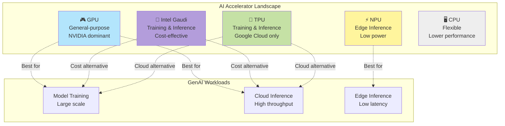
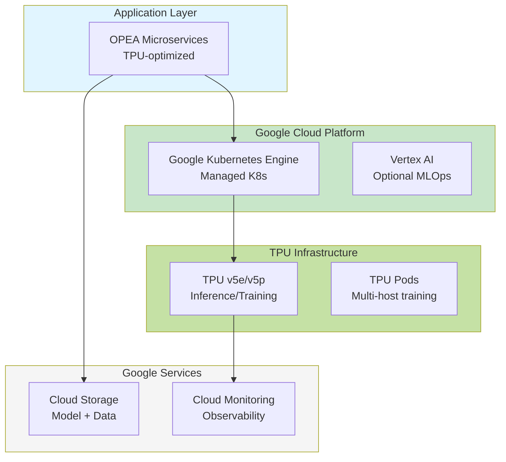
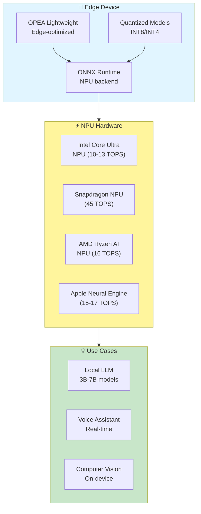
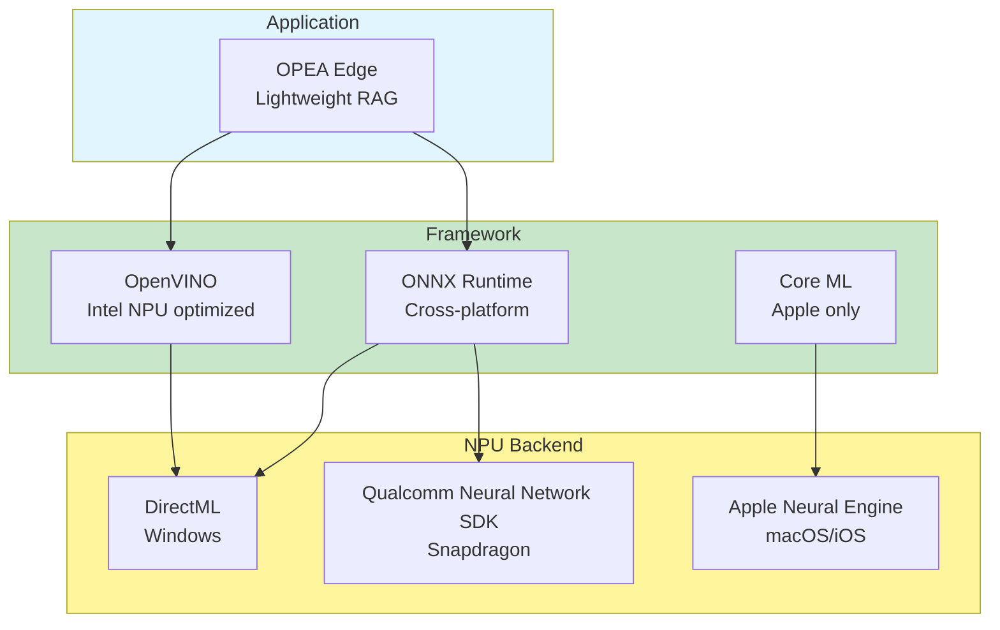
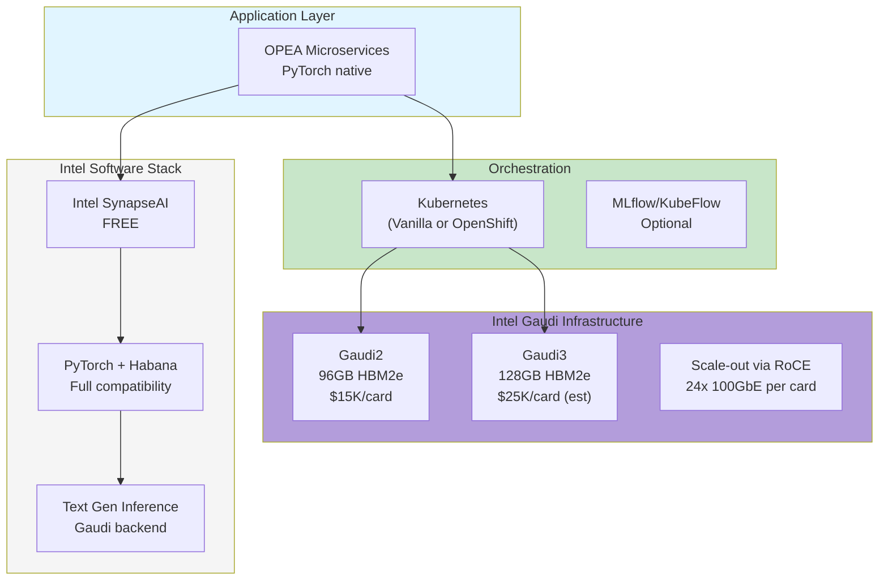
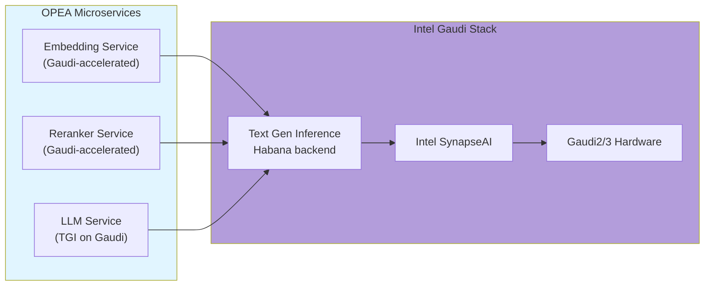
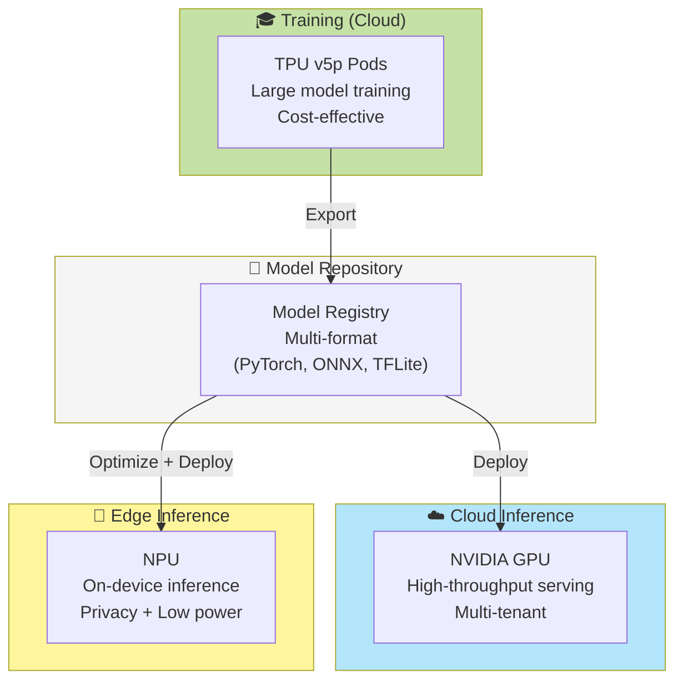

## Alternative Accelerators: TPU and NPU Strategies

### Why Consider TPU/NPU for GenAI?

While NVIDIA GPUs dominate the AI acceleration market, TPUs (Tensor Processing Units) and NPUs (Neural Processing Units) offer compelling alternatives for specific GenAI workloads:


```mermaid
flowchart TB
    subgraph Accelerators["AI Accelerator Landscape"]
        GPU["🎮 GPU<br/>General-purpose<br/>NVIDIA dominant"]
        Gaudi["🔷 Intel Gaudi<br/>Training & Inference<br/>Cost-effective"]
        TPU["🔷 TPU<br/>Training & Inference<br/>Google Cloud only"]
        NPU["⚡ NPU<br/>Edge Inference<br/>Low power"]
        CPU["🖥️ CPU<br/>Flexible<br/>Lower performance"]
    end
    
    subgraph Workloads["GenAI Workloads"]
        Training["Model Training<br/>Large scale"]
        Inference_Cloud["Cloud Inference<br/>High throughput"]
        Inference_Edge["Edge Inference<br/>Low latency"]
    end
    
    GPU -.Best for.-> Training
    GPU -.Best for.-> Inference_Cloud
    Gaudi -.Cost alternative.-> Training
    Gaudi -.Cost alternative.-> Inference_Cloud
    TPU -.Cloud alternative.-> Training
    TPU -.Cloud alternative.-> Inference_Cloud
    NPU -.Best for.-> Inference_Edge
    
    style GPU fill:#b3e5fc
    style Gaudi fill:#b39ddb
    style TPU fill:#c5e1a5
    style NPU fill:#fff59d
    style CPU fill:#eeeeee
```

**Key Differences**:

| Aspect | GPU | TPU | Gaudi | NPU |
|--------|-----|-----|-------|-----|
| **Primary Use** | Training + Inference | Training + Inference | Training + Inference | Inference only |
| **Location** | On-prem + Cloud | Google Cloud only | On-prem + Cloud | Edge devices |
| **Power** | 300-700W | 200-450W | 600W | 5-50W |
| **Precision** | FP32, FP16, INT8, INT4 | BF16, INT8 | BF16, FP8, INT8 | INT8, INT4, Binary |
| **Software Stack** | CUDA, ROCm | JAX, PyTorch/XLA | SynapseAI, PyTorch | Vendor-specific |
| **Cost Model** | Per GPU license | Per TPU-hour | Per card + support | Embedded in hardware |
| **Best For** | Flexibility | Google Cloud workloads | Cost-effective training | Battery-powered edge |

---

### Strategy 5: OPEA + TPU (Google Cloud)

**Cost Optimization**: Escape NVIDIA license costs with Google TPUs

**Architecture**:

```mermaid
flowchart TB
    subgraph App["Application Layer"]
        OPEA_TPU["OPEA Microservices<br/>TPU-optimized"]
    end
    
    subgraph Platform["Google Cloud Platform"]
        GKE["Google Kubernetes Engine<br/>Managed K8s"]
        Vertex["Vertex AI<br/>Optional MLOps"]
    end
    
    subgraph Accelerators["TPU Infrastructure"]
        TPU_v5["TPU v5e/v5p<br/>Inference/Training"]
        TPU_Pods["TPU Pods<br/>Multi-host training"]
    end
    
    subgraph Services["Google Services"]
        CloudStorage["Cloud Storage<br/>Model + Data"]
        Monitoring["Cloud Monitoring<br/>Observability"]
    end
    
    OPEA_TPU --> GKE
    GKE --> TPU_v5
    OPEA_TPU --> CloudStorage
    TPU_v5 --> Monitoring
    
    style App fill:#e1f5ff
    style Platform fill:#c8e6c9
    style Accelerators fill:#c5e1a5
    style Services fill:#f5f5f5
```

**Platform Compatibility**:

| Platform | TPU Support | Notes |
|----------|-------------|-------|
| **OPEA** | ✅ Compatible | Framework-agnostic, uses PyTorch/JAX |
| **OpenShift AI** | ❌ Not supported | GKE only, not on OpenShift |
| **NVIDIA AIE** | ❌ Not applicable | NVIDIA-only |

**Components**:

| Layer | Component | Cost |
|-------|-----------|------|
| **Application** | OPEA | FREE |
| **Orchestration** | GKE | $0.10/cluster/hour |
| **MLOps** | Vertex AI (optional) | Pay-per-use |
| **Acceleration** | TPU v5e | $1.10/TPU/hour (preemptible) |
| **Acceleration** | TPU v5p | $4.60/TPU/hour (on-demand) |
| **Storage** | Cloud Storage | $0.02/GB/month |
| **Monitoring** | Cloud Monitoring | $0.25/GB logs |

**3-Year TCO** (TPU v5e, 4 TPUs 24/7):
- TPU compute: $1.10 × 4 × 24 × 365 × 3 = $1.16M
- GKE: $10K
- Storage (50TB): $36K
- Networking: $100K
- Operations: $300K (simpler than on-prem)
- **Total**: ~$1.6M

**vs. NVIDIA GPU Stack**:
- 4x A100 on-prem: $300K hardware + $800K NVIDIA AIE = $1.1M + ops
- TPU cloud: $1.6M all-in (no hardware, no NVIDIA license)

**Performance Comparison**:

| Metric | NVIDIA A100 | TPU v5e | TPU v5p |
|--------|-------------|---------|----------|
| **LLM Inference (tok/s)** | 1,600 | 1,400 | 2,200 |
| **Training (TFLOPS)** | 312 (FP16) | 197 (BF16) | 459 (BF16) |
| **Memory Bandwidth** | 2TB/s (HBM2e) | 1.6TB/s | 4.8TB/s |
| **Cost/hour** | ~$3 (amortized) | $1.10 | $4.60 |
| **Power** | 400W | 200W | 450W |

**Advantages**:
- ✅ No NVIDIA license costs
- ✅ No hardware procurement
- ✅ Pay-per-use (scale to zero)
- ✅ Excellent for training (BF16 native)
- ✅ Lower power consumption
- ✅ Google-managed infrastructure

**Disadvantages**:
- ❌ Google Cloud lock-in (no on-prem)
- ❌ No OpenShift AI support
- ❌ Limited framework support (PyTorch/JAX, not TensorFlow optimized anymore)
- ❌ Learning curve (JAX preferred)
- ❌ Fewer third-party tools
- ❌ Cannot use with existing on-prem Kubernetes

**Best For**:
- Organizations already on Google Cloud
- Training-heavy workloads (TPU v5p excels)
- Want to avoid NVIDIA licensing
- Comfortable with cloud-only deployment
- Using JAX or PyTorch/XLA
- Batch inference workloads

**When to Choose TPU over GPU**:
1. **Training large models** (>10B parameters)
   - TPU Pods provide excellent multi-host scaling
   - BF16 native support reduces memory usage

2. **Google Cloud commitment**
   - Already using GCP services
   - Want unified billing

3. **Cost-sensitive inference**
   - Preemptible TPU v5e at $1.10/hour
   - Can handle interruptions

4. **Power/cooling constraints**
   - TPU uses ~50% less power than A100
   - Lower datacenter costs

**Migration Path**:
```
Phase 1: Prototype on GPUs
         ↓
Phase 2: Port to PyTorch/XLA or JAX
         ↓
Phase 3: Benchmark on TPU
         ↓
Phase 4: Production on TPU if cost-effective
```

**Framework Compatibility**:

| Framework | GPU | TPU | Notes |
|-----------|-----|-----|-------|
| **PyTorch** | ✅✅✅ | ✅✅ | Use PyTorch/XLA for TPU |
| **JAX** | ✅✅ | ✅✅✅ | Native TPU support |
| **TensorFlow** | ✅✅✅ | ✅ | Legacy, not recommended |
| **vLLM** | ✅✅✅ | ❌ | GPU-only |
| **Triton** | ✅✅✅ | ❌ | NVIDIA-only |

---

### Strategy 6: OPEA + NPU (Edge Deployment)

**Ultra-Low Power GenAI at the Edge**

**Architecture**:

```mermaid
flowchart TB
    subgraph EdgeDevice["🔌 Edge Device"]
        App["OPEA Lightweight<br/>Edge-optimized"]
        Runtime["ONNX Runtime<br/>NPU backend"]
        Models["Quantized Models<br/>INT8/INT4"]
    end
    
    subgraph NPU["⚡ NPU Hardware"]
        Intel_NPU["Intel Core Ultra<br/>NPU (10-13 TOPS)"]
        Qualcomm_NPU["Snapdragon NPU<br/>(45 TOPS)"]
        AMD_NPU["AMD Ryzen AI<br/>NPU (16 TOPS)"]
        Apple_ANE["Apple Neural Engine<br/>(15-17 TOPS)"]
    end
    
    subgraph UseCase["💡 Use Cases"]
        Local_LLM["Local LLM<br/>3B-7B models"]
        Voice["Voice Assistant<br/>Real-time"]
        Vision["Computer Vision<br/>On-device"]
    end
    
    App --> Runtime
    Runtime --> NPU
    Models --> Runtime
    NPU --> UseCase
    
    style EdgeDevice fill:#e1f5ff
    style NPU fill:#fff59d
    style UseCase fill:#c8e6c9
```

**NPU Landscape** (2025):

| Vendor | Product | TOPS | Power | Availability |
|--------|---------|------|-------|-------------|
| **Intel** | Core Ultra (Meteor Lake) | 10-13 | 5-15W | Available |
| **Intel** | Core Ultra (Lunar Lake) | 40-48 | 8-17W | Available |
| **AMD** | Ryzen AI 300 (Strix Point) | 50 | 15-54W | Available |
| **Qualcomm** | Snapdragon X Elite | 45 | 5-20W | Available |
| **Apple** | M4 Neural Engine | 38 | 10-20W | Available |
| **MediaTek** | Dimensity 9300 | 12 | 5-10W | Mobile only |

**Platform Compatibility**:

| Platform | NPU Support | Notes |
|----------|-------------|-------|
| **OPEA** | ✅ Possible | Via ONNX Runtime, OpenVINO |
| **OpenShift AI** | ⚠️ Limited | Experimental, not production |
| **NVIDIA AIE** | ❌ Not applicable | NVIDIA-only |

**Software Stack**:


```mermaid
flowchart TB
    subgraph App_Layer["Application"]
        OPEA_Edge["OPEA Edge<br/>Lightweight RAG"]
    end
    
    subgraph Framework["Framework"]
        ONNX["ONNX Runtime<br/>Cross-platform"]
        OpenVINO["OpenVINO<br/>Intel NPU optimized"]
        CoreML["Core ML<br/>Apple only"]
    end
    
    subgraph Backend["NPU Backend"]
        DirectML["DirectML<br/>Windows"]
        QNN["Qualcomm Neural Network SDK<br/>Snapdragon"]
        ANE["Apple Neural Engine<br/>macOS/iOS"]
    end
    
    OPEA_Edge --> ONNX
    OPEA_Edge --> OpenVINO
    ONNX --> DirectML
    ONNX --> QNN
    OpenVINO --> DirectML
    CoreML --> ANE
    
    style App_Layer fill:#e1f5ff
    style Framework fill:#c8e6c9
    style Backend fill:#fff59d
```

**Performance Characteristics**:

| Model Size | GPU (RTX 4090) | NPU (Intel Core Ultra) | Ratio |
|------------|----------------|------------------------|-------|
| **3B INT4** | 120 tok/s | 15 tok/s | 8x slower |
| **7B INT4** | 80 tok/s | 8 tok/s | 10x slower |
| **Power Draw** | 450W | 15W | 30x more efficient |
| **Cost** | $1,600 | $0 (built-in) | Included in laptop |

**Key Insight**: NPUs are 8-10x slower but 30x more power-efficient

**NPU Advantages**:
- ✅ Ultra-low power (5-20W vs 300-400W GPU)
- ✅ Always available (built into CPU)
- ✅ No additional hardware cost
- ✅ Silent operation (no fans)
- ✅ Battery-friendly for laptops
- ✅ Privacy (all on-device)

**NPU Disadvantages**:
- ❌ 8-10x slower than discrete GPU
- ❌ Limited to smaller models (<7B)
- ❌ INT8/INT4 quantization required
- ❌ Fragmented software ecosystem
- ❌ Vendor-specific optimizations needed
- ❌ Not suitable for training

**Best Use Cases for NPU**:

1. **Personal AI Assistants**
   - Background processing
   - Voice commands
   - Text completion
   - Battery-powered devices

2. **Edge RAG Systems**
   - Small knowledge bases (< 10K documents)
   - Latency acceptable (< 2s)
   - Privacy-critical data
   - Offline operation required

3. **Embedded AI**
   - IoT devices
   - Kiosks and terminals
   - Industrial equipment
   - Medical devices

4. **Mobile AI**
   - Smartphones and tablets
   - Always-on features
   - Wearables

**Cost Profile** (Edge NPU Deployment):
- Devices: $5K-$20K (NPU-capable laptops/workstations)
- OPEA: FREE
- ONNX Runtime/OpenVINO: FREE
- Models: FREE (open source, quantized)
- Operations: Minimal (self-contained)
- **Total**: $5K-$20K one-time

**vs. Edge GPU**:
- Edge GPU: $10K-$50K (workstations with RTX GPUs)
- Edge NPU: $5K-$20K (NPU built into CPU)
- Power savings: $500-$1K/year (if running 24/7)

**When to Choose NPU**:
1. Battery-powered devices (laptops, tablets)
2. Always-on inference (< 10 req/s)
3. Small models (< 7B parameters)
4. Privacy requirements (on-device only)
5. Silent operation needed
6. Power/cooling constraints

**When GPU is Better**:
1. Throughput > 50 req/s
2. Models > 10B parameters
3. Training or fine-tuning
4. Sub-100ms latency required
5. Desktop workstation (power not an issue)

---

### Strategy 7: OPEA + Intel Gaudi (On-Prem + Cloud)

**Cost Optimization**: NVIDIA-competitive performance without NVIDIA licensing

**What is Intel Gaudi?**

Intel Gaudi (formerly Habana Labs) is a purpose-built AI accelerator for deep learning training and inference:
- **Gaudi2**: Current generation (2022), optimized for LLM training
- **Gaudi3**: Next generation (2024), 2x performance of Gaudi2
- Designed from scratch for AI workloads (not repurposed GPU)
- Open software stack, no proprietary licensing

**Architecture**:

```mermaid
flowchart TB
    subgraph App["Application Layer"]
        OPEA_Gaudi["OPEA Microservices<br/>PyTorch native"]
    end
    
    subgraph Platform["Orchestration"]
        K8s["Kubernetes<br/>(Vanilla or OpenShift)"]
        MLOps["MLflow/KubeFlow<br/>Optional"]
    end
    
    subgraph Accelerators["Intel Gaudi Infrastructure"]
        Gaudi2["Gaudi2<br/>96GB HBM2e<br/>$15K/card"]
        Gaudi3["Gaudi3<br/>128GB HBM2e<br/>$25K/card (est)"]
        Scale["Scale-out via RoCE<br/>24x 100GbE per card"]
    end
    
    subgraph Software["Intel Software Stack"]
        SynapseAI["Intel SynapseAI<br/>FREE"]
        PyTorch["PyTorch + Habana<br/>Full compatibility"]
        TGI["Text Gen Inference<br/>Gaudi backend"]
    end
    
    OPEA_Gaudi --> K8s
    K8s --> Gaudi2
    K8s --> Gaudi3
    OPEA_Gaudi --> SynapseAI
    SynapseAI --> PyTorch
    PyTorch --> TGI
    
    style App fill:#e1f5ff
    style Platform fill:#c8e6c9
    style Accelerators fill:#b39ddb
    style Software fill:#f5f5f5
```

**Platform Compatibility**:

| Platform | Gaudi Support | Notes |
|----------|---------------|-------|
| **OPEA** | ✅✅ Excellent | Intel-backed, first-class support |
| **OpenShift AI** | ✅ Supported | Via Intel operators |
| **NVIDIA AIE** | ❌ Not applicable | NVIDIA-only |

**Key Specifications** (Gaudi2 vs Gaudi3):

| Spec | Gaudi2 | Gaudi3 | NVIDIA H100 | NVIDIA A100 |
|------|--------|--------|-------------|-------------|
| **Memory** | 96GB HBM2e | 128GB HBM2e | 80GB HBM3 | 80GB HBM2e |
| **Memory BW** | 2.45TB/s | 3.7TB/s | 3.35TB/s | 2TB/s |
| **Compute (BF16)** | 432 TFLOPS | 1,835 TFLOPS | 989 TFLOPS | 312 TFLOPS |
| **Compute (FP8)** | N/A | 3,670 TFLOPS | 1,979 TFLOPS | N/A |
| **TDP** | 600W | 600W | 700W | 400W |
| **Network** | 24x 100GbE RoCE | 24x 200GbE RoCE | 8x 200Gb NVLink | 12x 200Gb NVLink |
| **Price** | ~$15K | ~$25K (est) | ~$30K | ~$15K |

**Performance vs NVIDIA** (LLM Training):

| Model | Gaudi2 | H100 | Ratio |
|-------|--------|------|-------|
| **Llama2-7B** | 3,070 samples/s | 3,400 samples/s | 0.90x |
| **Llama2-13B** | 1,550 samples/s | 1,900 samples/s | 0.82x |
| **Llama2-70B** | 330 samples/s | 410 samples/s | 0.80x |
| **GPT-3 175B** | 140 samples/s | 180 samples/s | 0.78x |

**Performance vs NVIDIA** (LLM Inference):

| Model | Gaudi2 | A100 | Ratio |
|-------|--------|------|-------|
| **Llama2-7B (BF16)** | 1,200 tok/s | 1,600 tok/s | 0.75x |
| **Llama2-13B (BF16)** | 800 tok/s | 1,100 tok/s | 0.73x |
| **Mistral-7B (BF16)** | 1,400 tok/s | 1,800 tok/s | 0.78x |

**Key Insight**: Gaudi2 delivers 75-90% of NVIDIA performance at ~50% of the cost

**Cost Profile** (8-card cluster, 3 years):

| Component | Gaudi2 Cost | H100 Cost | Savings |
|-----------|-------------|-----------|----------|
| **Hardware** | $120K (8×$15K) | $240K (8×$30K) | -50% |
| **Software License** | FREE | $800K (NVAIE) | -100% |
| **Support (Intel)** | $50K/year × 3 = $150K | Included in NVAIE | +$150K |
| **Networking** | $50K (RoCE switches) | $100K (InfiniBand) | -50% |
| **Infrastructure** | $100K | $100K | Same |
| **Operations** | $300K | $300K | Same |
| **Total** | **$720K** | **$1.54M** | **-53%** |

**3-Year TCO Comparison**:

```mermaid
gantt
    title 3-Year Cost: Gaudi2 vs H100
    dateFormat X
    axisFormat %s

    section Gaudi2
    Hardware (120K)           :0, 120
    Software (FREE)           :120, 120
    Support (150K)            :120, 270
    Networking (50K)          :270, 320
    Infra+Ops (400K)          :320, 720
    
    section H100
    Hardware (240K)           :0, 240
    NVIDIA AIE (800K)         :240, 1040
    Networking (100K)         :1040, 1140
    Infra+Ops (400K)          :1140, 1540
```

**Gaudi Advantages**:
- ✅ **50-60% lower TCO** vs NVIDIA with similar performance
- ✅ **No proprietary licensing** (SynapseAI is free)
- ✅ **Standard Ethernet** (RoCE) vs expensive InfiniBand
- ✅ **Higher memory capacity** (96GB vs 80GB on A100)
- ✅ **Excellent scale-out** (24x 100GbE per card for distributed training)
- ✅ **PyTorch native support** (minimal code changes)
- ✅ **Works with OPEA and OpenShift AI**
- ✅ **Available on AWS, Azure, on-prem**

**Gaudi Disadvantages**:
- ❌ **10-25% slower** than equivalent NVIDIA cards
- ❌ **Smaller ecosystem** (fewer third-party tools)
- ❌ **No CUDA support** (SynapseAI only)
- ❌ **Limited inference optimization** (vLLM, TensorRT alternatives immature)
- ❌ **Fewer pretrained models** (most optimized for NVIDIA)
- ❌ **Less mature tooling** (profiling, debugging)
- ❌ **Intel support required** (not as broad as NVIDIA ecosystem)

**Best For**:
- Organizations prioritizing **cost over ecosystem**
- **Large-scale LLM training** (70B+ models)
- **Memory-constrained workloads** (96GB/128GB HBM)
- Teams comfortable with **PyTorch** (primary framework)
- Deployments where **standard Ethernet is sufficient**
- Organizations already using **Intel technologies**
- **OPEA-first architectures** (Intel backing)

**When to Choose Gaudi over NVIDIA**:

1. **Budget-constrained training**
   - Need to train large models but have limited budget
   - 50% hardware savings + no NVIDIA license
   - Can tolerate 10-20% slower training

2. **Large memory requirements**
   - Models that need >80GB per accelerator
   - Gaudi2: 96GB, Gaudi3: 128GB
   - Avoid multi-GPU memory splitting

3. **Standard networking infrastructure**
   - Don't want to invest in InfiniBand
   - RoCE over existing Ethernet
   - Lower networking costs

4. **Intel ecosystem alignment**
   - Already using Intel CPUs, OneAPI
   - OpenVINO for inference
   - Intel support contracts

5. **Cloud flexibility**
   - Available on AWS (DL1 instances) and Azure
   - Pay-per-use without NVIDIA lock-in

**When NVIDIA is Better**:

1. **Inference-heavy workloads**
   - vLLM, TensorRT, Triton are NVIDIA-optimized
   - Gaudi inference tooling less mature

2. **Require specific NVIDIA features**
   - Multi-Instance GPU (MIG)
   - NVLink for tight coupling
   - CUDA ecosystem tools

3. **Ecosystem dependencies**
   - Using tools that require CUDA
   - Pretrained models with NVIDIA optimizations

4. **Maximum performance needed**
   - Cannot tolerate 10-20% performance gap
   - Latency-critical applications

**Migration Path** (NVIDIA → Gaudi):

```
Phase 1: Assessment (2 weeks)
         ↓
         • Audit PyTorch code for CUDA dependencies
         • Identify models and frameworks used
         • Benchmark critical workloads
         ↓
Phase 2: Proof of Concept (4 weeks)
         ↓
         • Port training code to SynapseAI
         • Run benchmarks on Gaudi2/3
         • Validate accuracy and performance
         ↓
Phase 3: Pilot Deployment (8 weeks)
         ↓
         • Deploy 1-2 workloads on Gaudi
         • Train team on SynapseAI tools
         • Establish monitoring and ops
         ↓
Phase 4: Production Rollout (12 weeks)
         ↓
         • Migrate training pipelines
         • Scale cluster as needed
         • Optimize for Gaudi architecture
```

**Framework Compatibility**:

| Framework | Gaudi2 | Gaudi3 | Notes |
|-----------|--------|--------|-------|
| **PyTorch** | ✅✅✅ | ✅✅✅ | Native support, best compatibility |
| **PyTorch Lightning** | ✅✅ | ✅✅ | Full support |
| **Hugging Face** | ✅✅✅ | ✅✅✅ | Transformers, TGI, Optimum-Habana |
| **DeepSpeed** | ✅✅ | ✅✅ | Distributed training support |
| **TensorFlow** | ✅ | ✅ | Limited, not recommended |
| **JAX** | ❌ | ❌ | Not supported |
| **vLLM** | ⚠️ | ⚠️ | Experimental, use TGI instead |
| **TensorRT** | ❌ | ❌ | NVIDIA-only |

**Cloud Availability**:

| Cloud Provider | Instance Type | Gaudi Type | Cost/hour |
|----------------|---------------|------------|----------|
| **AWS** | DL1.24xlarge | 8x Gaudi2 | $13.11 |
| **Azure** | Not yet | (planned) | TBD |
| **GCP** | Not available | N/A | N/A |
| **Intel Tiber Cloud** | Various | Gaudi2/3 | Contact Intel |

**Real-World Adoption**:

- **Stability AI**: Using Gaudi2 for Stable Diffusion training
- **Hugging Face**: Official Optimum-Habana support
- **IBM watsonx**: Gaudi2 option for training
- **Intel Tiber AI Cloud**: Gaudi-powered AI platform

**OPEA Integration**:


```mermaid
flowchart LR
    subgraph OPEA_Services["OPEA Microservices"]
        Embedding["Embedding Service<br/>(Gaudi-accelerated)"]
        Reranker["Reranker Service<br/>(Gaudi-accelerated)"]
        LLM["LLM Service<br/>(TGI on Gaudi)"]
    end
    
    subgraph Gaudi_Stack["Intel Gaudi Stack"]
        TGI_Gaudi["Text Gen Inference<br/>Habana backend"]
        SynapseAI["Intel SynapseAI"]
        Gaudi_HW["Gaudi2/3 Hardware"]
    end
    
    Embedding --> TGI_Gaudi
    Reranker --> TGI_Gaudi
    LLM --> TGI_Gaudi
    TGI_Gaudi --> SynapseAI
    SynapseAI --> Gaudi_HW
    
    style OPEA_Services fill:#e1f5ff
    style Gaudi_Stack fill:#b39ddb
```

**Performance Optimization Tips**:

1. **Use BF16 training** (native Gaudi support)
2. **Leverage 96GB memory** for larger batch sizes
3. **Use Habana DeepSpeed** for distributed training
4. **Optimize with Habana Model References** (pre-tuned configs)
5. **Use RoCE for scale-out** (24x 100GbE per card)
6. **Enable gradient checkpointing** for memory efficiency

**Total Cost Scenarios**:

**Scenario 1: Small Training Cluster (4 cards)**
- Gaudi2: $60K hardware + FREE software = **$60K**
- H100: $120K hardware + $400K NVAIE = **$520K**
- **Savings: -88%** 🎉

**Scenario 2: Medium Cluster (32 cards)**
- Gaudi2: $480K hardware + FREE software = **$480K**
- H100: $960K hardware + $800K NVAIE = **$1.76M**
- **Savings: -73%** 🎉

**Scenario 3: Large Cluster (256 cards)**
- Gaudi2: $3.84M hardware + FREE software = **$3.84M**
- H100: $7.68M hardware + $800K NVAIE = **$8.48M**
- **Savings: -55%** 🎉

**Key Insight**: Gaudi savings increase with smaller deployments (less NVIDIA license amortization)

---

### Accelerator Decision Matrix

```mermaid
flowchart TD
    Start["Select AI Accelerator"]
    
    Q1{"Workload Type?"}
    Q2{"Deployment?"}
    Q3{"Power Budget?"}
    Q4{"Cloud Provider?"}
    Q5{"Model Size?"}
    Q6{"Budget Priority?"}
    
    GPU["✅ NVIDIA GPU<br/>Flexible, high-performance<br/>CUDA ecosystem"]
    Gaudi["✅ Intel Gaudi<br/>Cost-effective training<br/>50-60% cheaper"]
    TPU["✅ Google TPU<br/>Training-optimized<br/>GCP only"]
    NPU["✅ NPU (Edge)<br/>Ultra-low power<br/>< 7B models"]
    CPU["✅ CPU<br/>Development/testing<br/>Very slow"]
    
    Start --> Q1
    Q1 -->|Training + Inference| Q2
    Q1 -->|Inference Only| Q3
    
    Q2 -->|On-prem| Q6
    Q2 -->|Cloud| Q4
    
    Q6 -->|Cost priority| Gaudi
    Q6 -->|Performance/ecosystem| GPU
    
    Q4 -->|Google Cloud| TPU
    Q4 -->|AWS (DL1)| Gaudi
    Q4 -->|AWS/Azure/Other| GPU
    
    Q3 -->|< 50W| Q5
    Q3 -->|> 50W| GPU
    
    Q5 -->|< 7B| NPU
    Q5 -->|> 7B| GPU
    
    style GPU fill:#b3e5fc
    style Gaudi fill:#b39ddb
    style TPU fill:#c5e1a5
    style NPU fill:#fff59d
    style CPU fill:#eeeeee
```

**Comprehensive Comparison**:

| Criteria | NVIDIA GPU | Intel Gaudi | Google TPU | Intel/AMD NPU | Apple Silicon |
|----------|------------|-------------|------------|---------------|---------------|
| **Training** | ✅✅✅ | ✅✅✅ | ✅✅✅ | ❌ | ✅ |
| **Inference** | ✅✅✅ | ✅✅ | ✅✅ | ✅ | ✅✅ |
| **On-premises** | ✅✅✅ | ✅✅✅ | ❌ | ✅✅✅ | ✅✅ |
| **Cloud** | ✅✅✅ | ✅✅ (AWS) | ✅✅✅ (GCP) | ⚠️ | ❌ |
| **Edge** | ✅ (power hungry) | ❌ | ❌ | ✅✅✅ | ✅✅✅ |
| **Power Efficiency** | 🟡 (300-700W) | 🟡 (600W) | 🟢 (200-450W) | 🟢🟢 (5-50W) | 🟢🟢 (10-30W) |
| **Cost** | 🔴 (hardware + license) | 🟢 (hardware only) | 🟡 (pay-per-use) | 🟢 (included) | 🟡 (hardware) |
| **Software Ecosystem** | ✅✅✅ (CUDA) | 🟡 (SynapseAI) | 🟡 (JAX/PyTorch) | ⚠️ (fragmented) | 🟡 (Core ML) |
| **OPEA Support** | ✅✅✅ | ✅✅✅ | ✅✅ | ✅ | ✅✅ |
| **OpenShift AI Support** | ✅✅✅ | ✅ | ❌ | ⚠️ | ❌ |
| **NVIDIA AIE Support** | ✅✅✅ | ❌ | ❌ | ❌ | ❌ |

---

### Multi-Accelerator Strategy

**Hybrid Approach**: Use different accelerators for different workloads


```mermaid
flowchart TB
    subgraph Training["🎓 Training (Cloud)"]
        TPU_Train["TPU v5p Pods<br/>Large model training<br/>Cost-effective"]
    end
    
    subgraph Cloud_Inference["☁️ Cloud Inference"]
        GPU_Cloud["NVIDIA GPU<br/>High-throughput serving<br/>Multi-tenant"]
    end
    
    subgraph Edge_Inference["📱 Edge Inference"]
        NPU_Edge["NPU<br/>On-device inference<br/>Privacy + Low power"]
    end
    
    subgraph Storage["💾 Model Repository"]
        Registry["Model Registry<br/>Multi-format<br/>(PyTorch, ONNX, TFLite)"]
    end
    
    TPU_Train -->|Export| Registry
    Registry -->|Deploy| GPU_Cloud
    Registry -->|Optimize + Deploy| NPU_Edge
    
    style Training fill:#c5e1a5
    style Cloud_Inference fill:#b3e5fc
    style Edge_Inference fill:#fff59d
    style Storage fill:#f5f5f5
```

**Example Architecture**:

**Option A: Training on Intel Gaudi (Cost-Optimized)**

**Training Pipeline** (Gaudi2 on-prem):
- Train LLM on 32x Gaudi2 cluster
- Cost: $480K hardware + $150K support (3-year) = $630K
- Export to PyTorch/ONNX format

**Cloud Deployment** (GPU):
- Serve via NVIDIA GPU with vLLM or Triton
- Cost: $800K NVIDIA AIE + $300K hardware (3-year) = $1.1M
- Throughput: 10K requests/hour per GPU

**Edge Deployment** (NPU):
- Quantize to INT4 for NPU
- Deploy to user devices (laptops, phones)
- Cost: $0 incremental (NPU built-in)
- Throughput: 100 requests/hour per device

**Total Cost** (3-year):
- Training: $630K (Gaudi2)
- Cloud inference: $1.1M (NVIDIA GPU)
- Edge deployment: $50K (distribution)
- **Total**: $1.78M

---

**Option B: Training on TPU (Cloud-Only)**

**Training Pipeline** (TPU v5p):
- Train LLM on TPU v5p Pods (Google Cloud)
- Cost: $4.60/TPU/hour × 256 TPUs × 100 hours = $117K per training run
- Cost (10 runs): $1.17M
- Export to PyTorch/ONNX format

**Cloud Deployment** (GPU):
- Serve via NVIDIA GPU with vLLM or Triton
- Cost: $800K NVIDIA AIE + $300K hardware (3-year) = $1.1M
- Throughput: 10K requests/hour per GPU

**Edge Deployment** (NPU):
- Quantize to INT4 for NPU
- Deploy to user devices (laptops, phones)
- Cost: $0 incremental (NPU built-in)
- Throughput: 100 requests/hour per device

**Total Cost** (3-year):
- Training: $1.17M (TPU cloud)
- Cloud inference: $1.1M (NVIDIA GPU)
- Edge deployment: $50K (distribution)
- **Total**: $2.32M

---

**Option C: All-Gaudi (Maximum Cost Savings)**

**Training Pipeline** (Gaudi2):
- Train LLM on 32x Gaudi2 cluster
- Cost: $630K (hardware + support, 3-year)

**Cloud Deployment** (Gaudi2 inference):
- Serve via Gaudi2 with Text Generation Inference
- Cost: $480K hardware + $150K support = $630K
- Throughput: 7K requests/hour per Gaudi2 (70% of GPU)

**Edge Deployment** (NPU):
- Quantize to INT4 for NPU
- Deploy to user devices
- Cost: $50K (distribution)

**Total Cost** (3-year):
- Training: $630K (Gaudi2)
- Cloud inference: $630K (Gaudi2)
- Edge deployment: $50K (NPU)
- **Total**: $1.31M 🎉

---

**vs. GPU-Only**:
- Training on H100: $960K hardware + $800K NVAIE = $1.76M
- Cloud inference: $1.1M
- Edge with discrete GPUs: $500K (power/cost prohibitive)
- **Total**: $3.36M (but no edge deployment)

**Cost Comparison**:
- **Option C (All-Gaudi + NPU)**: $1.31M ✅ **-61% savings**
- **Option A (Gaudi training + GPU inference + NPU)**: $1.78M ✅ **-47% savings**
- **Option B (TPU training + GPU inference + NPU)**: $2.32M ✅ **-31% savings**
- **GPU-Only (no edge)**: $3.36M ❌ Baseline

**Key Insight**: Intel Gaudi provides the best hybrid strategy for cost-sensitive deployments

---

### Platform Support Summary

| Accelerator | OPEA | OpenShift AI | NVIDIA AIE | Best Use Case |
|-------------|------|--------------|------------|---------------|
| **NVIDIA GPU** | ✅✅✅ | ✅✅✅ | ✅✅✅ | All workloads, most flexible |
| **Intel Gaudi** | ✅✅✅ | ✅ | ❌ | Cost-effective LLM training |
| **AMD GPU** | ✅✅ | ✅ | ❌ | Cost alternative to NVIDIA |
| **Intel GPU** | ✅✅ | ✅ | ❌ | Intel-backed workloads |
| **Google TPU** | ✅✅ | ❌ | ❌ | GCP training/inference |
| **Intel/AMD NPU** | ✅ | ⚠️ | ❌ | Edge inference, low power |
| **Apple ANE** | ✅ | ❌ | ❌ | macOS/iOS edge inference |
| **CPU** | ✅✅✅ | ✅✅✅ | ✅ | Development, small models |

**Platform Recommendations**:

1. **OPEA Only**
   - Works with ALL accelerators (NVIDIA, Gaudi, TPU, NPU)
   - Maximum flexibility
   - No vendor lock-in
   - Best for experimentation

2. **OPEA + Intel Gaudi**
   - 50-60% cost savings vs NVIDIA
   - First-class OPEA support (Intel-backed)
   - PyTorch native
   - Best for cost-sensitive training

3. **OPEA + OpenShift AI**
   - NVIDIA GPU support (best)
   - Intel Gaudi support (experimental)
   - AMD/Intel GPU support (limited)
   - No TPU/NPU production support

4. **OPEA + NVIDIA AIE**
   - NVIDIA GPU only
   - Maximum GPU performance
   - Highest cost
   - No Gaudi/TPU/NPU support

5. **Full Stack (OPEA + OpenShift + NVIDIA)**
   - NVIDIA GPU only
   - Most expensive ($1.5M+ for 8 cards)
   - Best enterprise support
   - No accelerator flexibility

**Recommendation**: 
- For **training-heavy workloads**: OPEA + Intel Gaudi (-50% cost)
- For **GCP deployments**: OPEA + TPU
- For **edge inference**: OPEA + NPU
- For **maximum ecosystem**: OPEA + NVIDIA GPU
- **Avoid**: Dual licensing (OpenShift AI + NVIDIA AIE) unless justified

---

