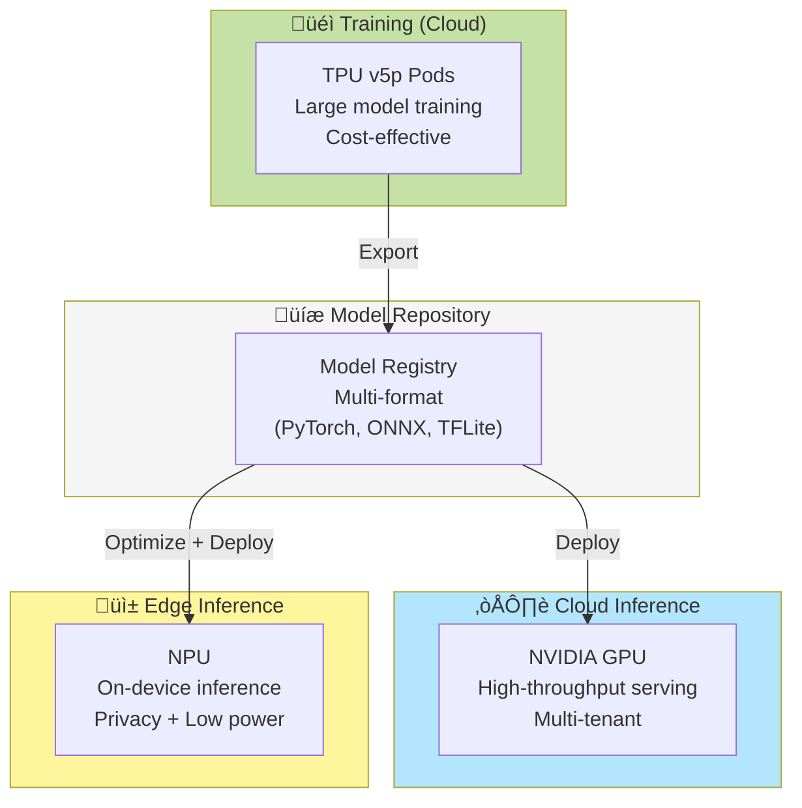

## Alternative Accelerators: TPU and NPU Strategies

### Why Consider TPU/NPU for GenAI?

While NVIDIA GPUs dominate the AI acceleration market, TPUs (Tensor Processing Units) and NPUs (Neural Processing Units) offer compelling alternatives for specific GenAI workloads:


**Key Differences**:

| Aspect | GPU | TPU | Gaudi | NPU |
|--------|-----|-----|-------|-----|
| **Primary Use** | Training + Inference | Training + Inference | Training + Inference | Inference only |
| **Location** | On-prem + Cloud | Google Cloud only | On-prem + Cloud | Edge devices |
| **Power** | 300-700W | 200-450W | 600W | 5-50W |
| **Precision** | FP32, FP16, INT8, INT4 | BF16, INT8 | BF16, FP8, INT8 | INT8, INT4, Binary |
| **Software Stack** | CUDA, ROCm | JAX, PyTorch/XLA | SynapseAI, PyTorch | Vendor-specific |
| **Cost Model** | Per GPU license | Per TPU-hour | Per card + support | Embedded in hardware |
| **Best For** | Flexibility | Google Cloud workloads | Cost-effective training | Battery-powered edge |

---

### Strategy 5: OPEA + TPU (Google Cloud)

**Cost Optimization**: Escape NVIDIA license costs with Google TPUs

**Architecture**:


**Platform Compatibility**:

| Platform | TPU Support | Notes |
|----------|-------------|-------|
| **OPEA** | ✅ Compatible | Framework-agnostic, uses PyTorch/JAX |
| **OpenShift AI** | ❌ Not supported | GKE only, not on OpenShift |
| **NVIDIA AIE** | ❌ Not applicable | NVIDIA-only |

**Components**:

| Layer | Component | Cost |
|-------|-----------|------|
| **Application** | OPEA | FREE |
| **Orchestration** | GKE | $0.10/cluster/hour |
| **MLOps** | Vertex AI (optional) | Pay-per-use |
| **Acceleration** | TPU v5e | $1.10/TPU/hour (preemptible) |
| **Acceleration** | TPU v5p | $4.60/TPU/hour (on-demand) |
| **Storage** | Cloud Storage | $0.02/GB/month |
| **Monitoring** | Cloud Monitoring | $0.25/GB logs |

**3-Year TCO** (TPU v5e, 4 TPUs 24/7):
- TPU compute: $1.10 × 4 × 24 × 365 × 3 = $1.16M
- GKE: $10K
- Storage (50TB): $36K
- Networking: $100K
- Operations: $300K (simpler than on-prem)
- **Total**: ~$1.6M

**vs. NVIDIA GPU Stack**:
- 4x A100 on-prem: $300K hardware + $800K NVIDIA AIE = $1.1M + ops
- TPU cloud: $1.6M all-in (no hardware, no NVIDIA license)

**Performance Comparison**:

| Metric | NVIDIA A100 | TPU v5e | TPU v5p |
|--------|-------------|---------|----------|
| **LLM Inference (tok/s)** | 1,600 | 1,400 | 2,200 |
| **Training (TFLOPS)** | 312 (FP16) | 197 (BF16) | 459 (BF16) |
| **Memory Bandwidth** | 2TB/s (HBM2e) | 1.6TB/s | 4.8TB/s |
| **Cost/hour** | ~$3 (amortized) | $1.10 | $4.60 |
| **Power** | 400W | 200W | 450W |

**Advantages**:
- ✅ No NVIDIA license costs
- ✅ No hardware procurement
- ✅ Pay-per-use (scale to zero)
- ✅ Excellent for training (BF16 native)
- ✅ Lower power consumption
- ✅ Google-managed infrastructure

**Disadvantages**:
- ❌ Google Cloud lock-in (no on-prem)
- ❌ No OpenShift AI support
- ❌ Limited framework support (PyTorch/JAX, not TensorFlow optimized anymore)
- ❌ Learning curve (JAX preferred)
- ❌ Fewer third-party tools
- ❌ Cannot use with existing on-prem Kubernetes

**Best For**:
- Organizations already on Google Cloud
- Training-heavy workloads (TPU v5p excels)
- Want to avoid NVIDIA licensing
- Comfortable with cloud-only deployment
- Using JAX or PyTorch/XLA
- Batch inference workloads

**When to Choose TPU over GPU**:
1. **Training large models** (>10B parameters)
   - TPU Pods provide excellent multi-host scaling
   - BF16 native support reduces memory usage

2. **Google Cloud commitment**
   - Already using GCP services
   - Want unified billing

3. **Cost-sensitive inference**
   - Preemptible TPU v5e at $1.10/hour
   - Can handle interruptions

4. **Power/cooling constraints**
   - TPU uses ~50% less power than A100
   - Lower datacenter costs

**Migration Path**:
```
Phase 1: Prototype on GPUs
         ↓
Phase 2: Port to PyTorch/XLA or JAX
         ↓
Phase 3: Benchmark on TPU
         ↓
Phase 4: Production on TPU if cost-effective
```

**Framework Compatibility**:

| Framework | GPU | TPU | Notes |
|-----------|-----|-----|-------|
| **PyTorch** | ✅✅✅ | ✅✅ | Use PyTorch/XLA for TPU |
| **JAX** | ✅✅ | ✅✅✅ | Native TPU support |
| **TensorFlow** | ✅✅✅ | ✅ | Legacy, not recommended |
| **vLLM** | ✅✅✅ | ❌ | GPU-only |
| **Triton** | ✅✅✅ | ❌ | NVIDIA-only |

---

### Strategy 6: OPEA + NPU (Edge Deployment)

**Ultra-Low Power GenAI at the Edge**

**Architecture**:


**NPU Landscape** (2025):

| Vendor | Product | TOPS | Power | Availability |
|--------|---------|------|-------|-------------|
| **Intel** | Core Ultra (Meteor Lake) | 10-13 | 5-15W | Available |
| **Intel** | Core Ultra (Lunar Lake) | 40-48 | 8-17W | Available |
| **AMD** | Ryzen AI 300 (Strix Point) | 50 | 15-54W | Available |
| **Qualcomm** | Snapdragon X Elite | 45 | 5-20W | Available |
| **Apple** | M4 Neural Engine | 38 | 10-20W | Available |
| **MediaTek** | Dimensity 9300 | 12 | 5-10W | Mobile only |

**Platform Compatibility**:

| Platform | NPU Support | Notes |
|----------|-------------|-------|
| **OPEA** | ✅ Possible | Via ONNX Runtime, OpenVINO |
| **OpenShift AI** | ⚠️ Limited | Experimental, not production |
| **NVIDIA AIE** | ❌ Not applicable | NVIDIA-only |

**Software Stack**:


**Performance Characteristics**:

| Model Size | GPU (RTX 4090) | NPU (Intel Core Ultra) | Ratio |
|------------|----------------|------------------------|-------|
| **3B INT4** | 120 tok/s | 15 tok/s | 8x slower |
| **7B INT4** | 80 tok/s | 8 tok/s | 10x slower |
| **Power Draw** | 450W | 15W | 30x more efficient |
| **Cost** | $1,600 | $0 (built-in) | Included in laptop |

**Key Insight**: NPUs are 8-10x slower but 30x more power-efficient

**NPU Advantages**:
- ✅ Ultra-low power (5-20W vs 300-400W GPU)
- ✅ Always available (built into CPU)
- ✅ No additional hardware cost
- ✅ Silent operation (no fans)
- ✅ Battery-friendly for laptops
- ✅ Privacy (all on-device)

**NPU Disadvantages**:
- ❌ 8-10x slower than discrete GPU
- ❌ Limited to smaller models (<7B)
- ❌ INT8/INT4 quantization required
- ❌ Fragmented software ecosystem
- ❌ Vendor-specific optimizations needed
- ❌ Not suitable for training

**Best Use Cases for NPU**:

1. **Personal AI Assistants**
   - Background processing
   - Voice commands
   - Text completion
   - Battery-powered devices

2. **Edge RAG Systems**
   - Small knowledge bases (< 10K documents)
   - Latency acceptable (< 2s)
   - Privacy-critical data
   - Offline operation required

3. **Embedded AI**
   - IoT devices
   - Kiosks and terminals
   - Industrial equipment
   - Medical devices

4. **Mobile AI**
   - Smartphones and tablets
   - Always-on features
   - Wearables

**Cost Profile** (Edge NPU Deployment):
- Devices: $5K-$20K (NPU-capable laptops/workstations)
- OPEA: FREE
- ONNX Runtime/OpenVINO: FREE
- Models: FREE (open source, quantized)
- Operations: Minimal (self-contained)
- **Total**: $5K-$20K one-time

**vs. Edge GPU**:
- Edge GPU: $10K-$50K (workstations with RTX GPUs)
- Edge NPU: $5K-$20K (NPU built into CPU)
- Power savings: $500-$1K/year (if running 24/7)

**When to Choose NPU**:
1. Battery-powered devices (laptops, tablets)
2. Always-on inference (< 10 req/s)
3. Small models (< 7B parameters)
4. Privacy requirements (on-device only)
5. Silent operation needed
6. Power/cooling constraints

**When GPU is Better**:
1. Throughput > 50 req/s
2. Models > 10B parameters
3. Training or fine-tuning
4. Sub-100ms latency required
5. Desktop workstation (power not an issue)

---

### Strategy 7: NVIDIA L40/L40S (Inference-Optimized GPU)

**Cost-Effective Inference Alternative to H100/A100**

**What is NVIDIA L40/L40S?**

The L40/L40S is NVIDIA's Ada Lovelace-based datacenter GPU optimized for AI inference and visual computing:
- **L40**: 48GB GDDR6, 362 TFLOPS (FP8), $7K-$8K/card
- **L40S**: 48GB GDDR6, 733 TFLOPS (FP8), $10K-$12K/card
- Based on consumer-grade Ada architecture (RTX 4090 lineage)
- **No NVLink** (PCIe only)
- Passive cooling design (requires airflow)
- Lower power (300W L40, 350W L40S) vs H100/A100

**Architecture**:


**Platform Compatibility**:

| Platform | L40/L40S Support | Notes |
|----------|------------------|-------|
| **OPEA** | ✅✅✅ Excellent | Full CUDA support |
| **OpenShift AI** | ✅✅✅ Supported | Standard GPU operator |
| **NVIDIA AIE** | ✅✅✅ Supported | L40S officially validated |

**Key Specifications**:

| Spec | L40 | L40S | H100 | A100 |
|------|-----|------|------|------|
| **Memory** | 48GB GDDR6 | 48GB GDDR6 | 80GB HBM3 | 80GB HBM2e |
| **Memory BW** | 864 GB/s | 864 GB/s | 3.35TB/s | 2TB/s |
| **Compute (FP8)** | 362 TFLOPS | 733 TFLOPS | 1,979 TFLOPS | N/A |
| **Compute (FP16)** | 181 TFLOPS | 366 TFLOPS | 989 TFLOPS | 312 TFLOPS |
| **TDP** | 300W | 350W | 700W | 400W |
| **Interconnect** | PCIe Gen4 x16 | PCIe Gen4 x16 | NVLink 900GB/s | NVLink 600GB/s |
| **Price** | ~$7K | ~$10K | ~$30K | ~$15K |
| **Form Factor** | Dual-slot passive | Dual-slot passive | Liquid/4-slot | 4-slot |

**Performance Comparison** (LLM Inference):

| Model | L40 | L40S | A100 | H100 | L40S vs A100 |
|-------|-----|------|------|------|---------------|
| **Llama2-7B (FP16)** | 800 tok/s | 1,100 tok/s | 1,600 tok/s | 2,000 tok/s | 0.69x |
| **Llama2-13B (FP16)** | 500 tok/s | 700 tok/s | 1,100 tok/s | 1,400 tok/s | 0.64x |
| **Llama2-70B (FP8)** | 120 tok/s | 180 tok/s | 250 tok/s | 350 tok/s | 0.72x |
| **Mistral-7B (FP16)** | 900 tok/s | 1,300 tok/s | 1,800 tok/s | 2,200 tok/s | 0.72x |

**Key Insight**: L40S delivers 65-75% of A100 inference performance at 67% of the cost

**Training Performance** (L40S vs A100):

| Model | L40S | A100 | Ratio | Notes |
|-------|------|------|-------|-------|
| **Llama2-7B** | 1,200 samples/s | 2,000 samples/s | 0.60x | No NVLink hurts |
| **Llama2-13B** | 600 samples/s | 1,100 samples/s | 0.55x | Memory BW limited |

**Key Insight**: L40S is **not recommended for training** (60% of A100 performance, no NVLink)

**Cost Profile** (8-card cluster, 3 years):

| Component | L40S Cost | A100 Cost | H100 Cost | L40S Savings |
|-----------|-----------|-----------|-----------|---------------|
| **Hardware** | $80K (8×$10K) | $120K (8×$15K) | $240K (8×$30K) | -33% vs A100 |
| **Power (3yr)** | $131K (300W) | $131K (400W) | $229K (700W) | Same as A100 |
| **NVIDIA AIE** | $800K | $800K | $800K | Same |
| **Hosting (3yr)** | $1,620K | $1,620K | $1,620K | Same |
| **Total** | **$2.63M** | **$2.67M** | **$2.89M** | **-$40K (-1.5%)** |

**Key Finding**: L40S saves only 1.5% over A100 (minimal TCO difference with NVIDIA AIE)

**WITHOUT NVIDIA AIE** (using open-source stack):

| Component | L40S Cost | A100 Cost | Savings |
|-----------|-----------|-----------|----------|
| **Hardware** | $80K | $120K | -33% |
| **Power (3yr)** | $131K | $131K | 0% |
| **Hosting (3yr)** | $1,620K | $1,620K | 0% |
| **Total** | **$1.83M** | **$1.87M** | **-$40K (-2%)** |

**Key Insight**: Even without NVIDIA AIE, savings are minimal due to hosting/power dominance

**L40/L40S Advantages**:
- ✅ **33-67% cheaper hardware** than A100/H100
- ✅ **Lower power** (300W vs 400-700W)
- ✅ **Passive cooling** (standard 2U servers)
- ✅ **Full CUDA ecosystem** (vLLM, TensorRT, Triton)
- ✅ **Good inference performance** (65-75% of A100)
- ✅ **Excellent FP8 support** (Ada architecture)
- ✅ **Smaller form factor** (2-slot vs 4-slot)
- ✅ **Works with NVIDIA AIE** (officially supported)

**L40/L40S Disadvantages**:
- ❌ **No NVLink** (poor for multi-GPU training)
- ❌ **Lower memory bandwidth** (864GB/s vs 2TB/s A100)
- ❌ **Only 48GB memory** (vs 80GB A100/H100)
- ❌ **60% training performance** of A100
- ❌ **GDDR6 vs HBM** (higher latency)
- ❌ **Not cost-effective with NVIDIA AIE** (hosting dominates)
- ❌ **PCIe bottleneck** for multi-GPU workloads

**Best For**:
- **Inference-only deployments** (not training)
- **Single-GPU workloads** (no NVLink needed)
- **Models < 40GB** (fits in 48GB)
- **Power-constrained datacenters** (300W vs 400-700W)
- **Standard 2U servers** (passive cooling)
- **Organizations avoiding NVIDIA AIE** (open-source stack)
- **Edge inference clusters** (compact form factor)

**When to Choose L40S**:

1. **Inference-only workload**
   - No training or fine-tuning
   - vLLM or TensorRT-LLM serving
   - Models < 40GB (e.g., Llama2-7B, Mistral-7B)

2. **Power/cooling constraints**
   - Datacenter limited to 300-400W per GPU
   - Standard air cooling (no liquid cooling)

3. **Budget hardware capex**
   - Want NVIDIA ecosystem without H100/A100 price
   - Accept 25-35% lower inference performance

4. **Single-GPU inference**
   - Each model instance fits on one GPU
   - No need for multi-GPU parallelism

5. **Edge datacenter deployment**
   - Need compact form factor (2-slot)
   - Remote sites with limited power

**When A100/H100 is Better**:

1. **Training workloads** (L40S is 60% slower, no NVLink)
2. **Models > 40GB** (need 80GB memory)
3. **Multi-GPU parallelism** (NVLink essential)
4. **Maximum performance** (accept higher cost)
5. **Large batch inference** (memory bandwidth critical)

**L40S vs Gaudi2 Comparison**:

| Aspect | L40S | Gaudi2 | Winner |
|--------|------|--------|--------|
| **Hardware cost** | $80K (8 cards) | $120K (8 cards) | L40S ✅ |
| **Software cost** | $800K (NVAIE) | $150K (support) | Gaudi2 ✅ |
| **Total TCO (3yr)** | $2.63M | $2.09M | Gaudi2 ✅ |
| **Inference perf** | 1,300 tok/s (Mistral-7B) | 1,400 tok/s | Gaudi2 ✅ |
| **Training perf** | 60% of A100 | 75% of H100 | Gaudi2 ✅ |
| **Ecosystem** | CUDA, vLLM, Triton | SynapseAI | L40S ✅ |
| **Memory** | 48GB GDDR6 | 96GB HBM2e | Gaudi2 ✅ |
| **Power** | 350W | 600W | L40S ✅ |

**Key Insight**: 
- **L40S better for**: CUDA ecosystem, lower power, single-GPU inference
- **Gaudi2 better for**: Total TCO, training, large models (96GB), no NVIDIA license

**Cloud Availability**:

| Cloud Provider | Instance Type | GPUs | Cost/hour |
|----------------|---------------|------|----------|
| **AWS** | g6.xlarge | 1x L40S | $1.16 |
| **AWS** | g6.48xlarge | 8x L40S | $21.11 |
| **Azure** | NCadsA100_v4 (A100) | 1x A100 | $3.67 |
| **GCP** | Not available | N/A | N/A |
| **Lambda Labs** | 1x L40S | 1x L40S | $0.60 |

**AWS g6 Instance TCO** (8x L40S, 3 years):
- $21.11/hour × 24 × 365 × 3 = $555K (24/7 usage)
- vs On-prem L40S: $2.63M (with NVIDIA AIE)
- vs On-prem L40S: $1.83M (without NVIDIA AIE)

**Break-even**: ~30% utilization (vs on-prem without NVIDIA AIE)

**Real-World Use Cases**:

**Use Case 1: Multi-tenant LLM Serving**
- Deploy 8x L40S for inference
- Serve Llama2-7B, Mistral-7B, Phi-3 concurrently
- Each model on dedicated GPU
- Cost: $1.83M (3-year, no NVIDIA AIE)
- Throughput: ~10K tokens/s total

**Use Case 2: Edge AI Cluster**
- Deploy 4x L40 in remote datacenter
- 300W per GPU (1.2kW total)
- Standard 2U server
- Cost: $28K hardware + $47K power (3yr) = $75K

**Use Case 3: Development/Testing**
- Use AWS g6 instances on-demand
- $1.16/hour per GPU
- Eliminate capex
- Pay only when training/testing

**Framework Compatibility**:

| Framework | L40/L40S | Notes |
|-----------|----------|-------|
| **vLLM** | ✅✅✅ | Excellent, full FP8 support |
| **TensorRT-LLM** | ✅✅✅ | Optimized for Ada architecture |
| **Triton** | ✅✅✅ | Full support |
| **PyTorch** | ✅✅✅ | Native CUDA support |
| **DeepSpeed** | ✅✅ | Works, but no NVLink limits performance |
| **vLLM PagedAttention** | ✅✅✅ | Memory-efficient inference |

**OPEA Integration**:


**Total Cost Scenarios**:

**Scenario 1: Inference-Only (8x L40S, no NVIDIA AIE)**
- Hardware: $80K
- Power (3yr): $131K
- Hosting (3yr): $1,620K
- **Total: $1.83M** 
- **vs A100**: -$40K (-2%) ⚠️ Minimal savings
- **vs Gaudi2**: +$260K (+16%) ❌

**Scenario 2: With NVIDIA AIE (8x L40S)**
- Hardware: $80K
- Power (3yr): $131K
- Hosting (3yr): $1,620K
- NVIDIA AIE: $800K
- **Total: $2.63M**
- **vs A100 + AIE**: -$40K (-1.5%) ⚠️
- **vs Gaudi2**: +$540K (+26%) ❌

**Scenario 3: AWS g6 (30% utilization)**
- $21.11/hour × 24 × 365 × 30% × 3 = $167K
- **vs On-prem L40S (no AIE)**: -$1.66M (-91%) ✅

**Recommendation**:

**Choose L40/L40S when**:
- ✅ Inference-only workload
- ✅ Power-constrained (300W limit)
- ✅ Need CUDA ecosystem (vLLM, TensorRT)
- ✅ Single-GPU inference (no NVLink needed)
- ✅ Using AWS g6 instances (low utilization)

**Avoid L40/L40S when**:
- ❌ Training workloads (use A100/H100/Gaudi2)
- ❌ Need lowest TCO (use Gaudi2: -$540K)
- ❌ Multi-GPU training (no NVLink)
- ❌ Models > 40GB (need 80GB cards)
- ❌ 24/7 on-prem deployment (hosting cost dominates)

**Key Takeaway**: L40S is a niche option for **inference-only** workloads where CUDA ecosystem is critical and power is constrained. For most use cases, **Gaudi2 offers better TCO** and **A100 offers better performance**.

---

### Strategy 8: OPEA + Intel Gaudi (On-Prem + Cloud)

**Cost Optimization**: NVIDIA-competitive performance without NVIDIA licensing

**What is Intel Gaudi?**

Intel Gaudi (formerly Habana Labs) is a purpose-built AI accelerator for deep learning training and inference:
- **Gaudi2**: Current generation (2022), optimized for LLM training
- **Gaudi3**: Next generation (2024), 2x performance of Gaudi2
- Designed from scratch for AI workloads (not repurposed GPU)
- Open software stack, no proprietary licensing

**Architecture**:


**Platform Compatibility**:

| Platform | Gaudi Support | Notes |
|----------|---------------|-------|
| **OPEA** | ✅✅ Excellent | Intel-backed, first-class support |
| **OpenShift AI** | ✅ Supported | Via Intel operators |
| **NVIDIA AIE** | ❌ Not applicable | NVIDIA-only |

**Key Specifications** (Gaudi2 vs Gaudi3):

| Spec | Gaudi2 | Gaudi3 | NVIDIA H100 | NVIDIA A100 |
|------|--------|--------|-------------|-------------|
| **Memory** | 96GB HBM2e | 128GB HBM2e | 80GB HBM3 | 80GB HBM2e |
| **Memory BW** | 2.45TB/s | 3.7TB/s | 3.35TB/s | 2TB/s |
| **Compute (BF16)** | 432 TFLOPS | 1,835 TFLOPS | 989 TFLOPS | 312 TFLOPS |
| **Compute (FP8)** | N/A | 3,670 TFLOPS | 1,979 TFLOPS | N/A |
| **TDP** | 600W | 600W | 700W | 400W |
| **Network** | 24x 100GbE RoCE | 24x 200GbE RoCE | 8x 200Gb NVLink | 12x 200Gb NVLink |
| **Price** | ~$15K | ~$25K (est) | ~$30K | ~$15K |

**Performance vs NVIDIA** (LLM Training):

| Model | Gaudi2 | H100 | Ratio |
|-------|--------|------|-------|
| **Llama2-7B** | 3,070 samples/s | 3,400 samples/s | 0.90x |
| **Llama2-13B** | 1,550 samples/s | 1,900 samples/s | 0.82x |
| **Llama2-70B** | 330 samples/s | 410 samples/s | 0.80x |
| **GPT-3 175B** | 140 samples/s | 180 samples/s | 0.78x |

**Performance vs NVIDIA** (LLM Inference):

| Model | Gaudi2 | A100 | Ratio |
|-------|--------|------|-------|
| **Llama2-7B (BF16)** | 1,200 tok/s | 1,600 tok/s | 0.75x |
| **Llama2-13B (BF16)** | 800 tok/s | 1,100 tok/s | 0.73x |
| **Mistral-7B (BF16)** | 1,400 tok/s | 1,800 tok/s | 0.78x |

**Key Insight**: Gaudi2 delivers 75-90% of NVIDIA performance at ~50% of the cost

**Cost Profile** (8-card cluster, 3 years):

| Component | Gaudi2 Cost | H100 Cost | Savings |
|-----------|-------------|-----------|----------|
| **Hardware** | $120K (8×$15K) | $240K (8×$30K) | -50% |
| **Software License** | FREE | $800K (NVAIE) | -100% |
| **Support (Intel)** | $50K/year × 3 = $150K | Included in NVAIE | +$150K |
| **Networking** | $50K (RoCE switches) | $100K (InfiniBand) | -50% |
| **Infrastructure** | $100K | $100K | Same |
| **Operations** | $300K | $300K | Same |
| **Total** | **$720K** | **$1.54M** | **-53%** |

**3-Year TCO Comparison**:


**Gaudi Advantages**:
- ✅ **50-60% lower TCO** vs NVIDIA with similar performance
- ✅ **No proprietary licensing** (SynapseAI is free)
- ✅ **Standard Ethernet** (RoCE) vs expensive InfiniBand
- ✅ **Higher memory capacity** (96GB vs 80GB on A100)
- ✅ **Excellent scale-out** (24x 100GbE per card for distributed training)
- ✅ **PyTorch native support** (minimal code changes)
- ✅ **Works with OPEA and OpenShift AI**
- ✅ **Available on AWS, Azure, on-prem**

**Gaudi Disadvantages**:
- ❌ **10-25% slower** than equivalent NVIDIA cards
- ❌ **Smaller ecosystem** (fewer third-party tools)
- ❌ **No CUDA support** (SynapseAI only)
- ❌ **Limited inference optimization** (vLLM, TensorRT alternatives immature)
- ❌ **Fewer pretrained models** (most optimized for NVIDIA)
- ❌ **Less mature tooling** (profiling, debugging)
- ❌ **Intel support required** (not as broad as NVIDIA ecosystem)

**Best For**:
- Organizations prioritizing **cost over ecosystem**
- **Large-scale LLM training** (70B+ models)
- **Memory-constrained workloads** (96GB/128GB HBM)
- Teams comfortable with **PyTorch** (primary framework)
- Deployments where **standard Ethernet is sufficient**
- Organizations already using **Intel technologies**
- **OPEA-first architectures** (Intel backing)

**When to Choose Gaudi over NVIDIA**:

1. **Budget-constrained training**
   - Need to train large models but have limited budget
   - 50% hardware savings + no NVIDIA license
   - Can tolerate 10-20% slower training

2. **Large memory requirements**
   - Models that need >80GB per accelerator
   - Gaudi2: 96GB, Gaudi3: 128GB
   - Avoid multi-GPU memory splitting

3. **Standard networking infrastructure**
   - Don't want to invest in InfiniBand
   - RoCE over existing Ethernet
   - Lower networking costs

4. **Intel ecosystem alignment**
   - Already using Intel CPUs, OneAPI
   - OpenVINO for inference
   - Intel support contracts

5. **Cloud flexibility**
   - Available on AWS (DL1 instances) and Azure
   - Pay-per-use without NVIDIA lock-in

**When NVIDIA is Better**:

1. **Inference-heavy workloads**
   - vLLM, TensorRT, Triton are NVIDIA-optimized
   - Gaudi inference tooling less mature

2. **Require specific NVIDIA features**
   - Multi-Instance GPU (MIG)
   - NVLink for tight coupling
   - CUDA ecosystem tools

3. **Ecosystem dependencies**
   - Using tools that require CUDA
   - Pretrained models with NVIDIA optimizations

4. **Maximum performance needed**
   - Cannot tolerate 10-20% performance gap
   - Latency-critical applications

**Migration Path** (NVIDIA → Gaudi):

```
Phase 1: Assessment (2 weeks)
         ↓
         • Audit PyTorch code for CUDA dependencies
         • Identify models and frameworks used
         • Benchmark critical workloads
         ↓
Phase 2: Proof of Concept (4 weeks)
         ↓
         • Port training code to SynapseAI
         • Run benchmarks on Gaudi2/3
         • Validate accuracy and performance
         ↓
Phase 3: Pilot Deployment (8 weeks)
         ↓
         • Deploy 1-2 workloads on Gaudi
         • Train team on SynapseAI tools
         • Establish monitoring and ops
         ↓
Phase 4: Production Rollout (12 weeks)
         ↓
         • Migrate training pipelines
         • Scale cluster as needed
         • Optimize for Gaudi architecture
```

**Framework Compatibility**:

| Framework | Gaudi2 | Gaudi3 | Notes |
|-----------|--------|--------|-------|
| **PyTorch** | ✅✅✅ | ✅✅✅ | Native support, best compatibility |
| **PyTorch Lightning** | ✅✅ | ✅✅ | Full support |
| **Hugging Face** | ✅✅✅ | ✅✅✅ | Transformers, TGI, Optimum-Habana |
| **DeepSpeed** | ✅✅ | ✅✅ | Distributed training support |
| **TensorFlow** | ✅ | ✅ | Limited, not recommended |
| **JAX** | ❌ | ❌ | Not supported |
| **vLLM** | ⚠️ | ⚠️ | Experimental, use TGI instead |
| **TensorRT** | ❌ | ❌ | NVIDIA-only |

**Cloud Availability**:

| Cloud Provider | Instance Type | Gaudi Type | Cost/hour |
|----------------|---------------|------------|----------|
| **AWS** | DL1.24xlarge | 8x Gaudi2 | $13.11 |
| **Azure** | Not yet | (planned) | TBD |
| **GCP** | Not available | N/A | N/A |
| **Intel Tiber Cloud** | Various | Gaudi2/3 | Contact Intel |

**Real-World Adoption**:

- **Stability AI**: Using Gaudi2 for Stable Diffusion training
- **Hugging Face**: Official Optimum-Habana support
- **IBM watsonx**: Gaudi2 option for training
- **Intel Tiber AI Cloud**: Gaudi-powered AI platform

**OPEA Integration**:


**Performance Optimization Tips**:

1. **Use BF16 training** (native Gaudi support)
2. **Leverage 96GB memory** for larger batch sizes
3. **Use Habana DeepSpeed** for distributed training
4. **Optimize with Habana Model References** (pre-tuned configs)
5. **Use RoCE for scale-out** (24x 100GbE per card)
6. **Enable gradient checkpointing** for memory efficiency

**Total Cost Scenarios**:

**Scenario 1: Small Training Cluster (4 cards)**
- Gaudi2: $60K hardware + FREE software = **$60K**
- H100: $120K hardware + $400K NVAIE = **$520K**
- **Savings: -88%** 🎉

**Scenario 2: Medium Cluster (32 cards)**
- Gaudi2: $480K hardware + FREE software = **$480K**
- H100: $960K hardware + $800K NVAIE = **$1.76M**
- **Savings: -73%** 🎉

**Scenario 3: Large Cluster (256 cards)**
- Gaudi2: $3.84M hardware + FREE software = **$3.84M**
- H100: $7.68M hardware + $800K NVAIE = **$8.48M**
- **Savings: -55%** 🎉

**Key Insight**: Gaudi savings increase with smaller deployments (less NVIDIA license amortization)

---

### Accelerator Decision Matrix

```mermaid
flowchart TD
    Start["Select AI Accelerator"]
    
    Q1{"Workload Type?"}
    Q2{"Deployment?"}
    Q3{"Power Budget?"}
    Q4{"Cloud Provider?"}
    Q5{"Model Size?"}
    Q6{"Budget Priority?"}
    
    GPU["✅ NVIDIA GPU<br/>Flexible, high-performance<br/>CUDA ecosystem"]
    Gaudi["✅ Intel Gaudi<br/>Cost-effective training<br/>50-60% cheaper"]
    TPU["✅ Google TPU<br/>Training-optimized<br/>GCP only"]
    NPU["✅ NPU (Edge)<br/>Ultra-low power<br/>< 7B models"]
    CPU["✅ CPU<br/>Development/testing<br/>Very slow"]
    
    Start --> Q1
    Q1 -->|Training + Inference| Q2
    Q1 -->|Inference Only| Q3
    
    Q2 -->|On-prem| Q6
    Q2 -->|Cloud| Q4
    
    Q6 -->|Cost priority| Gaudi
    Q6 -->|Performance/ecosystem| GPU
    
    Q4 -->|Google Cloud| TPU
    Q4 -->|AWS (DL1)| Gaudi
    Q4 -->|AWS/Azure/Other| GPU
    
    Q3 -->|< 50W| Q5
    Q3 -->|> 50W| GPU
    
    Q5 -->|< 7B| NPU
    Q5 -->|> 7B| GPU
    
    style GPU fill:#b3e5fc
    style Gaudi fill:#b39ddb
    style TPU fill:#c5e1a5
    style NPU fill:#fff59d
    style CPU fill:#eeeeee
```

**Comprehensive Comparison**:

| Criteria | NVIDIA GPU | Intel Gaudi | Google TPU | Intel/AMD NPU | Apple Silicon |
|----------|------------|-------------|------------|---------------|---------------|
| **Training** | ✅✅✅ | ✅✅✅ | ✅✅✅ | ❌ | ✅ |
| **Inference** | ✅✅✅ | ✅✅ | ✅✅ | ✅ | ✅✅ |
| **On-premises** | ✅✅✅ | ✅✅✅ | ❌ | ✅✅✅ | ✅✅ |
| **Cloud** | ✅✅✅ | ✅✅ (AWS) | ✅✅✅ (GCP) | ⚠️ | ❌ |
| **Edge** | ✅ (power hungry) | ❌ | ❌ | ✅✅✅ | ✅✅✅ |
| **Power Efficiency** | 🟡 (300-700W) | 🟡 (600W) | 🟢 (200-450W) | 🟢🟢 (5-50W) | 🟢🟢 (10-30W) |
| **Cost** | 🔴 (hardware + license) | 🟢 (hardware only) | 🟡 (pay-per-use) | 🟢 (included) | 🟡 (hardware) |
| **Software Ecosystem** | ✅✅✅ (CUDA) | 🟡 (SynapseAI) | 🟡 (JAX/PyTorch) | ⚠️ (fragmented) | 🟡 (Core ML) |
| **OPEA Support** | ✅✅✅ | ✅✅✅ | ✅✅ | ✅ | ✅✅ |
| **OpenShift AI Support** | ✅✅✅ | ✅ | ❌ | ⚠️ | ❌ |
| **NVIDIA AIE Support** | ✅✅✅ | ❌ | ❌ | ❌ | ❌ |

---

### Multi-Accelerator Strategy

**Hybrid Approach**: Use different accelerators for different workloads



**Example Architecture**:

**Option A: Training on Intel Gaudi (Cost-Optimized)**

**Training Pipeline** (Gaudi2 on-prem):
- Train LLM on 32x Gaudi2 cluster
- Cost: $480K hardware + $150K support (3-year) = $630K
- Export to PyTorch/ONNX format

**Cloud Deployment** (GPU):
- Serve via NVIDIA GPU with vLLM or Triton
- Cost: $800K NVIDIA AIE + $300K hardware (3-year) = $1.1M
- Throughput: 10K requests/hour per GPU

**Edge Deployment** (NPU):
- Quantize to INT4 for NPU
- Deploy to user devices (laptops, phones)
- Cost: $0 incremental (NPU built-in)
- Throughput: 100 requests/hour per device

**Total Cost** (3-year):
- Training: $630K (Gaudi2)
- Cloud inference: $1.1M (NVIDIA GPU)
- Edge deployment: $50K (distribution)
- **Total**: $1.78M

---

**Option B: Training on TPU (Cloud-Only)**

**Training Pipeline** (TPU v5p):
- Train LLM on TPU v5p Pods (Google Cloud)
- Cost: $4.60/TPU/hour × 256 TPUs × 100 hours = $117K per training run
- Cost (10 runs): $1.17M
- Export to PyTorch/ONNX format

**Cloud Deployment** (GPU):
- Serve via NVIDIA GPU with vLLM or Triton
- Cost: $800K NVIDIA AIE + $300K hardware (3-year) = $1.1M
- Throughput: 10K requests/hour per GPU

**Edge Deployment** (NPU):
- Quantize to INT4 for NPU
- Deploy to user devices (laptops, phones)
- Cost: $0 incremental (NPU built-in)
- Throughput: 100 requests/hour per device

**Total Cost** (3-year):
- Training: $1.17M (TPU cloud)
- Cloud inference: $1.1M (NVIDIA GPU)
- Edge deployment: $50K (distribution)
- **Total**: $2.32M

---

**Option C: All-Gaudi (Maximum Cost Savings)**

**Training Pipeline** (Gaudi2):
- Train LLM on 32x Gaudi2 cluster
- Cost: $630K (hardware + support, 3-year)

**Cloud Deployment** (Gaudi2 inference):
- Serve via Gaudi2 with Text Generation Inference
- Cost: $480K hardware + $150K support = $630K
- Throughput: 7K requests/hour per Gaudi2 (70% of GPU)

**Edge Deployment** (NPU):
- Quantize to INT4 for NPU
- Deploy to user devices
- Cost: $50K (distribution)

**Total Cost** (3-year):
- Training: $630K (Gaudi2)
- Cloud inference: $630K (Gaudi2)
- Edge deployment: $50K (NPU)
- **Total**: $1.31M 🎉

---

**vs. GPU-Only**:
- Training on H100: $960K hardware + $800K NVAIE = $1.76M
- Cloud inference: $1.1M
- Edge with discrete GPUs: $500K (power/cost prohibitive)
- **Total**: $3.36M (but no edge deployment)

**Cost Comparison**:
- **Option C (All-Gaudi + NPU)**: $1.31M ✅ **-61% savings**
- **Option A (Gaudi training + GPU inference + NPU)**: $1.78M ✅ **-47% savings**
- **Option B (TPU training + GPU inference + NPU)**: $2.32M ✅ **-31% savings**
- **GPU-Only (no edge)**: $3.36M ❌ Baseline

**Key Insight**: Intel Gaudi provides the best hybrid strategy for cost-sensitive deployments

---

## Day 2 Operations: Total Cost of Ownership Analysis

### Power Consumption and Cooling Costs

**Power consumption is often the #2 cost factor** (after hardware) for on-premises AI infrastructure.


**Power Cost Assumptions**:
- **Industrial electricity**: $0.12/kWh (US average)
- **24/7 operation**: 730 hours/month
- **PUE (Power Usage Effectiveness)**: 1.3 (air), 1.1 (liquid)

**Detailed Power Analysis** (8-card cluster, 3 years):

| Accelerator | TDP/card | 8-card Power | Cooling (PUE 1.3) | Total Power | Monthly Cost | 3-Year Cost |
|-------------|----------|--------------|-------------------|-------------|--------------|-------------|
| **H100** | 700W | 5,600W | +1,680W | 7,280W | $636 | **$229K** |
| **A100** | 400W | 3,200W | +960W | 4,160W | $364 | **$131K** |
| **Gaudi2** | 600W | 4,800W | +1,440W | 6,240W | $546 | **$197K** |
| **Gaudi3** | 600W | 4,800W | +1,440W | 6,240W | $546 | **$197K** |
| **TPU v5e** | ~200W | ~1,600W | N/A (cloud) | N/A | Included | Included |
| **NPU (edge)** | 15W | 120W | +36W | 156W | $14 | **$5K** |

**Key Findings**:
- **H100 power cost**: $229K over 3 years (32% of hardware cost)
- **Gaudi2 power cost**: $197K over 3 years (41% of hardware cost)
- **NPU power cost**: $5K over 3 years (25-100% of hardware cost)
- **TPU**: Power included in cloud pricing

**Cooling Requirements**:

| Accelerator | Cooling Type | Rack Units | Special Requirements |
|-------------|--------------|------------|----------------------|
| **H100** | Liquid recommended | 2U per 8 GPUs | High-density cooling, 350W/sq ft |
| **A100** | Air sufficient | 4U per 8 GPUs | Standard datacenter, 200W/sq ft |
| **Gaudi2** | Air sufficient | 4U per 8 GPUs | Standard datacenter, 225W/sq ft |
| **TPU** | N/A (cloud) | N/A | Google-managed |
| **NPU** | Passive/minimal | Embedded | No special requirements |

**Cooling Cost Impact** (8-card cluster):
- **Liquid cooling system**: $50K-$100K initial + $10K/year maintenance
- **Air cooling (sufficient)**: $20K initial + $5K/year maintenance
- **H100 requires liquid**: +$50K capex, +$15K/year opex
- **Gaudi2/A100 air cooling**: Standard datacenter sufficient

---

### Hardware Obsolescence and Refresh Cycles

**AI accelerators depreciate faster than traditional IT** due to rapid innovation.


**Typical Lifespan** (before replacement needed):

| Accelerator | Competitive | Viable | Obsolete | Typical Refresh |
|-------------|-------------|--------|----------|------------------|
| **NVIDIA H100** | 4 years | 7 years | 10 years | **4-5 years** |
| **NVIDIA A100** | 4 years | 6 years | 8 years | **3-4 years** (already 5 years old) |
| **Intel Gaudi2** | 3 years | 5 years | 7 years | **3-4 years** |
| **Intel Gaudi3** | 4 years | 6 years | 8 years | **4-5 years** |
| **Google TPU** | N/A (cloud) | N/A | N/A | Automatic (Google manages) |
| **NPU (edge)** | 5 years | 8 years | 10 years | **Laptop refresh cycle** |

**Obsolescence Risk Factors**:

1. **New Architecture Release**
   - NVIDIA: ~2 year cadence (Ampere → Hopper → Blackwell)
   - Intel Gaudi: ~2 year cadence (Gaudi2 → Gaudi3)
   - Google TPU: ~1.5 year cadence (v4 → v5e → v5p)

2. **Software/Framework Support**
   - NVIDIA: Long support (5-7 years for CUDA versions)
   - Intel Gaudi: Shorter support (3-5 years for SynapseAI)
   - TPU: Continuous updates (no version lock-in)

3. **Model Size Growth**
   - LLMs doubling in size every ~18 months
   - 80GB cards (A100/H100) struggle with 100B+ models by 2026
   - 128GB cards (Gaudi3) provide more headroom

**Depreciation Schedule** (accounting):

| Asset | Purchase Price | 3-Year Book Value | 5-Year Book Value | Resale Reality |
|-------|----------------|-------------------|-------------------|----------------|
| **H100 (8 cards)** | $240K | $96K (40%) | $48K (20%) | $60K (25%) after 3 years |
| **A100 (8 cards)** | $120K | $48K (40%) | $24K (20%) | $20K (17%) after 3 years |
| **Gaudi2 (8 cards)** | $120K | $48K (40%) | $24K (20%) | $10K (8%) after 3 years |
| **Gaudi3 (8 cards)** | $200K | $80K (40%) | $40K (20%) | TBD (new) |

**Key Insight**: 
- **NVIDIA GPUs hold value better** due to larger ecosystem
- **Gaudi2 resale value is lower** (smaller market)
- **Plan for 3-4 year refresh cycles** for competitive performance

**Refresh Cost Impact** (3-year vs 5-year hold):

**Scenario: H100 Cluster (8 cards)**

**Option 1: 3-Year Refresh**
- Year 0: Buy 8x H100 @ $240K
- Year 3: Sell 8x H100 @ $60K, buy 8x next-gen @ $300K
- **Net 3-year cost**: $240K + power $229K + refresh $240K = **$709K**
- **Amortized**: $236K/year

**Option 2: 5-Year Hold**
- Year 0: Buy 8x H100 @ $240K
- Year 5: Sell 8x H100 @ $48K
- **Net 5-year cost**: $240K + power $382K - resale $48K = **$574K**
- **Amortized**: $115K/year
- **Risk**: Performance gap widens after year 3

**Recommendation**: 
- **Training clusters**: 3-year refresh (competitive performance)
- **Inference clusters**: 5-year hold (performance matters less)
- **Edge NPU**: No refresh needed (tied to device lifecycle)

---

### Hosting and Infrastructure Costs

**On-Premises vs Cloud hosting costs beyond the accelerators**.


**Detailed Hosting Cost Breakdown** (8-card cluster, 3 years):

#### On-Premises Datacenter

| Cost Category | Setup | Annual | 3-Year Total | Notes |
|---------------|-------|--------|--------------|-------|
| **Rack Space** | $5K | $12K | $41K | 2 racks @ $500/rack/month |
| **Power (metered)** | $0 | $66K | $197K | 6,240W @ $0.12/kWh |
| **Cooling (HVAC)** | $50K | $10K | $80K | Air cooling system |
| **Networking** | $100K | $20K | $160K | 100Gb switches, cables |
| **Fire suppression** | $20K | $2K | $26K | Datacenter compliance |
| **Monitoring** | $10K | $5K | $25K | PDU, temp sensors, DCIM |
| **Physical security** | $30K | $10K | $60K | Access control, cameras |
| **Staff (dedicated)** | $0 | $300K | $900K | 2 FTE sysadmins |
| **Insurance** | $0 | $10K | $30K | Equipment insurance |
| **Connectivity** | $10K | $30K | $100K | Redundant ISP, 10Gbps |
| **Total (excluding HW)** | **$225K** | **$465K** | **$1.62M** | |

**Per-card hosting cost**: $1.62M ÷ 8 ÷ 3 = **$67K per card over 3 years**

#### Colocation Hosting

| Cost Category | Setup | Annual | 3-Year Total | Notes |
|---------------|-------|--------|--------------|-------|
| **Rack Space** | $2K | $48K | $146K | 2 racks @ $2K/rack/month |
| **Power (metered)** | $0 | $82K | $246K | 6,240W @ $0.15/kWh |
| **Cross-connects** | $5K | $12K | $41K | Network connectivity |
| **Remote hands** | $0 | $10K | $30K | $200/hour, 10 hours/month |
| **Bandwidth** | $2K | $36K | $110K | 500Mbps commit |
| **Staff (remote)** | $0 | $150K | $450K | 1 FTE remote admin |
| **Total (excluding HW)** | **$9K** | **$338K** | **$1.02M** | |

**Per-card hosting cost**: $1.02M ÷ 8 ÷ 3 = **$43K per card over 3 years**

#### Cloud Hosting (AWS/Azure/GCP)

**Not applicable for on-prem accelerators**, but for comparison:

| Service | Monthly | 3-Year Total | Notes |
|---------|---------|--------------|-------|
| **8x A100 instances** | $22K | $792K | p4d.24xlarge on-demand |
| **8x H100 instances** | $35K | $1.26M | p5.48xlarge on-demand |
| **256x TPU v5e** | $200K | $7.2M | On-demand, training workload |
| **8x Gaudi2 (AWS DL1)** | $9.5K | $342K | DL1.24xlarge on-demand |
| **Egress (1TB/month)** | $90 | $3.2K | Data transfer out |

**Key Insight**: Cloud hosting eliminates capex but has 2-3x higher 3-year TCO for 24/7 workloads.

---

### Comprehensive TCO Comparison (8-card cluster, 3 years)

**Total Cost of Ownership including ALL Day 2 costs**:

```mermaid
gantt
    title Total Cost of Ownership (3 Years, $K)
    dateFormat X
    axisFormat %s

    section NVIDIA H100 (On-Prem)
    Hardware (240)              :0, 240
    Power (229)                 :240, 469
    Hosting (1620)              :469, 2089
    Software License (800)      :2089, 2889
    Total: $2.89M               :2889, 2889
    
    section Intel Gaudi2 (On-Prem)
    Hardware (120)              :0, 120
    Power (197)                 :120, 317
    Hosting (1620)              :317, 1937
    Support (150)               :1937, 2087
    Total: $2.09M               :2087, 2087
    
    section NVIDIA H100 (Colo)
    Hardware (240)              :0, 240
    Power (246)                 :240, 486
    Hosting (1020)              :486, 1506
    Software License (800)      :1506, 2306
    Total: $2.31M               :2306, 2306
    
    section Google TPU (Cloud)
    No Hardware                 :0, 0
    Compute (1600/3yr)          :0, 1600
    Total: $1.60M               :1600, 1600
    
    section NPU Edge (8 devices)
    Hardware (20)               :0, 20
    Power (5)                   :20, 25
    Total: $25K                 :25, 25
```

**Full TCO Breakdown**:

| Component | H100 (On-Prem) | Gaudi2 (On-Prem) | H100 (Colo) | Gaudi2 (Colo) | TPU (Cloud) | NPU (Edge) |
|-----------|----------------|------------------|-------------|---------------|-------------|------------|
| **Hardware** | $240K | $120K | $240K | $120K | $0 | $20K |
| **Power (3yr)** | $229K | $197K | $246K | $246K | Included | $5K |
| **Hosting (3yr)** | $1,620K | $1,620K | $1,020K | $1,020K | Included | $0 |
| **Software License** | $800K | $150K | $800K | $150K | Included | $0 |
| **Compute Usage** | $0 | $0 | $0 | $0 | $1,600K | $0 |
| **Refresh (partial)** | $0 | $0 | $0 | $0 | $0 | $0 |
| **Total** | **$2.89M** | **$2.09M** | **$2.31M** | **$1.54M** | **$1.60M** | **$25K** |
| **Per card/year** | **$121K** | **$87K** | **$96K** | **$64K** | **$67K** | **$1K** |

**Key Findings**:

1. **Hosting is often the largest cost** (56% for on-prem H100)
2. **Gaudi2 on-prem**: $2.09M total (-28% vs H100)
3. **Gaudi2 colocation**: $1.54M total (-33% vs H100 colo)
4. **TPU cloud**: $1.60M total (no hosting complexity)
5. **NPU edge**: $25K total (99% cheaper, but limited use cases)

**Colocation vs On-Premises**:
- **Colocation saves ~$600K** over 3 years (37% reduction)
- Eliminates datacenter capex, security, and some staff
- Trade-off: Less control, higher power rates

**Cloud vs On-Premises** (for intermittent workloads):
- **Break-even point**: ~40% utilization
- If training 4 months/year: Cloud is cheaper
- If training 24/7: On-prem is cheaper (after year 1)

---

### Obsolescence Risk Mitigation Strategies

**How to minimize risk of early obsolescence**:

```mermaid
flowchart TD
    Start["Purchase Decision"]
    
    Q1{"Workload<br/>Stability?"}
    Q2{"Budget<br/>Flexibility?"}
    Q3{"Performance<br/>Criticality?"}
    
    Strategy1["✅ Buy Latest Gen<br/>3-4 year refresh<br/>Max performance"]
    Strategy2["✅ Buy Previous Gen<br/>50% discount<br/>2-3 year refresh"]
    Strategy3["✅ Lease/Cloud<br/>No obsolescence risk<br/>Higher opex"]
    Strategy4["✅ Hybrid Approach<br/>Mix old/new<br/>Risk balanced"]
    
    Start --> Q1
    Q1 -->|Stable| Q2
    Q1 -->|Evolving| Strategy3
    
    Q2 -->|High| Q3
    Q2 -->|Low| Strategy2
    
    Q3 -->|Critical| Strategy1
    Q3 -->|Flexible| Strategy4
    
    style Strategy1 fill:#c8e6c9
    style Strategy2 fill:#fff59d
    style Strategy3 fill:#b3e5fc
    style Strategy4 fill:#f5f5f5
```



**Strategy 1: Buy Latest Generation**
- **When**: Need maximum performance, stable workload, 3-4 year hold
- **Example**: H100 (2022), Gaudi3 (2024)
- **Risk**: High capex, but longest competitive lifespan
- **Cost**: $240K (H100) or $200K (Gaudi3) for 8 cards

**Strategy 2: Buy Previous Generation**
- **When**: Budget-constrained, shorter refresh cycle
- **Example**: A100 (50% off H100 price)
- **Risk**: Already 2-3 years behind, shorter viable period
- **Cost**: $120K for 8 cards
- **Savings**: $120K upfront, but refresh in 2-3 years

**Strategy 3: Cloud/Lease**
- **When**: Uncertain workload, want latest hardware always
- **Example**: AWS p5 instances (auto-upgrade to newer GPUs)
- **Risk**: No obsolescence (provider manages), but higher opex
- **Cost**: $35K/month → $1.26M over 3 years

**Strategy 4: Hybrid (Old + New)**
- **When**: Diverse workloads, risk mitigation
- **Example**: 4x H100 (new, critical) + 4x A100 (old, batch)
- **Risk**: Balanced—extend old hardware, limit new investment
- **Cost**: $180K for mixed cluster

**Recommended Approach by Accelerator**:

| Accelerator | Recommended Strategy | Rationale |
|-------------|----------------------|-----------|
| **NVIDIA H100** | Strategy 1 (Buy Latest) | Best resale value, longest support |
| **NVIDIA A100** | Strategy 2 (Previous Gen) | Already 5 years old, good value |
| **Intel Gaudi3** | Strategy 1 (Buy Latest) | New generation, future-proof |
| **Intel Gaudi2** | Strategy 2 (Previous Gen) | Mature, but short runway |
| **Google TPU** | Strategy 3 (Cloud) | No choice—cloud only |
| **NPU** | Strategy 1 (Latest) | Tied to device, long lifecycle |

---

### Day 2 Operations Summary

**Key Takeaways**:

1. **Power is a major cost** ($197K-$229K over 3 years for 8 cards)
2. **Hosting costs exceed hardware** ($1.02M-$1.62M for on-prem/colo)
3. **Obsolescence is real** (3-4 year refresh cycles recommended)
4. **Gaudi2 total TCO is still lower** than H100 despite hosting costs
5. **Colocation saves ~37%** vs on-prem (eliminate datacenter capex)
6. **Cloud is better** for intermittent workloads (<40% utilization)
7. **NPU edge is cheapest** by far ($25K total, but limited use cases)

**Total 3-Year TCO Rankings** (best to worst):

1. **NPU (Edge)**: $25K ⭐ (limited use cases)
2. **Gaudi2 (Colocation)**: $1.54M ⭐
3. **TPU (Cloud)**: $1.60M ⭐
4. **Gaudi2 (On-Prem)**: $2.09M
5. **H100 (Colocation)**: $2.31M
6. **H100 (On-Prem)**: $2.89M

**Strategic Recommendations**:

- **For startups**: Cloud (TPU/AWS Gaudi) to avoid capex
- **For enterprises with DC**: Colocation with Gaudi2 (best TCO)
- **For maximum performance**: On-prem H100 (accept higher cost)
- **For edge inference**: NPU (lowest cost, lowest power)
- **For hybrid**: Gaudi2 training (on-prem) + TPU bursting (cloud)

---

### Platform Support Summary

| Accelerator | OPEA | OpenShift AI | NVIDIA AIE | Best Use Case |
|-------------|------|--------------|------------|---------------|
| **NVIDIA GPU** | ✅✅✅ | ✅✅✅ | ✅✅✅ | All workloads, most flexible |
| **Intel Gaudi** | ✅✅✅ | ✅ | ❌ | Cost-effective LLM training |
| **AMD GPU** | ✅✅ | ✅ | ❌ | Cost alternative to NVIDIA |
| **Intel GPU** | ✅✅ | ✅ | ❌ | Intel-backed workloads |
| **Google TPU** | ✅✅ | ❌ | ❌ | GCP training/inference |
| **Intel/AMD NPU** | ✅ | ⚠️ | ❌ | Edge inference, low power |
| **Apple ANE** | ✅ | ❌ | ❌ | macOS/iOS edge inference |
| **CPU** | ✅✅✅ | ✅✅✅ | ✅ | Development, small models |

**Platform Recommendations**:

1. **OPEA Only**
   - Works with ALL accelerators (NVIDIA, Gaudi, TPU, NPU)
   - Maximum flexibility
   - No vendor lock-in
   - Best for experimentation

2. **OPEA + Intel Gaudi**
   - 50-60% cost savings vs NVIDIA
   - First-class OPEA support (Intel-backed)
   - PyTorch native
   - Best for cost-sensitive training

3. **OPEA + OpenShift AI**
   - NVIDIA GPU support (best)
   - Intel Gaudi support (experimental)
   - AMD/Intel GPU support (limited)
   - No TPU/NPU production support

4. **OPEA + NVIDIA AIE**
   - NVIDIA GPU only
   - Maximum GPU performance
   - Highest cost
   - No Gaudi/TPU/NPU support

5. **Full Stack (OPEA + OpenShift + NVIDIA)**
   - NVIDIA GPU only
   - Most expensive ($1.5M+ for 8 cards)
   - Best enterprise support
   - No accelerator flexibility

**Recommendation**: 
- For **training-heavy workloads**: OPEA + Intel Gaudi (-50% cost)
- For **GCP deployments**: OPEA + TPU
- For **edge inference**: OPEA + NPU
- For **maximum ecosystem**: OPEA + NVIDIA GPU
- **Avoid**: Dual licensing (OpenShift AI + NVIDIA AIE) unless justified

---

