## Functional Workload Optimization: Training vs Inference

### The 90/10 Reality

**Critical Insight**: Most GenAI deployments spend 90% of their compute budget on inference, not training.

```mermaid
flowchart TB
    subgraph Reality["GenAI Workload Reality"]
        Training["Training<br/>10% of compute<br/>Infrequent, batch"]
        Inference["Inference<br/>90% of compute<br/>Continuous, real-time"]
    end
    
    subgraph Problem["Common Mistake"]
        OverProvision["Over-provisioning<br/>for training<br/>❌ Expensive GPUs idle<br/>during inference"]
    end
    
    subgraph Solution["Optimized Approach"]
        Split["Split Infrastructure<br/>✅ Training: Cloud/burst<br/>✅ Inference: Right-sized"]
    end
    
    Reality --> Problem
    Problem --> Solution
    
    style Reality fill:#e3f2fd
    style Problem fill:#ffebee
    style Solution fill:#c8e6c9
```

**Cost Impact**:
- **Traditional approach**: Buy A100s for training, use same for inference
  - Cost: $300K hardware + $800K NVIDIA AIE = $1.1M
  - Utilization: 20% (training 2 weeks/quarter, idle 10 weeks)

- **Optimized approach**: Cloud training, dedicated inference
  - Training: TPU/GPU cloud burst = $50K/year
  - Inference: Right-sized GPUs (L4/T4) = $400K
  - **Savings**: $650K (59% reduction)

---

### Training vs Inference Requirements

**Hardware Implications**:

| Requirement | Training | Inference | Optimization Opportunity |
|-------------|----------|-----------|-------------------------|
| **GPU Memory** | 40-80GB (A100/H100) | 8-24GB (L4/T4) | Use cheaper GPUs for inference |
| **Compute Precision** | FP16/BF16 | INT8/INT4 | 4x memory savings with quantization |
| **Latency** | Hours/days acceptable | <100ms required | Different GPU architectures |
| **Utilization** | Burst (20-30%) | Continuous (70-90%) | Cloud training, on-prem inference |
| **Scaling** | Vertical (big GPUs) | Horizontal (many small GPUs) | Better TCO with inference-optimized |

---

### Inference-Optimized Cost Model

**Problem**: Most organizations over-provision for training needs

**Solution**: Right-size for inference (90% of workload)

#### Traditional Architecture (Training-Optimized)

```mermaid
flowchart TB
    subgraph Traditional["❌ Traditional: Training-First"]
        T_HW["4x NVIDIA A100 (80GB)<br/>$300K hardware<br/>For training capacity"]
        T_License["NVIDIA AI Enterprise<br/>$800K (3-year)<br/>For all GPUs"]
        T_Usage["Usage Pattern:<br/>Training: 20%<br/>Inference: 80%<br/>❌ 80% overpaying"]
    end
    
    T_HW --> T_License
    T_License --> T_Usage
    
    style Traditional fill:#ffebee
```

**Cost**: $1.1M for 3 years
**Problem**: Paying for A100 capabilities during inference (80% of time)

---

#### Optimized Architecture (Inference-First with Burst Training)

```mermaid
flowchart TB
    subgraph Optimized["✅ Optimized: Inference-First"]
        subgraph Training_Cloud["Training (Cloud Burst)"]
            Cloud["Google TPU / AWS Trainium<br/>Pay-per-use<br/>$50K/year for quarterly training"]
        end
        
        subgraph Inference_OnPrem["Inference (On-premises)"]
            Inf_HW["8x NVIDIA L4 (24GB)<br/>$120K hardware<br/>Right-sized for inference"]
            Inf_SW["vLLM (Open Source)<br/>FREE<br/>No NVIDIA AIE needed"]
        end
        
        Training_Cloud -.Export model.-> Inference_OnPrem
    end
    
    style Optimized fill:#c8e6c9
    style Training_Cloud fill:#fff3e0
    style Inference_OnPrem fill:#e8f5e9
```

**Cost**: $120K hardware + $150K cloud training = $270K for 3 years
**Savings**: $830K (75% reduction)
**Benefit**: Better inference performance (8 GPUs vs 4)

---

### Hardware Selection by Workload

#### Training Hardware Options

| Hardware | Use Case | Cost Model | Performance | Best For |
|----------|----------|------------|-------------|----------|
| **A100 80GB** | Large model training | $75K on-prem | 312 TFLOPS (FP16) | On-prem, frequent training |
| **H100 80GB** | Cutting-edge training | $120K on-prem | 989 TFLOPS (FP16) | Largest models, research |
| **TPU v5p** | Cloud training | $4.60/hour | 459 TFLOPS (BF16) | Infrequent, burst training |
| **AWS Trainium** | Cloud training | $1.34/hour | 190 TFLOPS (BF16) | Cost-sensitive AWS users |
| **MI300X** | AMD alternative | $60K on-prem | 383 TFLOPS (FP16) | Escape NVIDIA, on-prem |

**Training Cost Comparison** (100 hours/quarter, 4 quarters):
- **On-prem A100**: $75K × 4 = $300K (amortized 3-year)
- **TPU v5p cloud**: $4.60 × 4 GPUs × 100h × 4q = $7.4K/year = $22K (3-year)
- **AWS Trainium**: $1.34 × 4 × 100h × 4q = $2.1K/year = $6.3K (3-year)

**Insight**: Cloud training is 93-98% cheaper for infrequent workloads

---

#### Inference Hardware Options

| Hardware | Throughput | Latency | Power | Cost | Best For |
|----------|-----------|---------|-------|------|----------|
| **A100 80GB** | 1,600 tok/s | 60ms | 400W | $75K | Overkill for inference |
| **L40S 48GB** | 1,400 tok/s | 65ms | 350W | $40K | Balanced inference |
| **L4 24GB** | 800 tok/s | 80ms | 72W | $15K | Cost-effective inference |
| **T4 16GB** | 400 tok/s | 120ms | 70W | $8K | Budget inference |
| **NPU (edge)** | 15 tok/s | 2s | 15W | $0 | Edge, battery-powered |

**Inference Cost Comparison** (24/7 operation):
- **4x A100**: $300K hardware + $800K NVIDIA AIE = $1.1M
- **8x L4**: $120K hardware + $0 (vLLM) = $120K
- **16x T4**: $128K hardware + $0 (vLLM) = $128K

**Insight**: Inference-optimized GPUs provide 85% cost savings

---

### Optimized Platform Strategies by Workload

#### Strategy A: Inference-Only Deployment (90% of use cases)

**Scenario**: Pre-trained models, no fine-tuning, pure inference

**Hardware**:
- **Cloud**: AWS Inferentia ($0.23/hour), Google TPU v5e inference
- **On-prem**: NVIDIA L4 ($15K), T4 ($8K), or NPU (built-in)
- **No training hardware needed**

**Platform Stack**:
- OPEA: ✅ (application architecture)
- OpenShift AI: ⚠️ Optional (if need MLOps for model management)
- NVIDIA AIE: ❌ Not needed (use vLLM)

**3-Year Cost**:
- 8x L4 + vLLM: $120K
- Operations: $200K
- **Total**: $320K

**vs. Training-provisioned**: $1.1M → **Save $780K (71%)**

---

#### Strategy B: Inference + Infrequent Training (Cloud Burst)

**Scenario**: Fine-tune quarterly, inference 24/7

**Hardware**:
- **Training**: Cloud burst (TPU/Trainium)
- **Inference**: On-prem L4/T4 GPUs
- **Separation**: Different hardware for different workloads

**Platform Stack**:
- OPEA: ✅
- OpenShift AI: ⚠️ Optional (model registry, pipelines)
- NVIDIA AIE: ❌ Not needed

**3-Year Cost**:
- Cloud training: $5K × 4/year × 3 = $60K
- 8x L4 inference: $120K
- Storage & ops: $200K
- **Total**: $380K

**vs. Training-provisioned**: $1.1M → **Save $720K (65%)**

---

#### Strategy C: Inference + Frequent Training (Hybrid)

**Scenario**: Training monthly, inference 24/7

**Hardware**:
- **Training**: 2x A100 (minimum for frequent training)
- **Inference**: 8x L4 (right-sized)
- **Hybrid**: A100s can help inference during peak

**Platform Stack**:
- OPEA: ✅
- OpenShift AI: ✅ (helps with scheduling, multi-tenancy)
- NVIDIA AIE: ⚠️ Optional (if want TensorRT optimization)

**3-Year Cost**:
- 2x A100: $150K
- 8x L4: $120K
- OpenShift AI: $500K
- Operations: $300K
- **Total**: $1.07M

**vs. Training-provisioned**: $1.1M → **Save $30K (3%)** but better utilization

---

### Quantization Impact on Inference Cost

**Key Insight**: Most inference workloads don't need FP16 precision

**Quantization Performance**:

| Model | Precision | Memory | GPU | Throughput | Quality Loss | Cost |
|-------|-----------|--------|-----|------------|--------------|------|
| **LLaMA 70B** | FP16 | 140GB | 2x A100 | 100 tok/s | Baseline | $150K |
| **LLaMA 70B** | INT8 | 70GB | 1x A100 | 90 tok/s | <2% | $75K (50% off) |
| **LLaMA 70B** | INT4 | 35GB | 2x L4 | 80 tok/s | 3-5% | $30K (80% off) |

**Recommendation**: 
- **Production**: INT8 (best quality/cost balance)
- **Cost-sensitive**: INT4 (acceptable quality loss)
- **Never**: FP16 for inference (waste of money)

---

### Inference-First Architecture Template

**For 90% of GenAI deployments:**

**Cost Breakdown** (3-year):
- Hardware: 8x L4 = $120K
- Kubernetes: EKS/GKE managed = $30K
- Software: OPEA + vLLM = $0
- Operations: $200K
- **Total: $350K**

**vs. Traditional Training-First** ($1.1M): **Save $750K (68%)**

---

### Platform Recommendations by Workload Type

| Workload Type | Training Freq | Platform Stack | Hardware | 3-Year Cost | Savings |
|---------------|---------------|----------------|----------|-------------|----------|
| **Inference Only** | Never | OPEA + vLLM + K8s | 8x L4 | $350K | **-68%** |
| **Inference + Rare Training** | Quarterly | OPEA + vLLM + Cloud burst | 8x L4 + TPU | $380K | **-65%** |
| **Inference + Regular Training** | Monthly | OPEA + OpenShift + vLLM | 2x A100 + 8x L4 | $1.07M | **-3%** |
| **Training + Inference** | Weekly | OPEA + OpenShift + NVIDIA AIE | 4x A100 | $1.1M | Baseline |
| **Training-Intensive** | Daily | OPEA + OpenShift + NVIDIA AIE | 8x A100 | $2.2M | Need it |

**Key Insight**: 90% of organizations should use "Inference Only" or "Inference + Rare Training" models

---

### Workload-Specific Cost Optimization Checklist

**Before buying hardware, ask:**

☐ How often do we train? (Daily/Weekly/Monthly/Quarterly/Never)  
☐ Can we use pre-trained models? (Yes = don't need training hardware)  
☐ Can we fine-tune in cloud? (Yes = burst, not on-prem)  
☐ What's our inference load? (Right-size GPU choice)  
☐ Can we quantize to INT8? (Yes = 50% cheaper hardware)  
☐ Can we quantize to INT4? (Yes = 80% cheaper hardware)  
☐ Do we need NVIDIA AIE? (Only if need TensorRT + support)  
☐ Do we need OpenShift AI? (Only if need compliance + MLOps)  

**Typical Answers for 90% of Organizations:**
- Training: Quarterly or Never → **Cloud burst or none**
- Models: Pre-trained + fine-tune → **No training hardware**
- Inference: 24/7 → **Inference-optimized GPUs**
- Precision: INT8 acceptable → **Half the memory needed**
- NVIDIA AIE: Not needed → **$800K saved**
- OpenShift AI: Optional → **$500K saved**

**Result**: $350K instead of $1.1M (**68% cost reduction**)

---

## Conclusion

The three platforms address different enterprise AI needs:

- **OPEA**: Open architectural framework for GenAI applications
- **OpenShift AI**: Enterprise MLOps platform
- **NVIDIA AI Enterprise**: GPU-optimized runtime and microservices

**Key Takeaway**: These are not mutually exclusive choices. The most robust enterprise AI strategy often involves combining multiple platforms at different architectural layers, with OpenShift AI providing the platform foundation, NVIDIA AI Enterprise optimizing GPU performance, and OPEA defining GenAI application patterns.

**GenAI-Specific Insights**:
1. **RAG applications** benefit most from OPEA's composable architecture
2. **Regulated industries** require OpenShift AI for compliance and security
3. **Real-time applications** need NVIDIA AIE for latency optimization
4. **Edge deployments** work best with simpler stacks (not full enterprise platforms)
5. **AI agents** require all three platforms for security, orchestration, and performance

**Next Steps**:
1. Assess current infrastructure and investments
2. Define primary use cases (RAG, agents, real-time, edge, compliance)
3. Evaluate vendor relationships and support needs
4. Prototype with free/trial versions
5. Create TCO model for your specific scenario
6. Plan phased adoption strategy
7. Implement security and compliance controls early

---

## References

- OPEA Project: https://opea-project.github.io
- OpenShift AI: https://www.redhat.com/en/products/ai/openshift-ai
- NVIDIA AI Enterprise: https://www.nvidia.com/en-us/data-center/products/ai-enterprise/
