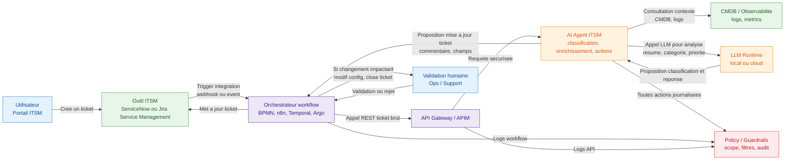

# exemple d'integration sous forme de schema

Un exemple classique : intégrer un agent pour traiter automatiquement une partie d’un workflow ITSM (tickets d’incident) en s’appuyant sur tes systèmes existants.[^1][^2]

## Schéma Mermaid d’intégration dans un workflow ITSM

Dans cet exemple :

- Le workflow principal reste porté par l’outil ITSM et l’orchestrateur, l’agent n’est qu’un step d’analyse et de proposition d’actions.[^3][^1]
- Les validations sensibles passent toujours par une étape humaine, l’agent fournit le contexte et les suggestions.[^4][^5]

Le même pattern se transpose bien à d’autres workflows (onboarding client, SOC, CI/CD) en remplaçant ITSM et CMDB par tes systèmes métier.

⁂

[^1]: https://mitrix.io/blog/how-to-integrate-ai-agents-with-your-existing-tech-stack/

[^2]: https://www.talktoagent.com/blog/integrate-ai-agents-existing-systems

[^3]: https://botscrew.com/blog/how-to-integrate-ai-agents-with-enterprise-systems/

[^4]: https://www.zenesys.com/ai-agent-integration-explained-how-to-build-smarter-faster-workflows

[^5]: https://www.cybersec-automation.com/p/integrating-ai-agents-into-existing-soc-workflows-best-practices-61391cdca6acf83b

