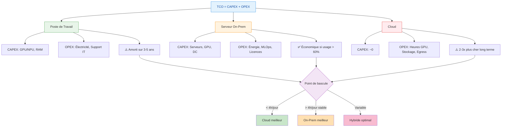

# Comment évaluer les coûts totaux de possession pour chaque option

Pour comparer poste de travail, serveurs on‑prem et cloud, la bonne approche est de poser un modèle TCO explicite sur 3–5 ans, en séparant clairement CAPEX et OPEX, et en intégrant l’usage réel (heures GPU, volumétrie, équipes).[^1][^2]

## 1. Poser le cadre TCO

- Définir l'horizon (souvent 3 ou 5 ans) et la charge cible : nombre de requêtes/jour, heures d'utilisation GPU/CPU, croissance prévue, SLA.[^3][^1]
- Appliquer la formule TCO basique à chaque option :
    - $TCO = CAPEX + OPEX$ sur la période, en ramenant tout en coût annuel ou mensuel par utilisateur / par 1k requêtes.[^2][^4]

### Visualisation du modèle TCO

## 2. Poste de travail (edge)

À évaluer pour chaque poste “IA‑capable” (GPU/accelerator) :

- CAPEX : surcoût GPU/NPU, RAM, stockage par rapport à un poste standard, amorti sur 3–5 ans.[^5][^1]
- OPEX : électricité approximative liée à l’IA (kWh estimés), support IT, licences locales éventuelles, temps d’admin (MAJ modèles, sécurité).[^6][^5]

Pertinent si :

- Utilisation modérée et locale (assistant dev, RAG perso, peu de mutualisation) et si les machines existent déjà.[^5][^6]

## 3. Serveurs on‑prem / départementaux

Pour un ou plusieurs serveurs GPU :

- CAPEX : achat serveurs, GPUs, stockage, réseau associé, éventuellement baie et onduleurs, amortis sur 3–5 ans.[^7][^8][^6]
- OPEX : électricité + refroidissement (coût horaire par serveur), maintenance matérielle, licences (hyperviseur, K8s enterprise, monitoring), et part de salaires pour exploitation (infra + MLOps).[^9][^7][^1]

Clés d’analyse :

- Calculer le taux d’utilisation GPU moyen (ex. objectif >60–70%) : les études montrent que pour des charges IA stables et intensives, l’on‑prem devient plus économique que le cloud après environ 2–3 ans et peut représenter 30–50% d’économies sur 3–5 ans.[^10][^11][^7][^5]
- Calculer le point de bascule : comparer coût horaire cloud (équivalent GPU) vs coût horaire on‑prem (énergie + amortissement), les analyses Lenovo/Dell montrent que quelques heures d’utilisation GPU par jour suffisent à rendre l’on‑prem plus rentable sur 5 ans.[^8][^12][^7]

## 4. Cloud (IaaS / API LLM)

Cloud IaaS (VM GPU) :

- CAPEX quasi nul.
- OPEX : coût horaire des instances GPU (à multiplier par heures d’usage + overhead réseau/stockage), frais de sortie de données, licences managées, support, etc.[^13][^7][^9]

Cloud via API LLM :

- Facturation à la requête / au token + éventuels abonnements, souvent 2–3x plus cher à long terme que d’exploiter son propre hardware pour usage intensif.[^14][^15][^16]

Clés d’analyse :

- Idéal pour workloads bursty, POC, ou charges faibles à moyennes, où la flexibilité compense un coût unitaire élevé.[^9][^1]
- Vérifier le coût sur un scénario “steady‑state” (ex. X requêtes/jour sur 3 ans) : plusieurs analyses montrent que pour des LLM très utilisés, le cloud peut coûter 2–3x l’on‑prem sur 3–5 ans.[^15][^17][^14]

## 5. Comparer sur une base commune

- Normaliser les TCO : coût par requête, par utilisateur ou par heure GPU, pour chaque scénario (poste, on‑prem, cloud).[^1][^3]
- Tester plusieurs profils de charge :
    - Faible (tests, POC) : cloud/API gagne souvent.[^13][^9]
    - Moyen : solutions hybrides / cloud + un peu d’edge.[^4][^5]
    - Fort et stable : on‑prem (et possiblement postes puissants pour une partie des usages) devient en général nettement moins cher.[^10][^7][^6]

## 6. Tableau de ce qu’il faut inclure

| Option | CAPEX à inclure | OPEX à inclure |
| :-- | :-- | :-- |
| Poste de travail | Surcoût GPU/NPU, RAM, stockage. [^5] | Énergie, temps IT, licences locales, MAJ modèles/sécurité. [^5][^6] |
| Serveur on‑prem | Serveurs, GPU, stockage, réseau, DC. [^7] | Énergie, refroidissement, licences, support HW, salaires infra/MLOps. [^7][^1] |
| Cloud IaaS | Aucun (hors setup). [^9] | Heures VM GPU, stockage, réseau, egress, support, services managés. [^9][^13] |
| API LLM / SaaS | Aucun. [^14] | Coût par token/requête, abonnements, frais de compliance supplémentaires. [^14][^16] |

Si tu veux, tu peux donner un ordre de grandeur de ta charge (nb d’utilisateurs, requêtes/jour, taille des modèles) et un budget énergétique/DC, et un petit modèle chiffré (avec hypothèses explicites) poste vs on‑prem vs cloud peut être esquissé.
[^18][^19][^20]

⁂

[^1]: https://www.ansys.com/blog/understanding-total-cost-ownership-hpc-ai-systems

[^2]: https://www.cloud4y.ru/en/blog/tco-cloud/

[^3]: https://arxiv.org/pdf/1908.04136.pdf

[^4]: https://airbyte.com/data-engineering-resources/cloud-etl-vs-on-premise-total-cost-of-ownership

[^5]: https://www.getmonetizely.com/articles/the-ai-edge-computing-cost-local-processing-vs-cloud-pricing

[^6]: https://www.verge.io/blog/ai/the-roi-of-on-premises-ai/

[^7]: https://lenovopress.lenovo.com/lp2225-on-premise-vs-cloud-generative-ai-total-cost-of-ownership

[^8]: https://lenovopress.lenovo.com/lp2225.pdf

[^9]: https://terrazone.io/on-prem-vs-cloud-tco/

[^10]: https://ai-stack.ai/en/cloud-or-on-premises

[^11]: https://arxiv.org/html/2509.18101v3

[^12]: https://www.delltechnologies.com/asset/en-in/solutions/business-solutions/industry-market/esg-inferencing-on-premises-with-dell-technologies-analyst-paper.pdf

[^13]: https://www.newline.co/@zaoyang/on-prem-vs-cloud-llm-cost-breakdown--4a7b0926

[^14]: https://www.getmonetizely.com/articles/the-ai-model-hosting-economics-cloud-vs-on-premise-pricing

[^15]: https://anchoreo.ai/blog/on-premises-ai-vs-cloud-ai/

[^16]: https://www.signitysolutions.com/blog/on-premise-vs-cloud-based-llm

[^17]: https://latitude-blog.ghost.io/blog/cloud-vs-on-prem-llms-long-term-cost-analysis/

[^18]: https://www.infracloud.io/blogs/on-premise-ai-vs-cloud-ai/

[^19]: https://www.criticalcase.com/blog/calculating-the-tco-cloud-vs-on-premise-infrastructure.html

[^20]: https://expedient.com/knowledgebase/tools-and-calculators/cloud-build-vs-buy-calculator/

