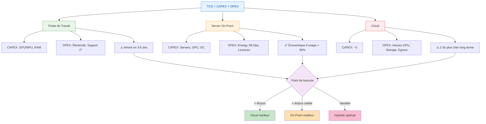

# How to evaluate les costs totaux de possession for chaque option

Pour compare workstation, servers on‑prem and cloud, la bonne approche is de poser un modèle TCO explicite on 3–5 ans, en séparant clairement CAPEX and OPEX, and en intégrant l’usage réel (heures GPU, volumétrie, équipes).[^1][^2]

## 1. Poser le cadre TCO

- Définir l'horizon (often 3 or 5 ans) and la load cible : nombre de requêtes/jour, heures d'usage GPU/CPU, croissance prévue, SLA.[^3][^1]
- Appliquer la formule TCO basique à chaque option :
    - $TCO = CAPEX + OPEX$ on la période, en ramenant tout en cost annuel or mensuel par utilisateur / par 1k requêtes.[^2][^4]

### Visualization du modèle TCO

## 2. Workstation (edge)

À evaluate for chaque poste “IA‑capable” (GPU/accelerator) :

- CAPEX : surcost GPU/NPU, RAM, storage par rapport à un poste standard, amorti on 3–5 ans.[^5][^1]
- OPEX : électricité approximative liée à l’IA (kWh estimés), support IT, licences locales éventuelles, temps d’admin (MAJ models, security).[^6][^5]

Relevant if :

- Usage modérée and locale (assistant dev, RAG perso, peu de mutualisation) and if les machines existent déjà.[^5][^6]

## 3. Servers on‑prem / départementaux

Pour un or plusieurs servers GPU :

- CAPEX : achat servers, GPUs, storage, network associé, éventuellement baie and onduleurs, amortis on 3–5 ans.[^7][^8][^6]
- OPEX : électricité + refroidissement (cost horaire par server), maintenance hardwarele, licences (hyperviseur, K8s enterprise, monitoring), and part de salaires for exploitation (infra + MLOps).[^9][^7][^1]

Clés d’analyse :

- Calculer le taux d’usage GPU moyen (ex. objectif >60–70%) : les études montrent que for des loads IA stables and intensives, l’on‑prem devient plus économique que le cloud après environ 2–3 ans and can représenter 30–50% d’économies on 3–5 ans.[^10][^11][^7][^5]
- Calculer le point de bascule : compare cost horaire cloud (équivalent GPU) vs cost horaire on‑prem (energy + amortissement), les analyses Lenovo/Dell montrent que quelques heures d’usage GPU par jour suffisent à rendre l’on‑prem plus rentable on 5 ans.[^8][^12][^7]

## 4. Cloud (IaaS / API LLM)

Cloud IaaS (VM GPU) :

- CAPEX quasi nul.
- OPEX : cost horaire des instances GPU (à multiplier par heures d’usage + overhead network/storage), frais de sortie de data, licences managées, support, etc.[^13][^7][^9]

Cloud via API LLM :

- Facturation à la requête / au token + éventuels abonnements, often 2–3x plus cher à long terme que d’exploiter son propre hardware for usage intensif.[^14][^15][^16]

Clés d’analyse :

- Idéal for workloads bursty, POC, or loads faibles à moyennes, où la flexibilité compense un cost unitaire élevé.[^9][^1]
- Vérifier le cost on un scénario “steady‑state” (ex. X requêtes/jour on 3 ans) : plusieurs analyses montrent que for des LLM très utilisés, le cloud can coster 2–3x l’on‑prem on 3–5 ans.[^15][^17][^14]

## 5. Compare on une base commune

- Normaliser les TCO : cost par requête, par utilisateur or par heure GPU, for chaque scénario (poste, on‑prem, cloud).[^1][^3]
- Tester plusieurs profils de load :
    - Faible (tests, POC) : cloud/API gagne often.[^13][^9]
    - Moyen : solutions hybrides / cloud + un peu d’edge.[^4][^5]
    - Fort and stable : on‑prem (et possiblement postes puissants for une partie des usages) devient en général nettement moins cher.[^10][^7][^6]

## 6. Table de ce qu’il faut inclure

| Option | CAPEX à inclure | OPEX à inclure |
| :-- | :-- | :-- |
| Workstation | Surcost GPU/NPU, RAM, storage. [^5] | Energy, temps IT, licences locales, MAJ models/security. [^5][^6] |
| Server on‑prem | Servers, GPU, storage, network, DC. [^7] | Energy, refroidissement, licences, support HW, salaires infra/MLOps. [^7][^1] |
| Cloud IaaS | Aucun (hors setup). [^9] | Heures VM GPU, storage, network, egress, support, services managés. [^9][^13] |
| API LLM / SaaS | Aucun. [^14] | Cost par token/requête, abonnements, frais de compliance supplémentaires. [^14][^16] |

Si tu veux, tu peux donner un ordre de grandeur de ta load (nb d’utilisateurs, requêtes/jour, taille des models) and un budget énergétique/DC, and un petit modèle chiffré (avec hypothèses explicites) poste vs on‑prem vs cloud can être esquissé.
[^18][^19][^20]

⁂

[^1]: https://www.ansys.com/blog/understanding-total-cost-ownership-hpc-ai-systems

[^2]: https://www.cloud4y.ru/en/blog/tco-cloud/

[^3]: https://arxiv.org/pdf/1908.04136.pdf

[^4]: https://airbyte.com/data-engineering-resources/cloud-etl-vs-on-premise-total-cost-of-ownership

[^5]: https://www.getmonetizely.com/articles/the-ai-edge-computing-cost-local-processing-vs-cloud-pricing

[^6]: https://www.verge.io/blog/ai/the-roi-of-on-premises-ai/

[^7]: https://lenovopress.lenovo.com/lp2225-on-premise-vs-cloud-generative-ai-total-cost-of-ownership

[^8]: https://lenovopress.lenovo.com/lp2225.pdf

[^9]: https://terrazone.io/on-prem-vs-cloud-tco/

[^10]: https://ai-stack.ai/en/cloud-or-on-premises

[^11]: https://arxiv.org/html/2509.18101v3

[^12]: https://www.delltechnologies.com/asset/en-in/solutions/business-solutions/industry-market/esg-inferencing-on-premises-with-dell-technologies-analyst-paper.pdf

[^13]: https://www.newline.co/@zaoyang/on-prem-vs-cloud-llm-cost-breakdown--4a7b0926

[^14]: https://www.getmonetizely.com/articles/the-ai-model-hosting-economics-cloud-vs-on-premise-pricing

[^15]: https://anchoreo.ai/blog/on-premises-ai-vs-cloud-ai/

[^16]: https://www.signitysolutions.com/blog/on-premise-vs-cloud-based-llm

[^17]: https://latitude-blog.ghost.io/blog/cloud-vs-on-prem-llms-long-term-cost-analysis/

[^18]: https://www.infracloud.io/blogs/on-premise-ai-vs-cloud-ai/

[^19]: https://www.criticalcase.com/blog/calculating-the-tco-cloud-vs-on-premise-infrastructure.html

[^20]: https://expedient.com/knowledgebase/tools-and-calculators/cloud-build-vs-buy-calculator/

