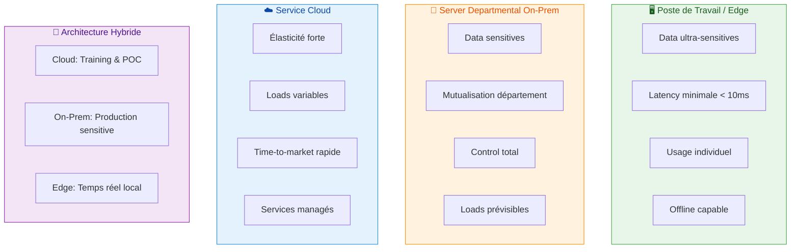

# AI Deployment Model: Workstation, Departmental Servers, or Cloud Service

The choice between workstation, departmental servers, and cloud service depends primarily on data sensitivity, latency criticality, workload variability, and your capacity to operate and maintain the infrastructure.[^1][^2]

## Key Decision Criteria

- **Data and compliance**: If data is sensitive (healthcare, HR, detailed financial data), keeping processing on-premises (workstation or server) simplifies sovereignty and audits, while cloud imposes additional regulatory constraints.[^2][^3][^1]
- **Latency and network availability**: For real-time use cases or poorly connected environments (workshops, field sites, remote branches), local inference (workstation or departmental server) avoids network round-trips to the cloud.[^4][^5][^6]
- **Workload variability**: If demand is highly fluctuating (strong peaks, frequent POCs), cloud remains significantly more elastic and faster to scale than on-premises.[^7][^8][^2]
- **Cost horizon**: On-premises has high CAPEX but low marginal costs for stable workloads, while cloud is OPEX pay-per-use but can cost 2-3x more long-term for intensive usage.[^9][^3][^10]

## Workstation (Individual Edge)

**Appropriate when:**

- Individual or small group use cases with strong confidentiality needs (local LLM, code assistants, prototypes).[^11][^5][^4]
- Relatively compact models, high usage frequency but local (not multi-user).[^12][^4]

**Advantages:**

- Data never leaves the workstation, no network dependency, minimal latency.[^5][^4]
- Controlled costs if hardware already exists, ideal for experimentation and distributed R&D.[^13][^2]

**Limitations:**

- No sharing between users, difficult to administer at scale (MLOps, model updates).[^14][^13]
- Power limited by workstation configuration (GPU/NPU), not well-suited for large training or massive inference.[^15][^4]

## Departmental Server / On-Premises

**Appropriate when:**

- Need to share models across a service or department, with sensitive data but relatively predictable workloads.[^10][^1][^2]
- Low latency and local service continuity required (even if WAN fails).[^6][^4]

**Advantages:**

- Total control over data, infrastructure, and software stack, simpler to align security and compliance.[^3][^1][^7]
- Attractive cost if GPUs/servers are well-utilized continuously (high usage rate over multiple years).[^9][^10]

**Limitations:**

- High initial investment (HW, energy, cooling) and need for teams to operate and evolve the platform.[^2][^15][^10]
- Slow scalability (procurement and installation delays) and difficulty absorbing spikes or very short-term projects.[^7][^9]

## Cloud Service (Public or Private)

**Appropriate when:**

- Strong elasticity needed, rapid testing of multiple models/providers, or highly variable workloads.[^8][^2][^7]
- Data already partially externalized, with non-critical latency requirements, or for heavy training phases.[^16][^17][^11]

**Advantages:**

- Near-immediate scaling, access to GPU/TPU/NPU without CAPEX, very fast time-to-market.[^15][^2][^7]
- Large ecosystem of managed services (vector DBs, pipelines, observability), simpler integration for numerous projects.[^18][^8]

**Limitations:**

- Costs can become 2-3x higher than on-premises for intensive and continuous usage (especially for LLM/vision) if not optimized.[^3][^9]
- Sovereignty issues, data localization concerns, and vendor dependency (lock-in).[^1][^11][^2]

## Visualization des models de deployment

## Table de décision synthétique

| Critère principal | Workstation | Server departmental on‑prem | Service cloud public |
| :-- | :-- | :-- | :-- |
| Sensibilité des data | Très élevée, data locales. [^4] | Élevée, data restent in le SI. [^1] | Variable, data chez un tiers. [^2] |
| Latency / dépendance network | Latency minimale, offline OK. [^4] | Faible en local, WAN optionnel. [^6] | Dépend du network and du DC. [^15] |
| Variabilité de la load | Faible, usage individuel. [^13] | Moyenne, loads prévisibles. [^10] | Forte, très élastique. [^2][^7] |
| Cost long terme (usage fort) | Bon if déjà équipé. [^13] | Avantageux if haut taux d’usage. [^9] | Peut devenir élevé en continu. [^9] |
| Complexité d’exploitation | Dispersée, peu industrialisable. [^13] | Nécessite équipe infra/MLOps. [^2] | Externalisée au provider. [^7] |

## Recommendation type (approche hybride)

Pour une DSI/collectivité or une grande entreprise, un modèle hybride is often optimal :

- Cloud for : trainings lourds, POC rapides, loads très variables, intégration de services managés (APIs LLM, vision, traduction).[^17][^16][^2]
- Server(s) départementaux for : inference récurrente on data sensitives, services IA partagés (chat internal, RAG on documents internals, scoring métier).[^10][^1][^3]
- Postes de travail for : outils personnels (copilotes dev, assistants bureautiques) and cas où aucune donnée ne must sortir du poste.[^4][^11]

Si tu veux, tu peux préciser ton contexte (taille de l’organisation, type de data, cas d’usage IA envisagés) and un budget approximatif, and une proposition d’architecture cible plus détaillée (incluant MLOps, security, network) can être construite.
[^19][^20]

⁂

[^1]: https://anchoreo.ai/blog/on-premises-ai-vs-cloud-ai/

[^2]: https://www.pluralsight.com/resources/blog/ai-and-data/ai-on-premises-vs-in-cloud

[^3]: https://bentoml.com/llm/infrastructure-and-operations/on-prem-llms

[^4]: https://www.imaginationtech.com/what-is-edge-ai/edge-ai-vs-cloud-ai/

[^5]: https://www.coursera.org/articles/edge-ai-vs-cloud-ai

[^6]: https://www.scalecomputing.com/resources/cloud-vs-on-premises

[^7]: https://www.quinnox.com/blogs/on-premise-ai-vs-cloud-ai/

[^8]: https://www.clarifai.com/blog/edge-vs-cloud-ai

[^9]: https://latitude-blog.ghost.io/blog/cloud-vs-on-prem-llms-long-term-cost-analysis/

[^10]: https://ai-stack.ai/en/cloud-or-on-premises

[^11]: https://www.innoaiot.com/edge-llms-vs-cloud-llms-balancing-performance-security-and-scalability-in-the-ai-era/

[^12]: https://testrigor.com/blog/edge-ai-vs-cloud-ai/

[^13]: https://scalevise.com/resources/on-premises-ai-vs-cloud-ai-vs-ai-tools-what-should-you-choose/

[^14]: https://www.linkedin.com/pulse/cloud-edge-where-should-ai-inference-workloads-run-jack-gold-zkt2e

[^15]: https://www.nse.com.tw/web/about/technology_in.jsp?np_no=NP1759904500891\&lang=en

[^16]: https://marutitech.com/llm-deployment-guide-cloud-vs-on-premises/

[^17]: https://research.aimultiple.com/llm-pricing/

[^18]: https://upcloud.com/blog/cloud-vs-on-premise-trade-offs-where-heim-fits/

[^19]: https://www.infracloud.io/blogs/on-premise-ai-vs-cloud-ai/

[^20]: https://agatsoftware.com/blog/on-premise-ai-vs-cloud-ai-which-solution-is-right-for-your-business/

