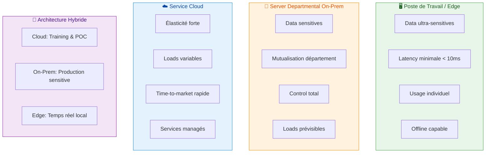

# choice du modele de deployment de l'IA between  workstation, server departementaux,  service cloud

Le choice between workstation, server departmental and service cloud dépend surtout de la sensibilité des data, de la criticité de la latency, de la variabilité de la load and de votre capacité à exploiter/maintenir l’infra.[^1][^2]

## Grands critères de choix

- Data and conformité : if les data are sensitives (santé, RH, data financières détaillées), garder le traitement on‑prem (poste or server) simplifie la souveraineté and les audits, alors que le cloud impose de gérer des contraintes réglementaires supplémentaires.[^2][^3][^1]
- Latency and disponibilité network : for des cas temps réel or en environnement peu connecté (atelier, terrain, agences mal reliées), l’inference locale (poste or server departmental) évite les allers‑retours network vers le cloud.[^4][^5][^6]
- Variabilité de la load : if la demande is très fluctuante (pics forts, POC fréquents), le cloud reste nettement plus élastique and rapide à dimensionner que l’on‑prem.[^7][^8][^2]
- Horizon de costs : on‑prem a un gros CAPEX but des costs marginaux faibles for des loads stables, alors que le cloud is OPEX pay‑per‑use but can coster plus cher on le long terme en cas d’usage intensif.[^9][^3][^10]

## Workstation (edge individuel)

Appropriate quand :

- Cas d’usage individuels or petits groupes, with need de confidentialité forte (LLM local, assistants code, prototypes).[^11][^5][^4]
- Models relativement compacts, fréquence d’usage élevée but locale (pas multi‑utilisateur).[^12][^4]

Advantages :

- Data qui ne sortent never du poste, aucune dépendance network, latency minimale.[^5][^4]
- Costs maîtrisés if le hardware existe déjà, idéal for expérimentation and R\&D distribuée.[^13][^2]

Limitations :

- Pas de mutualisation between utilisateurs, difficile à administrer à grande échelle (MLOps, mises à jour models).[^14][^13]
- Power limitée par la config du poste (GPU/NPU), peu adapté à de gros trainings or à de l’inference massive.[^15][^4]

## Server departmental / on‑prem

Appropriate quand :

- Need de mutualiser des models for un service or un département, with data sensitives but loads relativement prévisibles.[^10][^1][^2]
- Latency faible and continuité de service locale (même if le WAN tombe).[^6][^4]

Advantages :

- Control total on les data, l’infra, la stack softwarele, plus simple for aligner security and conformité.[^3][^1][^7]
- Cost intéressant if les GPU/servers are bien utilisés en continu (taux d’usage élevé on plusieurs années).[^9][^10]

Limitations :

- Investissement initial élevé (HW, energy, refroidissement) and need d’équipes for opérer and faire évoluer la plateforme.[^2][^15][^10]
- Scalabilité lente (délais d’achat, d’installation) and difficulté à absorber des pics or des projets très ponctuels.[^7][^9]

## Service cloud (public or private)

Appropriate quand :

- Need d’élasticité forte, de tests rapides de multiples models/fournisseurs, or de loads très variables.[^8][^2][^7]
- Data déjà partiellement externalisées, with requirements de latency pas ultra‑critiques, or for phases d’training lourdes.[^16][^17][^11]

Advantages :

- Mise à l’échelle quasi immédiate, accès à du GPU/TPU/NPU without capex, time‑to‑market très rapide.[^15][^2][^7]
- Large écosystème de services managés (vectordb, pipelines, observabilité), intégration plus simple for des projets nombreux.[^18][^8]

Limitations :

- Costs pouvant devenir 2–3x plus élevés que l’on‑prem à usage intensif and continu (surtout on LLM/vision) if non optimisés.[^3][^9]
- Enjeux de souveraineté, de localisation des data and de dépendance fournisseur (lock‑in).[^1][^11][^2]

## Visualization des models de deployment

## Table de décision synthétique

| Critère principal | Workstation | Server departmental on‑prem | Service cloud public |
| :-- | :-- | :-- | :-- |
| Sensibilité des data | Très élevée, data locales. [^4] | Élevée, data restent in le SI. [^1] | Variable, data chez un tiers. [^2] |
| Latency / dépendance network | Latency minimale, offline OK. [^4] | Faible en local, WAN optionnel. [^6] | Dépend du network and du DC. [^15] |
| Variabilité de la load | Faible, usage individuel. [^13] | Moyenne, loads prévisibles. [^10] | Forte, très élastique. [^2][^7] |
| Cost long terme (usage fort) | Bon if déjà équipé. [^13] | Avantageux if haut taux d’usage. [^9] | Peut devenir élevé en continu. [^9] |
| Complexité d’exploitation | Dispersée, peu industrialisable. [^13] | Nécessite équipe infra/MLOps. [^2] | Externalisée au provider. [^7] |

## Recommendation type (approche hybride)

Pour une DSI/collectivité or une grande entreprise, un modèle hybride is often optimal :

- Cloud for : trainings lourds, POC rapides, loads très variables, intégration de services managés (APIs LLM, vision, traduction).[^17][^16][^2]
- Server(s) départementaux for : inference récurrente on data sensitives, services IA partagés (chat internal, RAG on documents internals, scoring métier).[^10][^1][^3]
- Postes de travail for : outils personnels (copilotes dev, assistants bureautiques) and cas où aucune donnée ne must sortir du poste.[^4][^11]

Si tu veux, tu peux préciser ton contexte (taille de l’organisation, type de data, cas d’usage IA envisagés) and un budget approximatif, and une proposition d’architecture cible plus détaillée (incluant MLOps, security, network) can être construite.
[^19][^20]

⁂

[^1]: https://anchoreo.ai/blog/on-premises-ai-vs-cloud-ai/

[^2]: https://www.pluralsight.com/resources/blog/ai-and-data/ai-on-premises-vs-in-cloud

[^3]: https://bentoml.com/llm/infrastructure-and-operations/on-prem-llms

[^4]: https://www.imaginationtech.com/what-is-edge-ai/edge-ai-vs-cloud-ai/

[^5]: https://www.coursera.org/articles/edge-ai-vs-cloud-ai

[^6]: https://www.scalecomputing.com/resources/cloud-vs-on-premises

[^7]: https://www.quinnox.com/blogs/on-premise-ai-vs-cloud-ai/

[^8]: https://www.clarifai.com/blog/edge-vs-cloud-ai

[^9]: https://latitude-blog.ghost.io/blog/cloud-vs-on-prem-llms-long-term-cost-analysis/

[^10]: https://ai-stack.ai/en/cloud-or-on-premises

[^11]: https://www.innoaiot.com/edge-llms-vs-cloud-llms-balancing-performance-security-and-scalability-in-the-ai-era/

[^12]: https://testrigor.com/blog/edge-ai-vs-cloud-ai/

[^13]: https://scalevise.com/resources/on-premises-ai-vs-cloud-ai-vs-ai-tools-what-should-you-choose/

[^14]: https://www.linkedin.com/pulse/cloud-edge-where-should-ai-inference-workloads-run-jack-gold-zkt2e

[^15]: https://www.nse.com.tw/web/about/technology_in.jsp?np_no=NP1759904500891\&lang=en

[^16]: https://marutitech.com/llm-deployment-guide-cloud-vs-on-premises/

[^17]: https://research.aimultiple.com/llm-pricing/

[^18]: https://upcloud.com/blog/cloud-vs-on-premise-trade-offs-where-heim-fits/

[^19]: https://www.infracloud.io/blogs/on-premise-ai-vs-cloud-ai/

[^20]: https://agatsoftware.com/blog/on-premise-ai-vs-cloud-ai-which-solution-is-right-for-your-business/

