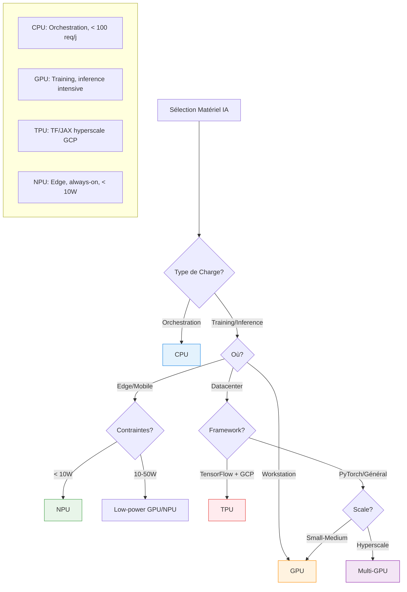

# quand utiliser un CPU versus GPU versus TPU versus NPU

CPU, GPU, TPU et NPU se choisissent en fonction du type de tâche (généraliste vs massivement parallèle), de l’échelle (edge vs datacenter), de la consommation énergétique et de ton écosystème (on‑prem vs cloud, TensorFlow vs PyTorch).[^1][^2][^3]

## Quand utiliser un CPU

- Tâches générales et logique complexe : orchestration, pré/post‑traitement, requêtes BDD, API, feature engineering léger, petits modèles classiques (arbres, régressions).[^4][^5][^3]
- Petits modèles ou faible volume : inférence sur modèles légers, scripts batch, micro‑services IA peu sollicités, là où la latence et le throughput ne justifient pas un accélérateur.[^5][^4]

À privilégier pour : orchestrateurs d’agents, services REST, jobs de glue code, et pour l’IA “light” dans des systèmes existants.[^6][^3]

## Quand utiliser un GPU

- Entraînement et fine‑tuning de modèles profonds : gros réseaux, LLM, vision, où la multiplication de matrices batte la mesure.[^7][^1]
- Inférence à moyenne ou grande échelle : serveurs RAG, chatbots multi‑utilisateurs, pipelines batch intensifs, quand tu veux maximiser throughput ou réduire fortement la latence.[^8][^2][^9]

À privilégier pour : datacenters, serveurs K8s, postes de travail IA, là où tu veux un bon mix flexibilité / perf / écosystème (CUDA, ROCm).[^3][^8][^4]

## Quand utiliser un TPU

- Workloads TensorFlow massifs : Google TPU est optimisé pour les ops tenseur (matmul) et montre un excellent ratio perf/watt en training/inférence pour des modèles DL bien alignés avec l’archi.[^2][^1][^7]
- Hyperscale sur Google Cloud : grands entraînements ou inférence de gros modèles lorsque tu es déjà dans l’écosystème GCP et que ton code est adapté (TF/XLA, JAX).[^9][^8][^4]

À privilégier pour : gros projets DL sur GCP, TensorFlow/JAX‑first, où l’optimisation coût/latence sur TPU est prioritaire à la portabilité.[^2][^7]

## Quand utiliser un NPU

- Edge et on‑device : mobiles, caméras, robots, NAS, passerelles industrielles, où l’IA doit tourner localement avec quelques watts, parfois en “always‑on” (vision, wake‑word, filtrage, LLM local compact).[^10][^1][^6]
- Inférence temps réel basse conso : benchmarks récents montrent que les NPUs peuvent offrir des latences comparables ou meilleures que des GPUs pour l’inférence, avec 2–10× moins de puissance consommée.[^11][^12][^10][^2]

À privilégier pour : déploiements embarqués/edge, assistants locaux, scénarios où la perf/watt et la confidentialité locale priment sur la flexibilité maximale.[^13][^6][^9]

## Résumé pratique

### Récapitulatif

- CPU : orchestration, logique métier, petits modèles, low‑volume, partout.[^4][^3]
- GPU : entraînement et inférence intensifs, multi‑utilisateurs, datacenter et postes IA.[^1][^8][^9]
- TPU : gros TensorFlow/JAX sur GCP, hyperscale optimisé coût/énergie.[^7][^2]
- NPU : edge / mobile / on‑device, IA embarquée, LLM compacts, contraintes fortes d'énergie et de confidentialité.[^10][^6][^1]
[^14][^15][^16][^17][^18][^19][^20]

⁂

[^1]: https://www.seeedstudio.com/blog/2024/08/12/cpu-vs-gpu-vs-tpu-vs-npu/

[^2]: https://www.thepurplestruct.com/blog/cpu-vs-gpu-vs-tpu-vs-npu-ai-hardware-architecture-guide-2025

[^3]: https://dev.to/deepakgupta/cpus-gpus-npus-and-tpus-choosing-the-right-processing-unit-for-ai-workloads-29df

[^4]: https://picovoice.ai/blog/cpu-gpu-tpu-npu/

[^5]: https://guptadeepak.com/understanding-cpus-gpus-npus-and-tpus-a-simple-guide-to-processing-units/

[^6]: https://resources.l-p.com/knowledge-center/cpu-vs-gpu-vs-tpu-vs-npu-architecture-comparison-explained

[^7]: https://www.techtarget.com/whatis/feature/GPUs-vs-TPUs-vs-NPUs-Comparing-AI-hardware-options

[^8]: https://www.backblaze.com/blog/ai-101-gpu-vs-tpu-vs-npu/

[^9]: https://blog.stackademic.com/beyond-the-cpu-choosing-the-right-processing-unit-for-ai-workloads-05299ebe5f8f

[^10]: https://arxiv.org/html/2409.14803v1

[^11]: https://www.servermania.com/kb/articles/npu-vs-gpu-comparison-guide

[^12]: https://www.onlogic.com/blog/npus-vs-gpus-for-edge-ai/

[^13]: https://www.nxp.com/design/design-center/training/TIP-AI-PROCESSORS-EDGE-TRENDS-SOLUTIONS

[^14]: https://blog.qnap.com/en/cpu-gpu-npu-tpu-what-are-they/

[^15]: https://www.youtube.com/watch?v=d3SqH0UBLEY

[^16]: https://www.linkedin.com/posts/aditya-hicounselor_aichips-gpu-tpu-activity-7382399548519895041-7ACA

[^17]: https://www.reddit.com/r/AskComputerScience/comments/1j68g4b/nputpu_vs_gpgpucuda_vs_cpuavxsimd/

[^18]: https://lilys.ai/notes/fr/ai-semiconductor-20251022/npu-cpu-gpu-tpu-ai-hardware

[^19]: https://www.linkedin.com/posts/ali-kamaly_ai-ml-machinelearning-activity-7378776188649013256-lHbd

[^20]: https://www.corsair.com/us/en/explorer/diy-builder/power-supply-units/cpu-vs-gpu-vs-npu-whats-the-difference/

