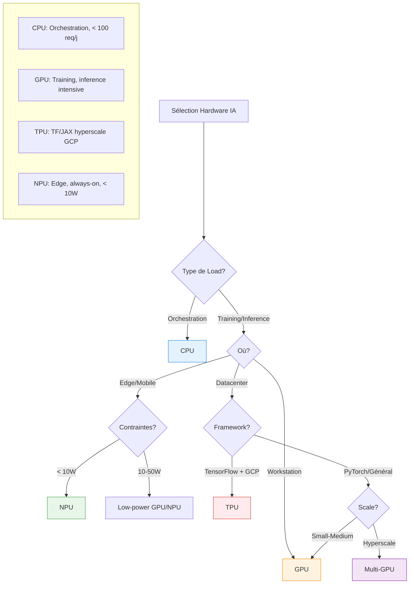

# when to use un CPU versus GPU versus TPU versus NPU

CPU, GPU, TPU and NPU se choisissent en fonction du type de tâche (généraliste vs massivement parallèle), de l’échelle (edge vs datacenter), de la consumption énergétique and de ton écosystème (on‑prem vs cloud, TensorFlow vs PyTorch).[^1][^2][^3]

## When to use un CPU

- Tâches générales and logique complexe : orchestration, pré/post‑traitement, requêtes BDD, API, feature engineering léger, petits models classiques (arbres, régressions).[^4][^5][^3]
- Petits models or faible volume : inference on models légers, scripts batch, micro‑services IA peu sollicités, là où la latency and le throughput ne justifient pas un accélérateur.[^5][^4]

À privilégier for : orchestrateurs d’agents, services REST, jobs de glue code, and for l’IA “light” in des systèmes existants.[^6][^3]

## When to use un GPU

- Training and fine‑tuning de models profonds : gros networkx, LLM, vision, où la multiplication de matrices batte la mesure.[^7][^1]
- Inference à moyenne or grande échelle : servers RAG, chatbots multi‑utilisateurs, pipelines batch intensifs, quand tu veux maximiser throughput or réduire fortement la latency.[^8][^2][^9]

À privilégier for : datacenters, servers K8s, postes de travail IA, là où tu veux un bon mix flexibilité / perf / écosystème (CUDA, ROCm).[^3][^8][^4]

## When to use un TPU

- Workloads TensorFlow massifs : Google TPU is optimisé for les ops tenseur (matmul) and montre un excellent ratio perf/watt en training/inference for des models DL bien alignés with l’archi.[^2][^1][^7]
- Hyperscale on Google Cloud : grands trainings or inference de gros models lorsque tu es déjà in l’écosystème GCP and que ton code is adapté (TF/XLA, JAX).[^9][^8][^4]

À privilégier for : gros projets DL on GCP, TensorFlow/JAX‑first, où l’optimisation cost/latency on TPU is prioritaire à la portabilité.[^2][^7]

## When to use un NPU

- Edge and on‑device : mobiles, caméras, robots, NAS, passerelles industrielles, où l’IA must tourner localement with quelques watts, sometimes en “always‑on” (vision, wake‑word, filtrage, LLM local compact).[^10][^1][^6]
- Inference temps réel basse conso : benchmarks récents montrent que les NPUs can offrir des latencys comparables or meilleures que des GPUs for l’inference, with 2–10× moins de power consommée.[^11][^12][^10][^2]

À privilégier for : deployments embarqués/edge, assistants locaux, scénarios où la perf/watt and la confidentialité locale priment on la flexibilité maximale.[^13][^6][^9]

## Summary pratique

### Récapitulatif

- CPU : orchestration, logique métier, petits models, low‑volume, partout.[^4][^3]
- GPU : training and inference intensifs, multi‑utilisateurs, datacenter and postes IA.[^1][^8][^9]
- TPU : gros TensorFlow/JAX on GCP, hyperscale optimisé cost/energy.[^7][^2]
- NPU : edge / mobile / on‑device, IA embarquée, LLM compacts, contraintes fortes d'energy and de confidentialité.[^10][^6][^1]
[^14][^15][^16][^17][^18][^19][^20]

⁂

[^1]: https://www.seeedstudio.com/blog/2024/08/12/cpu-vs-gpu-vs-tpu-vs-npu/

[^2]: https://www.thepurplestruct.com/blog/cpu-vs-gpu-vs-tpu-vs-npu-ai-hardware-architecture-guide-2025

[^3]: https://dev.to/deepakgupta/cpus-gpus-npus-and-tpus-choosing-the-right-processing-unit-for-ai-workloads-29df

[^4]: https://picovoice.ai/blog/cpu-gpu-tpu-npu/

[^5]: https://guptadeepak.com/understanding-cpus-gpus-npus-and-tpus-a-simple-guide-to-processing-units/

[^6]: https://resources.l-p.com/knowledge-center/cpu-vs-gpu-vs-tpu-vs-npu-architecture-comparison-explained

[^7]: https://www.techtarget.com/whatis/feature/GPUs-vs-TPUs-vs-NPUs-Comparing-AI-hardware-options

[^8]: https://www.backblaze.com/blog/ai-101-gpu-vs-tpu-vs-npu/

[^9]: https://blog.stackademic.com/beyond-the-cpu-choosing-the-right-processing-unit-for-ai-workloads-05299ebe5f8f

[^10]: https://arxiv.org/html/2409.14803v1

[^11]: https://www.servermania.com/kb/articles/npu-vs-gpu-comparison-guide

[^12]: https://www.onlogic.com/blog/npus-vs-gpus-for-edge-ai/

[^13]: https://www.nxp.com/design/design-center/training/TIP-AI-PROCESSORS-EDGE-TRENDS-SOLUTIONS

[^14]: https://blog.qnap.com/en/cpu-gpu-npu-tpu-what-are-they/

[^15]: https://www.youtube.com/watch?v=d3SqH0UBLEY

[^16]: https://www.linkedin.com/posts/aditya-hicounselor_aichips-gpu-tpu-activity-7382399548519895041-7ACA

[^17]: https://www.reddit.com/r/AskComputerScience/comments/1j68g4b/nputpu_vs_gpgpucuda_vs_cpuavxsimd/

[^18]: https://lilys.ai/notes/fr/ai-semiconductor-20251022/npu-cpu-gpu-tpu-ai-hardware

[^19]: https://www.linkedin.com/posts/ali-kamaly_ai-ml-machinelearning-activity-7378776188649013256-lHbd

[^20]: https://www.corsair.com/us/en/explorer/diy-builder/power-supply-units/cpu-vs-gpu-vs-npu-whats-the-difference/

