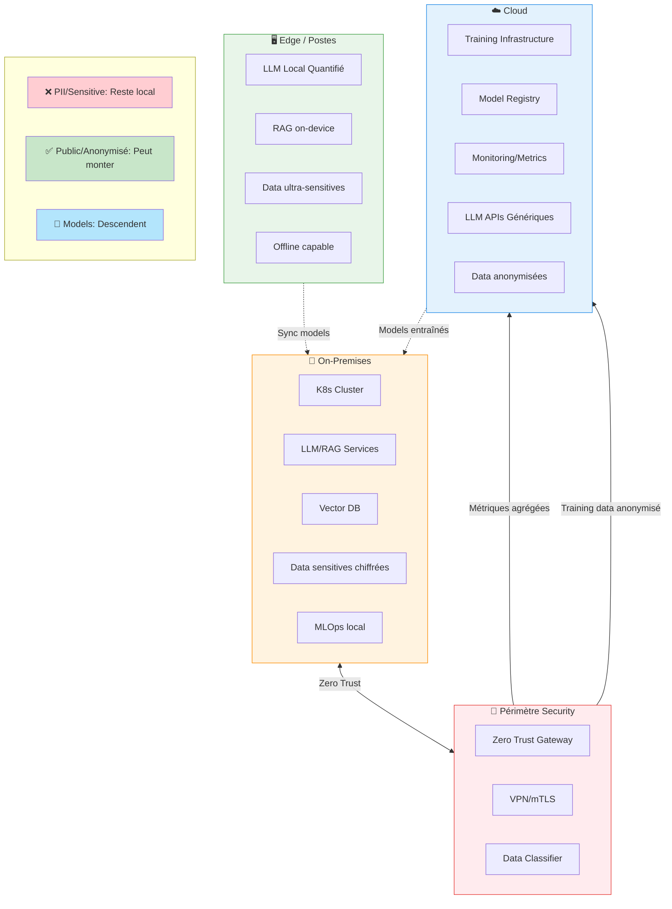

# Which architecture hybride recommander for workloads sensitives

Pour des workloads sensitives, la recommendation courante is une architecture hybride où les data critiques restent traitées on‑prem/edge and où le cloud n'est utilisé que for l'entrainement lourd, l'agrégation de métriques or des models généralistes on data non sensitives.[^1][^2]

## Architecture Hybride for Workloads Sensitives

## Principles de base

- Localiser le traitement des data sensitives (PII, santé, RH, IP) on workstation or servers on‑prem, in le périmètre de security de l’organisation, for simplifier conformité and souveraineté.[^3][^4][^2]
- Utiliser le cloud for les workloads non sensitives or anonymisés : training de models génériques, analytics agrégées, services LLM publics on prompts/documents “publics”.[^5][^6][^1]

## Breakdown logique des workloads

- Plan de control / orchestration en cloud private or public : registry de models, configuration, supervision, but without data brutes sensitives.[^7][^8]
- Plan de data and d’inference sensitive on‑prem : LLM/RAG/doc intelligence déployés in le datacenter internal or on postes renforcés, with éventuels connecteurs optionnels vers des LLM cloud uniquement for contenus non sensitives.[^4][^2][^9]

## Architecture cible (vue simplifiée)

- Edge/postes and servers départementaux :
    - Services d’inference locaux (LLM, OCR, vision, classification) déployés via un orchestrateur internal (K8s on‑prem, Talos, K3s, etc.).[^10][^4]
    - Storage local chiffré (documents, embeddings, logs) with accès restricted (RBAC, segmentation network).[^11][^4]
- Cloud :
    - Training/fine‑tuning on data pseudonymisées or synthétiques, and storage des models maîtres.[^1][^5]
    - Services managés for monitoring, registry de features, MLOps, bastion d’observabilité, with retour des métriques agrégées depuis l’on‑prem.[^6][^7]

## Security : Zero Trust \& gouvernance

- Appliquer du Zero Trust de bout en bout : authentication forte, micro‑segmentation, vérification continue des identités de workloads (SPIFFE/SPIRE, Vault, etc.).[^12][^13][^14]
- Encryption systématique : au repos on l’edge and on‑prem, and en transit vers le cloud (VPN, TLS mutualisé), with politiques claires de classification de data définissant ce qui can sortir or non.[^15][^16]

## Flow de data “privacy first”

- Les data brutes sensitives restent localement ; seuls des signaux dérivés or agrégés (statistiques, gradients FL, logs anonymisés) montent vers le cloud.[^17][^1]
- Pour certains cas limitations, usage de techniques avancées (federated learning, FHE, TEEs) for déporter une partie de la load tout en conservant la confidentialité.[^18][^19]

### Exemple de pattern concret

- On‑prem/edge : OnPrem.LLM or équivalent for RAG on documents internals, with models quantifiés hébergés on GPU locaux, UI web internal.[^9][^4]
- Cloud : LLM public or “sovereign cloud” utilisé for rédaction générique or traitement de docs publics, appelé uniquement quand le classifieur local conclut que le contenu n’est pas sensitive.[^2][^8][^5]

Si tu précises ton secteur (santé, banque, secteur public…), les contraintes réglementaires (RGPD strict, data hors UE, etc.) and ton stack K8s actuel, l’architecture can être affinée jusqu’au niveau composants (ingress, opérateurs d’IA, types de storage, patterns de synchronisation).
[^20]

⁂

[^1]: https://gleecus.com/blogs/the-edge-to-cloud-a-hybrid-approach-for-your-ai-strategy/

[^2]: https://radicalbit.ai/resources/blog/cloud-onprem-llm/

[^3]: https://www.ibm.com/think/topics/edge-ai

[^4]: https://arxiv.org/html/2505.07672v2

[^5]: https://www.newline.co/@zaoyang/hybrid-cloud-vs-on-premise-llm-deployment--74f51098

[^6]: https://www.cloudera.com/resources/faqs/hybrid-data.html

[^7]: https://www.kamiwaza.ai/hybrid-cloud-ai-architecture

[^8]: https://www.orange-business.com/en/blogs/ai-edge-finding-perfect-balance-between-cloud-premise-hosting-your-ai-services

[^9]: https://llm.co/blog/on-prem-llm-difficulty

[^10]: https://www.folio3.ai/blog/hybrid-cloud-edge-ai-architecture/

[^11]: https://www.sciencedirect.com/org/science/article/pii/S1546221825009725

[^12]: https://ideausher.com/blog/creating-hybrid-edge-cloud-agentic-ai/

[^13]: https://nvlpubs.nist.gov/nistpubs/specialpublications/NIST.SP.800-207.pdf

[^14]: https://www.paloaltonetworks.com/cyberpedia/what-is-a-zero-trust-architecture

[^15]: https://docs.cloud.google.com/architecture/hybrid-multicloud-patterns-and-practices/edge-hybrid-pattern

[^16]: https://www.fortinet.com/uk/resources/cyberglossary/zero-trust-edge

[^17]: https://www.nature.com/articles/s41598-025-09696-3

[^18]: https://arxiv.org/html/2505.23792v1

[^19]: https://www.zama.ai/post/hybrid-large-language-models-to-improve-on-premise-deployments-with-concrete-ml

[^20]: https://www.mirantis.com/blog/the-complete-guide-to-edge-computing-architecture/

