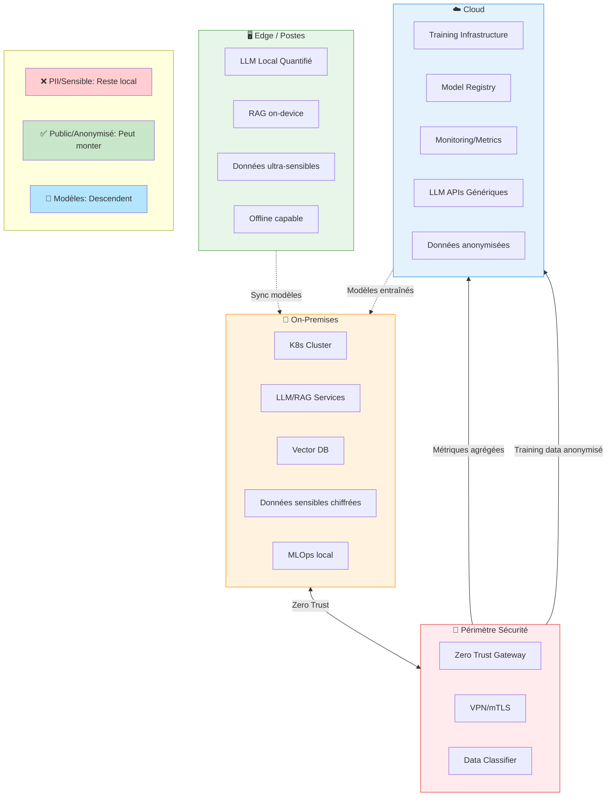

# Quelle architecture hybride recommander pour workloads sensibles

Pour des workloads sensibles, la recommandation courante est une architecture hybride où les données critiques restent traitées on‑prem/edge et où le cloud n'est utilisé que pour l'entrainement lourd, l'agrégation de métriques ou des modèles généralistes sur données non sensibles.[^1][^2]

## Architecture Hybride pour Workloads Sensibles

## Principes de base

- Localiser le traitement des données sensibles (PII, santé, RH, IP) sur poste de travail ou serveurs on‑prem, dans le périmètre de sécurité de l’organisation, pour simplifier conformité et souveraineté.[^3][^4][^2]
- Utiliser le cloud pour les workloads non sensibles ou anonymisés : entraînement de modèles génériques, analytics agrégées, services LLM publics sur prompts/documents “publics”.[^5][^6][^1]

## Découpage logique des workloads

- Plan de contrôle / orchestration en cloud privé ou public : registry de modèles, configuration, supervision, mais sans données brutes sensibles.[^7][^8]
- Plan de données et d’inférence sensible on‑prem : LLM/RAG/doc intelligence déployés dans le datacenter interne ou sur postes renforcés, avec éventuels connecteurs optionnels vers des LLM cloud uniquement pour contenus non sensibles.[^4][^2][^9]

## Architecture cible (vue simplifiée)

- Edge/postes et serveurs départementaux :
    - Services d’inférence locaux (LLM, OCR, vision, classification) déployés via un orchestrateur interne (K8s on‑prem, Talos, K3s, etc.).[^10][^4]
    - Stockage local chiffré (documents, embeddings, logs) avec accès restreint (RBAC, segmentation réseau).[^11][^4]
- Cloud :
    - Entraînement/fine‑tuning sur données pseudonymisées ou synthétiques, et stockage des modèles maîtres.[^1][^5]
    - Services managés pour monitoring, registry de features, MLOps, bastion d’observabilité, avec retour des métriques agrégées depuis l’on‑prem.[^6][^7]

## Sécurité : Zero Trust \& gouvernance

- Appliquer du Zero Trust de bout en bout : authentification forte, micro‑segmentation, vérification continue des identités de workloads (SPIFFE/SPIRE, Vault, etc.).[^12][^13][^14]
- Chiffrement systématique : au repos sur l’edge et on‑prem, et en transit vers le cloud (VPN, TLS mutualisé), avec politiques claires de classification de données définissant ce qui peut sortir ou non.[^15][^16]

## Flux de données “privacy first”

- Les données brutes sensibles restent localement ; seuls des signaux dérivés ou agrégés (statistiques, gradients FL, logs anonymisés) montent vers le cloud.[^17][^1]
- Pour certains cas limites, usage de techniques avancées (federated learning, FHE, TEEs) pour déporter une partie de la charge tout en conservant la confidentialité.[^18][^19]

### Exemple de pattern concret

- On‑prem/edge : OnPrem.LLM ou équivalent pour RAG sur documents internes, avec modèles quantifiés hébergés sur GPU locaux, UI web interne.[^9][^4]
- Cloud : LLM public ou “sovereign cloud” utilisé pour rédaction générique ou traitement de docs publics, appelé uniquement quand le classifieur local conclut que le contenu n’est pas sensible.[^2][^8][^5]

Si tu précises ton secteur (santé, banque, secteur public…), les contraintes réglementaires (RGPD strict, données hors UE, etc.) et ton stack K8s actuel, l’architecture peut être affinée jusqu’au niveau composants (ingress, opérateurs d’IA, types de stockage, patterns de synchronisation).
[^20]

⁂

[^1]: https://gleecus.com/blogs/the-edge-to-cloud-a-hybrid-approach-for-your-ai-strategy/

[^2]: https://radicalbit.ai/resources/blog/cloud-onprem-llm/

[^3]: https://www.ibm.com/think/topics/edge-ai

[^4]: https://arxiv.org/html/2505.07672v2

[^5]: https://www.newline.co/@zaoyang/hybrid-cloud-vs-on-premise-llm-deployment--74f51098

[^6]: https://www.cloudera.com/resources/faqs/hybrid-data.html

[^7]: https://www.kamiwaza.ai/hybrid-cloud-ai-architecture

[^8]: https://www.orange-business.com/en/blogs/ai-edge-finding-perfect-balance-between-cloud-premise-hosting-your-ai-services

[^9]: https://llm.co/blog/on-prem-llm-difficulty

[^10]: https://www.folio3.ai/blog/hybrid-cloud-edge-ai-architecture/

[^11]: https://www.sciencedirect.com/org/science/article/pii/S1546221825009725

[^12]: https://ideausher.com/blog/creating-hybrid-edge-cloud-agentic-ai/

[^13]: https://nvlpubs.nist.gov/nistpubs/specialpublications/NIST.SP.800-207.pdf

[^14]: https://www.paloaltonetworks.com/cyberpedia/what-is-a-zero-trust-architecture

[^15]: https://docs.cloud.google.com/architecture/hybrid-multicloud-patterns-and-practices/edge-hybrid-pattern

[^16]: https://www.fortinet.com/uk/resources/cyberglossary/zero-trust-edge

[^17]: https://www.nature.com/articles/s41598-025-09696-3

[^18]: https://arxiv.org/html/2505.23792v1

[^19]: https://www.zama.ai/post/hybrid-large-language-models-to-improve-on-premise-deployments-with-concrete-ml

[^20]: https://www.mirantis.com/blog/the-complete-guide-to-edge-computing-architecture/

