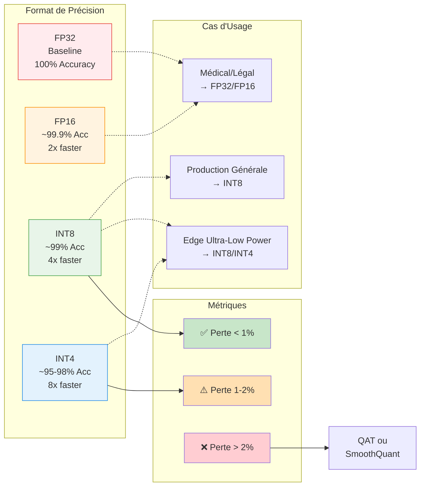

# Quelle précision modèle perd avec quantification 8bit sur NPU

Avec une quantification 8 bits bien faite, la plupart des modèles perdent très peu de précision (souvent < 1 point de pourcentage), même sur NPU edge, à condition d'utiliser les bonnes techniques (calibration correcte, schémas adaptés au hardware) et d'évaluer sur ton propre cas d'usage.[^1][^2][^3]

## Compromis Précision vs Performance

## Ordres de grandeur typiques en INT8

- Vision / classiques (ResNet, EfficientNet, etc.) : de nombreuses études montrent des écarts de l’ordre de 0–1 point de précision top‑1 entre FP32/FP16 et INT8 post‑training quantization bien calibrée.[^4][^2][^3]
- LLM et modèles texte : les guides récents indiquent qu’un INT8 “moderne” (LLM.int8, SmoothQuant, AWQ, etc.) perd généralement < 1 point sur des benchmarks globaux, parfois quasi rien avec QAT (quantization‑aware training).[^5][^6][^7][^8][^4]

Un exemple chiffré issu d’une étude pédagogique : un modèle passant de 85% à 83,5% en INT8 PTQ (≈1,5 point), alors que INT8 QAT remonte à 84,8% (écart résiduel 0,2 point).[^4]

## Spécificités côté NPU edge

- La plupart des NPUs imposent INT8 statique pour poids et activations, avec calibration offline et toolchain propriétaire.[^9]
- Sur ces plateformes, les travaux récents montrent qu’un INT8 bien aligné avec le compilateur NPU peut rester dans la même plage de perte qu’en GPU/CPU (souvent < 1–2 points), mais :
    - La qualité dépend fortement de la calibration (jeu de données représentatif) et de l’algorithme de quantification choisi.[^10][^3][^9]
    - Une quantification naïve ou mal calibrée peut provoquer des chutes plus sévères, surtout pour des modèles très sensibles (LLM, modèles avec fortes valeurs extrêmes).[^7][^3][^10]

Des méthodes comme SmoothQuant, LLM.int8, Quant‑Trim ou QAT sont justement conçues pour rendre ces INT8 robustes aux différences de backend (GPU vs NPU) et réduire la variabilité de précision.[^6][^11][^7][^9]

## Règles pratiques pour estimer la perte

- Attente réaliste pour du INT8 bien fait :
    - Vision / classification / détection : souvent 0–1 point de perte, parfois négligeable.[^2][^4]
    - LLM / RAG : généralement < 1 point sur des scores agrégés, avec possibilité de dérive un peu plus forte sur certaines tâches fines (math, logique), d’où l’importance de tester tes propres métriques.[^12][^5][^1]
- Si tu observes > 2–3 points de perte :
    - Revoir la calibration et le schéma (per‑channel vs per‑tensor, clipping), voire envisager QAT ou des schémas hybrides (W8/A16).[^8][^9][^4]

En résumé, sur un NPU moderne, un modèle INT8 bien quantifié garde en général une précision très proche de FP16/FP32 (souvent < 1% d’écart), avec un gain massif en perf/watt, mais il faut systématiquement valider sur ton jeu de tests métier pour confirmer que cette perte est acceptable.[^3][^1][^2]
[^13][^14][^15][^16][^17][^18][^19][^20]

⁂

[^1]: https://latitude-blog.ghost.io/blog/how-quantization-reduces-llm-latency/

[^2]: https://www.clarifai.com/blog/model-quantization

[^3]: https://massedcompute.com/faq-answers/?question=What+is+the+impact+of+quantization+on+the+accuracy+of+edge+AI+models%3F

[^4]: https://apxml.com/courses/practical-llm-quantization/chapter-6-evaluating-deploying-quantized-llms/accuracy-performance-tradeoffs

[^5]: https://compute.hivenet.com/post/llm-quantization-guide

[^6]: https://arxiv.org/pdf/2211.10438.pdf

[^7]: https://arxiv.org/html/2411.02530v1

[^8]: https://developer.nvidia.com/blog/optimizing-llms-for-performance-and-accuracy-with-post-training-quantization/

[^9]: https://arxiv.org/html/2511.15300v1

[^10]: https://datature.com/blog/introducing-post-training-quantization-feature-and-mechanics-explained

[^11]: https://huggingface.co/docs/bitsandbytes/reference/nn/linear8bit

[^12]: https://www.edge-ai-vision.com/2025/08/optimizing-llms-for-performance-and-accuracy-with-post-training-quantization/

[^13]: https://bentoml.com/llm/getting-started/llm-quantization

[^14]: https://milvus.io/ai-quick-reference/how-does-quantization-such-as-int8-quantization-or-using-float16-affect-the-accuracy-and-speed-of-sentence-transformer-embeddings-and-similarity-calculations

[^15]: https://www.aiacceleratorinstitute.com/how-to-8-bit-quantize-large-models-using-bits-and-bytes/

[^16]: https://www.newline.co/@zaoyang/4-bit-vs-8-bit-quantization-key-differences--842272c7

[^17]: https://www.emergentmind.com/topics/int8-quantized-training

[^18]: https://www.newline.co/@zaoyang/how-quantization-reduces-memory-in-edge-llms--6d6cb538

[^19]: https://www.linkedin.com/pulse/model-quantization-rise-edge-ai-naresh-matta-qougc

[^20]: https://docs.netspresso.ai/docs/post-training-int8-quantization

