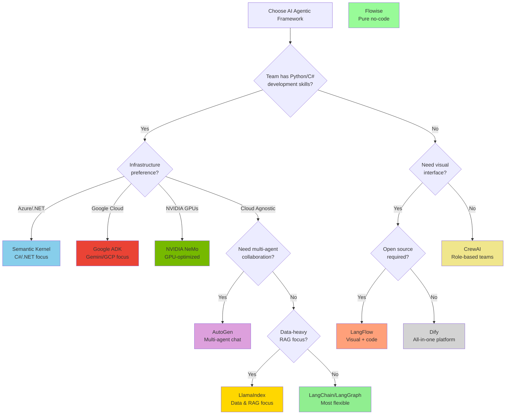

# AI Implementation Decision Framework

Comprehensive assessment process to determine whether a use case should be implemented with **Standard Development**, **AI/ML**, or **AI Agentic** approaches.

## Overview

This framework provides a structured methodology to evaluate use cases and select the appropriate implementation strategy based on technical requirements, business constraints, and architectural considerations.

**Decision Flow**:
```
Use Case → Assessment → Category → Technology Selection → Implementation
```

---

## Quick Decision Matrix

| Characteristic | Standard Development | AI/ML | AI Agentic |
|---------------|---------------------|-------|------------|
| **Problem Type** | Deterministic, rule-based | Pattern recognition, prediction | Multi-step reasoning, dynamic planning |
| **Requirements** | Fixed, well-defined | Data-driven, statistical | Autonomous decision-making |
| **Complexity** | Low-Medium | Medium | High |
| **Autonomy Level** | None | Limited | High |
| **Human Involvement** | Continuous | Training phase | Oversight/approval |
| **Data Needs** | Structured data | Large labeled datasets | Varied data + context |
| **Latency Tolerance** | Low | Medium | Medium-High |
| **Cost** | Low | Medium | High |
| **Explainability** | Full | Limited | Limited |
| **Maintenance** | Updates for changes | Retraining needed | Continuous learning |

---

## Assessment Process (5 Phases)

### Phase 1: Use Case Analysis (15-30 minutes)

**Objective**: Understand the use case characteristics and requirements.

#### 1.1 Problem Definition
```markdown
□ Clear problem statement defined
□ Success criteria identified
□ Stakeholders mapped
□ Current solution (if any) documented
□ Pain points identified
```

**Questions to Answer**:
1. What problem are we solving?
2. What does success look like?
3. Who are the users/stakeholders?
4. What is the current state vs desired state?
5. What are the key constraints (time, budget, skills)?

#### 1.2 Requirements Gathering

**Functional Requirements**:
- [ ] Input/output specifications
- [ ] Performance requirements (accuracy, speed, throughput)
- [ ] Integration requirements (systems, APIs, databases)
- [ ] User interface requirements
- [ ] Security/compliance requirements

**Non-Functional Requirements**:
- [ ] Latency requirements (real-time, near-real-time, batch)
- [ ] Availability requirements (24/7, business hours)
- [ ] Scalability requirements (users, volume, growth)
- [ ] Cost constraints (development, operational)
- [ ] Maintenance expectations

---

### Phase 2: Technical Feasibility Assessment (30-60 minutes)

Use the following scoring system for each dimension (0-5 scale):
- **0-1**: Very Low
- **2**: Low
- **3**: Medium
- **4**: High
- **5**: Very High

#### 2.1 Complexity Dimensions

| Dimension | Score (0-5) | Notes |
|-----------|-------------|-------|
| **Business Logic Complexity** | | Fixed rules vs dynamic patterns? |
| **Data Variety** | | Structured vs unstructured data? |
| **Decision Complexity** | | Simple if/then vs multi-step reasoning? |
| **Integration Complexity** | | Number of systems to integrate? |
| **Autonomy Required** | | Human-in-loop vs autonomous? |
| **Context Sensitivity** | | Fixed context vs dynamic adaptation? |
| **Natural Language Processing** | | Text/speech understanding needed? |
| **Reasoning Depth** | | Single-step vs multi-step reasoning? |
| **Tool/API Usage** | | Number of external tools needed? |
| **Learning Requirements** | | Static logic vs learning from data? |

**Total Score**: ____ / 50

**Interpretation**:
- **0-15**: Standard Development likely sufficient
- **16-30**: AI/ML appropriate
- **31-50**: AI Agentic recommended

#### 2.2 Data Assessment

```markdown
Available Data:
□ Structured data (databases, spreadsheets)
□ Unstructured data (text, images, audio, video)
□ Real-time data streams
□ Historical data (size: _____)
□ Labeled training data available
□ Quality: High / Medium / Low

Data Gaps:
□ Missing data types identified
□ Labeling effort required: _____ hours
□ Data collection strategy defined
```

**Data Readiness Score**:
- High: Sufficient quality data available
- Medium: Data exists but needs preparation
- Low: Significant data collection/labeling needed

---

### Phase 3: Implementation Category Selection

#### Decision Tree


#### Category Characteristics

**✅ Standard Development**
- Deterministic business logic
- Well-defined rules and workflows
- Structured data inputs
- Fixed decision trees
- Low complexity
- Full explainability required

**✅ AI/ML Implementation**
- Pattern recognition (classification, regression, clustering)
- Single-step predictions
- Large datasets available
- Statistical modeling appropriate
- Limited natural language processing
- Supervised/unsupervised learning

**✅ AI Agentic Implementation**
- Multi-step reasoning required
- Dynamic planning and replanning
- Multiple tool/API orchestration
- Natural language understanding critical
- Autonomous decision-making
- Context-aware adaptability
- Human-in-the-loop for oversight

---

### Phase 4: Technology Stack Selection

Once category is determined, select appropriate technologies:

#### Standard Development Stack

| Component | Technology Options |
|-----------|-------------------|
| **Language** | Python, Java, Go, Node.js, C# |
| **Framework** | Django, Spring Boot, Express.js, .NET |
| **Database** | PostgreSQL, MySQL, MongoDB |
| **API** | REST, GraphQL |
| **Integration** | Apache Camel, MuleSoft, custom APIs |
| **Orchestration** | Airflow, Temporal, custom workflows |

**When to Choose**:
- Business rules can be hardcoded
- Logic is deterministic and testable
- Performance is critical (< 100ms)
- Full auditability required
- Development team has traditional skills

---

#### AI/ML Stack

| Component | Technology Options |
|-----------|-------------------|
| **Framework** | scikit-learn, PyTorch, TensorFlow |
| **Model Type** | Classification, Regression, Clustering, NLP (BERT/transformers) |
| **Training Platform** | Jupyter, SageMaker, Vertex AI, Azure ML |
| **Model Serving** | FastAPI, TensorFlow Serving, Triton, TorchServe |
| **MLOps** | MLflow, Weights & Biases, Kubeflow |
| **Monitoring** | Prometheus, Grafana, Arize, WhyLabs |

**When to Choose**:
- Pattern recognition required
- Large labeled dataset available
- Single-step inference (input → output)
- Acceptable accuracy threshold (e.g., 95%)
- Latency acceptable (< 500ms)

**Use Case Examples**:
- Image classification
- Sentiment analysis
- Fraud detection
- Recommendation systems
- Predictive maintenance

---

#### AI Agentic Stack

| Component | Technology Options |
|-----------|-------------------|
| **Agent Framework (Code-First)** | LangChain/LangGraph, LlamaIndex, Semantic Kernel, AutoGen, CrewAI, Haystack, Google ADK, NVIDIA NeMo |
| **Agent Framework (Low-Code)** | LangFlow, Flowise, Dify, n8n AI |
| **LLM Provider** | OpenAI GPT-4, Azure OpenAI, Anthropic Claude, Bedrock, Ollama (local), NVIDIA NIM |
| **Memory/State** | Redis, PostgreSQL, MongoDB, Vector DB |
| **Tools/APIs** | Custom functions, REST APIs, database connectors |
| **Orchestration** | LangGraph, Semantic Kernel workflows |
| **Guardrails** | NeMo Guardrails, Guardrails AI, LLM Guard |
| **Observability** | LangSmith, Phoenix, Arize |
| **Security** | HashiCorp Vault, Azure Key Vault, Okta |

**When to Choose**:
- Multi-step reasoning required
- Natural language is primary interface
- Dynamic tool selection needed
- Context-aware responses required
- Autonomous decision-making with oversight
- Complex workflows with branching logic

**Use Case Examples**:
- Customer support agents
- Research assistants
- Code generation and debugging
- Document processing and analysis
- IT service management automation
- Data analysis and reporting

##### Choosing the Right AI Agentic Framework

Once you've decided on AI Agentic approach, select the appropriate framework based on your team's skills and requirements:

**Code-First Frameworks** (Python/C# developers)

| Framework | Best For | Strengths | Limitations |
|-----------|----------|-----------|-------------|
| **LangChain/LangGraph** | Complex multi-agent systems | Rich ecosystem, graph-based orchestration, extensive integrations | Steeper learning curve, verbose API |
| **LlamaIndex** | Data-heavy applications | Excellent data connectors, RAG optimization, structured outputs | Less focus on multi-agent orchestration |
| **Semantic Kernel** | Microsoft ecosystem | Native Azure integration, C#/.NET support, enterprise patterns | Smaller community, fewer integrations |
| **AutoGen** | Multi-agent collaboration | Advanced agent communication, group chat patterns, code execution | Research-oriented, production readiness varies |
| **CrewAI** | Role-based agent teams | Simple role definitions, task delegation, good for hierarchical workflows | Limited customization, opinionated structure |
| **Haystack** | Search & retrieval focused | Production-ready pipelines, strong RAG capabilities | Less flexibility for complex reasoning |
| **Google ADK** | Google Cloud/Gemini ecosystem | Native Gemini integration, Vertex AI support, Google Cloud services, function calling | Google Cloud dependency, newer framework, smaller community |
| **NVIDIA NeMo** | NVIDIA hardware/enterprise AI | Optimized for NVIDIA GPUs, NIM microservices, enterprise support, guardrails, multimodal | NVIDIA ecosystem lock-in, enterprise pricing, steeper setup |

**Low-Code/Visual Frameworks** (non-developers, rapid prototyping)

| Framework | Best For | Strengths | Limitations |
|-----------|----------|-----------|-------------|
| **LangFlow** | Visual flow design | Drag-and-drop interface, LangChain compatibility, rapid prototyping | Limited complex logic, harder to version control |
| **Flowise** | No-code agent building | Easy to use, good for simple chatbots, open source | Limited enterprise features, simpler use cases only |
| **Dify** | All-in-one platform | Built-in RAG, prompt management, deployment included | Opinionated architecture, vendor lock-in risk |
| **n8n AI** | Workflow automation | Strong integrations, automation focus, self-hostable | Not agent-specific, requires workflow thinking |

**Framework Selection Decision Tree**:



**Recommended Approach by Use Case**:

| Use Case Type | Recommended Framework | Reason |
|---------------|----------------------|--------|
| Customer Support Chatbot | LangChain/LangGraph | Complex routing, multiple tools, mature ecosystem |
| Document Analysis Pipeline | LlamaIndex | Excellent document loaders, RAG optimization |
| Enterprise Integration (.NET) | Semantic Kernel | Native Azure/Microsoft integration |
| Research Assistant (multi-agent) | AutoGen | Strong multi-agent communication patterns |
| IT Helpdesk Automation | CrewAI | Clear role hierarchies, task delegation |
| RAG Search Application | Haystack | Production-ready RAG, strong retrieval |
| Google Cloud Native Agent | Google ADK | Native Gemini, Vertex AI, GCP services integration |
| NVIDIA GPU-Optimized Agent | NVIDIA NeMo | Optimized inference on NVIDIA hardware, NIM deployment |
| Rapid Prototyping | LangFlow | Visual design, fast iteration, code export |
| Citizen Developer Tool | Flowise | No-code, simple deployment |
| All-in-one Solution | Dify | Includes hosting, RAG, prompts out-of-box |

**Framework Maturity Matrix**:

| Framework | Maturity | Enterprise Ready | Community Size | Learning Curve |
|-----------|----------|------------------|----------------|----------------|
| LangChain/LangGraph | High | ✅ Yes | Very Large | Medium-High |
| LlamaIndex | High | ✅ Yes | Large | Medium |
| Semantic Kernel | Medium | ✅ Yes | Medium | Medium |
| Google ADK | Low-Medium | ⚠️ Partial | Small | Medium |
| NVIDIA NeMo | Medium-High | ✅ Yes | Medium | Medium-High |
| AutoGen | Medium | ⚠️ Partial | Medium | High |
| CrewAI | Low-Medium | ⚠️ Partial | Small-Medium | Low |
| Haystack | High | ✅ Yes | Medium | Medium |
| LangFlow | Medium | ⚠️ Partial | Medium | Low |
| Flowise | Low-Medium | ❌ No | Small | Very Low |
| Dify | Medium | ⚠️ Partial | Medium | Low |

**Key Selection Criteria**:

1. **Choose LangChain/LangGraph if**:
   - Need maximum flexibility and control
   - Complex multi-step workflows with branching
   - Large team with Python expertise
   - Want extensive integration options
   - Need LangSmith observability

2. **Choose LlamaIndex if**:
   - RAG (Retrieval-Augmented Generation) is core requirement
   - Working with diverse data sources
   - Need strong document processing
   - Want structured data outputs

3. **Choose Semantic Kernel if**:
   - .NET/C# is primary language
   - Deep Azure integration required
   - Microsoft enterprise environment
   - Want native async/await patterns

4. **Choose Google ADK if**:
   - Building on Google Cloud Platform
   - Using Gemini models (Gemini 2.0, Gemini Pro)
   - Need Vertex AI integration
   - Want native Google services integration (BigQuery, Cloud Functions, etc.)
   - Prefer Google's function calling approach
   - Team comfortable with Google ecosystem

5. **Choose NVIDIA NeMo if**:
   - Have NVIDIA GPU infrastructure (A100, H100, L40S)
   - Need optimized inference performance
   - Want to deploy with NVIDIA NIM microservices
   - Require multimodal capabilities (text, image, speech)
   - Need enterprise support from NVIDIA
   - Building on NVIDIA AI Enterprise platform
   - Want built-in guardrails (NeMo Guardrails)

6. **Choose AutoGen if**:
   - Need sophisticated multi-agent collaboration
   - Agents must negotiate and communicate
   - Research/experimental project
   - Code execution safety is handled

7. **Choose CrewAI if**:
   - Simple hierarchical agent teams
   - Clear role definitions (manager, worker, etc.)
   - Fast development timeline
   - Less customization needed

8. **Choose Haystack if**:
   - Production RAG pipeline is priority
   - Search and retrieval focused
   - Need battle-tested components
   - Want pipeline-based architecture

9. **Choose LangFlow if**:
   - Need visual design interface
   - Rapid prototyping required
   - Team includes non-developers
   - Want to export to LangChain code

10. **Choose Flowise if**:
    - Pure no-code requirement
    - Simple chatbot use case
    - Limited technical resources
    - Quick POC needed

11. **Choose Dify if**:
    - Want all-in-one solution
    - Need hosting included
    - Small team with limited DevOps
    - Prefer opinionated architecture

---

### Phase 5: Cost-Benefit Analysis

#### Cost Estimation

**Standard Development**:
```
Development Cost:
- Engineer time: ____ hours × $____ /hour = $____
- Infrastructure: $____ /month
- Maintenance: ____ hours/month × $____ /hour = $____

Total 3-Year TCO: $____
```

**AI/ML Implementation**:
```
Development Cost:
- Data preparation: ____ hours × $____ /hour = $____
- Model development: ____ hours × $____ /hour = $____
- Infrastructure (GPU/training): $____ /month
- Model serving: $____ /month
- Monitoring: $____ /month
- Retraining: ____ hours/quarter × $____ /hour = $____

Total 3-Year TCO: $____
```

**AI Agentic Implementation**:
```
Development Cost:
- Agent design: ____ hours × $____ /hour = $____
- LLM integration: ____ hours × $____ /hour = $____
- Tool integration: ____ hours × $____ /hour = $____
- LLM API costs: $____ /month (token usage)
- Infrastructure: $____ /month
- Guardrails: $____ /month
- Observability: $____ /month
- Maintenance: ____ hours/month × $____ /hour = $____

Total 3-Year TCO: $____
```

#### Value Assessment

**Quantifiable Benefits**:
- Time saved: ____ hours/month × $____ /hour = $____
- Error reduction: ____ % × $____ cost = $____
- Efficiency gain: ____ % increase = $____
- Revenue impact: $____ /month

**Qualitative Benefits**:
- [ ] Improved user experience
- [ ] Competitive advantage
- [ ] Innovation enablement
- [ ] Scalability improvement
- [ ] Risk reduction

**ROI Calculation**:
```
3-Year Value: $____
3-Year Cost: $____
Net Benefit: $____
ROI: _____%
Payback Period: ____ months
```

---

## Assessment Worksheet Template

### Use Case Information

```markdown
# Use Case Assessment

**Date**: _______________
**Assessor**: _______________
**Use Case Name**: _______________

## 1. Problem Statement
[Describe the problem in 2-3 sentences]

## 2. Current Solution (if any)
[Describe current approach and limitations]

## 3. Technical Requirements

### Input/Output
- **Input**: [Data types, sources, volume]
- **Output**: [Expected results, format]
- **Latency**: [Real-time / Near-real-time / Batch]

### Complexity Scoring
| Dimension | Score (0-5) | Justification |
|-----------|-------------|---------------|
| Business Logic | | |
| Data Variety | | |
| Decision Complexity | | |
| Integration Needs | | |
| Autonomy Required | | |
| Context Sensitivity | | |
| NLP Requirements | | |
| Reasoning Depth | | |
| Tool Usage | | |
| Learning Needs | | |
| **TOTAL** | __/50 | |

### Data Assessment
- **Available Data**: [Types, volume, quality]
- **Labeled Data**: Yes / No (If yes, size: ____)
- **Data Gaps**: [List gaps]

## 4. Decision

### Recommended Approach
- [ ] Standard Development
- [ ] AI/ML Implementation  
- [ ] AI Agentic Implementation
- [ ] Hybrid Approach

### Justification
[2-3 sentences explaining the decision]

### Technology Stack
[List recommended technologies]

## 5. Cost-Benefit Summary

**Estimated 3-Year TCO**: $____
**Estimated 3-Year Value**: $____
**ROI**: ____%
**Payback Period**: ____ months

## 6. Risks & Mitigations

| Risk | Likelihood | Impact | Mitigation |
|------|------------|--------|------------|
| | | | |

## 7. Next Steps

1. [ ] Step 1
2. [ ] Step 2
3. [ ] Step 3

## 8. Approvals

- **Technical Lead**: _______________ Date: _____
- **Product Owner**: _______________ Date: _____
- **Architect**: _______________ Date: _____
```

---

## Use Case Examples with Classifications

### Example 1: Invoice Processing

**Problem**: Extract data from invoices (PDF/images) and validate against purchase orders.

**Assessment**:
- Business Logic Complexity: 2 (fixed validation rules)
- Data Variety: 4 (unstructured PDFs/images)
- Decision Complexity: 2 (simple matching)
- Integration: 3 (ERP, document storage)
- Autonomy: 2 (human review needed)
- Context: 2 (fixed business rules)
- NLP: 3 (OCR + basic text extraction)
- Reasoning: 2 (single-step validation)
- Tools: 2 (OCR, ERP API)
- Learning: 3 (OCR model, layout understanding)

**Total: 25/50** → **AI/ML Implementation**

**Recommended Stack**:
- Document AI / Azure Form Recognizer / AWS Textract
- Python + FastAPI
- Traditional validation logic
- Human-in-the-loop for exceptions

---

### Example 2: Customer Support Chatbot

**Problem**: Handle customer inquiries across multiple topics with access to knowledge base, order history, and ability to create tickets.

**Assessment**:
- Business Logic Complexity: 3 (varied queries)
- Data Variety: 4 (text, KB, structured data)
- Decision Complexity: 4 (multi-turn conversations)
- Integration: 5 (KB, CRM, ticketing, order system)
- Autonomy: 4 (autonomous within guardrails)
- Context: 5 (conversation history, user context)
- NLP: 5 (advanced understanding required)
- Reasoning: 5 (multi-step problem solving)
- Tools: 5 (multiple API calls)
- Learning: 4 (continuous improvement)

**Total: 44/50** → **AI Agentic Implementation**

**Recommended Stack**:
- LangChain/LangGraph + Azure OpenAI
- Vector DB (Pinecone/Chroma) for knowledge base
- Tool integrations (CRM API, Ticketing API)
- Guardrails for safety
- LangSmith for observability

---

### Example 3: Discount Calculation Engine

**Problem**: Calculate product discounts based on customer tier, order volume, promotions, and seasonal rules.

**Assessment**:
- Business Logic Complexity: 2 (clear rules)
- Data Variety: 1 (structured data)
- Decision Complexity: 2 (rule-based logic)
- Integration: 2 (pricing DB, customer DB)
- Autonomy: 1 (deterministic)
- Context: 1 (fixed rules)
- NLP: 0 (no NLP needed)
- Reasoning: 1 (simple calculation)
- Tools: 1 (database queries)
- Learning: 0 (no learning needed)

**Total: 11/50** → **Standard Development**

**Recommended Stack**:
- Python/Java business logic
- PostgreSQL for rules/data
- REST API
- Unit tests for all rules
- Configuration-driven rules engine

---

### Example 4: Code Review Assistant

**Problem**: Analyze pull requests, identify potential issues, suggest improvements, check against coding standards, and generate review comments.

**Assessment**:
- Business Logic Complexity: 4 (varied code patterns)
- Data Variety: 4 (code, diffs, docs)
- Decision Complexity: 5 (multi-aspect analysis)
- Integration: 4 (Git, CI/CD, IDE)
- Autonomy: 3 (suggests, human decides)
- Context: 5 (codebase understanding)
- NLP: 4 (code understanding)
- Reasoning: 5 (multi-step analysis)
- Tools: 4 (static analysis, linters, tests)
- Learning: 4 (codebase patterns)

**Total: 42/50** → **AI Agentic Implementation**

**Recommended Stack**:
- LangChain + OpenAI GPT-4 / Claude
- GitHub API integration
- Vector DB for codebase context
- Static analysis tools integration
- LangSmith for tracking

---

## Risk Assessment Matrix

| Risk Type | Standard Dev | AI/ML | AI Agentic |
|-----------|-------------|-------|------------|
| **Technical Complexity** | Low | Medium | High |
| **Skill Requirements** | Low | Medium | High |
| **Development Time** | Short | Medium | Long |
| **Operational Complexity** | Low | Medium | High |
| **Cost Uncertainty** | Low | Medium | High |
| **Performance Variability** | Low | Medium | High |
| **Explainability** | High | Medium | Low |
| **Regulatory Risk** | Low | Medium | High |
| **Vendor Lock-in** | Low | Low-Medium | Medium-High |
| **Maintenance Burden** | Low | Medium | High |

---

## Decision-Making Checklist

### Standard Development is RIGHT if:
- [ ] All business rules are well-defined and deterministic
- [ ] No pattern recognition or learning required
- [ ] Full explainability and auditability mandatory
- [ ] Performance requirements < 100ms
- [ ] Team has limited AI/ML expertise
- [ ] Budget constraints are tight

### AI/ML is RIGHT if:
- [ ] Pattern recognition from data required
- [ ] Large labeled dataset available (or can be created)
- [ ] Single-step prediction/classification needed
- [ ] Acceptable accuracy threshold defined (e.g., 95%)
- [ ] Team has ML expertise or can acquire it
- [ ] Retraining pipeline can be established

### AI Agentic is RIGHT if:
- [ ] Multi-step reasoning required
- [ ] Natural language is primary interface
- [ ] Dynamic tool/API orchestration needed
- [ ] Context-aware behavior required
- [ ] Autonomous decision-making with oversight
- [ ] Budget supports LLM API costs
- [ ] Team has LLM integration expertise

---

## Implementation Roadmap

### Standard Development Path
1. **Week 1-2**: Requirements finalization, design
2. **Week 3-6**: Development, unit testing
3. **Week 7**: Integration testing
4. **Week 8**: UAT and deployment

**Duration**: 2 months  
**Team**: 1-2 developers

---

### AI/ML Path
1. **Week 1-2**: Data collection and labeling strategy
2. **Week 3-4**: Data preparation and EDA
3. **Week 5-8**: Model development and training
4. **Week 9-10**: Model evaluation and tuning
5. **Week 11-12**: Deployment and monitoring setup
6. **Week 13**: UAT and production deployment

**Duration**: 3-4 months  
**Team**: 1 ML engineer, 1 data engineer, 1 MLOps engineer

---

### AI Agentic Path
1. **Week 1-2**: Agent design and tool mapping
2. **Week 3-4**: LLM selection and prompt engineering
3. **Week 5-8**: Tool integration and orchestration
4. **Week 9-10**: Guardrails and security implementation
5. **Week 11-12**: Observability and monitoring
6. **Week 13-14**: Testing (unit, integration, end-to-end)
7. **Week 15-16**: UAT and production deployment

**Duration**: 4-5 months  
**Team**: 1-2 AI engineers, 1 backend engineer, 1 security engineer

---

## References

- [AI Agent Security Layer](../security/ai-agent-security/index.md)
- [Agent Frameworks Comparison](../architecture/agent-frameworks-comparison.md)
- [TCO Analysis](../cost-economics/tco-analysis.md)
- [Decision Trees](decision-trees.md)

---

**Last Updated**: December 12, 2025
