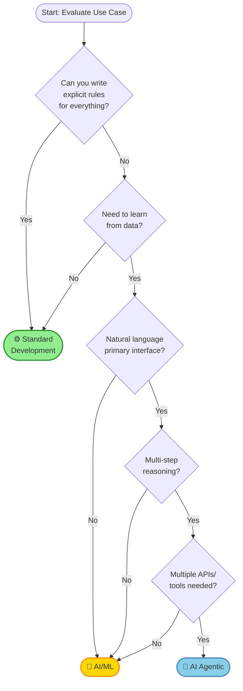

# AI Implementation Quick Reference Guide

Visual decision tools and cheat sheets for rapidly categorizing use cases.

## 🎯 30-Second Decision Tool

Answer these 3 questions:

### Question 1: Is the logic deterministic?
- **YES** → Consider Standard Development
- **NO** → Continue to Question 2

### Question 2: Does it need multi-step reasoning?
- **NO** → Consider AI/ML
- **YES** → Continue to Question 3

### Question 3: Does it orchestrate multiple tools/APIs?
- **YES** → Use AI Agentic
- **NO** → Use AI/ML

---

## 📊 Visual Decision Tree

---

## 🔍 Pattern Recognition Cards

### ⚙️ Standard Development Patterns

**Go Standard If:**
- ✅ Fixed business rules (e.g., discount calculations, approval workflows)
- ✅ Deterministic logic (same input → same output always)
- ✅ Performance critical (< 100ms response time)
- ✅ Full audit trail required
- ✅ Traditional team skillset

**Examples:**
- Payment processing
- Inventory management
- Order routing
- Configuration management
- Batch ETL jobs

**Tech Stack:**
- Backend: Python/Java/Go/Node.js
- Database: PostgreSQL/MySQL
- API: REST/GraphQL
- Testing: Unit/integration tests

---

### 🤖 AI/ML Patterns

**Go AI/ML If:**
- ✅ Pattern recognition (fraud detection, image classification)
- ✅ Predictions from data (sales forecasting, churn prediction)
- ✅ Content recommendations
- ✅ Anomaly detection
- ✅ Single-step inference (input → prediction)

**Examples:**
- Spam detection
- Image/video analysis
- Product recommendations
- Predictive maintenance
- Sentiment analysis
- OCR/document extraction

**Tech Stack:**
- Frameworks: scikit-learn, PyTorch, TensorFlow
- Platforms: SageMaker, Vertex AI, Azure ML
- Serving: FastAPI, TensorFlow Serving
- MLOps: MLflow, Kubeflow

**Requirements:**
- Large labeled dataset (1,000+ examples minimum)
- Acceptable error rate (e.g., 95% accuracy)
- Retraining pipeline
- Model monitoring

---

### 🧠 AI Agentic Patterns

**Go AI Agentic If:**
- ✅ Natural language is the interface
- ✅ Multi-step reasoning required
- ✅ Dynamic tool selection needed
- ✅ Orchestrates multiple APIs/systems
- ✅ Context-aware responses
- ✅ Autonomous but with oversight

**Examples:**
- Customer support chatbots
- Research assistants
- Code review/generation
- IT service automation
- Document analysis pipelines
- Data analysis agents

**Tech Stack:**

*Code-First Frameworks*:
- LangChain/LangGraph (most flexible, Python)
- LlamaIndex (RAG focus, Python)
- Semantic Kernel (C#/.NET, Azure)
- AutoGen (multi-agent, Python)
- CrewAI (role-based teams, Python)

*Low-Code Frameworks*:
- LangFlow (visual + LangChain, open source)
- Flowise (no-code, simple chatbots)
- Dify (all-in-one platform)

*Other Components*:
- LLMs: GPT-4, Claude, Azure OpenAI
- Memory: Vector DB, Redis
- Guardrails: NeMo, Guardrails AI
- Observability: LangSmith, Phoenix

**Requirements:**
- Budget for LLM API calls ($100-$10,000+/month)
- Security/compliance review
- Human oversight for critical actions
- Latency tolerance (1-10 seconds)

**Framework Selection Quick Guide**:
- **Max flexibility** → LangChain/LangGraph
- **RAG/data focus** → LlamaIndex
- **.NET/Azure** → Semantic Kernel
- **Multi-agent** → AutoGen
- **Visual design** → LangFlow
- **No-code** → Flowise

---

## ⚡ Fast Classification Checklist

Check all that apply, then count category totals:

### Standard Development (Count: ___)
- [ ] All logic can be coded as if/then rules
- [ ] Same input always gives same output
- [ ] No learning from data needed
- [ ] Latency must be < 100ms
- [ ] Full explainability required
- [ ] Team has no ML experience

### AI/ML (Count: ___)
- [ ] Need to recognize patterns in data
- [ ] Have 1,000+ labeled examples (or can create)
- [ ] Single prediction/classification step
- [ ] Some errors acceptable (e.g., 95% accuracy)
- [ ] Latency can be 100ms-500ms
- [ ] Team has ML skills or can hire

### AI Agentic (Count: ___)
- [ ] Natural language is primary interface
- [ ] Requires multi-step reasoning
- [ ] Must call multiple APIs/tools
- [ ] Context-aware behavior needed
- [ ] Can tolerate 1-10 second latency
- [ ] Budget for LLM API costs
- [ ] Team has LLM integration skills

**Highest count wins! If tied, prefer simpler approach (Standard > AI/ML > Agentic).**

---

## 💰 Cost Comparison (3-Year TCO)

| Category | Typical Range | Example Use Case |
|----------|--------------|------------------|
| **Standard Development** | $50K - $200K | Discount calculation engine |
| **AI/ML** | $100K - $500K | Fraud detection system |
| **AI Agentic** | $200K - $1M+ | Customer support agent |

**Cost Breakdown:**

### Standard Development
- Development: 2-4 months × $150K/year engineer = $25K-$50K
- Infrastructure: $100-$500/month = $3.6K-$18K (3 years)
- Maintenance: $10K-$30K/year = $30K-$90K

### AI/ML
- Development: 3-6 months × $180K/year engineer = $45K-$90K
- Data labeling: $10K-$50K
- Training infrastructure: $500-$2K/month = $18K-$72K
- Model serving: $200-$1K/month = $7K-$36K
- Maintenance/retraining: $20K-$50K/year = $60K-$150K

### AI Agentic
- Development: 4-6 months × $200K/year engineer = $65K-$100K
- LLM API: $500-$5K/month = $18K-$180K (3 years)
- Infrastructure: $500-$2K/month = $18K-$72K
- Guardrails/security: $10K-$30K
- Observability: $500-$2K/month = $18K-$72K
- Maintenance: $30K-$80K/year = $90K-$240K

---

## 🎬 Real-World Example Categorizations

### Invoice Processing System
**Scenario**: Extract data from PDF invoices and match to purchase orders.

**Analysis**:
- Deterministic rules? NO (layout varies)
- Learn from data? YES (OCR, field extraction)
- Multi-step reasoning? NO (extract → validate)
- Multiple tools? LIMITED (OCR + ERP API)

**→ Decision: AI/ML** (Document AI + validation logic)

---

### Customer Support Chatbot
**Scenario**: Answer questions, check order status, escalate complex issues.

**Analysis**:
- Deterministic rules? NO
- Learn from data? YES
- Multi-step reasoning? YES (understand → query → respond)
- Multiple tools? YES (KB, CRM, ticketing, orders)
- Natural language? YES

**→ Decision: AI Agentic** (LangChain + GPT-4 + tools)

---

### Pricing Calculator
**Scenario**: Calculate product price based on volume, customer tier, promotions.

**Analysis**:
- Deterministic rules? YES
- Learn from data? NO
- Multi-step reasoning? NO

**→ Decision: Standard Development** (Rules engine)

---

### Sales Forecasting
**Scenario**: Predict next quarter sales based on historical data.

**Analysis**:
- Deterministic rules? NO
- Learn from data? YES
- Multi-step reasoning? NO (single prediction)
- Multiple tools? NO

**→ Decision: AI/ML** (Time series model)

---

### Code Review Assistant
**Scenario**: Analyze PRs, suggest improvements, check standards.

**Analysis**:
- Deterministic rules? NO
- Learn from data? YES
- Multi-step reasoning? YES (analyze → compare → suggest)
- Multiple tools? YES (Git, linters, tests, docs)
- Natural language? YES

**→ Decision: AI Agentic** (LangChain + GPT-4 + tooling)

---

## 🚨 Red Flags & Warning Signs

### Don't Use Standard Development If:
- ❌ You keep saying "it depends on context"
- ❌ Rules change frequently based on patterns
- ❌ Natural language input required
- ❌ Exceptions outnumber rules

### Don't Use AI/ML If:
- ❌ You have < 100 examples (too little data)
- ❌ Logic is deterministic
- ❌ Multi-step reasoning required
- ❌ Zero error tolerance
- ❌ Team has no ML experience and can't hire

### Don't Use AI Agentic If:
- ❌ Latency must be < 1 second
- ❌ Zero error tolerance (safety-critical)
- ❌ Budget is very limited (< $50K)
- ❌ Simple single-step task
- ❌ No team expertise in LLMs
- ❌ Full determinism required

---

## 📋 One-Page Assessment Form

**Use Case**: _______________________________________________

**Quick Assessment (check boxes)**:

| Question | Yes | No |
|----------|-----|-----|
| Can all logic be hardcoded as rules? | ☐ | ☐ |
| Need to learn patterns from data? | ☐ | ☐ |
| Natural language understanding needed? | ☐ | ☐ |
| Multi-step reasoning required? | ☐ | ☐ |
| Must call 3+ different APIs/tools? | ☐ | ☐ |
| Context-aware responses needed? | ☐ | ☐ |
| Latency tolerance > 1 second? | ☐ | ☐ |
| Have 1,000+ labeled examples? | ☐ | ☐ |
| Budget supports LLM API costs? | ☐ | ☐ |

**Score**:
- Mostly "Yes" for Q1, "No" for others → **Standard Development**
- "Yes" for Q2, Q8; "No" for Q3, Q4 → **AI/ML**
- "Yes" for Q3, Q4, Q5 → **AI Agentic**

**Recommended Approach**: _______________________________________________

**Estimated Cost**: $_____________ (3-year TCO)

**Timeline**: _____ months

**Next Step**: Review [full decision framework](ai-implementation-decision-framework.md)

---

## 🔗 Additional Resources

- [Full Decision Framework](ai-implementation-decision-framework.md) - Comprehensive 5-phase assessment
- [AI Software Catalog](ai-software-catalog.md) - Technology options by category
- [AI Software SBOM](ai-software-sbom.md) - Reference deployment stacks
- [Agent Frameworks Comparison](../architecture/agent-frameworks-comparison.md) - Framework selection
- [AI Agent Security](../security/ai-agent-security/index.md) - Security considerations

---

**Last Updated**: December 12, 2025
