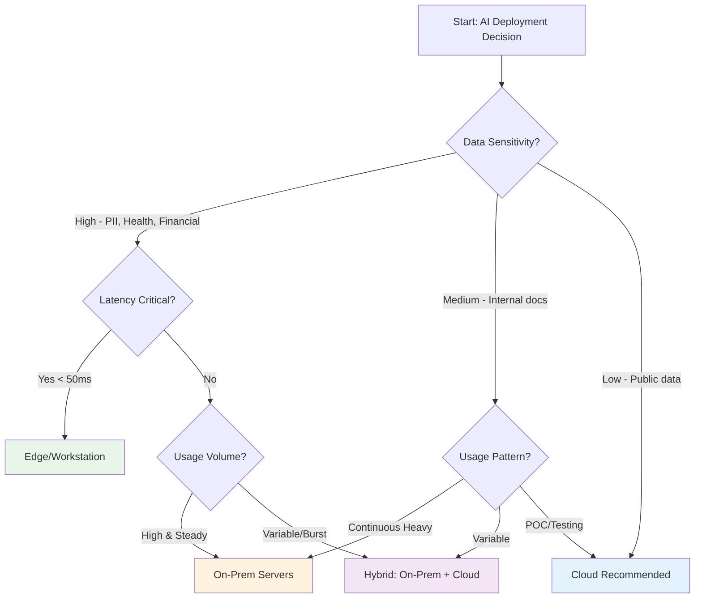
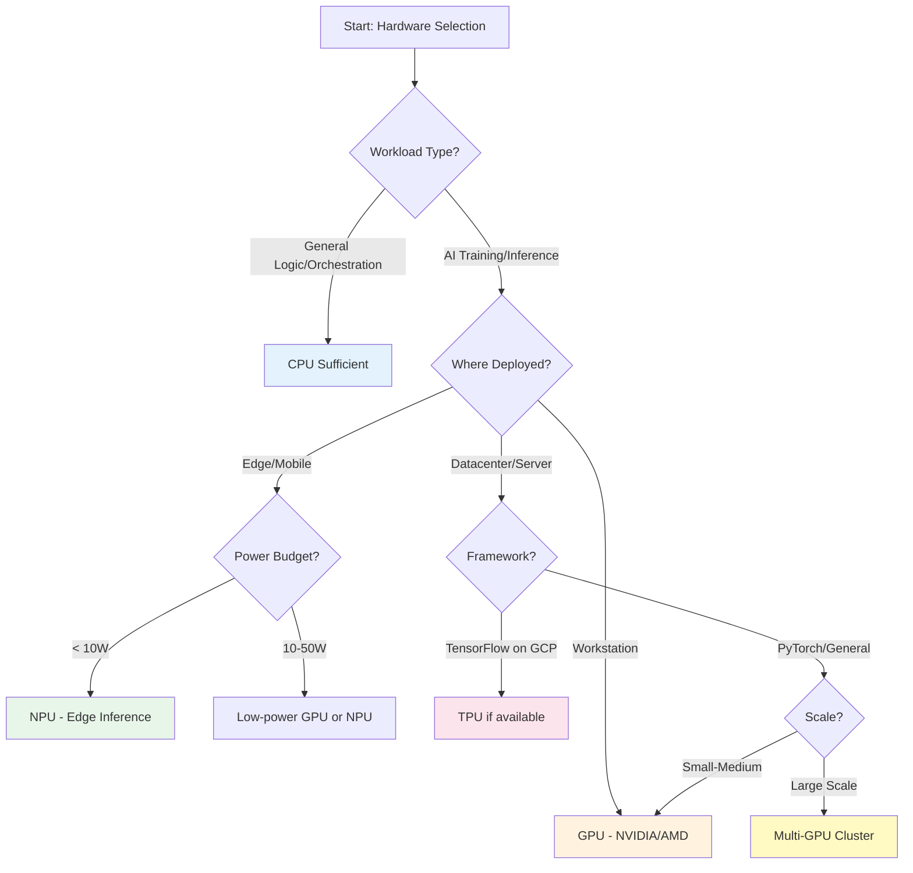
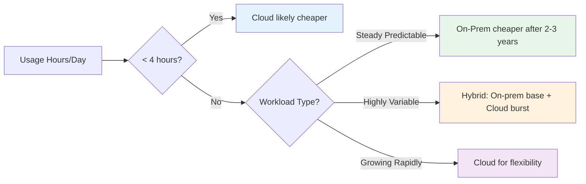
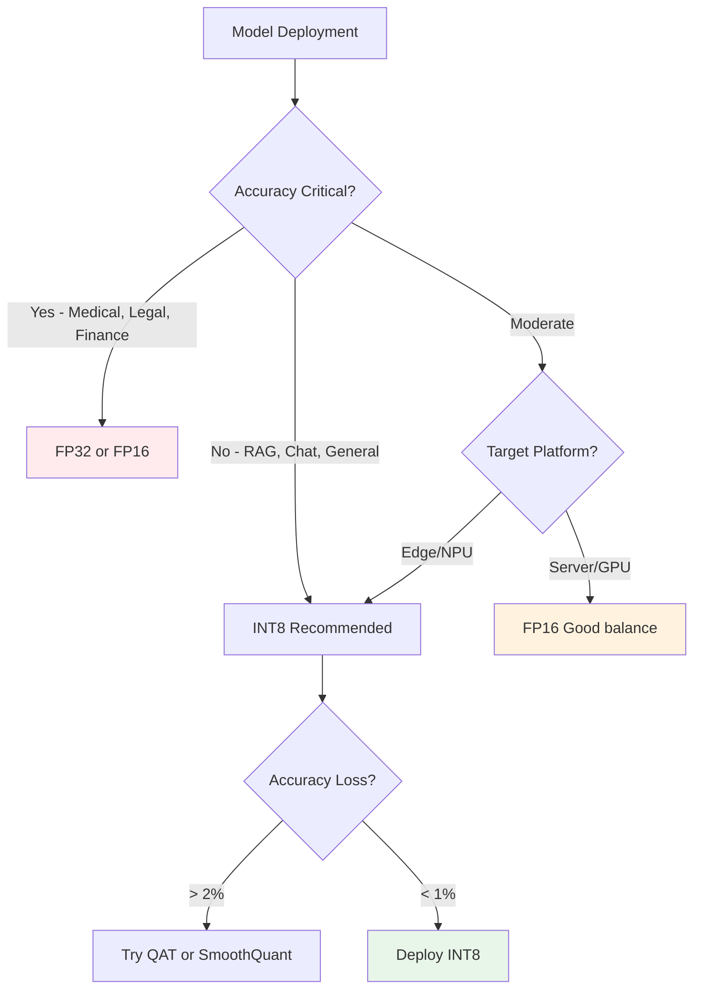

# Decision Trees & Frameworks

Structured decision frameworks to guide AI deployment and architecture choices.

## Deployment Model Decision Tree

## Hardware Selection Decision Tree

## Framework Selection Decision Matrix

| Requirement | LangGraph | CrewAI | Semantic Kernel | AutoGen |
|-------------|-----------|--------|-----------------|---------|
| **Learning Curve** | Medium | Low | Medium | High |
| **Multi-Agent** | ✅ Excellent | ✅ Excellent | ⚠️ Basic | ✅ Excellent |
| **State Management** | ✅ Built-in | ⚠️ Limited | ⚠️ Basic | ✅ Advanced |
| **Enterprise Ready** | ✅ Yes | ⚠️ Growing | ✅ Yes | ⚠️ Research |
| **Kubernetes Support** | ✅ Good | ✅ Good | ✅ Excellent | ⚠️ Manual |
| **Best For** | Complex workflows | Role-based teams | Microsoft stack | Experimental |

## Security Controls Decision Framework

### Data Classification → Controls Mapping

| Data Class | Encryption | Auth | Network | Deployment |
|------------|-----------|------|---------|------------|
| **Public** | TLS in transit | SSO optional | Standard firewall | Cloud OK |
| **Internal** | TLS + at-rest | SSO + RBAC | VPN/private | Cloud or On-prem |
| **Confidential** | TLS + at-rest + KMS | SSO + RBAC + MFA | mTLS + service mesh | On-prem preferred |
| **Regulated** | Full encryption + HSM | SSO + MFA + audit | Zero Trust + mTLS | On-prem required |

## Cost Optimization Decision Framework

### TCO Break-Even Analysis

### GPU Utilization Thresholds

| Utilization Rate | Recommendation |
|------------------|----------------|
| < 30% | Reconsider GPU investment or consolidate workloads |
| 30-60% | Acceptable for flexibility, monitor trends |
| 60-80% | Optimal utilization range |
| > 80% | Plan capacity expansion or workload distribution |

## Quantization Decision Framework

### Precision vs Performance Trade-off

## Integration Pattern Selection

### API Integration Patterns

| Pattern | Use When | Complexity | Latency |
|---------|----------|------------|---------|
| **Synchronous API** | Real-time user queries | Low | < 1s required |
| **Async Queue** | Batch processing, non-urgent | Medium | Minutes OK |
| **Streaming** | Progressive generation, long outputs | Medium | Variable |
| **Webhook** | Event-driven triggers | Low | Async |
| **RAG Pipeline** | Knowledge-grounded responses | High | 1-5s typical |

## Quick Reference: When to Use What

### Deployment Model
- **Edge/Workstation**: High data sensitivity + low latency + individual use
- **On-Prem Servers**: Moderate sensitivity + high steady usage + compliance
- **Cloud**: Low sensitivity + variable usage + rapid experimentation
- **Hybrid**: Mix of above requirements

### Hardware
- **CPU**: Orchestration, light inference, < 100 req/day
- **GPU**: Training, medium-high inference volume, datacenter
- **TPU**: TensorFlow + Google Cloud + hyperscale
- **NPU**: Edge devices, always-on inference, < 10W power

### Framework
- **LangGraph**: Complex stateful workflows, Kubernetes-native
- **CrewAI**: Multi-agent with clear roles, simpler learning curve
- **Semantic Kernel**: Microsoft ecosystem, enterprise orchestration
- **AutoGen**: Experimental multi-agent, research projects

---

*For detailed analysis on any decision point, refer to the relevant section of this documentation.*
