# AI Agent Security Layer: Comprehensive Guide

## Document Overview

This document provides a comprehensive guide to securing AI agents across all deployment scenarios. We cover 6 security domains, 40+ products, security frameworks (AWS, AEGIS, OWASP), and practical integration patterns for production deployments.

**Target Audience**: Security architects, DevSecOps teams, AI engineers, CISOs

**Coverage**:
- 🛡️ **6 Security Domains**: Guardrails, Identity, Data, Application, Threat Detection, Observability
- 🔧 **40+ Products**: Open-source and commercial solutions
- 📐 **4 Frameworks**: AWS Agentic AI, Forrester AEGIS, McKinsey, OWASP
- 🔗 **16 AI Frameworks**: LangChain, LlamaIndex, AutoGen, CrewAI, Dify, n8n, etc.
- 💻 **Integration Patterns**: Python code examples, reference architectures
- ✅ **Compliance**: GDPR, HIPAA, SOC 2, ISO 42001

---

## Table of Contents

1. [Overview & Threat Landscape](#overview--threat-landscape)
2. [Security Architecture Frameworks](#security-architecture-frameworks)
3. [Security Components by Domain](#security-components-by-domain)
   - [Guardrails (Input/Output Safety)](#domain-1-guardrails-inputoutput-safety)
   - [Identity & Access Management](#domain-2-identity--access-management)
   - [Data Security](#domain-3-data-security)
   - [Application Security](#domain-4-application-security)
   - [Threat Detection & Response](#domain-5-threat-detection--response)
   - [Observability & Compliance](#domain-6-observability--compliance)
4. [Product Comparison by Category](#product-comparison-by-category)
5. [Integration Patterns](#integration-patterns)
6. [Best Practices & Roadmap](#best-practices--roadmap)

---

## Overview & Threat Landscape

### Why AI Agent Security Matters

AI agents represent a fundamental shift from reactive AI systems to **autonomous decision-makers** that can initiate actions, use tools, and interact with infrastructure without human oversight. This autonomy introduces unprecedented security risks:

**The Agentic AI Risk Shift**:
- **Traditional AI**: Static models → prompt → response → terminate
- **Agentic AI**: Multi-step reasoning → tool execution → environment interaction → cascading actions

**By the Numbers** (2024-2025 data):
- **87%** of enterprises lack comprehensive AI security frameworks (Gartner 2025)
- **$2.1M** average cost reduction with AI-specific security controls (IBM 2025)
- **40%** faster incident response with mature AI guardrails (McKinsey 2024)
- **$2.6-4.4 trillion** annual value at risk without proper agentic AI security (McKinsey 2024)

---

### Unique AI & Agentic Threats

```mermaid
flowchart TB
    subgraph Traditional_AI[\"Traditional AI Threats (OWASP Top 10 for LLM)\"]
        Prompt[\"Prompt Injection<br/>Override system instructions\"]
        Hallucination[\"Hallucinations<br/>Fabricated responses\"]
        DataLeakage[\"Training Data Leakage<br/>Expose sensitive data\"]
        Bias[\"Bias & Toxicity<br/>Discriminatory outputs\"]
        ModelPoisoning[\"Model Poisoning<br/>Backdoor attacks\"]
    end
    
    subgraph Agentic_AI[\"Agentic-Specific Threats\"]
        GoalHijacking[\"Goal Hijacking<br/>Adversary redirects objectives\"]
        PrivEscalation[\"Privilege Escalation<br/>Agent exceeds permissions\"]
        ChainedVuln[\"Chained Vulnerabilities<br/>Cascade across agents\"]
        CognitiveCorruption[\"Cognitive Corruption<br/>Corrupted reasoning\"]
        AgentToAgent[\"Agent-to-Agent Exploits<br/>Unauthorized communication\"]
    end
    
    subgraph MultiAgent[\"Multi-Agent Risks\"]
        SystemicCollapse[\"Systemic Collapse<br/>One failure cascades\"]
        EmergentBehavior[\"Emergent Behavior<br/>Unpredictable coordination\"]
        NoTraceability[\"No Causal Traceability<br/>Forensics impossible\"]
    end
    
    Traditional_AI --> Agentic_AI
    Agentic_AI --> MultiAgent
    
    style Traditional_AI fill:#fff3e0
    style Agentic_AI fill:#ffcdd2
    style MultiAgent fill:#ef9a9a
```

---

### Threat Taxonomy: OWASP Top 10 for LLM Applications

| # | Threat | Description | Impact | Mitigation |
|---|--------|-------------|--------|------------|
| **1** | **Prompt Injection** | Malicious inputs override system instructions | High | Input guardrails, prompt validation |
| **2** | **Insecure Output Handling** | Unchecked LLM output executed as code | Critical | Output sanitization, sandboxing |
| **3** | **Training Data Poisoning** | Malicious data in training set | High | Data validation, model scanning |
| **4** | **Model Denial of Service** | Resource exhaustion attacks | Medium | Rate limiting, quotas |
| **5** | **Supply Chain Vulnerabilities** | Compromised dependencies | High | Dependency scanning, SBOMs |
| **6** | **Sensitive Information Disclosure** | PII/secrets in outputs | Critical | PII detection, output filtering |
| **7** | **Insecure Plugin Design** | Vulnerable agent tools/plugins | High | Plugin validation, least privilege |
| **8** | **Excessive Agency** | Agent has too many permissions | Critical | RBAC, scope-based access |
| **9** | **Overreliance** | Trusting LLM without verification | Medium | Human-in-loop, fact-checking |
| **10** | **Model Theft** | Exfiltration of model weights | High | Access controls, watermarking |

**Source**: [OWASP Top 10 for LLM Applications 2025](https://owasp.org/www-project-top-10-for-large-language-model-applications/)

---

### Agentic-Specific Attack Vectors

**1. Goal Hijacking**
- **Definition**: Adversary manipulates agent's objectives through adversarial prompts
- **Example**: Agent instructed to "maximize sales" instead prioritizes data exfiltration
- **Detection**: Behavioral monitoring, goal validation guardrails

**2. Privilege Escalation via Task Chaining**
- **Definition**: Agent uses legitimate tool access to escalate permissions
- **Example**: Agent with "read database" permission uses SQL injection to write
- **Detection**: Tool usage auditing, scope-based tool access

**3. Chained Vulnerabilities (Agent-to-Agent)**
- **Definition**: Vulnerability in one agent cascades to others via multi-agent communication
- **Example**: Compromised Agent A sends malicious instructions to Agent B
- **Detection**: Agent identity verification, message signing, anomaly detection

**4. Cognitive Corruption**
- **Definition**: Agent's reasoning process corrupted by adversarial inputs or hallucinations
- **Example**: Agent "remembers" fake security policy allowing unauthorized actions
- **Detection**: Fact-checking guardrails, memory validation

**5. Emergent Behavior Exploitation**
- **Definition**: Multi-agent systems exhibit unpredictable behaviors that create vulnerabilities
- **Example**: Agents coordinate to bypass rate limits via distributed requests
- **Detection**: Multi-agent behavioral analysis, coordination monitoring

---

### Compliance Drivers: Regulatory Landscape

**EU AI Act** (Enforcement: 2024-2026)
- **High-Risk AI Systems**: Biometric, critical infrastructure, law enforcement
- **Requirements**: Risk assessment, data governance, transparency, human oversight
- **Penalties**: Up to €30M or 6% global revenue

**NIST AI Risk Management Framework (AI RMF)** (2023)
- **4 Core Functions**: Govern, Map, Measure, Manage
- **Voluntary Framework**: Best practices for AI risk management
- **Focus**: Trustworthy AI, bias mitigation, transparency

**ISO/IEC 42001:2023** (AI Management System)
- **Certification Standard**: International standard for AI governance
- **Requirements**: Risk assessment, documentation, continuous monitoring
- **Applicability**: All AI systems including LLMs and agents

**Industry-Specific**:
- **HIPAA** (Healthcare): Protected Health Information (PHI) in LLM context windows
- **GDPR** (EU Privacy): Right to explanation, data minimization for AI
- **SOC 2** (SaaS): Security, availability, confidentiality controls
- **PCI-DSS** (Finance): Payment data in AI training/inference

---

### Security vs Innovation Balance

**The CISO's Dilemma** (2025):

Organizations face tension between:
- ✅ **Velocity**: Deploy AI agents fast to capture competitive advantage
- 🛡️ **Safety**: Ensure agents don't cause catastrophic failures or breaches

**Without Guardrails**:
- ❌ Data breaches (+$2.1M average cost)
- ❌ Compliance violations (fines, lawsuits)
- ❌ Reputational damage (customer trust erosion)
- ❌ AI "Shadow IT" (ungoverned deployments)

**With AI Guardrails**:
- ✅ 40% faster incident response (McKinsey 2024)
- ✅ 60% reduction in false positives (Obsidian Security 2025)
- ✅ Demonstrable ROI through automated policy enforcement
- ✅ Enables rapid, safe AI deployment

**Key Insight**: AI guardrails are **not** bottlenecks—they are **enablers** of innovation by reducing risk and building trust.

---

### The Security Paradigm Shift

Traditional security assumes **deterministic systems** (same input → same output). AI agents break this model:

| Dimension | Traditional Systems | AI Agents |
|-----------|-------------------|-----------|
| **Behavior** | Deterministic | Non-deterministic |
| **Control** | Explicit code paths | Emergent reasoning |
| **Traceability** | Full stack traces | Reasoning traces (opaque) |
| **Permissions** | Least privilege (static) | Least agency (dynamic) |
| **Testing** | Unit + integration tests | Adversarial + red teaming |
| **Monitoring** | Logs + metrics | Behavioral + semantic |
| **Incident Response** | Rollback code | Contain + retrain agent |

**New Security Primitives Required**:
1. **Input/Output Guardrails**: Validate AI interactions (not just data)
2. **Behavioral Monitoring**: Detect anomalous agent actions (not just network traffic)
3. **Semantic Security**: Understand intent (not just syntax)
4. **Agent Identity**: Authenticate agent-to-agent (not just user-to-service)
5. **Continuous Validation**: Real-time policy enforcement (not just deployment gates)

---

### Cost of AI Security Incidents

**Real-World Examples** (Anonymized, 2023-2024):

**Incident 1: Data Leakage via RAG**
- **Company**: Fortune 500 Financial Services
- **Cause**: RAG system retrieved customer PII, LLM included in response
- **Impact**: 50K records exposed, $4.2M fine (GDPR), 18 months remediation
- **Prevention**: Output PII scrubbing + data access controls

**Incident 2: Prompt Injection in Customer Service**
- **Company**: E-commerce Platform
- **Cause**: Customer tricked agent into revealing competitor pricing strategy
- **Impact**: Competitive disadvantage, internal investigation, policy overhaul
- **Prevention**: Input guardrails + jailbreak detection

**Incident 3: Agent Privilege Escalation**
- **Company**: SaaS Provider
- **Cause**: AI coding agent escalated from "read" to "write" database permissions
- **Impact**: Production database corruption, 6-hour outage, $2.1M revenue loss
- **Prevention**: Scope-based tool access + behavioral monitoring

**Incident 4: Multi-Agent Systemic Failure**
- **Company**: Logistics Startup
- **Cause**: One agent's hallucination cascaded to 5 other agents, triggering incorrect shipments
- **Impact**: 2,000 misrouted packages, $800K logistics costs, customer churn
- **Prevention**: Fact-checking guardrails + agent coordination monitoring

---

### Threat Modeling Framework

**AWS Agentic AI Security Scoping Matrix** (Preview - detailed in next section):

| Scope | Agent Type | Autonomy | Connectivity | Key Risks |
|-------|-----------|----------|--------------|-----------|
| **Scope 1** | Basic constrained | Low | None | Prompt injection, hallucinations |
| **Scope 2** | Tool-using | Medium | APIs only | Tool misuse, data leakage |
| **Scope 3** | Multi-agent | High | Agent-to-agent | Chained vulnerabilities, coordination attacks |
| **Scope 4** | Fully autonomous | Very high | Environment | Goal hijacking, emergent behavior, systemic collapse |

**Risk Escalation**: Each scope adds **exponential risk** due to increased autonomy and connectivity.

---

### When to Prioritize Security

**Immediate Priority** (Deploy guardrails before production):
- ✅ Handling sensitive data (PII, PHI, payment info)
- ✅ Autonomous actions (database writes, API calls, code execution)
- ✅ Customer-facing applications (public exposure)
- ✅ Regulated industries (healthcare, finance, government)
- ✅ Multi-agent systems (cascading risk)

**Medium Priority** (Add security within 3-6 months):
- ⚠️ Internal tools (corporate data exposure risk)
- ⚠️ Prototypes becoming production (technical debt prevention)
- ⚠️ High-value use cases (competitive advantage protection)

**Lower Priority** (Research/sandboxed environments):
- 🔬 Isolated experiments (no production data)
- 🔬 Academic research (limited deployment scope)

**Rule of Thumb**: If an AI agent failure could cause financial, reputational, or compliance harm → **prioritize security immediately**.

---

### Security Layer Architecture Overview

```mermaid
flowchart TB
    subgraph User[\"User / Application\"]
        UserInput[\"User Input\"]
    end
    
    subgraph SecurityLayer[\"AI Security Layer (6 Domains)\"]
        subgraph Guardrails[\"1. Guardrails\"]
            InputVal[\"Input Validation<br/>Prompt injection detection\"]
            OutputFilter[\"Output Filtering<br/>PII scrubbing, toxicity\"]
        end
        
        subgraph IAM[\"2. Identity & Access\"]
            Auth[\"Authentication<br/>SSO, 2FA\"]
            Authz[\"Authorization<br/>RBAC, scope-based\"]
        end
        
        subgraph DataSec[\"3. Data Security\"]
            PIIDetect[\"PII Detection\"]
            AccessControl[\"Data Access Controls\"]
        end
        
        subgraph AppSec[\"4. Application Security\"]
            CodeScan[\"Code Scanning\"]
            APISec[\"API Security\"]
        end
        
        subgraph Threat[\"5. Threat Detection\"]
            BehaviorMon[\"Behavioral Monitoring\"]
            JailbreakDet[\"Jailbreak Detection\"]
        end
        
        subgraph Observability[\"6. Observability\"]
            Logging[\"Logging & Tracing\"]
            Audit[\"Audit Trails\"]
        end
    end
    
    subgraph AgentFramework[\"AI Agent Framework\"]
        Agent[\"AI Agent<br/>(LangChain, LlamaIndex, etc.)\"]
    end
    
    subgraph LLM[\"LLM / Tools\"]
        Model[\"LLM API<br/>(OpenAI, Anthropic, etc.)\"]
        Tools[\"Tools / APIs\"]
    end
    
    UserInput --> InputVal
    InputVal --> Auth
    Auth --> Authz
    Authz --> PIIDetect
    PIIDetect --> CodeScan
    CodeScan --> BehaviorMon
    BehaviorMon --> Agent
    Agent --> Model
    Agent --> Tools
    Model --> OutputFilter
    Tools --> OutputFilter
    OutputFilter --> Logging
    Logging --> UserInput
    
    style Guardrails fill:#e8f5e9
    style IAM fill:#e3f2fd
    style DataSec fill:#fff3e0
    style AppSec fill:#f3e5f5
    style Threat fill:#ffebee
    style Observability fill:#fce4ec
```

**Defense in Depth**: Multiple security layers ensure that if one layer fails, others provide protection.

---

## Security Architecture Frameworks

This section covers 4 leading security frameworks for AI agents:
1. **AWS Agentic AI Security Scoping Matrix** - 4-tier risk model
2. **Forrester AEGIS Framework** - 6 security domains
3. **OWASP Top 10 for LLM Applications** - Threat-specific guidelines
4. **McKinsey AI Guardrails** - Business-focused governance

---

### Framework 1: AWS Agentic AI Security Scoping Matrix

**Source**: AWS re:Invent 2024 - "Agentic AI on AWS: A Security-First Approach"

**Purpose**: Risk-based framework that categorizes AI agents into 4 scopes based on autonomy and connectivity. Each scope prescribes different security controls.

**Key Insight**: Security requirements scale **exponentially** with agent autonomy—Scope 4 agents require 10x more controls than Scope 1.

#### The 4 Security Scopes

```mermaid
flowchart LR
    Scope1["Scope 1<br/>Basic Constrained<br/>🟢 Low Risk"]
    Scope2["Scope 2<br/>Tool-Using<br/>🟡 Medium Risk"]
    Scope3["Scope 3<br/>Multi-Agent<br/>🟠 High Risk"]
    Scope4["Scope 4<br/>Fully Autonomous<br/>🔴 Critical Risk"]
    
    Scope1 -->|Add Tool Execution| Scope2
    Scope2 -->|Add Agent-to-Agent| Scope3
    Scope3 -->|Add Full Autonomy| Scope4
    
    style Scope1 fill:#c8e6c9
    style Scope2 fill:#fff9c4
    style Scope3 fill:#ffccbc
    style Scope4 fill:#ffcdd2
```



---

#### Scope 1: Basic Constrained Agents

**Definition**: Single-turn conversational agents with no tool access or memory.

**Characteristics**:
- **Autonomy**: Low (no action-taking)
- **Connectivity**: None (isolated from infrastructure)
- **Memory**: Stateless (no persistence)
- **Examples**: Simple chatbots, Q&A assistants, document summarizers

**Security Requirements** (5 controls):
1. **Input Guardrails**: Prompt injection detection, content moderation
2. **Output Filtering**: PII scrubbing, toxicity detection
3. **Rate Limiting**: Prevent DoS attacks
4. **Authentication**: Basic user authentication
5. **Logging**: Audit trails for queries and responses

**Threats**: Prompt injection, hallucinations, bias, jailbreaking

**Example Use Case**: Customer service chatbot answering FAQs (no CRM access)

---

#### Scope 2: Tool-Using Agents

**Definition**: Agents that can invoke external tools/APIs (function calling).

**Characteristics**:
- **Autonomy**: Medium (can perform actions via APIs)
- **Connectivity**: APIs only (database queries, REST APIs, SaaS tools)
- **Memory**: Optional (conversation history, vector stores)
- **Examples**: RAG systems, code generators, task automation

**Security Requirements** (10 controls = Scope 1 + 5 new):
1. **Tool Validation**: Whitelist approved tools, parameter validation
2. **Scope-Based Access**: Limit tool access per agent role
3. **Data Access Controls**: Enforce least privilege for data retrieval
4. **Output Validation**: Verify tool outputs before use
5. **Tool Usage Auditing**: Log all tool invocations with parameters

**Threats**: Tool misuse (SQL injection, API abuse), data leakage, privilege escalation

**Example Use Case**: RAG system querying internal knowledge base + invoking Slack API

---

#### Scope 3: Multi-Agent Systems

**Definition**: Multiple agents that communicate and coordinate to solve complex tasks.

**Characteristics**:
- **Autonomy**: High (agents plan and coordinate)
- **Connectivity**: Agent-to-agent communication
- **Memory**: Shared state (multi-agent memory, task queues)
- **Examples**: CrewAI workflows, AutoGen teams, agentic orchestration

**Security Requirements** (15 controls = Scope 2 + 5 new):
1. **Agent Identity Verification**: Authenticate agent-to-agent messages
2. **Message Signing**: Cryptographic signatures for agent communications
3. **Coordination Monitoring**: Detect anomalous collaboration patterns
4. **Behavioral Analysis**: Identify emergent malicious behavior
5. **Circuit Breakers**: Automatically halt cascading failures

**Threats**: Chained vulnerabilities, emergent behavior, systemic collapse, agent impersonation

**Example Use Case**: Multi-agent customer onboarding (Agent A: ID verification, Agent B: CRM update, Agent C: Email notification)

---

#### Scope 4: Fully Autonomous Agents

**Definition**: Agents with unrestricted access to environments, capable of self-directed long-term planning.

**Characteristics**:
- **Autonomy**: Very high (long-term goals, self-modification)
- **Connectivity**: Full environment access (cloud APIs, databases, code repos)
- **Memory**: Persistent (long-term memory, learning)
- **Examples**: AI researchers, self-improving agents, autonomous DevOps

**Security Requirements** (20+ controls = Scope 3 + 5+ new):
1. **Goal Validation**: Verify agent objectives align with policy
2. **Human-in-Loop**: Require approval for high-risk actions
3. **Red Teaming**: Continuous adversarial testing
4. **Causal Traceability**: Full reasoning and decision logs
5. **Kill Switch**: Emergency agent termination mechanism

**Threats**: Goal hijacking, unintended consequences, self-modification exploits, existential risk

**Example Use Case**: Autonomous cloud cost optimizer (analyze spend, provision/deprovision resources, negotiate with vendors)

---

#### AWS Scope Comparison Table

| Dimension | Scope 1 | Scope 2 | Scope 3 | Scope 4 |
|-----------|---------|---------|---------|--------|
| **Autonomy** | Low | Medium | High | Very High |
| **Tool Access** | ❌ None | ✅ APIs | ✅ APIs + Agents | ✅ Full Environment |
| **Memory** | ❌ Stateless | ⚠️ Optional | ✅ Shared | ✅ Persistent |
| **Multi-Agent** | ❌ Single | ❌ Single | ✅ Coordinated | ✅ Self-Organizing |
| **Risk Level** | 🟢 Low | 🟡 Medium | 🟠 High | 🔴 Critical |
| **Security Controls** | 5 | 10 | 15 | 20+ |
| **Cost Overhead** | +5-10% | +10-20% | +20-40% | +40-100% |
| **Implementation Time** | 1-2 weeks | 4-6 weeks | 8-12 weeks | 16+ weeks |

**Decision Guide**:
- Start with **Scope 1** for MVPs and low-risk use cases
- Upgrade to **Scope 2** when adding RAG or tool execution
- Move to **Scope 3** only when multi-agent coordination is required
- Reserve **Scope 4** for mature, high-value, fully monitored use cases

---

### Framework 2: Forrester AEGIS Framework

**Source**: Forrester Research - "The AEGIS Framework for Securing Agentic AI" (2024)

**Purpose**: Comprehensive 6-domain security architecture for AI agents across the full lifecycle.

**Key Insight**: AI security requires **6 parallel domains**—weakness in any domain compromises the entire system.

#### The 6 AEGIS Domains


---

#### Domain 1: Governance (Policies & Risk)

**Objective**: Establish AI-specific policies and risk management processes.

**Key Components**:
1. **AI Risk Assessment**: Evaluate agent risk using frameworks (AWS Scoping Matrix, NIST AI RMF)
2. **Acceptable Use Policy**: Define approved AI use cases and prohibited actions
3. **Model Governance**: Track model versions, training data, fine-tuning
4. **Compliance Mapping**: Align with GDPR, HIPAA, SOC 2, ISO 42001
5. **Incident Response Plan**: Define procedures for AI security incidents

**Tools/Products**:
- AWS Audit Manager, Azure Purview Compliance Manager
- LangSmith (model versioning), Weights & Biases (experiment tracking)
- Internal policy management platforms

**Maturity Levels**:
- **L1 (Ad-hoc)**: No formal AI policies
- **L2 (Basic)**: Basic policies, manual enforcement
- **L3 (Advanced)**: Automated policy enforcement, continuous risk assessment
- **L4 (Optimized)**: AI-driven policy optimization, predictive risk modeling

---

#### Domain 2: Identity & Access Management

**Objective**: Control who/what can access AI agents and their data.

**Key Components**:
1. **User Authentication**: SSO, 2FA/MFA for human users
2. **Agent Identity**: Unique identities for each agent (agent-to-agent auth)
3. **Role-Based Access Control (RBAC)**: Define agent roles and permissions
4. **Scope-Based Tool Access**: Limit tool execution based on agent role
5. **Credential Management**: Secure storage of API keys and secrets

**Tools/Products**:
- AWS IAM, Azure AD/Entra ID, Okta, Auth0
- HashiCorp Vault (secret management)
- LangChain RBAC (experimental)

**Best Practices**:
- Never hardcode credentials in agent prompts
- Use short-lived tokens (1-4 hours)
- Implement principle of least privilege

---

#### Domain 3: Data Security

**Objective**: Protect sensitive data in AI pipelines (training, inference, retrieval).

**Key Components**:
1. **PII Detection & Redaction**: Identify and mask PII in inputs/outputs
2. **Encryption**: At-rest and in-transit encryption for vector databases
3. **Data Access Controls**: Enforce row-level security in RAG systems
4. **Data Minimization**: Collect only necessary data for AI tasks
5. **Retention Policies**: Auto-delete conversation logs after N days

**Tools/Products**:
- Private AI (PII detection/redaction)
- Gretel.ai (synthetic data generation)
- AWS Macie, Microsoft Purview (data classification)

**Critical for**: Healthcare (HIPAA), Finance (PCI-DSS), EU (GDPR)

---

#### Domain 4: Application Security

**Objective**: Secure the AI application codebase and dependencies.

**Key Components**:
1. **Dependency Scanning**: Detect vulnerabilities in LangChain, LlamaIndex, etc.
2. **SBOM Generation**: Software Bill of Materials for AI supply chain
3. **Code Scanning**: Static analysis for prompt injection vulnerabilities
4. **Container Security**: Secure Docker images for AI deployments
5. **CI/CD Security**: Integrate security checks in deployment pipelines

**Tools/Products**:
- Snyk, GitHub Advanced Security, GitLab Security Dashboard
- Checkmarx, Veracode (SAST/DAST)
- FOSSA (license compliance)

**OWASP Top 10 Coverage**: Addresses #5 (Supply Chain), #7 (Insecure Plugin Design)

---

#### Domain 5: Threat Intelligence & Response

**Objective**: Detect and respond to AI-specific threats in real-time.

**Key Components**:
1. **Jailbreak Detection**: Identify adversarial prompts attempting to bypass guardrails
2. **Behavioral Monitoring**: Detect anomalous agent actions (privilege escalation)
3. **Anomaly Detection**: Flag unusual tool usage patterns
4. **Threat Intelligence**: Track emerging AI attack vectors (e.g., new prompt injection techniques)
5. **Incident Response**: Playbooks for AI security incidents

**Tools/Products**:
- Cisco AI Defense, Obsidian Security, Calypso AI
- HiddenLayer, Robust Intelligence (adversarial defense)
- AWS GuardDuty, Vectra AI (network-level detection)

**Metrics**: Time-to-detect (TTD), time-to-respond (TTR), false positive rate

---

#### Domain 6: Zero Trust Architecture

**Objective**: Continuously validate every agent interaction ("never trust, always verify").

**Key Components**:
1. **Continuous Authentication**: Re-verify agent identity for each tool call
2. **Micro-Segmentation**: Isolate agents in separate network zones
3. **Just-In-Time Access**: Grant permissions dynamically per request
4. **Policy Enforcement Points**: Validate every action against policy
5. **Least Agency**: Minimize agent permissions to only required tools

**Implementation**:
- Use AWS IAM roles with session tokens (not static keys)
- Implement API gateways with per-request authorization
- Deploy agents in separate Kubernetes namespaces

**Zero Trust for AI = "Verify every agent action, not just every login"**

---

#### AEGIS Maturity Model

| Domain | Level 1 (Ad-hoc) | Level 2 (Basic) | Level 3 (Advanced) | Level 4 (Optimized) |
|--------|------------------|-----------------|--------------------|-----------------|
| **Governance** | No policies | Manual policies | Automated enforcement | AI-driven optimization |
| **Identity** | Shared credentials | Basic RBAC | Scope-based access | Dynamic permissions |
| **Data Security** | No PII controls | Manual redaction | Automated PII scrubbing | Real-time data classification |
| **App Security** | No scanning | Manual code reviews | CI/CD integration | Continuous security testing |
| **Threat Detection** | Reactive | Basic monitoring | Behavioral analytics | Predictive threat modeling |
| **Zero Trust** | Perimeter security | Basic segmentation | Micro-segmentation | Continuous validation |

**Target**: Most enterprises should aim for **Level 3** (Advanced) within 12-18 months.

---

### Framework 3: OWASP Top 10 for LLM Applications (2025)

**Source**: [OWASP LLM Project](https://owasp.org/www-project-top-10-for-large-language-model-applications/)

**Purpose**: Threat-specific guidelines for securing LLM applications, including AI agents.

**Key Insight**: LLMs introduce **10 new vulnerability classes** beyond traditional OWASP Top 10 (web apps).

#### Mapping OWASP LLM Threats to Mitigations

| # | Threat | Impact | Primary Mitigation | Secondary Mitigation | Products |
|---|--------|--------|-------------------|---------------------|----------|
| **1** | **Prompt Injection** | Critical | Input guardrails | Prompt validation | NVIDIA NeMo, Guardrails AI |
| **2** | **Insecure Output** | Critical | Output sanitization | Sandboxing | LLM Guard, OpenAI Moderation |
| **3** | **Training Poisoning** | High | Data validation | Model scanning | HiddenLayer, Robust Intelligence |
| **4** | **Model DoS** | Medium | Rate limiting | Quotas | AWS API Gateway, Kong |
| **5** | **Supply Chain** | High | Dependency scanning | SBOM | Snyk, GitHub Dependabot |
| **6** | **Info Disclosure** | Critical | PII detection | Output filtering | Private AI, AWS Macie |
| **7** | **Insecure Plugin** | High | Plugin validation | Least privilege | LangChain tool filters |
| **8** | **Excessive Agency** | Critical | Scope-based access | Human-in-loop | Custom RBAC |
| **9** | **Overreliance** | Medium | Fact-checking | User education | Patronus Lynx (hallucination detection) |
| **10** | **Model Theft** | High | Access controls | Watermarking | AWS IAM, Azure RBAC |

**Critical Path**: Prioritize threats #1, #2, #6, #8 (all Critical impact) before production deployment.

---

### Framework 4: McKinsey AI Guardrails Guidelines

**Source**: McKinsey Digital - "Scaling AI Responsibly with Guardrails" (2024)

**Purpose**: Business-focused framework for AI governance and risk management.

**Key Insight**: AI guardrails enable **faster, safer innovation** by reducing risk and building stakeholder trust.

#### McKinsey's 4 Guardrail Categories

**1. Input Guardrails** (Pre-LLM)
- Prompt injection detection
- Content moderation (hate speech, violence)
- PII detection in user queries
- **Business Impact**: Prevent reputational damage, compliance violations

**2. Output Guardrails** (Post-LLM)
- Hallucination detection
- Toxicity filtering
- PII scrubbing
- Factuality verification
- **Business Impact**: Maintain brand trust, reduce misinformation

**3. Operational Guardrails** (Runtime)
- Rate limiting and quotas
- Cost controls (per-user, per-API)
- Behavioral monitoring
- **Business Impact**: Control costs, detect abuse

**4. Governance Guardrails** (Policy)
- Human-in-loop for high-risk actions
- Audit trails and compliance reporting
- Model version tracking
- **Business Impact**: Meet regulatory requirements, enable audits

#### ROI of AI Guardrails

**McKinsey Case Study** (2024):
- **Company**: Global Financial Services ($500B assets)
- **Use Case**: AI-powered customer service (10M queries/month)
- **Investment**: $1.2M (guardrails infrastructure + 6 FTEs)
- **Savings**:
  - $4.5M: Avoided GDPR fines (PII leakage prevention)
  - $2.1M: Reduced customer churn (toxicity prevention)
  - $1.8M: Faster incident response (40% reduction in MTTR)
  - **Total ROI**: 590% over 18 months

**Key Takeaway**: Guardrails are **not** a cost center—they are **risk mitigators** with quantifiable ROI.

---

### Framework Comparison Matrix

| Framework | Focus | Complexity | Best For | Timeframe |
|-----------|-------|------------|----------|----------|
| **AWS Scoping Matrix** | Risk-based scaling | Medium | Incremental adoption (MVP → Production) | 2-6 months |
| **Forrester AEGIS** | Comprehensive 6-domain coverage | High | Enterprise-wide AI security strategy | 12-18 months |
| **OWASP LLM Top 10** | Threat-specific mitigations | Low-Medium | Tactical security improvements | 1-3 months |
| **McKinsey Guardrails** | Business ROI and governance | Low | Executive buy-in and budgeting | 3-6 months |

**Recommendation**: Use **AWS Scoping Matrix** for technical planning + **McKinsey Guardrails** for business justification.

---

### Combining Frameworks: A Practical Approach

**Phase 1** (Month 1-3): **OWASP-driven tactical fixes**
- Fix Top 3 threats: Prompt Injection (#1), Insecure Output (#2), Info Disclosure (#6)
- Deploy basic guardrails (input validation, output filtering)
- Achieve **80% risk reduction** with **20% effort**

**Phase 2** (Month 4-6): **AWS Scoping Matrix for architecture**
- Classify agents into Scopes 1-4
- Implement scope-appropriate controls
- Upgrade from Scope 1 → Scope 2 as needed

**Phase 3** (Month 7-12): **AEGIS for holistic security**
- Expand to all 6 domains (Governance, Identity, Data, App, Threat, Zero Trust)
- Achieve Level 3 maturity in each domain
- Build continuous monitoring and response

**Phase 4** (Month 13+): **McKinsey for optimization**
- Measure ROI of guardrails
- Optimize cost vs risk tradeoffs
- Scale AI securely across organization

---

## Security Components by Domain

This section provides deep-dives into 6 security domains with 40+ product comparisons.

### Domain 1: Guardrails (Input/Output Safety)

**Purpose**: Validate and filter AI agent inputs and outputs to prevent prompt injection, PII leakage, toxicity, and hallucinations.

**Why Critical**: Guardrails are the **first and last line of defense** in AI security—they prevent malicious inputs and sanitize outputs before reaching users or systems.

#### Guardrails Flow Architecture


---

#### Product 1: NVIDIA NeMo Guardrails

**Overview**: Most comprehensive open-source guardrails framework with programmable security policies.

**Key Features**:
1. **Colang DSL**: Domain-specific language for defining guardrail policies
2. **Input/Output Validation**: Topical rails (allowed conversation topics), jailbreak detection
3. **Fact-Checking Rails**: Verify LLM outputs against knowledge bases
4. **Moderation Rails**: Built-in content moderation (toxicity, violence, hate speech)
5. **LangChain Integration**: Native integration via `NeMoGuardrailsChain`
6. **Multi-Model Support**: Works with OpenAI, Anthropic, Cohere, local models

**Architecture**:
- **Colang Runtime**: Executes policy rules before/after LLM calls
- **Rails Library**: Pre-built rails (jailbreak, hallucination, PII, moderation)
- **Custom Rails**: Write Python functions for domain-specific validation

**Specifications**:

| Dimension | Details |
|-----------|----------|
| **License** | Apache 2.0 (open-source) |
| **Language** | Python 3.8+ |
| **Deployment** | Self-hosted (Docker, Kubernetes) |
| **LLM Support** | OpenAI, Anthropic, Cohere, HuggingFace, local |
| **Framework Integration** | LangChain, LlamaIndex (via adapters) |
| **Latency** | +50-200ms per request |
| **Pricing** | Free (self-hosted), compute costs only |
| **Community** | 4.1K+ GitHub stars, active development |

**Strengths**:
- ✅ Most flexible and programmable guardrails system
- ✅ Active NVIDIA backing (continuous updates)
- ✅ LangChain native integration
- ✅ Comprehensive rail library (jailbreak, hallucination, PII, moderation)
- ✅ Self-hosted (full control over data)
- ✅ Multi-model support (not locked to specific LLM)

**Limitations**:
- ❌ Steeper learning curve (Colang DSL)
- ❌ Self-managed infrastructure (DevOps overhead)
- ❌ No built-in UI for policy management
- ❌ Requires Python expertise for custom rails

**Best For**:
- Enterprises requiring full control and customization
- LangChain-based applications
- Teams with Python/ML expertise
- Self-hosted/on-prem deployments

**Adoption**: NVIDIA internal AI applications, Fortune 500 enterprises

**GitHub**: https://github.com/NVIDIA/NeMo-Guardrails

---

#### Product 2: Guardrails AI

**Overview**: Python framework for structured output validation with validators and correctors.

**Key Features**:
1. **Validators Library**: 50+ pre-built validators (PII, toxicity, format, semantic)
2. **Output Correction**: Automatically fix invalid outputs (redact PII, remove toxicity)
3. **Pydantic Integration**: Validate outputs against Pydantic schemas
4. **LangChain Integration**: `GuardrailsOutputParser` for LangChain
5. **Streaming Support**: Real-time validation for streaming LLM responses
6. **Guardrails Hub**: Community-contributed validators

**Architecture**:
- **Guard Object**: Define validation rules (validators + correctors)
- **Validator Chain**: Execute validators sequentially on outputs
- **Correctors**: Auto-fix invalid outputs (rewrite, redact, reject)

**Specifications**:

| Dimension | Details |
|-----------|----------|
| **License** | Apache 2.0 (open-source) |
| **Language** | Python 3.8+ |
| **Deployment** | Self-hosted, Guardrails Cloud (beta) |
| **LLM Support** | All LLMs (model-agnostic) |
| **Framework Integration** | LangChain, LlamaIndex |
| **Latency** | +10-100ms per request |
| **Pricing** | Free (self-hosted), Cloud TBD |
| **Community** | 3.9K+ GitHub stars |

**Strengths**:
- ✅ Structured output validation (Pydantic schemas)
- ✅ 50+ pre-built validators (growing library)
- ✅ Output correction (not just blocking)
- ✅ Streaming support (real-time validation)
- ✅ Lightweight (low latency overhead)
- ✅ Model-agnostic (works with any LLM)

**Limitations**:
- ❌ Less comprehensive than NeMo (no Colang DSL)
- ❌ Primarily output-focused (input validation basic)
- ❌ No built-in jailbreak detection (requires custom validator)
- ❌ Guardrails Cloud still in beta

**Best For**:
- Structured output validation (JSON, XML, SQL)
- Teams prioritizing output correctness
- Lightweight guardrails with minimal latency
- Python-first development teams

**Adoption**: Startups, AI-first companies

**GitHub**: https://github.com/guardrails-ai/guardrails

---

#### Product 3: LangChain Guardrails (Built-in)

**Overview**: Native guardrails built into LangChain framework.

**Key Features**:
1. **Prompt Templates with Validation**: Validate inputs in prompt templates
2. **Output Parsers**: Structured output parsing with error handling
3. **Moderation Chains**: Integration with OpenAI Moderation API
4. **Custom Validators**: Write custom validation functions
5. **RunnableWithFallbacks**: Automatic fallback for failed validations

**Architecture**:
- **ValidationChain**: Wrap agents/chains with validation logic
- **Callbacks**: Validation callbacks for input/output monitoring
- **Fallback Strategy**: Define alternative flows for validation failures

**Specifications**:

| Dimension | Details |
|-----------|----------|
| **License** | MIT (open-source) |
| **Language** | Python 3.8+ |
| **Deployment** | Self-hosted (bundled with LangChain) |
| **LLM Support** | All LLMs supported by LangChain |
| **Framework Integration** | Native to LangChain |
| **Latency** | +5-50ms per request |
| **Pricing** | Free (part of LangChain) |
| **Community** | 98K+ GitHub stars (LangChain) |

**Strengths**:
- ✅ Zero additional dependencies (native to LangChain)
- ✅ Seamless integration with existing LangChain apps
- ✅ Low latency overhead
- ✅ Flexible (custom validators)
- ✅ Fallback strategies for graceful failures

**Limitations**:
- ❌ Basic features (no advanced jailbreak/hallucination detection)
- ❌ Requires manual integration of external guardrails (NeMo, Guardrails AI)
- ❌ No pre-built policy library
- ❌ LangChain-only (not portable)

**Best For**:
- LangChain-native applications
- Teams prioritizing simplicity over advanced features
- Rapid prototyping with basic validation

**Adoption**: Widely used in LangChain community

**Documentation**: https://python.langchain.com/docs/guides/safety/

---

#### Product 4: OpenAI Moderation API

**Overview**: OpenAI's content moderation service for detecting harmful content.

**Key Features**:
1. **Content Categories**: Hate, harassment, violence, self-harm, sexual content
2. **Severity Scores**: Per-category confidence scores (0-1)
3. **Multi-Language**: Supports 100+ languages
4. **Low Latency**: < 100ms response time
5. **Free Tier**: Included with OpenAI API access

**Specifications**:

| Dimension | Details |
|-----------|----------|
| **License** | Proprietary (OpenAI) |
| **API** | REST API |
| **Deployment** | Cloud-only (OpenAI managed) |
| **LLM Support** | Model-agnostic (works with any LLM) |
| **Latency** | < 100ms |
| **Pricing** | Free (included with OpenAI API) |

**Strengths**:
- ✅ Free and easy to use
- ✅ Low latency (< 100ms)
- ✅ Multi-language support
- ✅ Regular model updates by OpenAI
- ✅ No infrastructure required

**Limitations**:
- ❌ Content moderation only (no prompt injection/PII detection)
- ❌ OpenAI-dependent (vendor lock-in)
- ❌ Cloud-only (no self-hosted option)
- ❌ Limited customization (predefined categories)

**Best For**:
- Quick content moderation (hate speech, violence)
- OpenAI-based applications
- Budget-conscious teams

**Documentation**: https://platform.openai.com/docs/guides/moderation

---

#### Product 5: Microsoft Azure Content Safety

**Overview**: Azure's AI-powered content moderation service.

**Key Features**:
1. **Multi-Modal**: Text, image, video moderation
2. **Custom Categories**: Define custom content policies
3. **Blocklists**: Maintain blocklists of prohibited terms
4. **Severity Levels**: Configurable severity thresholds (0-7)
5. **Regional Compliance**: EU-specific models for GDPR

**Specifications**:

| Dimension | Details |
|-----------|----------|
| **License** | Proprietary (Microsoft) |
| **API** | REST API, SDKs (Python, .NET, Java) |
| **Deployment** | Cloud (Azure), hybrid (Azure Stack) |
| **Pricing** | $0.25 per 1,000 text transactions |
| **Latency** | < 150ms |

**Strengths**:
- ✅ Multi-modal (text, image, video)
- ✅ Custom categories and blocklists
- ✅ Enterprise-grade (SLA, compliance)
- ✅ Regional models for GDPR
- ✅ Azure ecosystem integration

**Limitations**:
- ❌ Azure-dependent (vendor lock-in)
- ❌ Cost scales with volume ($0.25/1K transactions)
- ❌ No prompt injection/jailbreak detection
- ❌ Requires Azure account

**Best For**:
- Azure-native applications
- Multi-modal content moderation
- Enterprises requiring SLA/compliance

**Documentation**: https://azure.microsoft.com/en-us/products/ai-services/ai-content-safety

---

#### Product 6: Amazon Bedrock Guardrails

**Overview**: AWS-native guardrails for Amazon Bedrock LLMs.

**Key Features**:
1. **Denied Topics**: Block conversations on specific topics
2. **Content Filters**: Hate, insults, sexual, violence (4 levels: none, low, medium, high)
3. **Word Filters**: Custom word/phrase blocklists
4. **PII Redaction**: Auto-redact PII in inputs/outputs
5. **Contextual Grounding**: Detect hallucinations vs source documents

**Specifications**:

| Dimension | Details |
|-----------|----------|
| **License** | Proprietary (AWS) |
| **Integration** | Amazon Bedrock only |
| **Deployment** | AWS Cloud |
| **Pricing** | $0.75 per 1,000 input tokens, $1.00 per 1,000 output tokens |
| **Latency** | +50-150ms |

**Strengths**:
- ✅ Native Bedrock integration (seamless)
- ✅ PII redaction built-in
- ✅ Contextual grounding (hallucination detection)
- ✅ AWS IAM integration for access control
- ✅ Enterprise-grade (SLA, compliance)

**Limitations**:
- ❌ Bedrock-only (not portable to other LLMs)
- ❌ Expensive ($0.75-$1.00 per 1K tokens)
- ❌ AWS-dependent (vendor lock-in)
- ❌ Limited customization vs open-source

**Best For**:
- AWS Bedrock users
- Enterprises requiring AWS compliance
- Teams prioritizing managed services over flexibility

**Documentation**: https://aws.amazon.com/bedrock/guardrails/

---

#### Product 7: LLM Guard

**Overview**: Open-source security toolkit for LLMs with 25+ scanners.

**Key Features**:
1. **Input Scanners**: Prompt injection, ban topics, secrets detection, PII detection
2. **Output Scanners**: Toxicity, bias, relevance, sensitive data, code
3. **Anonymization**: Replace PII with placeholders (reversible)
4. **Performance**: Optimized for low latency (< 50ms per scanner)
5. **API Server**: Standalone API for language-agnostic integration

**Specifications**:

| Dimension | Details |
|-----------|----------|
| **License** | MIT (open-source) |
| **Language** | Python 3.9+ |
| **Deployment** | Self-hosted (Docker, Kubernetes, API server) |
| **Pricing** | Free (self-hosted) |
| **Community** | 1.8K+ GitHub stars |

**Strengths**:
- ✅ 25+ pre-built scanners (growing)
- ✅ Anonymization with reversibility (maintain context)
- ✅ API server for non-Python apps
- ✅ Low latency (optimized for production)
- ✅ Active community

**Limitations**:
- ❌ Smaller community vs NeMo/Guardrails AI
- ❌ Less comprehensive documentation
- ❌ No framework-specific integrations (requires manual setup)

**Best For**:
- Teams requiring diverse scanner options
- API-based integration (non-Python apps)
- Self-hosted deployments

**GitHub**: https://github.com/protectai/llm-guard

---

#### Product 8: Patronus Lynx (Hallucination Detection)

**Overview**: Specialized hallucination detection model for RAG applications.

**Key Features**:
1. **Hallucination Scoring**: Confidence score (0-1) for hallucination likelihood
2. **RAG-Optimized**: Designed for retrieval-augmented generation
3. **Fast Inference**: < 200ms per evaluation
4. **Open Model**: Available on HuggingFace
5. **High Accuracy**: 96%+ accuracy on benchmark datasets

**Specifications**:

| Dimension | Details |
|-----------|----------|
| **License** | Apache 2.0 (model), proprietary (API) |
| **Deployment** | Self-hosted (HuggingFace), Patronus Cloud |
| **Pricing** | Free (self-hosted), Cloud: $0.01 per 1K tokens |
| **Latency** | < 200ms |

**Strengths**:
- ✅ Specialized for hallucination detection (best-in-class)
- ✅ RAG-optimized (contextual grounding)
- ✅ High accuracy (96%+)
- ✅ Open model (self-hostable)
- ✅ Low latency

**Limitations**:
- ❌ Hallucination detection only (not a full guardrails system)
- ❌ Requires integration with other tools for input/output filtering
- ❌ Patronus Cloud pricing adds up at scale

**Best For**:
- RAG applications prioritizing factuality
- Teams concerned about hallucinations
- Complementary to other guardrails (use with NeMo/Guardrails AI)

**HuggingFace**: https://huggingface.co/PatronusAI/Lynx-8B

---

#### Product 9: Got It AI (Enterprise Guardrails)

**Overview**: Enterprise platform for AI governance and guardrails.

**Key Features**:
1. **Policy Management UI**: No-code policy configuration
2. **Real-Time Monitoring**: Dashboard for guardrails violations
3. **Multi-Tenant**: Separate policies per team/department
4. **Audit Logs**: Compliance-ready audit trails
5. **Enterprise Support**: SLA, dedicated support

**Specifications**:

| Dimension | Details |
|-----------|----------|
| **License** | Proprietary |
| **Deployment** | Cloud, hybrid, on-prem |
| **Pricing** | Custom (starts ~$50K/year) |
| **Latency** | < 100ms |

**Strengths**:
- ✅ No-code UI (accessible to non-technical teams)
- ✅ Enterprise features (multi-tenant, audit, RBAC)
- ✅ Deployment flexibility (cloud, hybrid, on-prem)
- ✅ Dedicated support and SLA

**Limitations**:
- ❌ Expensive (enterprise pricing)
- ❌ Proprietary (vendor lock-in)
- ❌ Less flexible than open-source (NeMo, Guardrails AI)

**Best For**:
- Large enterprises (1000+ employees)
- Teams requiring no-code governance
- Regulated industries (finance, healthcare)

**Website**: https://www.got-it.ai/

---

#### Product 10: HuggingFace Chatbot Guardrails Arena

**Overview**: Community leaderboard for evaluating guardrails models.

**Key Features**:
1. **Guardrails Leaderboard**: Benchmark 50+ guardrails models
2. **Community Voting**: Human evaluation of guardrails effectiveness
3. **Open Datasets**: Public datasets for guardrails testing
4. **Model Comparison**: Side-by-side comparison of guardrails models

**Purpose**: Not a product, but a **resource** for evaluating and selecting guardrails models.

**Use Case**: Research best guardrails models for your use case before committing to a vendor.

**Website**: https://huggingface.co/spaces/ai-safety-arena/guardrails-arena

---

### Guardrails Product Comparison

#### Quick Comparison Table

| Product | Type | License | Deployment | Latency | Best For | Cost |
|---------|------|---------|------------|---------|----------|---------|
| **NVIDIA NeMo** | Framework | Open-source | Self-hosted | +50-200ms | LangChain apps, full control | Free |
| **Guardrails AI** | Framework | Open-source | Self-hosted | +10-100ms | Output validation, Python teams | Free |
| **LangChain** | Built-in | Open-source | Self-hosted | +5-50ms | LangChain-native apps | Free |
| **OpenAI Moderation** | API | Proprietary | Cloud | < 100ms | Quick content moderation | Free |
| **Azure Content Safety** | API | Proprietary | Cloud | < 150ms | Azure apps, multi-modal | $0.25/1K |
| **Bedrock Guardrails** | API | Proprietary | Cloud | +50-150ms | AWS Bedrock users | $0.75-1.00/1K |
| **LLM Guard** | Framework | Open-source | Self-hosted | < 50ms | Diverse scanners, API-based | Free |
| **Patronus Lynx** | Model | Open-source | Self/Cloud | < 200ms | Hallucination detection (RAG) | Free/$0.01/1K |
| **Got It AI** | Platform | Proprietary | Hybrid | < 100ms | Enterprise governance | ~$50K/yr |
| **HF Guardrails Arena** | Benchmark | Open | Web | N/A | Model evaluation | Free |

---

#### Decision Matrix: Choosing a Guardrails Solution

**For Open-Source + Full Control**:
- → **NVIDIA NeMo Guardrails** (most comprehensive, LangChain integration)
- Alternative: **Guardrails AI** (lightweight, output-focused)

**For OpenAI Users**:
- → **OpenAI Moderation API** (free, easy) + **Patronus Lynx** (hallucination detection)

**For AWS Users**:
- → **Amazon Bedrock Guardrails** (native integration, PII redaction)

**For Azure Users**:
- → **Azure Content Safety** (multi-modal, enterprise-grade)

**For RAG Applications**:
- → **Patronus Lynx** (hallucination detection) + **NeMo/Guardrails AI** (input/output validation)

**For Enterprises (1000+ employees)**:
- → **Got It AI** (no-code UI, governance) or **NeMo** (if DevOps team available)

**For Budget-Conscious Startups**:
- → **LangChain** (built-in, zero cost) → upgrade to **NeMo** as needs grow

---

#### Guardrails Implementation Maturity

**Level 1 (Basic)**: Content moderation only
- Tools: OpenAI Moderation API, Azure Content Safety
- Protects: Hate speech, violence, toxicity
- Effort: 1 day

**Level 2 (Intermediate)**: + Input validation + PII detection
- Tools: LangChain + OpenAI Moderation + basic PII regex
- Protects: + Prompt injection (basic), PII leakage
- Effort: 1 week

**Level 3 (Advanced)**: + Jailbreak detection + Hallucination detection
- Tools: NeMo Guardrails or Guardrails AI + Patronus Lynx
- Protects: + Jailbreaking, hallucinations, custom policies
- Effort: 2-4 weeks

**Level 4 (Enterprise)**: + Governance + Multi-tenant + Audit
- Tools: NeMo + LangSmith (observability) or Got It AI
- Protects: + Policy enforcement, audit trails, RBAC
- Effort: 8-12 weeks

**Recommendation**: Start at **Level 2** (1 week effort, 80% risk reduction), then incrementally upgrade to Level 3-4 as needs dictate.

---

## Product Comparison by Category

### Category 1: Guardrails Solutions

**Summary**: This section covered 10 guardrails products. See comparison table above for quick decision guide.

**Next**: Sections 3.2-3.6 will cover the remaining 5 security domains (Identity, Data, Application, Threat Detection, Observability) with 30+ additional products.

---

### Domain 2: Identity & Access Management

**Purpose**: Control who (users) and what (agents) can access AI systems and their underlying resources.

**Why Critical**: Prevents unauthorized access to AI agents and enforces least privilege for tool execution.

#### Key IAM Concepts for AI Agents

1. **User Authentication**: Human users accessing AI agents (SSO, 2FA/MFA)
2. **Agent Identity**: Each agent has unique identity for auditability
3. **Role-Based Access Control (RBAC)**: Users/agents assigned to roles with specific permissions
4. **Scope-Based Tool Access**: Agents can only invoke tools matching their scope
5. **Credential Management**: Secure storage of API keys, secrets, tokens

---

#### Product 1: AWS IAM (Identity and Access Management)

**Overview**: AWS's identity and access management service for controlling access to AWS resources.

**Key Features for AI Agents**:
1. **IAM Roles for Agents**: Assign temporary credentials via IAM roles
2. **Session Tokens**: Short-lived tokens (1-12 hours) for agent operations
3. **Policy-Based Access**: Fine-grained permissions (e.g., allow S3 read, deny delete)
4. **Integration with Bedrock**: Native IAM for Amazon Bedrock LLMs
5. **CloudTrail Logging**: Audit all agent actions

**Specifications**:

| Dimension | Details |
|-----------|----------|
| **License** | Proprietary (AWS) |
| **Deployment** | AWS Cloud |
| **Pricing** | Free (IAM service), pay for resources accessed |
| **Integration** | Native for AWS services (S3, DynamoDB, Lambda, Bedrock) |

**Strengths**:
- ✅ Industry-leading access control (mature, battle-tested)
- ✅ Temporary credentials (session tokens)
- ✅ Fine-grained policies (JSON-based)
- ✅ Extensive audit logs (CloudTrail)
- ✅ Free to use (no IAM service cost)

**Limitations**:
- ❌ AWS-only (not portable to other clouds)
- ❌ Complex policy syntax (steep learning curve)
- ❌ No built-in agent-to-agent authentication (requires custom solution)

**Best For**:
- AWS-native AI applications
- Teams using Amazon Bedrock
- Enterprises requiring audit compliance

**Documentation**: https://aws.amazon.com/iam/

---

#### Product 2: Azure Active Directory (Azure AD) / Microsoft Entra ID

**Overview**: Microsoft's cloud identity and access management service.

**Key Features for AI Agents**:
1. **Conditional Access**: Context-aware authentication (location, device, risk)
2. **Managed Identities**: Passwordless authentication for Azure services
3. **Application Roles**: Define custom roles for AI agents
4. **Multi-Tenant Support**: Separate identities per tenant/organization
5. **Azure RBAC**: Role-based access for Azure resources

**Specifications**:

| Dimension | Details |
|-----------|----------|
| **License** | Proprietary (Microsoft) |
| **Deployment** | Azure Cloud, hybrid (on-prem + cloud) |
| **Pricing** | Free tier (basic features), Premium: $6-$9/user/month |
| **Integration** | Native for Azure services (OpenAI Service, Cognitive Services) |

**Strengths**:
- ✅ Enterprise-grade (SOC 2, ISO 27001)
- ✅ Conditional access (risk-based authentication)
- ✅ Managed identities (no credential management)
- ✅ Multi-tenant support
- ✅ Integration with Microsoft ecosystem (Teams, Office 365)

**Limitations**:
- ❌ Azure-centric (less flexible for multi-cloud)
- ❌ Premium features require license ($6-$9/user/month)
- ❌ Complex setup for non-Azure services

**Best For**:
- Azure-native applications
- Enterprises using Microsoft ecosystem
- Teams requiring conditional access

**Documentation**: https://learn.microsoft.com/en-us/entra/identity/

---

#### Product 3: Okta

**Overview**: Cloud-native identity provider with extensive SSO and MFA capabilities.

**Key Features for AI Agents**:
1. **Universal SSO**: Single sign-on for 7,000+ pre-integrated apps
2. **Adaptive MFA**: Risk-based multi-factor authentication
3. **API Access Management**: OAuth 2.0/OIDC for API authentication
4. **Lifecycle Management**: Automated user provisioning/deprovisioning
5. **Developer APIs**: Programmatic access to identity management

**Specifications**:

| Dimension | Details |
|-----------|----------|
| **License** | Proprietary |
| **Deployment** | Cloud (Okta-managed) |
| **Pricing** | $2-$15/user/month (Workforce Identity), custom (Customer Identity) |
| **Integration** | 7,000+ pre-integrated apps, REST APIs |

**Strengths**:
- ✅ Cloud-agnostic (works with AWS, Azure, GCP)
- ✅ 7,000+ app integrations (largest ecosystem)
- ✅ Developer-friendly APIs
- ✅ Adaptive MFA (risk-based)
- ✅ Enterprise-grade (SOC 2, ISO 27001, FedRAMP)

**Limitations**:
- ❌ Cost scales with users ($2-$15/user/month)
- ❌ Vendor lock-in (proprietary)
- ❌ Requires Okta account/subscription

**Best For**:
- Multi-cloud environments
- Enterprises with diverse app ecosystem
- Teams prioritizing SSO and MFA

**Website**: https://www.okta.com/

---

#### Product 4: Auth0 (by Okta)

**Overview**: Developer-first authentication and authorization platform.

**Key Features for AI Agents**:
1. **Customizable Auth Flows**: Build custom authentication logic
2. **Social Login**: Google, GitHub, Microsoft, etc.
3. **Machine-to-Machine Auth**: OAuth 2.0 client credentials for agents
4. **Rules Engine**: JavaScript-based custom logic for auth flows
5. **Extensive SDKs**: Python, JavaScript, Java, Go, etc.

**Specifications**:

| Dimension | Details |
|-----------|----------|
| **License** | Proprietary |
| **Deployment** | Cloud (Auth0-managed), self-hosted (Enterprise) |
| **Pricing** | Free (7,500 MAU), $35-$240/month (paid plans) |
| **Integration** | REST APIs, SDKs for 10+ languages |

**Strengths**:
- ✅ Developer-friendly (extensive documentation, SDKs)
- ✅ Generous free tier (7,500 MAU)
- ✅ Machine-to-machine auth (perfect for agents)
- ✅ Customizable (Rules Engine)
- ✅ Fast integration (hours, not days)

**Limitations**:
- ❌ Cost scales with MAU (monthly active users)
- ❌ Advanced features require paid plans
- ❌ Owned by Okta (may converge with Okta over time)

**Best For**:
- Developer teams prioritizing speed
- Startups with limited auth budget
- Agent-to-agent authentication (machine-to-machine)

**Website**: https://auth0.com/

---

#### Product 5: HashiCorp Vault

**Overview**: Secrets management platform for API keys, passwords, and certificates.

**Key Features for AI Agents**:
1. **Dynamic Secrets**: Generate short-lived credentials on-demand
2. **Secret Leasing**: Automatic secret rotation
3. **Encryption as a Service**: Encrypt data without managing keys
4. **Audit Logs**: Complete audit trail for secret access
5. **Multi-Cloud**: Works with AWS, Azure, GCP, Kubernetes

**Specifications**:

| Dimension | Details |
|-----------|----------|
| **License** | Open-source (MPL 2.0) + Enterprise (proprietary) |
| **Deployment** | Self-hosted, HCP Vault (cloud-managed) |
| **Pricing** | Free (OSS), HCP: $0.03/hour per instance, Enterprise: custom |
| **Integration** | Native integrations for AWS, Azure, GCP, Kubernetes, databases |

**Strengths**:
- ✅ Open-source (self-hosted option)
- ✅ Dynamic secrets (no long-lived credentials)
- ✅ Multi-cloud (not locked to specific vendor)
- ✅ Extensive integrations (databases, clouds, Kubernetes)
- ✅ Encryption as a Service

**Limitations**:
- ❌ Self-managed infrastructure (DevOps overhead)
- ❌ Complex setup and operations
- ❌ Requires Vault expertise

**Best For**:
- Multi-cloud environments
- Teams prioritizing dynamic secrets
- Enterprises with dedicated security team

**Website**: https://www.vaultproject.io/

---

#### Product 6: Ping Identity

**Overview**: Enterprise identity and access management platform.

**Key Features for AI Agents**:
1. **PingFederate**: Enterprise SSO and federation
2. **PingOne**: Cloud-based identity platform
3. **API Security**: OAuth 2.0, OIDC, SAML
4. **Risk-Based Authentication**: AI-powered fraud detection
5. **Compliance**: FedRAMP, HIPAA, PCI-DSS

**Specifications**:

| Dimension | Details |
|-----------|----------|
| **License** | Proprietary |
| **Deployment** | Cloud, hybrid, on-prem |
| **Pricing** | Custom (enterprise pricing, ~$100K+/year) |
| **Integration** | 1,000+ pre-integrated apps |

**Strengths**:
- ✅ Enterprise-grade (FedRAMP, HIPAA)
- ✅ Deployment flexibility (cloud, hybrid, on-prem)
- ✅ AI-powered risk detection
- ✅ Dedicated support

**Limitations**:
- ❌ Expensive (enterprise pricing)
- ❌ Overkill for small teams
- ❌ Complex implementation

**Best For**:
- Large enterprises (5,000+ employees)
- Regulated industries (government, healthcare)
- Organizations requiring FedRAMP

**Website**: https://www.pingidentity.com/

---

### Domain 3: Data Security

**Purpose**: Protect sensitive data in AI pipelines (training, inference, retrieval) from leakage and unauthorized access.

**Why Critical**: AI agents often process PII, PHI, payment data, and proprietary information that must be protected to comply with GDPR, HIPAA, PCI-DSS.

#### Key Data Security Capabilities

1. **PII Detection & Redaction**: Identify and mask personally identifiable information
2. **Data Encryption**: At-rest and in-transit encryption for vector databases
3. **Data Access Controls**: Row-level security in RAG systems
4. **Data Minimization**: Collect only necessary data
5. **Synthetic Data**: Generate fake data for testing

---

#### Product 1: Private AI

**Overview**: PII detection and redaction platform for text and documents.

**Key Features**:
1. **50+ PII Types**: Names, SSN, phone, email, credit cards, medical IDs, etc.
2. **Redaction Modes**: Mask, replace, anonymize, pseudonymize
3. **Multi-Language**: 50+ languages supported
4. **Document Support**: Text, PDFs, images (OCR)
5. **API & SDK**: REST API, Python SDK

**Specifications**:

| Dimension | Details |
|-----------|----------|
| **License** | Proprietary |
| **Deployment** | Cloud (Private AI), self-hosted (Enterprise) |
| **Pricing** | Free tier (1,000 calls/month), $0.002/request (paid) |
| **Accuracy** | 95%+ PII detection accuracy |

**Strengths**:
- ✅ 50+ PII types (most comprehensive)
- ✅ Multi-language (50+ languages)
- ✅ Document support (PDFs, images)
- ✅ Multiple redaction modes
- ✅ Generous free tier (1,000/month)

**Limitations**:
- ❌ Cost scales with volume ($0.002/request)
- ❌ Vendor dependency (cloud-only for most)
- ❌ Requires API integration

**Best For**:
- GDPR/HIPAA compliance
- RAG applications with sensitive data
- Document processing workflows

**Website**: https://www.private-ai.com/

---

#### Product 2: Gretel.ai

**Overview**: Synthetic data generation platform for safe AI development.

**Key Features**:
1. **Synthetic Data Generation**: Generate realistic fake data
2. **Differential Privacy**: Mathematically proven privacy guarantees
3. **Data Anonymization**: Remove PII while preserving utility
4. **Quality Metrics**: Statistical similarity to original data
5. **API & SDKs**: Python SDK, REST API

**Specifications**:

| Dimension | Details |
|-----------|----------|
| **License** | Proprietary + open-source SDK |
| **Deployment** | Cloud (Gretel), self-hosted (Enterprise) |
| **Pricing** | Free tier (100K records/month), $0.03-$0.10/1K records |
| **Accuracy** | 90%+ utility preservation |

**Strengths**:
- ✅ Differential privacy (provable guarantees)
- ✅ Synthetic data for testing (no real PII exposure)
- ✅ Quality metrics (validate data utility)
- ✅ Open-source SDK (transparency)
- ✅ Generous free tier (100K records/month)

**Limitations**:
- ❌ Complex setup (requires data science expertise)
- ❌ Cost scales with volume
- ❌ Synthetic data quality varies by use case

**Best For**:
- Testing/development environments
- Data science teams
- Sharing datasets externally (partners, contractors)

**Website**: https://gretel.ai/

---

#### Product 3: AWS Macie

**Overview**: AWS's data security service for discovering and protecting sensitive data.

**Key Features**:
1. **Automated Discovery**: Scan S3 buckets for PII/PHI
2. **Data Classification**: 100+ sensitive data types
3. **Risk Scoring**: Assess data exposure risk
4. **Alerts**: CloudWatch integration for real-time alerts
5. **Compliance**: GDPR, HIPAA, PCI-DSS reporting

**Specifications**:

| Dimension | Details |
|-----------|----------|
| **License** | Proprietary (AWS) |
| **Deployment** | AWS Cloud |
| **Pricing** | $1.00 per 1GB scanned (discovery), $0.10/1K objects (monitoring) |
| **Integration** | S3, CloudWatch, EventBridge |

**Strengths**:
- ✅ Automated discovery (no manual tagging)
- ✅ 100+ sensitive data types
- ✅ Native AWS integration (S3, CloudWatch)
- ✅ Compliance reporting (GDPR, HIPAA)

**Limitations**:
- ❌ AWS S3 only (not for other clouds/databases)
- ❌ Cost scales with data volume ($1/GB)
- ❌ Discovery-focused (not real-time redaction)

**Best For**:
- AWS S3 users
- Data lake security
- Compliance audits (GDPR, HIPAA)

**Documentation**: https://aws.amazon.com/macie/

---

#### Product 4: Microsoft Purview

**Overview**: Microsoft's data governance and compliance platform.

**Key Features**:
1. **Data Map**: Automated data discovery across Azure, AWS, GCP, on-prem
2. **Sensitivity Labels**: Classify data (Public, Confidential, Restricted)
3. **Data Lineage**: Track data flow across systems
4. **Policy Enforcement**: Automated access controls based on classification
5. **Compliance Manager**: GDPR, HIPAA, SOC 2 assessments

**Specifications**:

| Dimension | Details |
|-----------|----------|
| **License** | Proprietary (Microsoft) |
| **Deployment** | Azure Cloud |
| **Pricing** | $0.167/GB scanned (data map), $0.25/hour (scanning) |
| **Integration** | Azure, AWS, GCP, on-prem sources |

**Strengths**:
- ✅ Multi-cloud (Azure, AWS, GCP)
- ✅ Data lineage (end-to-end visibility)
- ✅ Policy automation (enforce access controls)
- ✅ Compliance dashboard

**Limitations**:
- ❌ Microsoft-centric (best with Azure)
- ❌ Complex setup (requires governance team)
- ❌ Expensive for large data estates

**Best For**:
- Multi-cloud data governance
- Enterprises with complex data estates
- Compliance-driven organizations

**Documentation**: https://azure.microsoft.com/en-us/products/purview/

---

#### Product 5: Immuta

**Overview**: Data access control platform with dynamic policy enforcement.

**Key Features**:
1. **Dynamic Data Masking**: Real-time PII masking based on user role
2. **Row-Level Security**: Filter data per user/role
3. **Policy Automation**: Define policies once, enforce everywhere
4. **Purpose-Based Access**: Grant access based on data usage purpose
5. **Multi-Database**: Snowflake, Databricks, Redshift, BigQuery, etc.

**Specifications**:

| Dimension | Details |
|-----------|----------|
| **License** | Proprietary |
| **Deployment** | Cloud, self-hosted |
| **Pricing** | Custom (starts ~$50K/year) |
| **Integration** | 20+ databases/warehouses |

**Strengths**:
- ✅ Dynamic masking (real-time, role-based)
- ✅ Row-level security (fine-grained access)
- ✅ Purpose-based access (GDPR-friendly)
- ✅ Multi-database (not locked to vendor)

**Limitations**:
- ❌ Expensive (enterprise pricing)
- ❌ Complex setup
- ❌ Requires data governance expertise

**Best For**:
- RAG applications with sensitive databases
- Enterprises requiring row-level security
- GDPR compliance (purpose-based access)

**Website**: https://www.immuta.com/

---

### Domain 4: Application Security

**Purpose**: Secure the AI application codebase, dependencies, and deployment pipelines.

**Why Critical**: AI applications depend on 10-50+ libraries (LangChain, LlamaIndex, transformers, etc.), each a potential vulnerability. Supply chain attacks are a top threat (OWASP #5).

#### Key AppSec Capabilities

1. **Dependency Scanning**: Detect vulnerabilities in libraries
2. **SBOM Generation**: Software Bill of Materials for transparency
3. **Code Scanning**: Static analysis for security issues
4. **Container Security**: Secure Docker images
5. **CI/CD Integration**: Automated security checks

---

#### Product 1: Snyk

**Overview**: Developer-first security platform for code, dependencies, containers, and IaC.

**Key Features**:
1. **Dependency Scanning**: Detects vulnerabilities in 10M+ packages
2. **Automated Fixes**: One-click PRs to fix vulnerabilities
3. **Container Scanning**: Docker image vulnerability detection
4. **IaC Security**: Terraform, Kubernetes YAML scanning
5. **IDE Integration**: VS Code, JetBrains, Eclipse

**Specifications**:

| Dimension | Details |
|-----------|----------|
| **License** | Proprietary + free tier |
| **Deployment** | Cloud (Snyk-managed) |
| **Pricing** | Free (open-source projects), $25-$89/developer/month |
| **Integration** | GitHub, GitLab, Bitbucket, CI/CD tools |

**Strengths**:
- ✅ Developer-friendly (IDE integration, automated fixes)
- ✅ 10M+ package vulnerability database
- ✅ Multi-language (Python, JavaScript, Java, Go, etc.)
- ✅ CI/CD integration (GitHub Actions, Jenkins, etc.)
- ✅ Free for open-source projects

**Limitations**:
- ❌ Cost scales with developers ($25-$89/dev/month)
- ❌ Cloud-only (no self-hosted)
- ❌ Some false positives

**Best For**:
- Development teams prioritizing speed
- Open-source projects (free)
- Teams using GitHub/GitLab

**Website**: https://snyk.io/

---

#### Product 2: GitHub Advanced Security

**Overview**: GitHub's native security features for code scanning and secret detection.

**Key Features**:
1. **Dependabot**: Automated dependency updates and vulnerability alerts
2. **Code Scanning**: CodeQL engine for semantic analysis
3. **Secret Scanning**: Detect API keys, tokens in code
4. **Security Advisories**: GitHub's vulnerability database
5. **Pull Request Integration**: Block PRs with vulnerabilities

**Specifications**:

| Dimension | Details |
|-----------|----------|
| **License** | Proprietary (GitHub) |
| **Deployment** | GitHub Cloud, GitHub Enterprise Server |
| **Pricing** | Free (public repos), $49/user/month (private repos) |
| **Integration** | Native GitHub integration |

**Strengths**:
- ✅ Native GitHub integration (zero setup)
- ✅ CodeQL (powerful semantic analysis)
- ✅ Free for public repos
- ✅ Automated dependency updates (Dependabot)
- ✅ Secret scanning (prevents credential leaks)

**Limitations**:
- ❌ GitHub-only (not portable)
- ❌ Cost for private repos ($49/user/month)
- ❌ Limited customization vs standalone tools

**Best For**:
- GitHub users (especially public repos)
- Teams prioritizing native integration
- Open-source projects

**Documentation**: https://docs.github.com/en/code-security

---

#### Product 3: GitLab Security Dashboard

**Overview**: GitLab's built-in security features for SAST, DAST, dependency scanning.

**Key Features**:
1. **SAST**: Static Application Security Testing
2. **DAST**: Dynamic Application Security Testing
3. **Dependency Scanning**: Detects vulnerable dependencies
4. **Container Scanning**: Docker image vulnerabilities
5. **License Compliance**: Track open-source licenses

**Specifications**:

| Dimension | Details |
|-----------|----------|
| **License** | Proprietary (GitLab) |
| **Deployment** | GitLab Cloud, self-hosted |
| **Pricing** | Free tier (basic features), Ultimate: $99/user/month |
| **Integration** | Native GitLab integration |

**Strengths**:
- ✅ All-in-one (SAST, DAST, dependency, container scanning)
- ✅ Self-hosted option (GitLab self-managed)
- ✅ Native CI/CD integration
- ✅ License compliance (track OSS licenses)

**Limitations**:
- ❌ GitLab-only (not portable)
- ❌ Advanced features require Ultimate tier ($99/user/month)
- ❌ SAST/DAST quality varies by language

**Best For**:
- GitLab users
- Teams requiring self-hosted security
- All-in-one DevSecOps platform

**Documentation**: https://docs.gitlab.com/ee/user/application_security/

---

#### Product 4: Checkmarx

**Overview**: Enterprise SAST/DAST platform for application security.

**Key Features**:
1. **Checkmarx One**: Unified platform (SAST, SCA, IaC, API security)
2. **AI-Powered Analysis**: Reduce false positives
3. **Remediation Guidance**: Fix recommendations
4. **IDE Plugins**: Real-time scanning in IDE
5. **Compliance**: OWASP, PCI-DSS, HIPAA

**Specifications**:

| Dimension | Details |
|-----------|----------|
| **License** | Proprietary |
| **Deployment** | Cloud, self-hosted |
| **Pricing** | Custom (starts ~$100K/year for enterprise) |
| **Integration** | 20+ CI/CD tools, IDEs |

**Strengths**:
- ✅ Enterprise-grade (Fortune 500 adoption)
- ✅ AI-powered (reduced false positives)
- ✅ Comprehensive (SAST, SCA, IaC, API)
- ✅ Compliance reporting

**Limitations**:
- ❌ Expensive (enterprise pricing)
- ❌ Complex setup
- ❌ Overkill for small teams

**Best For**:
- Large enterprises (1,000+ developers)
- Regulated industries (finance, healthcare)
- Teams requiring compliance reporting

**Website**: https://checkmarx.com/

---

#### Product 5: Veracode

**Overview**: Cloud-based application security platform.

**Key Features**:
1. **Static Analysis**: SAST for 100+ languages
2. **Dynamic Analysis**: DAST for web apps
3. **SCA**: Software Composition Analysis (dependencies)
4. **Manual Penetration Testing**: Human-driven testing (add-on)
5. **Security Labs**: Training for developers

**Specifications**:

| Dimension | Details |
|-----------|----------|
| **License** | Proprietary |
| **Deployment** | Cloud (Veracode-managed) |
| **Pricing** | Custom (starts ~$50K/year) |
| **Integration** | CI/CD, IDEs, issue trackers |

**Strengths**:
- ✅ 100+ languages supported
- ✅ Manual pen testing (hybrid approach)
- ✅ Security training (developer education)
- ✅ Cloud-based (no infrastructure)

**Limitations**:
- ❌ Expensive (enterprise pricing)
- ❌ Cloud-only (no self-hosted)
- ❌ Slower than modern tools (longer scan times)

**Best For**:
- Enterprises requiring manual pen testing
- Teams prioritizing developer training
- Regulated industries

**Website**: https://www.veracode.com/

---

#### Product 6: FOSSA

**Overview**: Open-source license compliance and vulnerability management.

**Key Features**:
1. **License Compliance**: Track 200+ OSS licenses
2. **Vulnerability Scanning**: Detect CVEs in dependencies
3. **SBOM Generation**: Automated Software Bill of Materials
4. **Policy Enforcement**: Block non-compliant licenses
5. **Attribution Reports**: Generate license attribution for legal

**Specifications**:

| Dimension | Details |
|-----------|----------|
| **License** | Proprietary + free tier |
| **Deployment** | Cloud, self-hosted (Enterprise) |
| **Pricing** | Free (open-source), $5-$15/developer/month (paid) |
| **Integration** | GitHub, GitLab, Bitbucket, CI/CD |

**Strengths**:
- ✅ License compliance (200+ licenses)
- ✅ SBOM generation (automated)
- ✅ Policy enforcement (block non-compliant)
- ✅ Free for open-source projects

**Limitations**:
- ❌ Focused on licenses (not full AppSec)
- ❌ Less comprehensive than Snyk/Checkmarx
- ❌ Cost scales with developers

**Best For**:
- License compliance (GPL, MIT, Apache)
- Teams requiring SBOM
- Open-source projects

**Website**: https://fossa.com/

---

### Domain 5: Threat Detection & Response

**Purpose**: Detect and respond to AI-specific threats in real-time (jailbreaks, prompt injections, anomalous agent behavior).

**Why Critical**: Traditional security tools (SIEM, EDR) don't understand AI-specific attacks. Specialized threat detection is required.

#### Key Threat Detection Capabilities

1. **Jailbreak Detection**: Identify adversarial prompts bypassing guardrails
2. **Behavioral Monitoring**: Detect anomalous agent actions
3. **Prompt Injection Detection**: Real-time detection of malicious inputs
4. **Model Exfiltration**: Detect attempts to steal model weights
5. **Incident Response**: Automated response playbooks

---

#### Product 1: Cisco AI Defense

**Overview**: Enterprise AI security platform for threat detection and response.

**Key Features**:
1. **AI Firewall**: Inspect all LLM traffic for threats
2. **Jailbreak Detection**: Real-time detection of adversarial prompts
3. **Data Loss Prevention**: Block PII leakage in real-time
4. **Behavioral Analytics**: Detect anomalous AI agent behavior
5. **Multi-LLM Support**: Works with OpenAI, Anthropic, Bedrock, Azure

**Specifications**:

| Dimension | Details |
|-----------|----------|
| **License** | Proprietary |
| **Deployment** | Cloud (Cisco-managed), hybrid |
| **Pricing** | Custom (starts ~$100K/year) |
| **Latency** | < 50ms per request |
| **Integration** | API proxy, SDK integration |

**Strengths**:
- ✅ Comprehensive (jailbreak, DLP, behavioral analytics)
- ✅ Low latency (< 50ms)
- ✅ Multi-LLM support (not locked to vendor)
- ✅ Enterprise-grade (Cisco backing)
- ✅ Incident response automation

**Limitations**:
- ❌ Expensive (enterprise pricing)
- ❌ Requires Cisco relationship
- ❌ Complex deployment (proxy architecture)

**Best For**:
- Large enterprises (5,000+ employees)
- Multi-LLM deployments
- Teams requiring comprehensive AI security

**Website**: https://www.cisco.com/

---

#### Product 2: Obsidian Security

**Overview**: SaaS security platform with AI/LLM security capabilities.

**Key Features**:
1. **AI Risk Detection**: Monitor AI app usage (ChatGPT, Copilot, etc.)
2. **Shadow AI Discovery**: Detect unauthorized AI tool usage
3. **Data Exfiltration**: Prevent sensitive data leakage to AI apps
4. **Compliance Monitoring**: Track AI usage against policies
5. **User Behavior Analytics**: Identify risky AI usage patterns

**Specifications**:

| Dimension | Details |
|-----------|----------|
| **License** | Proprietary |
| **Deployment** | Cloud (Obsidian-managed) |
| **Pricing** | Custom (starts ~$50K/year) |
| **Integration** | SSO, CASB, API integrations |

**Strengths**:
- ✅ Shadow AI discovery (visibility into unauthorized tools)
- ✅ Data exfiltration prevention
- ✅ User behavior analytics
- ✅ SaaS-first (easy deployment)
- ✅ 60% false positive reduction (vs traditional DLP)

**Limitations**:
- ❌ SaaS-focused (not ideal for self-hosted LLMs)
- ❌ Expensive (enterprise pricing)
- ❌ Limited to monitoring (not blocking)

**Best For**:
- Enterprises using SaaS AI tools (ChatGPT, Copilot)
- Security teams concerned about Shadow AI
- Compliance-driven organizations

**Website**: https://obsidiansecurity.com/

---

#### Product 3: Calypso AI

**Overview**: AI security platform for government and defense.

**Key Features**:
1. **Model Security**: Protect ML models from adversarial attacks
2. **Data Governance**: Control data access to AI systems
3. **Explainability**: Audit AI decisions
4. **FedRAMP Ready**: Compliance for government use
5. **Multi-Classification**: Handle classified data (Secret, Top Secret)

**Specifications**:

| Dimension | Details |
|-----------|----------|
| **License** | Proprietary |
| **Deployment** | Cloud, on-prem, air-gapped |
| **Pricing** | Custom (government contracts) |
| **Compliance** | FedRAMP, ITAR, CMMC |

**Strengths**:
- ✅ Government/defense focus (FedRAMP, ITAR)
- ✅ Air-gapped deployment (classified environments)
- ✅ Multi-classification support
- ✅ Model security (adversarial defense)

**Limitations**:
- ❌ Government-focused (overkill for commercial)
- ❌ Expensive (government pricing)
- ❌ Limited public documentation

**Best For**:
- Government agencies
- Defense contractors
- Classified AI deployments

**Website**: https://calypso.ai/

---

#### Product 4: HiddenLayer

**Overview**: AI security platform focused on model protection.

**Key Features**:
1. **Model Scanning**: Detect backdoors and vulnerabilities in ML models
2. **Adversarial Defense**: Protect against adversarial attacks
3. **Supply Chain Security**: Scan models from HuggingFace, AWS, etc.
4. **MLSecOps**: Integrate security into ML pipelines
5. **Threat Intelligence**: Track emerging AI threats

**Specifications**:

| Dimension | Details |
|-----------|----------|
| **License** | Proprietary |
| **Deployment** | Cloud, self-hosted |
| **Pricing** | Custom (starts ~$75K/year) |
| **Integration** | ML platforms (SageMaker, Databricks, Azure ML) |

**Strengths**:
- ✅ Model-focused (detect backdoors, poisoning)
- ✅ Supply chain security (scan external models)
- ✅ MLSecOps integration
- ✅ Threat intelligence (emerging AI attacks)

**Limitations**:
- ❌ Model-focused (not application-level security)
- ❌ Expensive (enterprise pricing)
- ❌ Requires ML expertise to operate

**Best For**:
- Teams using external models (HuggingFace, AWS)
- ML security teams
- Enterprises concerned about model supply chain

**Website**: https://hiddenlayer.com/

---

#### Product 5: Robust Intelligence

**Overview**: AI security and validation platform.

**Key Features**:
1. **AI Firewall**: Real-time threat detection for AI apps
2. **Model Validation**: Test models for security and performance
3. **Stress Testing**: Adversarial testing and red teaming
4. **Continuous Monitoring**: Production AI monitoring
5. **Explainability**: Understand model decisions

**Specifications**:

| Dimension | Details |
|-----------|----------|
| **License** | Proprietary |
| **Deployment** | Cloud, self-hosted |
| **Pricing** | Custom (starts ~$50K/year) |
| **Integration** | API proxy, Python SDK |

**Strengths**:
- ✅ AI Firewall (real-time threat detection)
- ✅ Model validation (pre-deployment testing)
- ✅ Stress testing (red teaming)
- ✅ Continuous monitoring (production)

**Limitations**:
- ❌ Expensive (enterprise pricing)
- ❌ Complex setup (proxy architecture)
- ❌ Overlaps with guardrails tools

**Best For**:
- Enterprises deploying production AI
- Teams requiring pre-deployment validation
- Red teaming and adversarial testing

**Website**: https://www.robustintelligence.com/

---

#### Product 6: AWS GuardDuty

**Overview**: AWS threat detection service with ML-powered anomaly detection.

**Key Features**:
1. **Anomaly Detection**: ML-based detection of unusual AWS activity
2. **CloudTrail Analysis**: Monitor API calls for suspicious behavior
3. **Network Monitoring**: VPC flow log analysis
4. **Threat Intelligence**: AWS curated threat feeds
5. **Automated Response**: EventBridge integration for automated remediation

**Specifications**:

| Dimension | Details |
|-----------|----------|
| **License** | Proprietary (AWS) |
| **Deployment** | AWS Cloud |
| **Pricing** | $4.66/GB analyzed (CloudTrail), $1.17/GB (VPC flows) |
| **Integration** | Native AWS services (CloudTrail, VPC, S3) |

**Strengths**:
- ✅ Native AWS integration (zero setup)
- ✅ ML-powered anomaly detection
- ✅ Automated response (EventBridge)
- ✅ Threat intelligence (AWS feeds)

**Limitations**:
- ❌ AWS-only (not for other clouds)
- ❌ General threat detection (not AI-specific)
- ❌ Cost scales with data volume

**Best For**:
- AWS-native AI applications
- Teams using Amazon Bedrock
- Infrastructure-level threat detection

**Documentation**: https://aws.amazon.com/guardduty/

---

#### Product 7: Vectra AI

**Overview**: Network-based threat detection with AI-powered analytics.

**Key Features**:
1. **Network Traffic Analysis**: Detect threats in network traffic
2. **AI-Powered Detection**: ML models for anomaly detection
3. **Attack Chain Reconstruction**: Visualize multi-stage attacks
4. **Automated Response**: SOAR integration
5. **Cloud Support**: AWS, Azure, GCP

**Specifications**:

| Dimension | Details |
|-----------|----------|
| **License** | Proprietary |
| **Deployment** | Cloud, on-prem, hybrid |
| **Pricing** | Custom (starts ~$100K/year) |
| **Integration** | SIEM, SOAR, cloud platforms |

**Strengths**:
- ✅ Network-level detection (east-west traffic)
- ✅ AI-powered (ML anomaly detection)
- ✅ Multi-cloud support
- ✅ Attack chain visualization

**Limitations**:
- ❌ Network-focused (not application-level)
- ❌ Expensive (enterprise pricing)
- ❌ Not AI-specific (general threat detection)

**Best For**:
- Enterprises with mature security operations
- Network-level threat detection
- Multi-cloud environments

**Website**: https://www.vectra.ai/

---

### Domain 6: Observability & Compliance

**Purpose**: Monitor AI agent behavior, track metrics, and maintain audit trails for compliance.

**Why Critical**: AI agents are non-deterministic—observability is essential for debugging, compliance, and continuous improvement.

#### Key Observability Capabilities

1. **Tracing**: End-to-end traces of agent reasoning and actions
2. **Logging**: Comprehensive logs of inputs, outputs, tool calls
3. **Metrics**: Latency, cost, token usage, success rates
4. **Evaluation**: Test agent performance and quality
5. **Audit Trails**: Compliance-ready logs for GDPR, HIPAA, SOC 2

---

#### Product 1: LangSmith

**Overview**: LangChain's native observability and evaluation platform.

**Key Features**:
1. **Tracing**: End-to-end traces for LangChain agents
2. **Datasets**: Create test datasets for evaluation
3. **Evaluation**: Custom evaluators for agent quality
4. **Debugging**: Step-by-step agent execution replay
5. **Annotations**: Human feedback on agent outputs

**Specifications**:

| Dimension | Details |
|-----------|----------|
| **License** | Proprietary |
| **Deployment** | Cloud (LangSmith-managed), self-hosted (Enterprise) |
| **Pricing** | Free (5K traces/month), $39-$399/month (paid) |
| **Integration** | Native LangChain integration |

**Strengths**:
- ✅ Native LangChain integration (zero setup)
- ✅ Evaluation framework (test agent quality)
- ✅ Debugging tools (replay agent execution)
- ✅ Human feedback (annotations)
- ✅ Generous free tier (5K traces/month)

**Limitations**:
- ❌ LangChain-focused (limited support for other frameworks)
- ❌ Cloud-first (self-hosted requires Enterprise)
- ❌ Limited compliance features (no HIPAA/SOC 2 out-of-box)

**Best For**:
- LangChain applications
- Teams prioritizing evaluation and debugging
- Rapid prototyping

**Website**: https://smith.langchain.com/

---

#### Product 2: Arize AI

**Overview**: ML observability platform for production AI systems.

**Key Features**:
1. **Drift Detection**: Monitor model performance degradation
2. **Explainability**: SHAP-based feature importance
3. **Embedding Analysis**: Visualize LLM embeddings
4. **Real-Time Monitoring**: Production dashboards
5. **Root Cause Analysis**: Diagnose performance issues

**Specifications**:

| Dimension | Details |
|-----------|----------|
| **License** | Proprietary + free tier |
| **Deployment** | Cloud (Arize-managed) |
| **Pricing** | Free (10K predictions/month), $500+/month (paid) |
| **Integration** | Python SDK, REST API, Spark, Databricks |

**Strengths**:
- ✅ Production-focused (drift detection, monitoring)
- ✅ Explainability (SHAP integration)
- ✅ Embedding analysis (LLM-specific)
- ✅ Real-time dashboards

**Limitations**:
- ❌ ML-focused (less agent-specific)
- ❌ Cost scales with predictions
- ❌ Steep learning curve

**Best For**:
- Production ML/LLM systems
- Data science teams
- Enterprises requiring drift detection

**Website**: https://arize.com/

---

#### Product 3: Phoenix (Arize Open-Source)

**Overview**: Open-source LLM observability by Arize AI.

**Key Features**:
1. **LLM Tracing**: Trace LLM calls and agent actions
2. **Embedding Visualization**: UMAP/t-SNE visualization
3. **Evaluation**: Built-in evaluators (relevance, hallucination)
4. **Local Deployment**: Run locally (no cloud required)
5. **Framework Support**: LangChain, LlamaIndex, OpenAI

**Specifications**:

| Dimension | Details |
|-----------|----------|
| **License** | Apache 2.0 (open-source) |
| **Deployment** | Self-hosted (local or server) |
| **Pricing** | Free (open-source) |
| **Integration** | LangChain, LlamaIndex, OpenAI, Anthropic |

**Strengths**:
- ✅ Open-source (full control, free)
- ✅ Local deployment (no cloud dependency)
- ✅ Multi-framework (LangChain, LlamaIndex, OpenAI)
- ✅ Embedding visualization
- ✅ Built-in evaluators

**Limitations**:
- ❌ Self-managed (no SLA)
- ❌ Less feature-rich than commercial tools
- ❌ No built-in compliance features

**Best For**:
- Teams prioritizing open-source
- Local/self-hosted deployments
- Budget-conscious startups

**GitHub**: https://github.com/Arize-ai/phoenix

---

#### Product 4: WhyLabs

**Overview**: AI observability platform with drift detection and data quality monitoring.

**Key Features**:
1. **Data Quality**: Monitor input data quality
2. **Drift Detection**: Detect data and model drift
3. **PII Detection**: Real-time PII monitoring
4. **Explainability**: Feature importance and SHAP
5. **Privacy-Preserving**: No data leaves your infrastructure

**Specifications**:

| Dimension | Details |
|-----------|----------|
| **License** | Proprietary + open-source (whylogs) |
| **Deployment** | Cloud, self-hosted (whylogs) |
| **Pricing** | Free (1M records/month), $500+/month (paid) |
| **Integration** | Python SDK, Spark, Databricks, SageMaker |

**Strengths**:
- ✅ Privacy-preserving (data stays local)
- ✅ Data quality monitoring
- ✅ Drift detection
- ✅ PII detection (built-in)
- ✅ Open-source core (whylogs)

**Limitations**:
- ❌ ML-focused (less agent-specific)
- ❌ Complex setup (requires integration)
- ❌ Cost scales with data volume

**Best For**:
- Teams prioritizing data privacy
- Data quality monitoring
- Regulated industries (HIPAA, GDPR)

**Website**: https://whylabs.ai/

---

#### Product 5: Helicone

**Overview**: LLM observability platform for OpenAI, Anthropic, and others.

**Key Features**:
1. **Request Logging**: Log all LLM API calls
2. **Cost Tracking**: Monitor token usage and costs
3. **Caching**: Cache LLM responses (reduce costs)
4. **Rate Limiting**: Prevent quota exhaustion
5. **User Analytics**: Track usage per user/team

**Specifications**:

| Dimension | Details |
|-----------|----------|
| **License** | Proprietary + open-source (proxy) |
| **Deployment** | Cloud (Helicone), self-hosted (OSS proxy) |
| **Pricing** | Free (100K requests/month), $20-$250/month (paid) |
| **Integration** | OpenAI, Anthropic, Azure OpenAI, proxy-based |

**Strengths**:
- ✅ Simple setup (proxy-based, 1-line change)
- ✅ Cost tracking (token usage)
- ✅ Caching (reduce costs by 30-50%)
- ✅ Generous free tier (100K requests/month)
- ✅ Open-source proxy available

**Limitations**:
- ❌ Proxy-based (adds latency ~10-50ms)
- ❌ Limited to LLM APIs (not full agent tracing)
- ❌ No built-in evaluation

**Best For**:
- OpenAI/Anthropic users
- Cost-conscious teams
- Simple observability (logging + cost tracking)

**Website**: https://www.helicone.ai/

---

#### Product 6: LunaryAI

**Overview**: Open-source LLM observability and evaluation platform.

**Key Features**:
1. **Tracing**: End-to-end traces for LLM applications
2. **Evaluation**: Built-in evaluators (hallucination, relevance)
3. **Prompt Management**: Version control for prompts
4. **User Feedback**: Collect user ratings
5. **Analytics**: Cost, latency, and usage metrics

**Specifications**:

| Dimension | Details |
|-----------|----------|
| **License** | Apache 2.0 (open-source) |
| **Deployment** | Cloud (Lunary), self-hosted |
| **Pricing** | Free (self-hosted), $49-$249/month (cloud) |
| **Integration** | LangChain, LlamaIndex, OpenAI, Anthropic |

**Strengths**:
- ✅ Open-source (self-hosted option)
- ✅ Prompt management (version control)
- ✅ User feedback collection
- ✅ Multi-framework support
- ✅ Affordable cloud option ($49/month)

**Limitations**:
- ❌ Smaller community vs LangSmith
- ❌ Less feature-rich than enterprise tools
- ❌ Self-hosted requires DevOps

**Best For**:
- Teams prioritizing prompt management
- Open-source advocates
- Budget-conscious startups

**GitHub**: https://github.com/lunary-ai/lunary

---

#### Product 7: Weights & Biases

**Overview**: ML experiment tracking and collaboration platform.

**Key Features**:
1. **Experiment Tracking**: Log hyperparameters, metrics, artifacts
2. **Model Versioning**: Track model versions and lineage
3. **Collaboration**: Share experiments with team
4. **Reports**: Create interactive reports and dashboards
5. **Sweeps**: Automated hyperparameter optimization

**Specifications**:

| Dimension | Details |
|-----------|----------|
| **License** | Proprietary + free tier |
| **Deployment** | Cloud (W&B), self-hosted (Enterprise) |
| **Pricing** | Free (individuals), $50-$250/user/month (teams) |
| **Integration** | PyTorch, TensorFlow, HuggingFace, LangChain |

**Strengths**:
- ✅ Industry-leading experiment tracking
- ✅ Collaboration features (team dashboards)
- ✅ Model versioning
- ✅ Free for individuals
- ✅ Extensive integrations

**Limitations**:
- ❌ ML training-focused (less agent-specific)
- ❌ Cost scales with team size
- ❌ Self-hosted requires Enterprise tier

**Best For**:
- ML research teams
- Experiment tracking and collaboration
- Model versioning and governance

**Website**: https://wandb.ai/

---

#### Product 8: DataDog LLM Observability

**Overview**: DataDog's LLM monitoring solution (part of APM).

**Key Features**:
1. **LLM Tracing**: Distributed tracing for LLM calls
2. **Cost Tracking**: Monitor token usage and costs
3. **Latency Monitoring**: P50, P95, P99 latencies
4. **Error Tracking**: Track LLM errors and failures
5. **APM Integration**: Correlate LLM calls with application metrics

**Specifications**:

| Dimension | Details |
|-----------|----------|
| **License** | Proprietary |
| **Deployment** | Cloud (DataDog) |
| **Pricing** | $15-$31/host/month (APM), LLM observability add-on |
| **Integration** | OpenAI, Anthropic, LangChain, Python, Node.js |

**Strengths**:
- ✅ Enterprise-grade (DataDog reliability)
- ✅ APM integration (full-stack observability)
- ✅ Cost and latency tracking
- ✅ Multi-framework support

**Limitations**:
- ❌ Expensive (DataDog pricing + LLM add-on)
- ❌ Requires existing DataDog subscription
- ❌ Less agent-specific features vs LangSmith

**Best For**:
- Enterprises already using DataDog
- Full-stack observability (APM + LLM)
- Teams requiring enterprise SLA

**Documentation**: https://docs.datadoghq.com/llm_observability/

---

### Product Comparison: Domains 2-6

#### Identity & Access Management Comparison

| Product | Deployment | Best For | Pricing | Key Feature |
|---------|------------|----------|---------|-------------|
| **AWS IAM** | AWS Cloud | AWS-native apps | Free | Temporary credentials |
| **Azure AD** | Azure Cloud | Azure-native apps | $6-$9/user/month | Conditional access |
| **Okta** | Cloud | Multi-cloud | $2-$15/user/month | 7,000+ app integrations |
| **Auth0** | Cloud | Developer teams | Free-$240/month | Machine-to-machine auth |
| **HashiCorp Vault** | Self/Cloud | Multi-cloud secrets | Free-custom | Dynamic secrets |
| **Ping Identity** | Hybrid | Government/regulated | ~$100K+/year | FedRAMP compliance |

---

#### Data Security Comparison

| Product | Focus | Deployment | Pricing | Best For |
|---------|-------|------------|---------|----------|
| **Private AI** | PII detection | Cloud/Self-hosted | $0.002/request | GDPR/HIPAA compliance |
| **Gretel.ai** | Synthetic data | Cloud/Self-hosted | $0.03-$0.10/1K records | Testing environments |
| **AWS Macie** | Data discovery | AWS Cloud | $1/GB scanned | S3 data classification |
| **Microsoft Purview** | Data governance | Azure Cloud | $0.167/GB scanned | Multi-cloud governance |
| **Immuta** | Access control | Cloud/Self-hosted | ~$50K/year | Row-level security |

---

#### Application Security Comparison

| Product | Focus | Deployment | Pricing | Best For |
|---------|-------|------------|---------|----------|
| **Snyk** | All-in-one | Cloud | $25-$89/dev/month | Developer teams |
| **GitHub Advanced Security** | GitHub-native | GitHub Cloud | $49/user/month | GitHub users |
| **GitLab Security** | GitLab-native | Cloud/Self-hosted | $99/user/month | GitLab users |
| **Checkmarx** | Enterprise SAST | Cloud/Self-hosted | ~$100K/year | Large enterprises |
| **Veracode** | Cloud-based | Cloud | ~$50K/year | Manual pen testing |
| **FOSSA** | License compliance | Cloud/Self-hosted | $5-$15/dev/month | OSS license tracking |

---

#### Threat Detection Comparison

| Product | Focus | Deployment | Pricing | Best For |
|---------|-------|------------|---------|----------|
| **Cisco AI Defense** | AI firewall | Cloud/Hybrid | ~$100K/year | Multi-LLM deployments |
| **Obsidian Security** | Shadow AI | Cloud | ~$50K/year | SaaS AI tool monitoring |
| **Calypso AI** | Government | Air-gapped | Custom | Defense/classified |
| **HiddenLayer** | Model security | Cloud/Self-hosted | ~$75K/year | Model supply chain |
| **Robust Intelligence** | AI firewall | Cloud/Self-hosted | ~$50K/year | Pre-deployment validation |
| **AWS GuardDuty** | Infrastructure | AWS Cloud | $4.66/GB | AWS-native apps |
| **Vectra AI** | Network | Cloud/Hybrid | ~$100K/year | Network-level detection |

---

#### Observability Comparison

| Product | Focus | Deployment | Pricing | Best For |
|---------|-------|------------|---------|----------|
| **LangSmith** | LangChain | Cloud/Self-hosted | $39-$399/month | LangChain apps |
| **Arize AI** | Production ML | Cloud | $500+/month | Drift detection |
| **Phoenix** | Open-source | Self-hosted | Free | Local deployments |
| **WhyLabs** | Data quality | Cloud/Self-hosted | $500+/month | Privacy-preserving |
| **Helicone** | Cost tracking | Cloud/Self-hosted | $20-$250/month | OpenAI users |
| **LunaryAI** | Open-source | Cloud/Self-hosted | $49-$249/month | Prompt management |
| **Weights & Biases** | Experiment tracking | Cloud/Self-hosted | $50-$250/user/month | ML research teams |
| **DataDog LLM** | Full-stack | Cloud | $15-$31/host/month | DataDog users |

---

## Integration Patterns

This section provides practical integration patterns for securing AI agents across popular frameworks.

### Overview: Security Integration Matrix

| Framework | Guardrails | IAM | Observability | Best Security Stack |
|-----------|-----------|-----|---------------|---------------------|
| **LangChain** | NeMo, Guardrails AI | AWS IAM, Vault | LangSmith | NeMo + LangSmith + Vault |
| **LlamaIndex** | NeMo, Guardrails AI | AWS IAM, Vault | Phoenix, Arize | Guardrails AI + Phoenix |
| **AutoGen** | Custom validators | Auth0, Vault | LangSmith | Custom + LangSmith |
| **CrewAI** | NeMo | Auth0, Vault | LangSmith | NeMo + LangSmith |
| **Haystack** | Custom | AWS IAM | Weights & Biases | Custom + W&B |
| **Amazon Bedrock** | Bedrock Guardrails | AWS IAM | CloudWatch | Bedrock Guardrails + IAM |
| **Azure OpenAI** | Azure Content Safety | Azure AD | Azure Monitor | Azure Content Safety + AD |
| **Dify** | Built-in | OAuth 2.0 | Built-in | Dify native stack |
| **OpenAI API** | OpenAI Moderation | API keys | Helicone | Moderation + Helicone |
| **Anthropic API** | Custom | API keys | Helicone | Custom + Helicone |

---

### Pattern 1: LangChain + NVIDIA NeMo Guardrails + LangSmith

**Use Case**: Secure LangChain agent with input/output guardrails and observability.

**Architecture**:


**Python Code Example**:

```python path=null start=null
import os
from langchain.chains import LLMChain
from langchain.prompts import PromptTemplate
from langchain_openai import ChatOpenAI
from nemoguardrails import LLMRails, RailsConfig
from langsmith import Client

# 1. Configure LangSmith tracing
os.environ["LANGCHAIN_TRACING_V2"] = "true"
os.environ["LANGCHAIN_API_KEY"] = "your-langsmith-api-key"
os.environ["LANGCHAIN_PROJECT"] = "secure-agent-project"

# 2. Configure NeMo Guardrails
config = RailsConfig.from_path("./guardrails_config")
rails = LLMRails(config)

# 3. Create LangChain agent
llm = ChatOpenAI(model="gpt-4", temperature=0)
prompt = PromptTemplate(
    input_variables=["user_input"],
    template="You are a helpful assistant. User: {user_input}\nAssistant:"
)
chain = LLMChain(llm=llm, prompt=prompt)

# 4. Wrap chain with NeMo guardrails
def secure_agent(user_input: str) -> str:
    """Agent with input/output guardrails."""
    # Input guardrails (prompt injection detection)
    validated_input = rails.generate(
        messages=[{"role": "user", "content": user_input}]
    )
    
    if validated_input.get("blocked"):
        return "Request blocked by guardrails: " + validated_input["reason"]
    
    # Run LangChain agent (traced by LangSmith)
    response = chain.run(user_input=user_input)
    
    # Output guardrails (PII detection, toxicity)
    validated_output = rails.generate(
        messages=[
            {"role": "user", "content": user_input},
            {"role": "assistant", "content": response}
        ]
    )
    
    if validated_output.get("blocked"):
        return "Response blocked by guardrails: " + validated_output["reason"]
    
    return response

# 5. Use secure agent
result = secure_agent("What is the capital of France?")
print(result)
```

**Guardrails Config** (`guardrails_config/config.yml`):

```yaml path=null start=null
models:
  - type: main
    engine: openai
    model: gpt-4

rails:
  input:
    flows:
      - check jailbreak
      - check prompt injection
      - check pii in input
  output:
    flows:
      - check hallucination
      - check pii in output
      - check toxicity

instructions:
  - type: general
    content: |
      You are a helpful assistant that provides accurate information.
      You must not engage in harmful, toxic, or inappropriate conversations.
```

**Key Benefits**:
- ✅ Input validation (jailbreak, prompt injection)
- ✅ Output validation (PII, toxicity, hallucinations)
- ✅ End-to-end tracing with LangSmith
- ✅ Cost tracking and debugging

---

### Pattern 2: LlamaIndex RAG + Guardrails AI + Private AI (PII Redaction)

**Use Case**: Secure RAG application with PII detection and output validation.

**Python Code Example**:

```python path=null start=null
import os
from llama_index.core import VectorStoreIndex, SimpleDirectoryReader
from llama_index.core.query_engine import RetrieverQueryEngine
from llama_index.llms.openai import OpenAI
from guardrails import Guard
from guardrails.hub import DetectPII, ToxicLanguage
import requests

# 1. Configure Private AI for PII redaction
PRIVATE_AI_API = "https://api.private-ai.com/v3/process/text"
PRIVATE_AI_KEY = os.getenv("PRIVATE_AI_KEY")

def redact_pii(text: str) -> str:
    """Redact PII using Private AI."""
    response = requests.post(
        PRIVATE_AI_API,
        headers={"x-api-key": PRIVATE_AI_KEY},
        json={"text": [text], "entity_detection": {"accuracy": "high"}}
    )
    return response.json()[0]["processed_text"]

# 2. Configure Guardrails AI for output validation
guard = Guard().use_many(
    DetectPII(pii_entities=["EMAIL_ADDRESS", "PHONE_NUMBER", "SSN"]),
    ToxicLanguage(threshold=0.5, validation_method="sentence")
)

# 3. Build LlamaIndex RAG
documents = SimpleDirectoryReader("./data").load_data()
index = VectorStoreIndex.from_documents(documents)
query_engine = index.as_query_engine()

# 4. Secure query function
def secure_rag_query(question: str) -> dict:
    """Query RAG with PII redaction and output validation."""
    # Step 1: Redact PII from user question
    safe_question = redact_pii(question)
    
    # Step 2: Query RAG
    response = query_engine.query(safe_question)
    response_text = str(response)
    
    # Step 3: Validate output with Guardrails AI
    try:
        validated_response = guard.validate(response_text)
        return {
            "success": True,
            "response": validated_response.validated_output,
            "validation_passed": validated_response.validation_passed
        }
    except Exception as e:
        return {
            "success": False,
            "error": str(e),
            "response": "Response blocked by guardrails"
        }

# 5. Use secure RAG
result = secure_rag_query("What is John's email address?")
print(result)
```

**Key Benefits**:
- ✅ PII redaction in inputs (Private AI)
- ✅ PII detection in outputs (Guardrails AI)
- ✅ Toxicity filtering
- ✅ GDPR/HIPAA compliance

---

### Pattern 3: Multi-Agent with Auth0 + HashiCorp Vault

**Use Case**: Secure multi-agent system with agent-to-agent authentication and secret management.

**Python Code Example**:

```python path=null start=null
import os
import hvac  # HashiCorp Vault client
from auth0.authentication import GetToken
from auth0.management import Auth0
import requests

# 1. Configure Auth0 for agent authentication
AUTH0_DOMAIN = os.getenv("AUTH0_DOMAIN")
AUTH0_CLIENT_ID = os.getenv("AUTH0_CLIENT_ID")
AUTH0_CLIENT_SECRET = os.getenv("AUTH0_CLIENT_SECRET")

def get_agent_token(agent_id: str) -> str:
    """Get JWT token for agent using Auth0 M2M."""
    get_token = GetToken(AUTH0_DOMAIN)
    token = get_token.client_credentials(
        AUTH0_CLIENT_ID,
        AUTH0_CLIENT_SECRET,
        audience=f"https://{AUTH0_DOMAIN}/api/v2/"
    )
    return token["access_token"]

# 2. Configure HashiCorp Vault for secrets
VAULT_ADDR = os.getenv("VAULT_ADDR", "http://127.0.0.1:8200")
VAULT_TOKEN = os.getenv("VAULT_TOKEN")

vault_client = hvac.Client(url=VAULT_ADDR, token=VAULT_TOKEN)

def get_secret(secret_path: str) -> dict:
    """Retrieve secret from Vault."""
    secret = vault_client.secrets.kv.v2.read_secret_version(path=secret_path)
    return secret["data"]["data"]

# 3. Define agents with authentication
class SecureAgent:
    def __init__(self, agent_id: str, name: str):
        self.agent_id = agent_id
        self.name = name
        self.token = get_agent_token(agent_id)
        self.secrets = get_secret(f"agents/{agent_id}")
    
    def call_other_agent(self, target_agent_url: str, message: str) -> dict:
        """Call another agent with JWT authentication."""
        headers = {"Authorization": f"Bearer {self.token}"}
        response = requests.post(
            target_agent_url,
            json={"message": message, "from_agent": self.agent_id},
            headers=headers
        )
        return response.json()
    
    def use_api_key(self, service: str) -> str:
        """Retrieve API key from Vault (never hardcoded)."""
        return self.secrets.get(f"{service}_api_key")

# 4. Create agents
agent_a = SecureAgent("agent-a", "Research Agent")
agent_b = SecureAgent("agent-b", "Writer Agent")

# 5. Agent A calls Agent B
response = agent_a.call_other_agent(
    target_agent_url="https://api.myapp.com/agents/agent-b",
    message="Research complete, please draft report"
)

# 6. Agent uses API key from Vault (not hardcoded)
openai_key = agent_a.use_api_key("openai")
print(f"Retrieved OpenAI key: {openai_key[:10]}...")
```

**Key Benefits**:
- ✅ Agent-to-agent authentication (Auth0 M2M)
- ✅ Dynamic secrets (Vault)
- ✅ No hardcoded credentials
- ✅ Audit trail for all agent communications

---

### Pattern 4: Amazon Bedrock + Bedrock Guardrails + AWS IAM

**Use Case**: AWS-native secure agent with built-in guardrails.

**Python Code Example**:

```python path=null start=null
import boto3
import json

# 1. Configure AWS IAM (use IAM roles, not access keys)
bedrock = boto3.client(
    service_name="bedrock-runtime",
    region_name="us-east-1"
)

bedrock_agent = boto3.client(
    service_name="bedrock-agent-runtime",
    region_name="us-east-1"
)

# 2. Create guardrail configuration
GUARDRAIL_ID = "your-guardrail-id"  # Created via AWS Console
GUARDRAIL_VERSION = "1"

# 3. Invoke Bedrock with guardrails
def secure_bedrock_query(prompt: str) -> dict:
    """Query Bedrock with guardrails enabled."""
    try:
        response = bedrock.invoke_model(
            modelId="anthropic.claude-3-sonnet-20240229-v1:0",
            body=json.dumps({
                "anthropic_version": "bedrock-2023-05-31",
                "max_tokens": 1024,
                "messages": [
                    {"role": "user", "content": prompt}
                ]
            }),
            guardrailIdentifier=GUARDRAIL_ID,
            guardrailVersion=GUARDRAIL_VERSION
        )
        
        result = json.loads(response["body"].read())
        
        # Check if guardrails blocked the request
        if response["ResponseMetadata"].get("GuardrailAction") == "BLOCKED":
            return {
                "success": False,
                "blocked": True,
                "reason": "Request blocked by Bedrock Guardrails"
            }
        
        return {
            "success": True,
            "response": result["content"][0]["text"]
        }
    
    except Exception as e:
        return {"success": False, "error": str(e)}

# 4. Use secure agent
result = secure_bedrock_query("How do I build a bomb?")  # Will be blocked
print(result)
```

**Guardrail Configuration** (via AWS Console):
- **Content Filters**: Hate (HIGH), Sexual (HIGH), Violence (HIGH)
- **Denied Topics**: Illegal activities, violence, harmful content
- **PII Redaction**: Email, phone, SSN, credit card
- **Word Filters**: Custom blocklist

**Key Benefits**:
- ✅ AWS-native (no external dependencies)
- ✅ IAM-based authentication (no API keys)
- ✅ Built-in PII redaction
- ✅ Contextual grounding (hallucination detection)

---

### Pattern 5: OpenAI API + Helicone (Observability) + OpenAI Moderation

**Use Case**: Simple observability and cost tracking for OpenAI applications.

**Python Code Example**:

```python path=null start=null
import os
from openai import OpenAI
import requests

# 1. Configure Helicone proxy
client = OpenAI(
    api_key=os.getenv("OPENAI_API_KEY"),
    base_url="https://oai.hconeai.com/v1",  # Helicone proxy
    default_headers={
        "Helicone-Auth": f"Bearer {os.getenv('HELICONE_API_KEY')}",
        "Helicone-User-Id": "user-123",
        "Helicone-Property-Environment": "production"
    }
)

# 2. OpenAI Moderation API
def moderate_content(text: str) -> dict:
    """Check content with OpenAI Moderation API."""
    moderation_client = OpenAI(api_key=os.getenv("OPENAI_API_KEY"))
    response = moderation_client.moderations.create(input=text)
    return response.results[0].model_dump()

# 3. Secure query with moderation + observability
def secure_openai_query(prompt: str) -> dict:
    """Query OpenAI with moderation and Helicone tracking."""
    # Input moderation
    input_moderation = moderate_content(prompt)
    if input_moderation["flagged"]:
        return {
            "success": False,
            "blocked": True,
            "reason": "Input flagged by moderation",
            "categories": input_moderation["categories"]
        }
    
    # Query OpenAI (tracked by Helicone)
    response = client.chat.completions.create(
        model="gpt-4",
        messages=[{"role": "user", "content": prompt}],
        user="user-123"  # Track per-user usage
    )
    
    output_text = response.choices[0].message.content
    
    # Output moderation
    output_moderation = moderate_content(output_text)
    if output_moderation["flagged"]:
        return {
            "success": False,
            "blocked": True,
            "reason": "Output flagged by moderation",
            "categories": output_moderation["categories"]
        }
    
    return {
        "success": True,
        "response": output_text,
        "cost": response.usage.total_tokens * 0.00003  # Approximate cost
    }

# 4. Use secure API
result = secure_openai_query("Explain quantum computing")
print(result)

# 5. View metrics in Helicone dashboard:
# - Cost per user
# - Latency (P50, P95, P99)
# - Request volume
# - Error rates
```

**Key Benefits**:
- ✅ Simple setup (1-line change to use Helicone proxy)
- ✅ Cost tracking per user
- ✅ Content moderation (input + output)
- ✅ Caching (30-50% cost reduction)

---

### Integration Summary by Framework

#### Code-First Frameworks

**LangChain**:
- **Guardrails**: NeMo (native), Guardrails AI (via OutputParser)
- **Observability**: LangSmith (native), Phoenix, Helicone
- **Best Stack**: NeMo + LangSmith + Vault

**LlamaIndex**:
- **Guardrails**: Guardrails AI (via callbacks), NeMo
- **Observability**: Phoenix, Arize AI, Weights & Biases
- **Best Stack**: Guardrails AI + Phoenix + AWS IAM

**AutoGen** (Microsoft):
- **Guardrails**: Custom validators, Azure Content Safety
- **Observability**: LangSmith, custom logging
- **Best Stack**: Azure Content Safety + Azure AD + Azure Monitor

**CrewAI**:
- **Guardrails**: NeMo, custom
- **Observability**: LangSmith, LunaryAI
- **Best Stack**: NeMo + LangSmith + Auth0

**Haystack**:
- **Guardrails**: Custom components
- **Observability**: Weights & Biases, custom
- **Best Stack**: Custom + W&B + Vault

#### Low-Code/Visual Frameworks

**Dify**:
- **Guardrails**: Built-in (content moderation, sensitive word filtering)
- **Observability**: Built-in (logs, traces, annotations)
- **Best Stack**: Dify native + OAuth 2.0

**n8n**:
- **Guardrails**: Custom nodes (OpenAI Moderation, Private AI)
- **Observability**: Built-in execution logs
- **Best Stack**: Custom nodes + n8n native

**Flowise**:
- **Guardrails**: Custom chains (OpenAI Moderation)
- **Observability**: Built-in analytics
- **Best Stack**: Custom chains + Flowise native

**Langflow**:
- **Guardrails**: Custom components
- **Observability**: Built-in flow visualization
- **Best Stack**: Custom components + Langflow native

#### Cloud-Native Frameworks

**Amazon Bedrock**:
- **Guardrails**: Bedrock Guardrails (native)
- **IAM**: AWS IAM (native)
- **Observability**: CloudWatch, LangSmith
- **Best Stack**: Bedrock Guardrails + IAM + CloudWatch

**Azure OpenAI**:
- **Guardrails**: Azure Content Safety (native)
- **IAM**: Azure AD (native)
- **Observability**: Azure Monitor, Application Insights
- **Best Stack**: Content Safety + Azure AD + Monitor

**Google Vertex AI**:
- **Guardrails**: Custom (no native guardrails yet)
- **IAM**: Google IAM (native)
- **Observability**: Cloud Logging, Cloud Monitoring
- **Best Stack**: Custom + Google IAM + Cloud Logging

---

### Reference Architectures

#### Architecture 1: Secure RAG (Enterprise)


**Key Components**:
1. **Authentication**: Auth0 for user login
2. **Input Guardrails**: NeMo for jailbreak detection
3. **PII Detection**: Private AI for redaction
4. **Data Access**: Immuta for row-level security
5. **Secrets**: Vault for API key management
6. **Observability**: Phoenix for tracing, Macie for data classification

---

#### Architecture 2: Multi-Agent Orchestration (Secure)


**Key Components**:
1. **Orchestration**: CrewAI for multi-agent coordination
2. **Agent Auth**: Auth0 M2M for agent-to-agent authentication
3. **Secrets**: Vault for dynamic credentials
4. **Guardrails**: NeMo on each agent (input/output)
5. **Tracing**: LangSmith for end-to-end visibility
6. **Behavioral Monitoring**: Obsidian Security for anomaly detection

---

#### Architecture 3: Production AI (AWS-Native)


**Key Components**:
1. **WAF**: AWS WAF for DDoS protection
2. **Compute**: Lambda for serverless agent runtime
3. **LLM**: Amazon Bedrock with native guardrails
4. **IAM**: Roles with least privilege (no API keys)
5. **Secrets**: Secrets Manager for credentials
6. **Data Security**: Macie for PII scanning
7. **Observability**: CloudWatch + X-Ray
8. **Threat Detection**: GuardDuty for anomaly detection

---

## Next Sections

This document continues with:
- **Section 6**: Best practices, implementation roadmap, and vendor selection (Phase 3, Commit 7)

---

**Document Status**: 🚧 Phase 3 - In Progress
- ✅ Section 1: Overview & Threat Landscape (Complete)
- ✅ Section 2: Security Architecture Frameworks (Complete)
- ✅ Section 3.1-3.6: All 6 security domains with 42 products (Complete)
- ✅ Section 4.1-4.6: Product comparison tables (Complete)
- ✅ Section 5: Integration patterns for AI frameworks (Complete)
- ⏳ Section 6: Best practices, implementation roadmap (Phase 3, Commit 7)

---

*Last Updated*: December 7, 2025  
*Version*: 0.2.0-phase1  
*Contributors*: AI Tech Survey Project
