# AI Agent Security Layer: Comprehensive Guide

## Document Overview

This document provides a comprehensive guide to securing AI agents across all deployment scenarios. We cover 6 security domains, 40+ products, security frameworks (AWS, AEGIS, OWASP), and practical integration patterns for production deployments.

**Target Audience**: Security architects, DevSecOps teams, AI engineers, CISOs

**Coverage**:
- 🛡️ **6 Security Domains**: Guardrails, Identity, Data, Application, Threat Detection, Observability
- 🔧 **40+ Products**: Open-source and commercial solutions
- 📐 **4 Frameworks**: AWS Agentic AI, Forrester AEGIS, McKinsey, OWASP
- 🔗 **16 AI Frameworks**: LangChain, LlamaIndex, AutoGen, CrewAI, Dify, n8n, etc.
- 💻 **Integration Patterns**: Python code examples, reference architectures
- ✅ **Compliance**: GDPR, HIPAA, SOC 2, ISO 42001

---

## Table of Contents

1. [Overview & Threat Landscape](#overview--threat-landscape)
2. [Security Architecture Frameworks](#security-architecture-frameworks)
3. [Security Components by Domain](#security-components-by-domain)
   - [Guardrails (Input/Output Safety)](#domain-1-guardrails-inputoutput-safety)
   - [Identity & Access Management](#domain-2-identity--access-management)
   - [Data Security](#domain-3-data-security)
   - [Application Security](#domain-4-application-security)
   - [Threat Detection & Response](#domain-5-threat-detection--response)
   - [Observability & Compliance](#domain-6-observability--compliance)
4. [Product Comparison by Category](#product-comparison-by-category)
5. [Integration Patterns](#integration-patterns)
6. [Best Practices & Roadmap](#best-practices--roadmap)

---

## Overview & Threat Landscape

### Why AI Agent Security Matters

AI agents represent a fundamental shift from reactive AI systems to **autonomous decision-makers** that can initiate actions, use tools, and interact with infrastructure without human oversight. This autonomy introduces unprecedented security risks:

**The Agentic AI Risk Shift**:
- **Traditional AI**: Static models → prompt → response → terminate
- **Agentic AI**: Multi-step reasoning → tool execution → environment interaction → cascading actions

**By the Numbers** (2024-2025 data):
- **87%** of enterprises lack comprehensive AI security frameworks (Gartner 2025)
- **$2.1M** average cost reduction with AI-specific security controls (IBM 2025)
- **40%** faster incident response with mature AI guardrails (McKinsey 2024)
- **$2.6-4.4 trillion** annual value at risk without proper agentic AI security (McKinsey 2024)

---

### Unique AI & Agentic Threats

```mermaid
flowchart TB
    subgraph Traditional_AI[\"Traditional AI Threats (OWASP Top 10 for LLM)\"]
        Prompt[\"Prompt Injection<br/>Override system instructions\"]
        Hallucination[\"Hallucinations<br/>Fabricated responses\"]
        DataLeakage[\"Training Data Leakage<br/>Expose sensitive data\"]
        Bias[\"Bias & Toxicity<br/>Discriminatory outputs\"]
        ModelPoisoning[\"Model Poisoning<br/>Backdoor attacks\"]
    end
    
    subgraph Agentic_AI[\"Agentic-Specific Threats\"]
        GoalHijacking[\"Goal Hijacking<br/>Adversary redirects objectives\"]
        PrivEscalation[\"Privilege Escalation<br/>Agent exceeds permissions\"]
        ChainedVuln[\"Chained Vulnerabilities<br/>Cascade across agents\"]
        CognitiveCorruption[\"Cognitive Corruption<br/>Corrupted reasoning\"]
        AgentToAgent[\"Agent-to-Agent Exploits<br/>Unauthorized communication\"]
    end
    
    subgraph MultiAgent[\"Multi-Agent Risks\"]
        SystemicCollapse[\"Systemic Collapse<br/>One failure cascades\"]
        EmergentBehavior[\"Emergent Behavior<br/>Unpredictable coordination\"]
        NoTraceability[\"No Causal Traceability<br/>Forensics impossible\"]
    end
    
    Traditional_AI --> Agentic_AI
    Agentic_AI --> MultiAgent
    
    style Traditional_AI fill:#fff3e0
    style Agentic_AI fill:#ffcdd2
    style MultiAgent fill:#ef9a9a
```

---

### Threat Taxonomy: OWASP Top 10 for LLM Applications

| # | Threat | Description | Impact | Mitigation |
|---|--------|-------------|--------|------------|
| **1** | **Prompt Injection** | Malicious inputs override system instructions | High | Input guardrails, prompt validation |
| **2** | **Insecure Output Handling** | Unchecked LLM output executed as code | Critical | Output sanitization, sandboxing |
| **3** | **Training Data Poisoning** | Malicious data in training set | High | Data validation, model scanning |
| **4** | **Model Denial of Service** | Resource exhaustion attacks | Medium | Rate limiting, quotas |
| **5** | **Supply Chain Vulnerabilities** | Compromised dependencies | High | Dependency scanning, SBOMs |
| **6** | **Sensitive Information Disclosure** | PII/secrets in outputs | Critical | PII detection, output filtering |
| **7** | **Insecure Plugin Design** | Vulnerable agent tools/plugins | High | Plugin validation, least privilege |
| **8** | **Excessive Agency** | Agent has too many permissions | Critical | RBAC, scope-based access |
| **9** | **Overreliance** | Trusting LLM without verification | Medium | Human-in-loop, fact-checking |
| **10** | **Model Theft** | Exfiltration of model weights | High | Access controls, watermarking |

**Source**: [OWASP Top 10 for LLM Applications 2025](https://owasp.org/www-project-top-10-for-large-language-model-applications/)

---

### Agentic-Specific Attack Vectors

**1. Goal Hijacking**
- **Definition**: Adversary manipulates agent's objectives through adversarial prompts
- **Example**: Agent instructed to "maximize sales" instead prioritizes data exfiltration
- **Detection**: Behavioral monitoring, goal validation guardrails

**2. Privilege Escalation via Task Chaining**
- **Definition**: Agent uses legitimate tool access to escalate permissions
- **Example**: Agent with "read database" permission uses SQL injection to write
- **Detection**: Tool usage auditing, scope-based tool access

**3. Chained Vulnerabilities (Agent-to-Agent)**
- **Definition**: Vulnerability in one agent cascades to others via multi-agent communication
- **Example**: Compromised Agent A sends malicious instructions to Agent B
- **Detection**: Agent identity verification, message signing, anomaly detection

**4. Cognitive Corruption**
- **Definition**: Agent's reasoning process corrupted by adversarial inputs or hallucinations
- **Example**: Agent "remembers" fake security policy allowing unauthorized actions
- **Detection**: Fact-checking guardrails, memory validation

**5. Emergent Behavior Exploitation**
- **Definition**: Multi-agent systems exhibit unpredictable behaviors that create vulnerabilities
- **Example**: Agents coordinate to bypass rate limits via distributed requests
- **Detection**: Multi-agent behavioral analysis, coordination monitoring

---

### Compliance Drivers: Regulatory Landscape

**EU AI Act** (Enforcement: 2024-2026)
- **High-Risk AI Systems**: Biometric, critical infrastructure, law enforcement
- **Requirements**: Risk assessment, data governance, transparency, human oversight
- **Penalties**: Up to €30M or 6% global revenue

**NIST AI Risk Management Framework (AI RMF)** (2023)
- **4 Core Functions**: Govern, Map, Measure, Manage
- **Voluntary Framework**: Best practices for AI risk management
- **Focus**: Trustworthy AI, bias mitigation, transparency

**ISO/IEC 42001:2023** (AI Management System)
- **Certification Standard**: International standard for AI governance
- **Requirements**: Risk assessment, documentation, continuous monitoring
- **Applicability**: All AI systems including LLMs and agents

**Industry-Specific**:
- **HIPAA** (Healthcare): Protected Health Information (PHI) in LLM context windows
- **GDPR** (EU Privacy): Right to explanation, data minimization for AI
- **SOC 2** (SaaS): Security, availability, confidentiality controls
- **PCI-DSS** (Finance): Payment data in AI training/inference

---

### Security vs Innovation Balance

**The CISO's Dilemma** (2025):

Organizations face tension between:
- ✅ **Velocity**: Deploy AI agents fast to capture competitive advantage
- 🛡️ **Safety**: Ensure agents don't cause catastrophic failures or breaches

**Without Guardrails**:
- ❌ Data breaches (+$2.1M average cost)
- ❌ Compliance violations (fines, lawsuits)
- ❌ Reputational damage (customer trust erosion)
- ❌ AI "Shadow IT" (ungoverned deployments)

**With AI Guardrails**:
- ✅ 40% faster incident response (McKinsey 2024)
- ✅ 60% reduction in false positives (Obsidian Security 2025)
- ✅ Demonstrable ROI through automated policy enforcement
- ✅ Enables rapid, safe AI deployment

**Key Insight**: AI guardrails are **not** bottlenecks—they are **enablers** of innovation by reducing risk and building trust.

---

### The Security Paradigm Shift

Traditional security assumes **deterministic systems** (same input → same output). AI agents break this model:

| Dimension | Traditional Systems | AI Agents |
|-----------|-------------------|-----------|
| **Behavior** | Deterministic | Non-deterministic |
| **Control** | Explicit code paths | Emergent reasoning |
| **Traceability** | Full stack traces | Reasoning traces (opaque) |
| **Permissions** | Least privilege (static) | Least agency (dynamic) |
| **Testing** | Unit + integration tests | Adversarial + red teaming |
| **Monitoring** | Logs + metrics | Behavioral + semantic |
| **Incident Response** | Rollback code | Contain + retrain agent |

**New Security Primitives Required**:
1. **Input/Output Guardrails**: Validate AI interactions (not just data)
2. **Behavioral Monitoring**: Detect anomalous agent actions (not just network traffic)
3. **Semantic Security**: Understand intent (not just syntax)
4. **Agent Identity**: Authenticate agent-to-agent (not just user-to-service)
5. **Continuous Validation**: Real-time policy enforcement (not just deployment gates)

---

### Cost of AI Security Incidents

**Real-World Examples** (Anonymized, 2023-2024):

**Incident 1: Data Leakage via RAG**
- **Company**: Fortune 500 Financial Services
- **Cause**: RAG system retrieved customer PII, LLM included in response
- **Impact**: 50K records exposed, $4.2M fine (GDPR), 18 months remediation
- **Prevention**: Output PII scrubbing + data access controls

**Incident 2: Prompt Injection in Customer Service**
- **Company**: E-commerce Platform
- **Cause**: Customer tricked agent into revealing competitor pricing strategy
- **Impact**: Competitive disadvantage, internal investigation, policy overhaul
- **Prevention**: Input guardrails + jailbreak detection

**Incident 3: Agent Privilege Escalation**
- **Company**: SaaS Provider
- **Cause**: AI coding agent escalated from "read" to "write" database permissions
- **Impact**: Production database corruption, 6-hour outage, $2.1M revenue loss
- **Prevention**: Scope-based tool access + behavioral monitoring

**Incident 4: Multi-Agent Systemic Failure**
- **Company**: Logistics Startup
- **Cause**: One agent's hallucination cascaded to 5 other agents, triggering incorrect shipments
- **Impact**: 2,000 misrouted packages, $800K logistics costs, customer churn
- **Prevention**: Fact-checking guardrails + agent coordination monitoring

---

### Threat Modeling Framework

**AWS Agentic AI Security Scoping Matrix** (Preview - detailed in next section):

| Scope | Agent Type | Autonomy | Connectivity | Key Risks |
|-------|-----------|----------|--------------|-----------|
| **Scope 1** | Basic constrained | Low | None | Prompt injection, hallucinations |
| **Scope 2** | Tool-using | Medium | APIs only | Tool misuse, data leakage |
| **Scope 3** | Multi-agent | High | Agent-to-agent | Chained vulnerabilities, coordination attacks |
| **Scope 4** | Fully autonomous | Very high | Environment | Goal hijacking, emergent behavior, systemic collapse |

**Risk Escalation**: Each scope adds **exponential risk** due to increased autonomy and connectivity.

---

### When to Prioritize Security

**Immediate Priority** (Deploy guardrails before production):
- ✅ Handling sensitive data (PII, PHI, payment info)
- ✅ Autonomous actions (database writes, API calls, code execution)
- ✅ Customer-facing applications (public exposure)
- ✅ Regulated industries (healthcare, finance, government)
- ✅ Multi-agent systems (cascading risk)

**Medium Priority** (Add security within 3-6 months):
- ⚠️ Internal tools (corporate data exposure risk)
- ⚠️ Prototypes becoming production (technical debt prevention)
- ⚠️ High-value use cases (competitive advantage protection)

**Lower Priority** (Research/sandboxed environments):
- 🔬 Isolated experiments (no production data)
- 🔬 Academic research (limited deployment scope)

**Rule of Thumb**: If an AI agent failure could cause financial, reputational, or compliance harm → **prioritize security immediately**.

---

### Security Layer Architecture Overview

```mermaid
flowchart TB
    subgraph User[\"User / Application\"]
        UserInput[\"User Input\"]
    end
    
    subgraph SecurityLayer[\"AI Security Layer (6 Domains)\"]
        subgraph Guardrails[\"1. Guardrails\"]
            InputVal[\"Input Validation<br/>Prompt injection detection\"]
            OutputFilter[\"Output Filtering<br/>PII scrubbing, toxicity\"]
        end
        
        subgraph IAM[\"2. Identity & Access\"]
            Auth[\"Authentication<br/>SSO, 2FA\"]
            Authz[\"Authorization<br/>RBAC, scope-based\"]
        end
        
        subgraph DataSec[\"3. Data Security\"]
            PIIDetect[\"PII Detection\"]
            AccessControl[\"Data Access Controls\"]
        end
        
        subgraph AppSec[\"4. Application Security\"]
            CodeScan[\"Code Scanning\"]
            APISec[\"API Security\"]
        end
        
        subgraph Threat[\"5. Threat Detection\"]
            BehaviorMon[\"Behavioral Monitoring\"]
            JailbreakDet[\"Jailbreak Detection\"]
        end
        
        subgraph Observability[\"6. Observability\"]
            Logging[\"Logging & Tracing\"]
            Audit[\"Audit Trails\"]
        end
    end
    
    subgraph AgentFramework[\"AI Agent Framework\"]
        Agent[\"AI Agent<br/>(LangChain, LlamaIndex, etc.)\"]
    end
    
    subgraph LLM[\"LLM / Tools\"]
        Model[\"LLM API<br/>(OpenAI, Anthropic, etc.)\"]
        Tools[\"Tools / APIs\"]
    end
    
    UserInput --> InputVal
    InputVal --> Auth
    Auth --> Authz
    Authz --> PIIDetect
    PIIDetect --> CodeScan
    CodeScan --> BehaviorMon
    BehaviorMon --> Agent
    Agent --> Model
    Agent --> Tools
    Model --> OutputFilter
    Tools --> OutputFilter
    OutputFilter --> Logging
    Logging --> UserInput
    
    style Guardrails fill:#e8f5e9
    style IAM fill:#e3f2fd
    style DataSec fill:#fff3e0
    style AppSec fill:#f3e5f5
    style Threat fill:#ffebee
    style Observability fill:#fce4ec
```

**Defense in Depth**: Multiple security layers ensure that if one layer fails, others provide protection.

---

## Security Architecture Frameworks

This section covers 4 leading security frameworks for AI agents:
1. **AWS Agentic AI Security Scoping Matrix** - 4-tier risk model
2. **Forrester AEGIS Framework** - 6 security domains
3. **OWASP Top 10 for LLM Applications** - Threat-specific guidelines
4. **McKinsey AI Guardrails** - Business-focused governance

---

### Framework 1: AWS Agentic AI Security Scoping Matrix

**Source**: AWS re:Invent 2024 - "Agentic AI on AWS: A Security-First Approach"

**Purpose**: Risk-based framework that categorizes AI agents into 4 scopes based on autonomy and connectivity. Each scope prescribes different security controls.

**Key Insight**: Security requirements scale **exponentially** with agent autonomy—Scope 4 agents require 10x more controls than Scope 1.

#### The 4 Security Scopes

```mermaid
flowchart LR
    Scope1["Scope 1<br/>Basic Constrained<br/>🟢 Low Risk"]
    Scope2["Scope 2<br/>Tool-Using<br/>🟡 Medium Risk"]
    Scope3["Scope 3<br/>Multi-Agent<br/>🟠 High Risk"]
    Scope4["Scope 4<br/>Fully Autonomous<br/>🔴 Critical Risk"]
    
    Scope1 -->|Add Tool Execution| Scope2
    Scope2 -->|Add Agent-to-Agent| Scope3
    Scope3 -->|Add Full Autonomy| Scope4
    
    style Scope1 fill:#c8e6c9
    style Scope2 fill:#fff9c4
    style Scope3 fill:#ffccbc
    style Scope4 fill:#ffcdd2
```



---

#### Scope 1: Basic Constrained Agents

**Definition**: Single-turn conversational agents with no tool access or memory.

**Characteristics**:
- **Autonomy**: Low (no action-taking)
- **Connectivity**: None (isolated from infrastructure)
- **Memory**: Stateless (no persistence)
- **Examples**: Simple chatbots, Q&A assistants, document summarizers

**Security Requirements** (5 controls):
1. **Input Guardrails**: Prompt injection detection, content moderation
2. **Output Filtering**: PII scrubbing, toxicity detection
3. **Rate Limiting**: Prevent DoS attacks
4. **Authentication**: Basic user authentication
5. **Logging**: Audit trails for queries and responses

**Threats**: Prompt injection, hallucinations, bias, jailbreaking

**Example Use Case**: Customer service chatbot answering FAQs (no CRM access)

---

#### Scope 2: Tool-Using Agents

**Definition**: Agents that can invoke external tools/APIs (function calling).

**Characteristics**:
- **Autonomy**: Medium (can perform actions via APIs)
- **Connectivity**: APIs only (database queries, REST APIs, SaaS tools)
- **Memory**: Optional (conversation history, vector stores)
- **Examples**: RAG systems, code generators, task automation

**Security Requirements** (10 controls = Scope 1 + 5 new):
1. **Tool Validation**: Whitelist approved tools, parameter validation
2. **Scope-Based Access**: Limit tool access per agent role
3. **Data Access Controls**: Enforce least privilege for data retrieval
4. **Output Validation**: Verify tool outputs before use
5. **Tool Usage Auditing**: Log all tool invocations with parameters

**Threats**: Tool misuse (SQL injection, API abuse), data leakage, privilege escalation

**Example Use Case**: RAG system querying internal knowledge base + invoking Slack API

---

#### Scope 3: Multi-Agent Systems

**Definition**: Multiple agents that communicate and coordinate to solve complex tasks.

**Characteristics**:
- **Autonomy**: High (agents plan and coordinate)
- **Connectivity**: Agent-to-agent communication
- **Memory**: Shared state (multi-agent memory, task queues)
- **Examples**: CrewAI workflows, AutoGen teams, agentic orchestration

**Security Requirements** (15 controls = Scope 2 + 5 new):
1. **Agent Identity Verification**: Authenticate agent-to-agent messages
2. **Message Signing**: Cryptographic signatures for agent communications
3. **Coordination Monitoring**: Detect anomalous collaboration patterns
4. **Behavioral Analysis**: Identify emergent malicious behavior
5. **Circuit Breakers**: Automatically halt cascading failures

**Threats**: Chained vulnerabilities, emergent behavior, systemic collapse, agent impersonation

**Example Use Case**: Multi-agent customer onboarding (Agent A: ID verification, Agent B: CRM update, Agent C: Email notification)

---

#### Scope 4: Fully Autonomous Agents

**Definition**: Agents with unrestricted access to environments, capable of self-directed long-term planning.

**Characteristics**:
- **Autonomy**: Very high (long-term goals, self-modification)
- **Connectivity**: Full environment access (cloud APIs, databases, code repos)
- **Memory**: Persistent (long-term memory, learning)
- **Examples**: AI researchers, self-improving agents, autonomous DevOps

**Security Requirements** (20+ controls = Scope 3 + 5+ new):
1. **Goal Validation**: Verify agent objectives align with policy
2. **Human-in-Loop**: Require approval for high-risk actions
3. **Red Teaming**: Continuous adversarial testing
4. **Causal Traceability**: Full reasoning and decision logs
5. **Kill Switch**: Emergency agent termination mechanism

**Threats**: Goal hijacking, unintended consequences, self-modification exploits, existential risk

**Example Use Case**: Autonomous cloud cost optimizer (analyze spend, provision/deprovision resources, negotiate with vendors)

---

#### AWS Scope Comparison Table

| Dimension | Scope 1 | Scope 2 | Scope 3 | Scope 4 |
|-----------|---------|---------|---------|--------|
| **Autonomy** | Low | Medium | High | Very High |
| **Tool Access** | ❌ None | ✅ APIs | ✅ APIs + Agents | ✅ Full Environment |
| **Memory** | ❌ Stateless | ⚠️ Optional | ✅ Shared | ✅ Persistent |
| **Multi-Agent** | ❌ Single | ❌ Single | ✅ Coordinated | ✅ Self-Organizing |
| **Risk Level** | 🟢 Low | 🟡 Medium | 🟠 High | 🔴 Critical |
| **Security Controls** | 5 | 10 | 15 | 20+ |
| **Cost Overhead** | +5-10% | +10-20% | +20-40% | +40-100% |
| **Implementation Time** | 1-2 weeks | 4-6 weeks | 8-12 weeks | 16+ weeks |

**Decision Guide**:
- Start with **Scope 1** for MVPs and low-risk use cases
- Upgrade to **Scope 2** when adding RAG or tool execution
- Move to **Scope 3** only when multi-agent coordination is required
- Reserve **Scope 4** for mature, high-value, fully monitored use cases

---

### Framework 2: Forrester AEGIS Framework

**Source**: Forrester Research - "The AEGIS Framework for Securing Agentic AI" (2024)

**Purpose**: Comprehensive 6-domain security architecture for AI agents across the full lifecycle.

**Key Insight**: AI security requires **6 parallel domains**—weakness in any domain compromises the entire system.

#### The 6 AEGIS Domains


---

#### Domain 1: Governance (Policies & Risk)

**Objective**: Establish AI-specific policies and risk management processes.

**Key Components**:
1. **AI Risk Assessment**: Evaluate agent risk using frameworks (AWS Scoping Matrix, NIST AI RMF)
2. **Acceptable Use Policy**: Define approved AI use cases and prohibited actions
3. **Model Governance**: Track model versions, training data, fine-tuning
4. **Compliance Mapping**: Align with GDPR, HIPAA, SOC 2, ISO 42001
5. **Incident Response Plan**: Define procedures for AI security incidents

**Tools/Products**:
- AWS Audit Manager, Azure Purview Compliance Manager
- LangSmith (model versioning), Weights & Biases (experiment tracking)
- Internal policy management platforms

**Maturity Levels**:
- **L1 (Ad-hoc)**: No formal AI policies
- **L2 (Basic)**: Basic policies, manual enforcement
- **L3 (Advanced)**: Automated policy enforcement, continuous risk assessment
- **L4 (Optimized)**: AI-driven policy optimization, predictive risk modeling

---

#### Domain 2: Identity & Access Management

**Objective**: Control who/what can access AI agents and their data.

**Key Components**:
1. **User Authentication**: SSO, 2FA/MFA for human users
2. **Agent Identity**: Unique identities for each agent (agent-to-agent auth)
3. **Role-Based Access Control (RBAC)**: Define agent roles and permissions
4. **Scope-Based Tool Access**: Limit tool execution based on agent role
5. **Credential Management**: Secure storage of API keys and secrets

**Tools/Products**:
- AWS IAM, Azure AD/Entra ID, Okta, Auth0
- HashiCorp Vault (secret management)
- LangChain RBAC (experimental)

**Best Practices**:
- Never hardcode credentials in agent prompts
- Use short-lived tokens (1-4 hours)
- Implement principle of least privilege

---

#### Domain 3: Data Security

**Objective**: Protect sensitive data in AI pipelines (training, inference, retrieval).

**Key Components**:
1. **PII Detection & Redaction**: Identify and mask PII in inputs/outputs
2. **Encryption**: At-rest and in-transit encryption for vector databases
3. **Data Access Controls**: Enforce row-level security in RAG systems
4. **Data Minimization**: Collect only necessary data for AI tasks
5. **Retention Policies**: Auto-delete conversation logs after N days

**Tools/Products**:
- Private AI (PII detection/redaction)
- Gretel.ai (synthetic data generation)
- AWS Macie, Microsoft Purview (data classification)

**Critical for**: Healthcare (HIPAA), Finance (PCI-DSS), EU (GDPR)

---

#### Domain 4: Application Security

**Objective**: Secure the AI application codebase and dependencies.

**Key Components**:
1. **Dependency Scanning**: Detect vulnerabilities in LangChain, LlamaIndex, etc.
2. **SBOM Generation**: Software Bill of Materials for AI supply chain
3. **Code Scanning**: Static analysis for prompt injection vulnerabilities
4. **Container Security**: Secure Docker images for AI deployments
5. **CI/CD Security**: Integrate security checks in deployment pipelines

**Tools/Products**:
- Snyk, GitHub Advanced Security, GitLab Security Dashboard
- Checkmarx, Veracode (SAST/DAST)
- FOSSA (license compliance)

**OWASP Top 10 Coverage**: Addresses #5 (Supply Chain), #7 (Insecure Plugin Design)

---

#### Domain 5: Threat Intelligence & Response

**Objective**: Detect and respond to AI-specific threats in real-time.

**Key Components**:
1. **Jailbreak Detection**: Identify adversarial prompts attempting to bypass guardrails
2. **Behavioral Monitoring**: Detect anomalous agent actions (privilege escalation)
3. **Anomaly Detection**: Flag unusual tool usage patterns
4. **Threat Intelligence**: Track emerging AI attack vectors (e.g., new prompt injection techniques)
5. **Incident Response**: Playbooks for AI security incidents

**Tools/Products**:
- Cisco AI Defense, Obsidian Security, Calypso AI
- HiddenLayer, Robust Intelligence (adversarial defense)
- AWS GuardDuty, Vectra AI (network-level detection)

**Metrics**: Time-to-detect (TTD), time-to-respond (TTR), false positive rate

---

#### Domain 6: Zero Trust Architecture

**Objective**: Continuously validate every agent interaction ("never trust, always verify").

**Key Components**:
1. **Continuous Authentication**: Re-verify agent identity for each tool call
2. **Micro-Segmentation**: Isolate agents in separate network zones
3. **Just-In-Time Access**: Grant permissions dynamically per request
4. **Policy Enforcement Points**: Validate every action against policy
5. **Least Agency**: Minimize agent permissions to only required tools

**Implementation**:
- Use AWS IAM roles with session tokens (not static keys)
- Implement API gateways with per-request authorization
- Deploy agents in separate Kubernetes namespaces

**Zero Trust for AI = "Verify every agent action, not just every login"**

---

#### AEGIS Maturity Model

| Domain | Level 1 (Ad-hoc) | Level 2 (Basic) | Level 3 (Advanced) | Level 4 (Optimized) |
|--------|------------------|-----------------|--------------------|-----------------|
| **Governance** | No policies | Manual policies | Automated enforcement | AI-driven optimization |
| **Identity** | Shared credentials | Basic RBAC | Scope-based access | Dynamic permissions |
| **Data Security** | No PII controls | Manual redaction | Automated PII scrubbing | Real-time data classification |
| **App Security** | No scanning | Manual code reviews | CI/CD integration | Continuous security testing |
| **Threat Detection** | Reactive | Basic monitoring | Behavioral analytics | Predictive threat modeling |
| **Zero Trust** | Perimeter security | Basic segmentation | Micro-segmentation | Continuous validation |

**Target**: Most enterprises should aim for **Level 3** (Advanced) within 12-18 months.

---

### Framework 3: OWASP Top 10 for LLM Applications (2025)

**Source**: [OWASP LLM Project](https://owasp.org/www-project-top-10-for-large-language-model-applications/)

**Purpose**: Threat-specific guidelines for securing LLM applications, including AI agents.

**Key Insight**: LLMs introduce **10 new vulnerability classes** beyond traditional OWASP Top 10 (web apps).

#### Mapping OWASP LLM Threats to Mitigations

| # | Threat | Impact | Primary Mitigation | Secondary Mitigation | Products |
|---|--------|--------|-------------------|---------------------|----------|
| **1** | **Prompt Injection** | Critical | Input guardrails | Prompt validation | NVIDIA NeMo, Guardrails AI |
| **2** | **Insecure Output** | Critical | Output sanitization | Sandboxing | LLM Guard, OpenAI Moderation |
| **3** | **Training Poisoning** | High | Data validation | Model scanning | HiddenLayer, Robust Intelligence |
| **4** | **Model DoS** | Medium | Rate limiting | Quotas | AWS API Gateway, Kong |
| **5** | **Supply Chain** | High | Dependency scanning | SBOM | Snyk, GitHub Dependabot |
| **6** | **Info Disclosure** | Critical | PII detection | Output filtering | Private AI, AWS Macie |
| **7** | **Insecure Plugin** | High | Plugin validation | Least privilege | LangChain tool filters |
| **8** | **Excessive Agency** | Critical | Scope-based access | Human-in-loop | Custom RBAC |
| **9** | **Overreliance** | Medium | Fact-checking | User education | Patronus Lynx (hallucination detection) |
| **10** | **Model Theft** | High | Access controls | Watermarking | AWS IAM, Azure RBAC |

**Critical Path**: Prioritize threats #1, #2, #6, #8 (all Critical impact) before production deployment.

---

### Framework 4: McKinsey AI Guardrails Guidelines

**Source**: McKinsey Digital - "Scaling AI Responsibly with Guardrails" (2024)

**Purpose**: Business-focused framework for AI governance and risk management.

**Key Insight**: AI guardrails enable **faster, safer innovation** by reducing risk and building stakeholder trust.

#### McKinsey's 4 Guardrail Categories

**1. Input Guardrails** (Pre-LLM)
- Prompt injection detection
- Content moderation (hate speech, violence)
- PII detection in user queries
- **Business Impact**: Prevent reputational damage, compliance violations

**2. Output Guardrails** (Post-LLM)
- Hallucination detection
- Toxicity filtering
- PII scrubbing
- Factuality verification
- **Business Impact**: Maintain brand trust, reduce misinformation

**3. Operational Guardrails** (Runtime)
- Rate limiting and quotas
- Cost controls (per-user, per-API)
- Behavioral monitoring
- **Business Impact**: Control costs, detect abuse

**4. Governance Guardrails** (Policy)
- Human-in-loop for high-risk actions
- Audit trails and compliance reporting
- Model version tracking
- **Business Impact**: Meet regulatory requirements, enable audits

#### ROI of AI Guardrails

**McKinsey Case Study** (2024):
- **Company**: Global Financial Services ($500B assets)
- **Use Case**: AI-powered customer service (10M queries/month)
- **Investment**: $1.2M (guardrails infrastructure + 6 FTEs)
- **Savings**:
  - $4.5M: Avoided GDPR fines (PII leakage prevention)
  - $2.1M: Reduced customer churn (toxicity prevention)
  - $1.8M: Faster incident response (40% reduction in MTTR)
  - **Total ROI**: 590% over 18 months

**Key Takeaway**: Guardrails are **not** a cost center—they are **risk mitigators** with quantifiable ROI.

---

### Framework Comparison Matrix

| Framework | Focus | Complexity | Best For | Timeframe |
|-----------|-------|------------|----------|----------|
| **AWS Scoping Matrix** | Risk-based scaling | Medium | Incremental adoption (MVP → Production) | 2-6 months |
| **Forrester AEGIS** | Comprehensive 6-domain coverage | High | Enterprise-wide AI security strategy | 12-18 months |
| **OWASP LLM Top 10** | Threat-specific mitigations | Low-Medium | Tactical security improvements | 1-3 months |
| **McKinsey Guardrails** | Business ROI and governance | Low | Executive buy-in and budgeting | 3-6 months |

**Recommendation**: Use **AWS Scoping Matrix** for technical planning + **McKinsey Guardrails** for business justification.

---

### Combining Frameworks: A Practical Approach

**Phase 1** (Month 1-3): **OWASP-driven tactical fixes**
- Fix Top 3 threats: Prompt Injection (#1), Insecure Output (#2), Info Disclosure (#6)
- Deploy basic guardrails (input validation, output filtering)
- Achieve **80% risk reduction** with **20% effort**

**Phase 2** (Month 4-6): **AWS Scoping Matrix for architecture**
- Classify agents into Scopes 1-4
- Implement scope-appropriate controls
- Upgrade from Scope 1 → Scope 2 as needed

**Phase 3** (Month 7-12): **AEGIS for holistic security**
- Expand to all 6 domains (Governance, Identity, Data, App, Threat, Zero Trust)
- Achieve Level 3 maturity in each domain
- Build continuous monitoring and response

**Phase 4** (Month 13+): **McKinsey for optimization**
- Measure ROI of guardrails
- Optimize cost vs risk tradeoffs
- Scale AI securely across organization

---

## Next Sections

This document continues with:
- **Section 3**: Deep-dive into 6 security domains with 40+ product comparisons
- **Section 4**: Product comparison tables and decision matrices
- **Section 5**: Integration patterns for 16 AI frameworks (Python code examples)
- **Section 6**: Best practices, implementation roadmap, and vendor selection

---

**Document Status**: 🚧 Phase 1 - In Progress
- ✅ Section 1: Overview & Threat Landscape (Complete)
- ✅ Section 2: Security Architecture Frameworks (Complete)
- ⏳ Section 3: Security Components by Domain (Next)
- ⏳ Section 4-6: (Upcoming)

---

*Last Updated*: December 7, 2025  
*Version*: 0.2.0-phase1  
*Contributors*: AI Tech Survey Project
