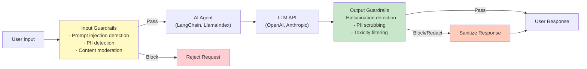

## Security Components by Domain

This section provides deep-dives into 6 security domains with 40+ product comparisons.

### Domain 1: Guardrails (Input/Output Safety)

**Purpose**: Validate and filter AI agent inputs and outputs to prevent prompt injection, PII leakage, toxicity, and hallucinations.

**Why Critical**: Guardrails are the **first and last line of defense** in AI security—they prevent malicious inputs and sanitize outputs before reaching users or systems.

#### Guardrails Flow Architecture



---

#### Product 1: NVIDIA NeMo Guardrails

**Overview**: Most comprehensive open-source guardrails framework with programmable security policies.

**Key Features**:
1. **Colang DSL**: Domain-specific language for defining guardrail policies
2. **Input/Output Validation**: Topical rails (allowed conversation topics), jailbreak detection
3. **Fact-Checking Rails**: Verify LLM outputs against knowledge bases
4. **Moderation Rails**: Built-in content moderation (toxicity, violence, hate speech)
5. **LangChain Integration**: Native integration via `NeMoGuardrailsChain`
6. **Multi-Model Support**: Works with OpenAI, Anthropic, Cohere, local models

**Architecture**:
- **Colang Runtime**: Executes policy rules before/after LLM calls
- **Rails Library**: Pre-built rails (jailbreak, hallucination, PII, moderation)
- **Custom Rails**: Write Python functions for domain-specific validation

**Specifications**:

| Dimension | Details |
|-----------|----------|
| **License** | Apache 2.0 (open-source) |
| **Language** | Python 3.8+ |
| **Deployment** | Self-hosted (Docker, Kubernetes) |
| **LLM Support** | OpenAI, Anthropic, Cohere, HuggingFace, local |
| **Framework Integration** | LangChain, LlamaIndex (via adapters) |
| **Latency** | +50-200ms per request |
| **Pricing** | Free (self-hosted), compute costs only |
| **Community** | 4.1K+ GitHub stars, active development |

**Strengths**:
- ✅ Most flexible and programmable guardrails system
- ✅ Active NVIDIA backing (continuous updates)
- ✅ LangChain native integration
- ✅ Comprehensive rail library (jailbreak, hallucination, PII, moderation)
- ✅ Self-hosted (full control over data)
- ✅ Multi-model support (not locked to specific LLM)

**Limitations**:
- ❌ Steeper learning curve (Colang DSL)
- ❌ Self-managed infrastructure (DevOps overhead)
- ❌ No built-in UI for policy management
- ❌ Requires Python expertise for custom rails

**Best For**:
- Enterprises requiring full control and customization
- LangChain-based applications
- Teams with Python/ML expertise
- Self-hosted/on-prem deployments

**Adoption**: NVIDIA internal AI applications, Fortune 500 enterprises

**GitHub**: https://github.com/NVIDIA/NeMo-Guardrails

---

#### Product 2: Guardrails AI

**Overview**: Python framework for structured output validation with validators and correctors.

**Key Features**:
1. **Validators Library**: 50+ pre-built validators (PII, toxicity, format, semantic)
2. **Output Correction**: Automatically fix invalid outputs (redact PII, remove toxicity)
3. **Pydantic Integration**: Validate outputs against Pydantic schemas
4. **LangChain Integration**: `GuardrailsOutputParser` for LangChain
5. **Streaming Support**: Real-time validation for streaming LLM responses
6. **Guardrails Hub**: Community-contributed validators

**Architecture**:
- **Guard Object**: Define validation rules (validators + correctors)
- **Validator Chain**: Execute validators sequentially on outputs
- **Correctors**: Auto-fix invalid outputs (rewrite, redact, reject)

**Specifications**:

| Dimension | Details |
|-----------|----------|
| **License** | Apache 2.0 (open-source) |
| **Language** | Python 3.8+ |
| **Deployment** | Self-hosted, Guardrails Cloud (beta) |
| **LLM Support** | All LLMs (model-agnostic) |
| **Framework Integration** | LangChain, LlamaIndex |
| **Latency** | +10-100ms per request |
| **Pricing** | Free (self-hosted), Cloud TBD |
| **Community** | 3.9K+ GitHub stars |

**Strengths**:
- ✅ Structured output validation (Pydantic schemas)
- ✅ 50+ pre-built validators (growing library)
- ✅ Output correction (not just blocking)
- ✅ Streaming support (real-time validation)
- ✅ Lightweight (low latency overhead)
- ✅ Model-agnostic (works with any LLM)

**Limitations**:
- ❌ Less comprehensive than NeMo (no Colang DSL)
- ❌ Primarily output-focused (input validation basic)
- ❌ No built-in jailbreak detection (requires custom validator)
- ❌ Guardrails Cloud still in beta

**Best For**:
- Structured output validation (JSON, XML, SQL)
- Teams prioritizing output correctness
- Lightweight guardrails with minimal latency
- Python-first development teams

**Adoption**: Startups, AI-first companies

**GitHub**: https://github.com/guardrails-ai/guardrails

---

#### Product 3: LangChain Guardrails (Built-in)

**Overview**: Native guardrails built into LangChain framework.

**Key Features**:
1. **Prompt Templates with Validation**: Validate inputs in prompt templates
2. **Output Parsers**: Structured output parsing with error handling
3. **Moderation Chains**: Integration with OpenAI Moderation API
4. **Custom Validators**: Write custom validation functions
5. **RunnableWithFallbacks**: Automatic fallback for failed validations

**Architecture**:
- **ValidationChain**: Wrap agents/chains with validation logic
- **Callbacks**: Validation callbacks for input/output monitoring
- **Fallback Strategy**: Define alternative flows for validation failures

**Specifications**:

| Dimension | Details |
|-----------|----------|
| **License** | MIT (open-source) |
| **Language** | Python 3.8+ |
| **Deployment** | Self-hosted (bundled with LangChain) |
| **LLM Support** | All LLMs supported by LangChain |
| **Framework Integration** | Native to LangChain |
| **Latency** | +5-50ms per request |
| **Pricing** | Free (part of LangChain) |
| **Community** | 98K+ GitHub stars (LangChain) |

**Strengths**:
- ✅ Zero additional dependencies (native to LangChain)
- ✅ Seamless integration with existing LangChain apps
- ✅ Low latency overhead
- ✅ Flexible (custom validators)
- ✅ Fallback strategies for graceful failures

**Limitations**:
- ❌ Basic features (no advanced jailbreak/hallucination detection)
- ❌ Requires manual integration of external guardrails (NeMo, Guardrails AI)
- ❌ No pre-built policy library
- ❌ LangChain-only (not portable)

**Best For**:
- LangChain-native applications
- Teams prioritizing simplicity over advanced features
- Rapid prototyping with basic validation

**Adoption**: Widely used in LangChain community

**Documentation**: https://python.langchain.com/docs/guides/safety/

---

#### Product 4: OpenAI Moderation API

**Overview**: OpenAI's content moderation service for detecting harmful content.

**Key Features**:
1. **Content Categories**: Hate, harassment, violence, self-harm, sexual content
2. **Severity Scores**: Per-category confidence scores (0-1)
3. **Multi-Language**: Supports 100+ languages
4. **Low Latency**: < 100ms response time
5. **Free Tier**: Included with OpenAI API access

**Specifications**:

| Dimension | Details |
|-----------|----------|
| **License** | Proprietary (OpenAI) |
| **API** | REST API |
| **Deployment** | Cloud-only (OpenAI managed) |
| **LLM Support** | Model-agnostic (works with any LLM) |
| **Latency** | < 100ms |
| **Pricing** | Free (included with OpenAI API) |

**Strengths**:
- ✅ Free and easy to use
- ✅ Low latency (< 100ms)
- ✅ Multi-language support
- ✅ Regular model updates by OpenAI
- ✅ No infrastructure required

**Limitations**:
- ❌ Content moderation only (no prompt injection/PII detection)
- ❌ OpenAI-dependent (vendor lock-in)
- ❌ Cloud-only (no self-hosted option)
- ❌ Limited customization (predefined categories)

**Best For**:
- Quick content moderation (hate speech, violence)
- OpenAI-based applications
- Budget-conscious teams

**Documentation**: https://platform.openai.com/docs/guides/moderation

---

#### Product 5: Microsoft Azure Content Safety

**Overview**: Azure's AI-powered content moderation service.

**Key Features**:
1. **Multi-Modal**: Text, image, video moderation
2. **Custom Categories**: Define custom content policies
3. **Blocklists**: Maintain blocklists of prohibited terms
4. **Severity Levels**: Configurable severity thresholds (0-7)
5. **Regional Compliance**: EU-specific models for GDPR

**Specifications**:

| Dimension | Details |
|-----------|----------|
| **License** | Proprietary (Microsoft) |
| **API** | REST API, SDKs (Python, .NET, Java) |
| **Deployment** | Cloud (Azure), hybrid (Azure Stack) |
| **Pricing** | $0.25 per 1,000 text transactions |
| **Latency** | < 150ms |

**Strengths**:
- ✅ Multi-modal (text, image, video)
- ✅ Custom categories and blocklists
- ✅ Enterprise-grade (SLA, compliance)
- ✅ Regional models for GDPR
- ✅ Azure ecosystem integration

**Limitations**:
- ❌ Azure-dependent (vendor lock-in)
- ❌ Cost scales with volume ($0.25/1K transactions)
- ❌ No prompt injection/jailbreak detection
- ❌ Requires Azure account

**Best For**:
- Azure-native applications
- Multi-modal content moderation
- Enterprises requiring SLA/compliance

**Documentation**: https://azure.microsoft.com/en-us/products/ai-services/ai-content-safety

---

#### Product 6: Amazon Bedrock Guardrails

**Overview**: AWS-native guardrails for Amazon Bedrock LLMs.

**Key Features**:
1. **Denied Topics**: Block conversations on specific topics
2. **Content Filters**: Hate, insults, sexual, violence (4 levels: none, low, medium, high)
3. **Word Filters**: Custom word/phrase blocklists
4. **PII Redaction**: Auto-redact PII in inputs/outputs
5. **Contextual Grounding**: Detect hallucinations vs source documents

**Specifications**:

| Dimension | Details |
|-----------|----------|
| **License** | Proprietary (AWS) |
| **Integration** | Amazon Bedrock only |
| **Deployment** | AWS Cloud |
| **Pricing** | $0.75 per 1,000 input tokens, $1.00 per 1,000 output tokens |
| **Latency** | +50-150ms |

**Strengths**:
- ✅ Native Bedrock integration (seamless)
- ✅ PII redaction built-in
- ✅ Contextual grounding (hallucination detection)
- ✅ AWS IAM integration for access control
- ✅ Enterprise-grade (SLA, compliance)

**Limitations**:
- ❌ Bedrock-only (not portable to other LLMs)
- ❌ Expensive ($0.75-$1.00 per 1K tokens)
- ❌ AWS-dependent (vendor lock-in)
- ❌ Limited customization vs open-source

**Best For**:
- AWS Bedrock users
- Enterprises requiring AWS compliance
- Teams prioritizing managed services over flexibility

**Documentation**: https://aws.amazon.com/bedrock/guardrails/

---

#### Product 7: LLM Guard

**Overview**: Open-source security toolkit for LLMs with 25+ scanners.

**Key Features**:
1. **Input Scanners**: Prompt injection, ban topics, secrets detection, PII detection
2. **Output Scanners**: Toxicity, bias, relevance, sensitive data, code
3. **Anonymization**: Replace PII with placeholders (reversible)
4. **Performance**: Optimized for low latency (< 50ms per scanner)
5. **API Server**: Standalone API for language-agnostic integration

**Specifications**:

| Dimension | Details |
|-----------|----------|
| **License** | MIT (open-source) |
| **Language** | Python 3.9+ |
| **Deployment** | Self-hosted (Docker, Kubernetes, API server) |
| **Pricing** | Free (self-hosted) |
| **Community** | 1.8K+ GitHub stars |

**Strengths**:
- ✅ 25+ pre-built scanners (growing)
- ✅ Anonymization with reversibility (maintain context)
- ✅ API server for non-Python apps
- ✅ Low latency (optimized for production)
- ✅ Active community

**Limitations**:
- ❌ Smaller community vs NeMo/Guardrails AI
- ❌ Less comprehensive documentation
- ❌ No framework-specific integrations (requires manual setup)

**Best For**:
- Teams requiring diverse scanner options
- API-based integration (non-Python apps)
- Self-hosted deployments

**GitHub**: https://github.com/protectai/llm-guard

---

#### Product 8: Patronus Lynx (Hallucination Detection)

**Overview**: Specialized hallucination detection model for RAG applications.

**Key Features**:
1. **Hallucination Scoring**: Confidence score (0-1) for hallucination likelihood
2. **RAG-Optimized**: Designed for retrieval-augmented generation
3. **Fast Inference**: < 200ms per evaluation
4. **Open Model**: Available on HuggingFace
5. **High Accuracy**: 96%+ accuracy on benchmark datasets

**Specifications**:

| Dimension | Details |
|-----------|----------|
| **License** | Apache 2.0 (model), proprietary (API) |
| **Deployment** | Self-hosted (HuggingFace), Patronus Cloud |
| **Pricing** | Free (self-hosted), Cloud: $0.01 per 1K tokens |
| **Latency** | < 200ms |

**Strengths**:
- ✅ Specialized for hallucination detection (best-in-class)
- ✅ RAG-optimized (contextual grounding)
- ✅ High accuracy (96%+)
- ✅ Open model (self-hostable)
- ✅ Low latency

**Limitations**:
- ❌ Hallucination detection only (not a full guardrails system)
- ❌ Requires integration with other tools for input/output filtering
- ❌ Patronus Cloud pricing adds up at scale

**Best For**:
- RAG applications prioritizing factuality
- Teams concerned about hallucinations
- Complementary to other guardrails (use with NeMo/Guardrails AI)

**HuggingFace**: https://huggingface.co/PatronusAI/Lynx-8B

---

#### Product 9: Got It AI (Enterprise Guardrails)

**Overview**: Enterprise platform for AI governance and guardrails.

**Key Features**:
1. **Policy Management UI**: No-code policy configuration
2. **Real-Time Monitoring**: Dashboard for guardrails violations
3. **Multi-Tenant**: Separate policies per team/department
4. **Audit Logs**: Compliance-ready audit trails
5. **Enterprise Support**: SLA, dedicated support

**Specifications**:

| Dimension | Details |
|-----------|----------|
| **License** | Proprietary |
| **Deployment** | Cloud, hybrid, on-prem |
| **Pricing** | Custom (starts ~$50K/year) |
| **Latency** | < 100ms |

**Strengths**:
- ✅ No-code UI (accessible to non-technical teams)
- ✅ Enterprise features (multi-tenant, audit, RBAC)
- ✅ Deployment flexibility (cloud, hybrid, on-prem)
- ✅ Dedicated support and SLA

**Limitations**:
- ❌ Expensive (enterprise pricing)
- ❌ Proprietary (vendor lock-in)
- ❌ Less flexible than open-source (NeMo, Guardrails AI)

**Best For**:
- Large enterprises (1000+ employees)
- Teams requiring no-code governance
- Regulated industries (finance, healthcare)

**Website**: https://www.got-it.ai/

---

#### Product 10: HuggingFace Chatbot Guardrails Arena

**Overview**: Community leaderboard for evaluating guardrails models.

**Key Features**:
1. **Guardrails Leaderboard**: Benchmark 50+ guardrails models
2. **Community Voting**: Human evaluation of guardrails effectiveness
3. **Open Datasets**: Public datasets for guardrails testing
4. **Model Comparison**: Side-by-side comparison of guardrails models

**Purpose**: Not a product, but a **resource** for evaluating and selecting guardrails models.

**Use Case**: Research best guardrails models for your use case before committing to a vendor.

**Website**: https://huggingface.co/spaces/ai-safety-arena/guardrails-arena

---

### Guardrails Product Comparison

#### Quick Comparison Table

| Product | Type | License | Deployment | Latency | Best For | Cost |
|---------|------|---------|------------|---------|----------|---------|
| **NVIDIA NeMo** | Framework | Open-source | Self-hosted | +50-200ms | LangChain apps, full control | Free |
| **Guardrails AI** | Framework | Open-source | Self-hosted | +10-100ms | Output validation, Python teams | Free |
| **LangChain** | Built-in | Open-source | Self-hosted | +5-50ms | LangChain-native apps | Free |
| **OpenAI Moderation** | API | Proprietary | Cloud | < 100ms | Quick content moderation | Free |
| **Azure Content Safety** | API | Proprietary | Cloud | < 150ms | Azure apps, multi-modal | $0.25/1K |
| **Bedrock Guardrails** | API | Proprietary | Cloud | +50-150ms | AWS Bedrock users | $0.75-1.00/1K |
| **LLM Guard** | Framework | Open-source | Self-hosted | < 50ms | Diverse scanners, API-based | Free |
| **Patronus Lynx** | Model | Open-source | Self/Cloud | < 200ms | Hallucination detection (RAG) | Free/$0.01/1K |
| **Got It AI** | Platform | Proprietary | Hybrid | < 100ms | Enterprise governance | ~$50K/yr |
| **HF Guardrails Arena** | Benchmark | Open | Web | N/A | Model evaluation | Free |

---

#### Decision Matrix: Choosing a Guardrails Solution

**For Open-Source + Full Control**:
- → **NVIDIA NeMo Guardrails** (most comprehensive, LangChain integration)
- Alternative: **Guardrails AI** (lightweight, output-focused)

**For OpenAI Users**:
- → **OpenAI Moderation API** (free, easy) + **Patronus Lynx** (hallucination detection)

**For AWS Users**:
- → **Amazon Bedrock Guardrails** (native integration, PII redaction)

**For Azure Users**:
- → **Azure Content Safety** (multi-modal, enterprise-grade)

**For RAG Applications**:
- → **Patronus Lynx** (hallucination detection) + **NeMo/Guardrails AI** (input/output validation)

**For Enterprises (1000+ employees)**:
- → **Got It AI** (no-code UI, governance) or **NeMo** (if DevOps team available)

**For Budget-Conscious Startups**:
- → **LangChain** (built-in, zero cost) → upgrade to **NeMo** as needs grow

---

#### Guardrails Implementation Maturity

**Level 1 (Basic)**: Content moderation only
- Tools: OpenAI Moderation API, Azure Content Safety
- Protects: Hate speech, violence, toxicity
- Effort: 1 day

**Level 2 (Intermediate)**: + Input validation + PII detection
- Tools: LangChain + OpenAI Moderation + basic PII regex
- Protects: + Prompt injection (basic), PII leakage
- Effort: 1 week

**Level 3 (Advanced)**: + Jailbreak detection + Hallucination detection
- Tools: NeMo Guardrails or Guardrails AI + Patronus Lynx
- Protects: + Jailbreaking, hallucinations, custom policies
- Effort: 2-4 weeks

**Level 4 (Enterprise)**: + Governance + Multi-tenant + Audit
- Tools: NeMo + LangSmith (observability) or Got It AI
- Protects: + Policy enforcement, audit trails, RBAC
- Effort: 8-12 weeks

**Recommendation**: Start at **Level 2** (1 week effort, 80% risk reduction), then incrementally upgrade to Level 3-4 as needs dictate.

---

## Product Comparison by Category

### Category 1: Guardrails Solutions

**Summary**: This section covered 10 guardrails products. See comparison table above for quick decision guide.

**Next**: Sections 3.2-3.6 will cover the remaining 5 security domains (Identity, Data, Application, Threat Detection, Observability) with 30+ additional products.

---

### Domain 2: Identity & Access Management

**Purpose**: Control who (users) and what (agents) can access AI systems and their underlying resources.

**Why Critical**: Prevents unauthorized access to AI agents and enforces least privilege for tool execution.

#### Key IAM Concepts for AI Agents

1. **User Authentication**: Human users accessing AI agents (SSO, 2FA/MFA)
2. **Agent Identity**: Each agent has unique identity for auditability
3. **Role-Based Access Control (RBAC)**: Users/agents assigned to roles with specific permissions
4. **Scope-Based Tool Access**: Agents can only invoke tools matching their scope
5. **Credential Management**: Secure storage of API keys, secrets, tokens

---

#### Product 1: AWS IAM (Identity and Access Management)

**Overview**: AWS's identity and access management service for controlling access to AWS resources.

**Key Features for AI Agents**:
1. **IAM Roles for Agents**: Assign temporary credentials via IAM roles
2. **Session Tokens**: Short-lived tokens (1-12 hours) for agent operations
3. **Policy-Based Access**: Fine-grained permissions (e.g., allow S3 read, deny delete)
4. **Integration with Bedrock**: Native IAM for Amazon Bedrock LLMs
5. **CloudTrail Logging**: Audit all agent actions

**Specifications**:

| Dimension | Details |
|-----------|----------|
| **License** | Proprietary (AWS) |
| **Deployment** | AWS Cloud |
| **Pricing** | Free (IAM service), pay for resources accessed |
| **Integration** | Native for AWS services (S3, DynamoDB, Lambda, Bedrock) |

**Strengths**:
- ✅ Industry-leading access control (mature, battle-tested)
- ✅ Temporary credentials (session tokens)
- ✅ Fine-grained policies (JSON-based)
- ✅ Extensive audit logs (CloudTrail)
- ✅ Free to use (no IAM service cost)

**Limitations**:
- ❌ AWS-only (not portable to other clouds)
- ❌ Complex policy syntax (steep learning curve)
- ❌ No built-in agent-to-agent authentication (requires custom solution)

**Best For**:
- AWS-native AI applications
- Teams using Amazon Bedrock
- Enterprises requiring audit compliance

**Documentation**: https://aws.amazon.com/iam/

---

#### Product 2: Azure Active Directory (Azure AD) / Microsoft Entra ID

**Overview**: Microsoft's comprehensive cloud identity and access management platform, rebranded as Microsoft Entra ID, providing advanced security features specifically designed for AI agent workloads.

**Key Features for AI Agents**:

1. **Conditional Access Policies**
   - **Risk-Based Authentication**: Real-time risk assessment (sign-in risk, user risk)
   - **Context-Aware**: Location, device, IP address, application sensitivity
   - **AI-Specific Policies**: Custom policies for Azure OpenAI Service access
   - **Session Controls**: Limit session lifetime for high-risk AI operations

2. **Managed Identities for AI Workloads**
   - **System-Assigned**: Automatic identity tied to Azure resource lifecycle
   - **User-Assigned**: Shared identity across multiple AI services
   - **Passwordless**: Zero credential management (no API keys to leak)
   - **Azure OpenAI Integration**: Native authentication for Azure OpenAI Service
   - **Token Acquisition**: Automatic Azure AD token refresh

3. **Workload Identities (Preview)**
   - **Service Principals**: Dedicated identities for AI agent applications
   - **Federated Credentials**: Trust external identity providers (GitHub Actions, Kubernetes)
   - **Certificate-Based Auth**: Use X.509 certificates for agent-to-agent

4. **Application Roles & Permissions**
   - **Custom App Roles**: Define agent-specific roles (ReadAgent, WriteAgent, AdminAgent)
   - **Scope-Based Permissions**: Fine-grained API permissions
   - **Consent Framework**: User/admin consent for agent tool access

5. **Azure RBAC Integration**
   - **Cognitive Services Contributor**: Full access to Azure OpenAI/AI services
   - **Cognitive Services User**: Read-only access (inference only)
   - **Cognitive Services OpenAI User**: Azure OpenAI Service specific role
   - **Custom Roles**: Define least-privilege roles for AI agents

6. **Multi-Tenant Architecture**
   - **B2B Collaboration**: Share AI agents across organizations
   - **B2C Identity**: Customer-facing AI agents with social logins
   - **Tenant Isolation**: Separate identities per customer/department

7. **Identity Protection**
   - **Risk Detections**: Leaked credentials, anonymous IP, atypical travel
   - **Automated Remediation**: Force password reset, block access
   - **Sign-in Risk Policies**: Real-time risk-based access decisions

8. **Privileged Identity Management (PIM)**
   - **Just-In-Time Access**: Temporary elevated permissions for agents
   - **Approval Workflows**: Require approval for high-privilege operations
   - **Access Reviews**: Periodic review of agent permissions

**Specifications**:

| Dimension | Details |
|-----------|----------|
| **License** | Free (External Identities), Premium P1: $6/user/month, Premium P2: $9/user/month |
| **Deployment** | Azure Cloud, hybrid (Azure AD Connect), Azure AD DS (domain services) |
| **Pricing** | Free tier: 50K MAU, P1/P2 for advanced features (Conditional Access, PIM) |
| **Integration** | Native: Azure OpenAI, AI Search, Cognitive Services, Bot Service, Machine Learning |
| **Compliance** | SOC 1/2/3, ISO 27001/27018, HIPAA BAA, FedRAMP High, PCI-DSS |
| **Availability** | 99.99% SLA (Premium), 60+ Azure regions |

**Advanced Features for AI Agents**:

**1. Conditional Access for Azure OpenAI**:
```json
{
  "displayName": "Require MFA for Azure OpenAI Access",
  "conditions": {
    "applications": {
      "includeApplications": ["Azure OpenAI Service"]
    },
    "users": {
      "includeRoles": ["AI Agent Operators"]
    },
    "signInRiskLevels": ["medium", "high"]
  },
  "grantControls": {
    "builtInControls": ["mfa"],
    "operator": "AND"
  }
}
```

**2. Managed Identity Code Example** (Python - Azure OpenAI):
```python
from azure.identity import DefaultAzureCredential
from openai import AzureOpenAI

# Automatic credential acquisition (Managed Identity or Azure CLI)
credential = DefaultAzureCredential()
token = credential.get_token("https://cognitiveservices.azure.com/.default")

# Azure OpenAI client with Managed Identity
client = AzureOpenAI(
    azure_endpoint="https://your-resource.openai.azure.com",
    api_version="2024-02-15-preview",
    azure_ad_token=token.token
)

response = client.chat.completions.create(
    model="gpt-4",
    messages=[{"role": "user", "content": "Hello"}]
)
```

**3. Workload Identity for Kubernetes**:
```yaml
apiVersion: v1
kind: ServiceAccount
metadata:
  name: ai-agent-sa
  annotations:
    azure.workload.identity/client-id: "<managed-identity-client-id>"
---
apiVersion: apps/v1
kind: Deployment
metadata:
  name: ai-agent
spec:
  template:
    metadata:
      labels:
        azure.workload.identity/use: "true"
    spec:
      serviceAccountName: ai-agent-sa
      containers:
      - name: agent
        image: myregistry.azurecr.io/ai-agent:latest
```

**Strengths**:
- ✅ **Passwordless AI Authentication**: Managed Identities eliminate API key management
- ✅ **Conditional Access**: Risk-based policies specifically for AI workloads
- ✅ **Azure OpenAI Native**: Seamless integration with Azure OpenAI Service
- ✅ **Workload Identities**: Support for Kubernetes, GitHub Actions, and CI/CD
- ✅ **Enterprise Compliance**: SOC 2, ISO 27001, HIPAA, FedRAMP High
- ✅ **Identity Protection**: AI-powered anomaly detection for sign-ins
- ✅ **PIM Integration**: Just-in-time access for sensitive AI operations
- ✅ **Multi-Tenant**: Separate identities per customer/department
- ✅ **Microsoft Ecosystem**: Seamless integration with Teams, Office 365, Power Platform
- ✅ **Hybrid Support**: On-prem Active Directory integration via Azure AD Connect

**Limitations**:
- ❌ **Azure-Centric**: Optimized for Azure services (less portable to AWS/GCP)
- ❌ **Premium Licensing**: Advanced features (Conditional Access, PIM) require P1/P2 ($6-$9/user/month)
- ❌ **Complexity**: Steep learning curve for advanced features
- ❌ **Managed Identity Limitations**: Only works within Azure (not for external APIs)
- ❌ **Regional Restrictions**: Some features not available in all Azure regions

**Best For**:
- **Azure OpenAI Service users**: Native integration with passwordless auth
- **Enterprises using Microsoft 365**: Unified identity across ecosystem
- **Regulated Industries**: HIPAA, FedRAMP, SOC 2 compliance requirements
- **Kubernetes Workloads**: Workload Identity for AKS-based AI agents
- **Multi-Tenant SaaS**: B2B/B2C scenarios with tenant isolation
- **Hybrid Environments**: On-prem + cloud identity integration

**Security Best Practices for AI Agents**:
1. **Use Managed Identities**: Eliminate API keys for Azure services
2. **Enable Conditional Access**: Require MFA for Azure OpenAI access
3. **Implement PIM**: Just-in-time access for privileged operations
4. **Configure Identity Protection**: Enable risk-based policies
5. **Use Custom Roles**: Define least-privilege RBAC roles
6. **Enable Audit Logs**: Monitor sign-ins and token acquisition
7. **Rotate Certificates**: For service principals using cert auth (90 days max)
8. **Separate Service Principals**: One per AI agent application

**Integration with Azure AI Services**:
- ✅ **Azure OpenAI Service**: Native Entra ID authentication
- ✅ **Azure AI Search**: Managed Identity for indexing/querying
- ✅ **Azure Cognitive Services**: Speech, Vision, Language with Entra ID
- ✅ **Azure Bot Service**: Identity-based bot authentication
- ✅ **Azure Machine Learning**: Managed Identity for training/inference
- ✅ **Azure Key Vault**: Managed Identity for secret retrieval

**Pricing Breakdown for AI Workloads**:
- **Free Tier**: 50,000 MAU (Monthly Active Users)
  - Basic authentication, SSO, MFA
  - External Identities (B2B/B2C)
  - No Conditional Access or PIM
- **Premium P1** ($6/user/month):
  - Conditional Access policies
  - Self-service password reset
  - Cloud app discovery
  - Hybrid identity (Azure AD Connect)
- **Premium P2** ($9/user/month):
  - Identity Protection (risk-based policies)
  - Privileged Identity Management (PIM)
  - Access Reviews
  - Entitlement Management

**Note**: Managed Identities are **free** (no per-identity charge)

**Real-World Use Case**:
**Company**: Healthcare AI Platform (HIPAA-compliant)
- **Challenge**: Secure Azure OpenAI access for 50 AI agents processing PHI
- **Solution**:
  - User-Assigned Managed Identity per agent application
  - Conditional Access: Require MFA + compliant device
  - Custom RBAC Role: "Healthcare AI Agent" (Azure OpenAI User + Key Vault Secrets User)
  - PIM: Just-in-time access for model fine-tuning operations
  - Identity Protection: Block sign-ins from risky locations
- **Result**: Zero API key leaks, HIPAA compliance, $8K/month savings (vs managing credentials)

**Documentation**:
- [Microsoft Entra ID](https://learn.microsoft.com/en-us/entra/identity/)
- [Managed Identities](https://learn.microsoft.com/en-us/entra/identity/managed-identities-azure-resources/)
- [Conditional Access](https://learn.microsoft.com/en-us/entra/identity/conditional-access/)
- [Azure OpenAI + Entra ID](https://learn.microsoft.com/en-us/azure/ai-services/openai/how-to/managed-identity)

---

#### Product 3: Okta

**Overview**: Cloud-native identity provider with extensive SSO and MFA capabilities.

**Key Features for AI Agents**:
1. **Universal SSO**: Single sign-on for 7,000+ pre-integrated apps
2. **Adaptive MFA**: Risk-based multi-factor authentication
3. **API Access Management**: OAuth 2.0/OIDC for API authentication
4. **Lifecycle Management**: Automated user provisioning/deprovisioning
5. **Developer APIs**: Programmatic access to identity management

**Specifications**:

| Dimension | Details |
|-----------|----------|
| **License** | Proprietary |
| **Deployment** | Cloud (Okta-managed) |
| **Pricing** | $2-$15/user/month (Workforce Identity), custom (Customer Identity) |
| **Integration** | 7,000+ pre-integrated apps, REST APIs |

**Strengths**:
- ✅ Cloud-agnostic (works with AWS, Azure, GCP)
- ✅ 7,000+ app integrations (largest ecosystem)
- ✅ Developer-friendly APIs
- ✅ Adaptive MFA (risk-based)
- ✅ Enterprise-grade (SOC 2, ISO 27001, FedRAMP)

**Limitations**:
- ❌ Cost scales with users ($2-$15/user/month)
- ❌ Vendor lock-in (proprietary)
- ❌ Requires Okta account/subscription

**Best For**:
- Multi-cloud environments
- Enterprises with diverse app ecosystem
- Teams prioritizing SSO and MFA

**Website**: https://www.okta.com/

---

#### Product 4: Auth0 (by Okta)

**Overview**: Developer-first authentication and authorization platform.

**Key Features for AI Agents**:
1. **Customizable Auth Flows**: Build custom authentication logic
2. **Social Login**: Google, GitHub, Microsoft, etc.
3. **Machine-to-Machine Auth**: OAuth 2.0 client credentials for agents
4. **Rules Engine**: JavaScript-based custom logic for auth flows
5. **Extensive SDKs**: Python, JavaScript, Java, Go, etc.

**Specifications**:

| Dimension | Details |
|-----------|----------|
| **License** | Proprietary |
| **Deployment** | Cloud (Auth0-managed), self-hosted (Enterprise) |
| **Pricing** | Free (7,500 MAU), $35-$240/month (paid plans) |
| **Integration** | REST APIs, SDKs for 10+ languages |

**Strengths**:
- ✅ Developer-friendly (extensive documentation, SDKs)
- ✅ Generous free tier (7,500 MAU)
- ✅ Machine-to-machine auth (perfect for agents)
- ✅ Customizable (Rules Engine)
- ✅ Fast integration (hours, not days)

**Limitations**:
- ❌ Cost scales with MAU (monthly active users)
- ❌ Advanced features require paid plans
- ❌ Owned by Okta (may converge with Okta over time)

**Best For**:
- Developer teams prioritizing speed
- Startups with limited auth budget
- Agent-to-agent authentication (machine-to-machine)

**Website**: https://auth0.com/

---

#### Product 5: HashiCorp Vault

**Overview**: Secrets management platform for API keys, passwords, and certificates.

**Key Features for AI Agents**:
1. **Dynamic Secrets**: Generate short-lived credentials on-demand
2. **Secret Leasing**: Automatic secret rotation
3. **Encryption as a Service**: Encrypt data without managing keys
4. **Audit Logs**: Complete audit trail for secret access
5. **Multi-Cloud**: Works with AWS, Azure, GCP, Kubernetes

**Specifications**:

| Dimension | Details |
|-----------|----------|
| **License** | Open-source (MPL 2.0) + Enterprise (proprietary) |
| **Deployment** | Self-hosted, HCP Vault (cloud-managed) |
| **Pricing** | Free (OSS), HCP: $0.03/hour per instance, Enterprise: custom |
| **Integration** | Native integrations for AWS, Azure, GCP, Kubernetes, databases |

**Strengths**:
- ✅ Open-source (self-hosted option)
- ✅ Dynamic secrets (no long-lived credentials)
- ✅ Multi-cloud (not locked to specific vendor)
- ✅ Extensive integrations (databases, clouds, Kubernetes)
- ✅ Encryption as a Service

**Limitations**:
- ❌ Self-managed infrastructure (DevOps overhead)
- ❌ Complex setup and operations
- ❌ Requires Vault expertise

**Best For**:
- Multi-cloud environments
- Teams prioritizing dynamic secrets
- Enterprises with dedicated security team

**Website**: https://www.vaultproject.io/

---

#### Product 6: Ping Identity

**Overview**: Enterprise identity and access management platform.

**Key Features for AI Agents**:
1. **PingFederate**: Enterprise SSO and federation
2. **PingOne**: Cloud-based identity platform
3. **API Security**: OAuth 2.0, OIDC, SAML
4. **Risk-Based Authentication**: AI-powered fraud detection
5. **Compliance**: FedRAMP, HIPAA, PCI-DSS

**Specifications**:

| Dimension | Details |
|-----------|----------|
| **License** | Proprietary |
| **Deployment** | Cloud, hybrid, on-prem |
| **Pricing** | Custom (enterprise pricing, ~$100K+/year) |
| **Integration** | 1,000+ pre-integrated apps |

**Strengths**:
- ✅ Enterprise-grade (FedRAMP, HIPAA)
- ✅ Deployment flexibility (cloud, hybrid, on-prem)
- ✅ AI-powered risk detection
- ✅ Dedicated support

**Limitations**:
- ❌ Expensive (enterprise pricing)
- ❌ Overkill for small teams
- ❌ Complex implementation

**Best For**:
- Large enterprises (5,000+ employees)
- Regulated industries (government, healthcare)
- Organizations requiring FedRAMP

**Website**: https://www.pingidentity.com/

---


---

**Previous**: [Security Architecture Frameworks](02-security-frameworks.md)  
**Next**: [Data Security & Application Security](03b-data-appsec.md) - 5 data security + 6 app security products
