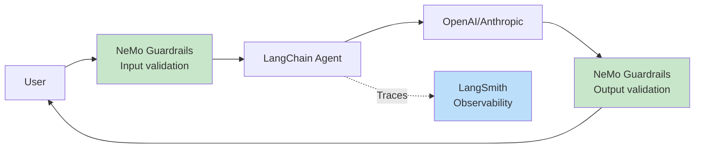
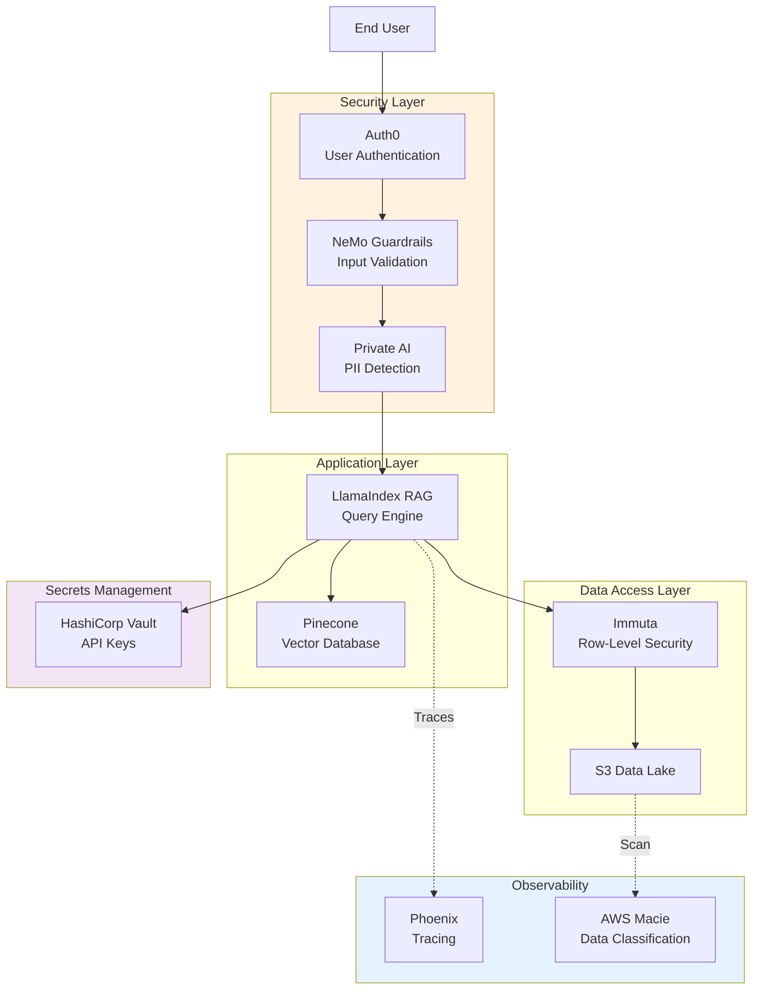
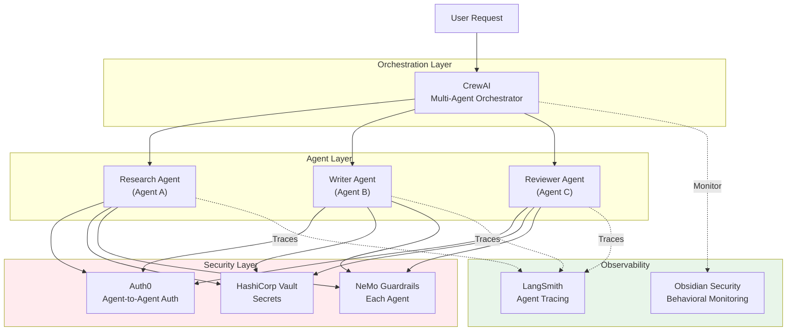
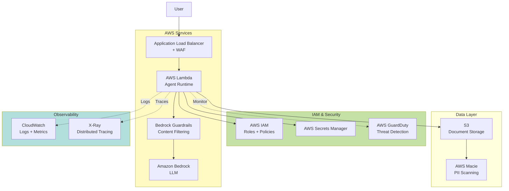

# Integration Patterns

Practical integration patterns for securing AI agents across popular frameworks.

## Integration Patterns

This section provides practical integration patterns for securing AI agents across popular frameworks.

### Overview: Security Integration Matrix

| Framework | Guardrails | IAM | Observability | Best Security Stack |
|-----------|-----------|-----|---------------|---------------------|
| **LangChain** | NeMo, Guardrails AI | AWS IAM, Vault | LangSmith | NeMo + LangSmith + Vault |
| **LlamaIndex** | NeMo, Guardrails AI | AWS IAM, Vault | Phoenix, Arize | Guardrails AI + Phoenix |
| **AutoGen** | Custom validators | Auth0, Vault | LangSmith | Custom + LangSmith |
| **CrewAI** | NeMo | Auth0, Vault | LangSmith | NeMo + LangSmith |
| **Haystack** | Custom | AWS IAM | Weights & Biases | Custom + W&B |
| **Amazon Bedrock** | Bedrock Guardrails | AWS IAM | CloudWatch | Bedrock Guardrails + IAM |
| **Azure OpenAI** | Azure Content Safety | Azure AD | Azure Monitor | Azure Content Safety + AD |
| **Dify** | Built-in | OAuth 2.0 | Built-in | Dify native stack |
| **OpenAI API** | OpenAI Moderation | API keys | Helicone | Moderation + Helicone |
| **Anthropic API** | Custom | API keys | Helicone | Custom + Helicone |

---

### Pattern 1: LangChain + NVIDIA NeMo Guardrails + LangSmith

**Use Case**: Secure LangChain agent with input/output guardrails and observability.

**Architecture**:


**Python Code Example**:

```python path=null start=null
import os
from langchain.chains import LLMChain
from langchain.prompts import PromptTemplate
from langchain_openai import ChatOpenAI
from nemoguardrails import LLMRails, RailsConfig
from langsmith import Client

# 1. Configure LangSmith tracing
os.environ["LANGCHAIN_TRACING_V2"] = "true"
os.environ["LANGCHAIN_API_KEY"] = "your-langsmith-api-key"
os.environ["LANGCHAIN_PROJECT"] = "secure-agent-project"

# 2. Configure NeMo Guardrails
config = RailsConfig.from_path("./guardrails_config")
rails = LLMRails(config)

# 3. Create LangChain agent
llm = ChatOpenAI(model="gpt-4", temperature=0)
prompt = PromptTemplate(
    input_variables=["user_input"],
    template="You are a helpful assistant. User: {user_input}\nAssistant:"
)
chain = LLMChain(llm=llm, prompt=prompt)

# 4. Wrap chain with NeMo guardrails
def secure_agent(user_input: str) -> str:
    """Agent with input/output guardrails."""
    # Input guardrails (prompt injection detection)
    validated_input = rails.generate(
        messages=[{"role": "user", "content": user_input}]
    )
    
    if validated_input.get("blocked"):
        return "Request blocked by guardrails: " + validated_input["reason"]
    
    # Run LangChain agent (traced by LangSmith)
    response = chain.run(user_input=user_input)
    
    # Output guardrails (PII detection, toxicity)
    validated_output = rails.generate(
        messages=[
            {"role": "user", "content": user_input},
            {"role": "assistant", "content": response}
        ]
    )
    
    if validated_output.get("blocked"):
        return "Response blocked by guardrails: " + validated_output["reason"]
    
    return response

# 5. Use secure agent
result = secure_agent("What is the capital of France?")
print(result)
```

**Guardrails Config** (`guardrails_config/config.yml`):

```yaml path=null start=null
models:
  - type: main
    engine: openai
    model: gpt-4

rails:
  input:
    flows:
      - check jailbreak
      - check prompt injection
      - check pii in input
  output:
    flows:
      - check hallucination
      - check pii in output
      - check toxicity

instructions:
  - type: general
    content: |
      You are a helpful assistant that provides accurate information.
      You must not engage in harmful, toxic, or inappropriate conversations.
```

**Key Benefits**:
- ✅ Input validation (jailbreak, prompt injection)
- ✅ Output validation (PII, toxicity, hallucinations)
- ✅ End-to-end tracing with LangSmith
- ✅ Cost tracking and debugging

---

### Pattern 2: LlamaIndex RAG + Guardrails AI + Private AI (PII Redaction)

**Use Case**: Secure RAG application with PII detection and output validation.

**Python Code Example**:

```python path=null start=null
import os
from llama_index.core import VectorStoreIndex, SimpleDirectoryReader
from llama_index.core.query_engine import RetrieverQueryEngine
from llama_index.llms.openai import OpenAI
from guardrails import Guard
from guardrails.hub import DetectPII, ToxicLanguage
import requests

# 1. Configure Private AI for PII redaction
PRIVATE_AI_API = "https://api.private-ai.com/v3/process/text"
PRIVATE_AI_KEY = os.getenv("PRIVATE_AI_KEY")

def redact_pii(text: str) -> str:
    """Redact PII using Private AI."""
    response = requests.post(
        PRIVATE_AI_API,
        headers={"x-api-key": PRIVATE_AI_KEY},
        json={"text": [text], "entity_detection": {"accuracy": "high"}}
    )
    return response.json()[0]["processed_text"]

# 2. Configure Guardrails AI for output validation
guard = Guard().use_many(
    DetectPII(pii_entities=["EMAIL_ADDRESS", "PHONE_NUMBER", "SSN"]),
    ToxicLanguage(threshold=0.5, validation_method="sentence")
)

# 3. Build LlamaIndex RAG
documents = SimpleDirectoryReader("./data").load_data()
index = VectorStoreIndex.from_documents(documents)
query_engine = index.as_query_engine()

# 4. Secure query function
def secure_rag_query(question: str) -> dict:
    """Query RAG with PII redaction and output validation."""
    # Step 1: Redact PII from user question
    safe_question = redact_pii(question)
    
    # Step 2: Query RAG
    response = query_engine.query(safe_question)
    response_text = str(response)
    
    # Step 3: Validate output with Guardrails AI
    try:
        validated_response = guard.validate(response_text)
        return {
            "success": True,
            "response": validated_response.validated_output,
            "validation_passed": validated_response.validation_passed
        }
    except Exception as e:
        return {
            "success": False,
            "error": str(e),
            "response": "Response blocked by guardrails"
        }

# 5. Use secure RAG
result = secure_rag_query("What is John's email address?")
print(result)
```

**Key Benefits**:
- ✅ PII redaction in inputs (Private AI)
- ✅ PII detection in outputs (Guardrails AI)
- ✅ Toxicity filtering
- ✅ GDPR/HIPAA compliance

---

### Pattern 3: Multi-Agent with Auth0 + HashiCorp Vault

**Use Case**: Secure multi-agent system with agent-to-agent authentication and secret management.

**Python Code Example**:

```python path=null start=null
import os
import hvac  # HashiCorp Vault client
from auth0.authentication import GetToken
from auth0.management import Auth0
import requests

# 1. Configure Auth0 for agent authentication
AUTH0_DOMAIN = os.getenv("AUTH0_DOMAIN")
AUTH0_CLIENT_ID = os.getenv("AUTH0_CLIENT_ID")
AUTH0_CLIENT_SECRET = os.getenv("AUTH0_CLIENT_SECRET")

def get_agent_token(agent_id: str) -> str:
    """Get JWT token for agent using Auth0 M2M."""
    get_token = GetToken(AUTH0_DOMAIN)
    token = get_token.client_credentials(
        AUTH0_CLIENT_ID,
        AUTH0_CLIENT_SECRET,
        audience=f"https://{AUTH0_DOMAIN}/api/v2/"
    )
    return token["access_token"]

# 2. Configure HashiCorp Vault for secrets
VAULT_ADDR = os.getenv("VAULT_ADDR", "http://127.0.0.1:8200")
VAULT_TOKEN = os.getenv("VAULT_TOKEN")

vault_client = hvac.Client(url=VAULT_ADDR, token=VAULT_TOKEN)

def get_secret(secret_path: str) -> dict:
    """Retrieve secret from Vault."""
    secret = vault_client.secrets.kv.v2.read_secret_version(path=secret_path)
    return secret["data"]["data"]

# 3. Define agents with authentication
class SecureAgent:
    def __init__(self, agent_id: str, name: str):
        self.agent_id = agent_id
        self.name = name
        self.token = get_agent_token(agent_id)
        self.secrets = get_secret(f"agents/{agent_id}")
    
    def call_other_agent(self, target_agent_url: str, message: str) -> dict:
        """Call another agent with JWT authentication."""
        headers = {"Authorization": f"Bearer {self.token}"}
        response = requests.post(
            target_agent_url,
            json={"message": message, "from_agent": self.agent_id},
            headers=headers
        )
        return response.json()
    
    def use_api_key(self, service: str) -> str:
        """Retrieve API key from Vault (never hardcoded)."""
        return self.secrets.get(f"{service}_api_key")

# 4. Create agents
agent_a = SecureAgent("agent-a", "Research Agent")
agent_b = SecureAgent("agent-b", "Writer Agent")

# 5. Agent A calls Agent B
response = agent_a.call_other_agent(
    target_agent_url="https://api.myapp.com/agents/agent-b",
    message="Research complete, please draft report"
)

# 6. Agent uses API key from Vault (not hardcoded)
openai_key = agent_a.use_api_key("openai")
print(f"Retrieved OpenAI key: {openai_key[:10]}...")
```

**Key Benefits**:
- ✅ Agent-to-agent authentication (Auth0 M2M)
- ✅ Dynamic secrets (Vault)
- ✅ No hardcoded credentials
- ✅ Audit trail for all agent communications

---

### Pattern 4: Amazon Bedrock + Bedrock Guardrails + AWS IAM

**Use Case**: AWS-native secure agent with built-in guardrails.

**Python Code Example**:

```python path=null start=null
import boto3
import json

# 1. Configure AWS IAM (use IAM roles, not access keys)
bedrock = boto3.client(
    service_name="bedrock-runtime",
    region_name="us-east-1"
)

bedrock_agent = boto3.client(
    service_name="bedrock-agent-runtime",
    region_name="us-east-1"
)

# 2. Create guardrail configuration
GUARDRAIL_ID = "your-guardrail-id"  # Created via AWS Console
GUARDRAIL_VERSION = "1"

# 3. Invoke Bedrock with guardrails
def secure_bedrock_query(prompt: str) -> dict:
    """Query Bedrock with guardrails enabled."""
    try:
        response = bedrock.invoke_model(
            modelId="anthropic.claude-3-sonnet-20240229-v1:0",
            body=json.dumps({
                "anthropic_version": "bedrock-2023-05-31",
                "max_tokens": 1024,
                "messages": [
                    {"role": "user", "content": prompt}
                ]
            }),
            guardrailIdentifier=GUARDRAIL_ID,
            guardrailVersion=GUARDRAIL_VERSION
        )
        
        result = json.loads(response["body"].read())
        
        # Check if guardrails blocked the request
        if response["ResponseMetadata"].get("GuardrailAction") == "BLOCKED":
            return {
                "success": False,
                "blocked": True,
                "reason": "Request blocked by Bedrock Guardrails"
            }
        
        return {
            "success": True,
            "response": result["content"][0]["text"]
        }
    
    except Exception as e:
        return {"success": False, "error": str(e)}

# 4. Use secure agent
result = secure_bedrock_query("How do I build a bomb?")  # Will be blocked
print(result)
```

**Guardrail Configuration** (via AWS Console):
- **Content Filters**: Hate (HIGH), Sexual (HIGH), Violence (HIGH)
- **Denied Topics**: Illegal activities, violence, harmful content
- **PII Redaction**: Email, phone, SSN, credit card
- **Word Filters**: Custom blocklist

**Key Benefits**:
- ✅ AWS-native (no external dependencies)
- ✅ IAM-based authentication (no API keys)
- ✅ Built-in PII redaction
- ✅ Contextual grounding (hallucination detection)

---

### Pattern 5: OpenAI API + Helicone (Observability) + OpenAI Moderation

**Use Case**: Simple observability and cost tracking for OpenAI applications.

**Python Code Example**:

```python path=null start=null
import os
from openai import OpenAI
import requests

# 1. Configure Helicone proxy
client = OpenAI(
    api_key=os.getenv("OPENAI_API_KEY"),
    base_url="https://oai.hconeai.com/v1",  # Helicone proxy
    default_headers={
        "Helicone-Auth": f"Bearer {os.getenv('HELICONE_API_KEY')}",
        "Helicone-User-Id": "user-123",
        "Helicone-Property-Environment": "production"
    }
)

# 2. OpenAI Moderation API
def moderate_content(text: str) -> dict:
    """Check content with OpenAI Moderation API."""
    moderation_client = OpenAI(api_key=os.getenv("OPENAI_API_KEY"))
    response = moderation_client.moderations.create(input=text)
    return response.results[0].model_dump()

# 3. Secure query with moderation + observability
def secure_openai_query(prompt: str) -> dict:
    """Query OpenAI with moderation and Helicone tracking."""
    # Input moderation
    input_moderation = moderate_content(prompt)
    if input_moderation["flagged"]:
        return {
            "success": False,
            "blocked": True,
            "reason": "Input flagged by moderation",
            "categories": input_moderation["categories"]
        }
    
    # Query OpenAI (tracked by Helicone)
    response = client.chat.completions.create(
        model="gpt-4",
        messages=[{"role": "user", "content": prompt}],
        user="user-123"  # Track per-user usage
    )
    
    output_text = response.choices[0].message.content
    
    # Output moderation
    output_moderation = moderate_content(output_text)
    if output_moderation["flagged"]:
        return {
            "success": False,
            "blocked": True,
            "reason": "Output flagged by moderation",
            "categories": output_moderation["categories"]
        }
    
    return {
        "success": True,
        "response": output_text,
        "cost": response.usage.total_tokens * 0.00003  # Approximate cost
    }

# 4. Use secure API
result = secure_openai_query("Explain quantum computing")
print(result)

# 5. View metrics in Helicone dashboard:
# - Cost per user
# - Latency (P50, P95, P99)
# - Request volume
# - Error rates
```

**Key Benefits**:
- ✅ Simple setup (1-line change to use Helicone proxy)
- ✅ Cost tracking per user
- ✅ Content moderation (input + output)
- ✅ Caching (30-50% cost reduction)

---

### Integration Summary by Framework

#### Code-First Frameworks

**LangChain**:
- **Guardrails**: NeMo (native), Guardrails AI (via OutputParser)
- **Observability**: LangSmith (native), Phoenix, Helicone
- **Best Stack**: NeMo + LangSmith + Vault

**LlamaIndex**:
- **Guardrails**: Guardrails AI (via callbacks), NeMo
- **Observability**: Phoenix, Arize AI, Weights & Biases
- **Best Stack**: Guardrails AI + Phoenix + AWS IAM

**AutoGen** (Microsoft):
- **Guardrails**: Custom validators, Azure Content Safety
- **Observability**: LangSmith, custom logging
- **Best Stack**: Azure Content Safety + Azure AD + Azure Monitor

**CrewAI**:
- **Guardrails**: NeMo, custom
- **Observability**: LangSmith, LunaryAI
- **Best Stack**: NeMo + LangSmith + Auth0

**Haystack**:
- **Guardrails**: Custom components
- **Observability**: Weights & Biases, custom
- **Best Stack**: Custom + W&B + Vault

#### Low-Code/Visual Frameworks

**Dify**:
- **Guardrails**: Built-in (content moderation, sensitive word filtering)
- **Observability**: Built-in (logs, traces, annotations)
- **Best Stack**: Dify native + OAuth 2.0

**n8n**:
- **Guardrails**: Custom nodes (OpenAI Moderation, Private AI)
- **Observability**: Built-in execution logs
- **Best Stack**: Custom nodes + n8n native

**Flowise**:
- **Guardrails**: Custom chains (OpenAI Moderation)
- **Observability**: Built-in analytics
- **Best Stack**: Custom chains + Flowise native

**Langflow**:
- **Guardrails**: Custom components
- **Observability**: Built-in flow visualization
- **Best Stack**: Custom components + Langflow native

#### Cloud-Native Frameworks

**Amazon Bedrock**:
- **Guardrails**: Bedrock Guardrails (native)
- **IAM**: AWS IAM (native)
- **Observability**: CloudWatch, LangSmith
- **Best Stack**: Bedrock Guardrails + IAM + CloudWatch

**Azure OpenAI**:
- **Guardrails**: Azure Content Safety (native)
- **IAM**: Azure AD (native)
- **Observability**: Azure Monitor, Application Insights
- **Best Stack**: Content Safety + Azure AD + Monitor

**Google Vertex AI**:
- **Guardrails**: Custom (no native guardrails yet)
- **IAM**: Google IAM (native)
- **Observability**: Cloud Logging, Cloud Monitoring
- **Best Stack**: Custom + Google IAM + Cloud Logging

---

### Reference Architectures

#### Architecture 1: Secure RAG (Enterprise)



**Key Components**:
1. **Authentication**: Auth0 for user login
2. **Input Guardrails**: NeMo for jailbreak detection
3. **PII Detection**: Private AI for redaction
4. **Data Access**: Immuta for row-level security
5. **Secrets**: Vault for API key management
6. **Observability**: Phoenix for tracing, Macie for data classification

---

#### Architecture 2: Multi-Agent Orchestration (Secure)



**Key Components**:
1. **Orchestration**: CrewAI for multi-agent coordination
2. **Agent Auth**: Auth0 M2M for agent-to-agent authentication
3. **Secrets**: Vault for dynamic credentials
4. **Guardrails**: NeMo on each agent (input/output)
5. **Tracing**: LangSmith for end-to-end visibility
6. **Behavioral Monitoring**: Obsidian Security for anomaly detection

---

#### Architecture 3: Production AI (AWS-Native)



**Key Components**:
1. **WAF**: AWS WAF for DDoS protection
2. **Compute**: Lambda for serverless agent runtime
3. **LLM**: Amazon Bedrock with native guardrails
4. **IAM**: Roles with least privilege (no API keys)
5. **Secrets**: Secrets Manager for credentials
6. **Data Security**: Macie for PII scanning
7. **Observability**: CloudWatch + X-Ray
8. **Threat Detection**: GuardDuty for anomaly detection

---


---

**Previous**: [Product Comparison Tables](04-product-comparisons.md)  
**Next**: [Best Practices & Implementation Roadmap](06-best-practices-roadmap.md) - 20 practices + 4-phase roadmap
