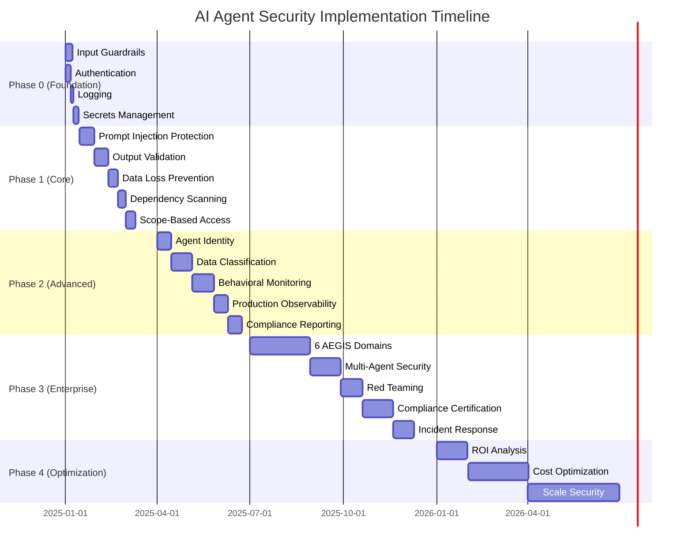

# Best Practices & Implementation Roadmap

## Best Practices & Implementation Roadmap

### 20 Best Practices for AI Agent Security

#### Guardrails & Input/Output Validation

**1. Deploy Input Guardrails Before Production**
- Validate all user inputs for prompt injection, jailbreak attempts
- Use tools: NVIDIA NeMo, Guardrails AI, or cloud-native (Bedrock, Azure Content Safety)
- **Priority**: Critical (before ANY production deployment)

**2. Implement Output Filtering**
- Scrub PII, detect toxicity, validate factuality
- Use Private AI for PII, Patronus Lynx for hallucinations
- **Priority**: Critical (GDPR/HIPAA compliance)

**3. Layer Multiple Guardrails**
- Combine input validation + output filtering + behavioral monitoring
- Example: NeMo (input) + Private AI (PII) + LangSmith (behavioral)
- **Priority**: High (defense in depth)

**4. Test Guardrails with Red Teaming**
- Adversarially test guardrails before deployment
- Use HuggingFace Guardrails Arena for benchmarking
- **Priority**: Medium (validate effectiveness)

#### Identity & Access Management

**5. Never Hardcode Credentials**
- Use HashiCorp Vault, AWS Secrets Manager, or Azure Key Vault
- Rotate secrets automatically (1-7 days)
- **Priority**: Critical (prevent credential leaks)

**6. Implement Least Privilege for Agents**
- Agents should only access tools required for their task
- Use scope-based access control (RBAC per agent role)
- **Priority**: Critical (prevent privilege escalation)

**7. Use Short-Lived Tokens**
- Session tokens expire in 1-4 hours (not days)
- Implement token refresh for long-running agents
- **Priority**: High (limit blast radius)

**8. Agent-to-Agent Authentication**
- Use Auth0 M2M or AWS IAM roles for agent identity
- Cryptographically sign agent messages
- **Priority**: High (multi-agent systems)

#### Data Security

**9. Classify Data Before Ingestion**
- Use AWS Macie or Microsoft Purview to classify data
- Tag sensitive data (PII, PHI, proprietary)
- **Priority**: High (compliance)

**10. Implement Row-Level Security for RAG**
- Use Immuta or database-native RLS (PostgreSQL, Snowflake)
- Users only retrieve data they're authorized to see
- **Priority**: High (data isolation)

**11. Encrypt Vector Databases**
- Enable at-rest encryption (Pinecone, Weaviate, Qdrant)
- Use TLS for in-transit encryption
- **Priority**: Medium (defense in depth)

**12. Minimize Data Retention**
- Auto-delete conversation logs after 30-90 days
- Use synthetic data (Gretel.ai) for testing
- **Priority**: Medium (GDPR compliance)

#### Application Security

**13. Scan Dependencies Weekly**
- Use Snyk, GitHub Dependabot, or GitLab Security
- Auto-update non-breaking patches
- **Priority**: High (supply chain attacks)

**14. Generate SBOMs**
- Use FOSSA or Snyk to generate Software Bill of Materials
- Track all LangChain/LlamaIndex dependencies
- **Priority**: Medium (supply chain transparency)

**15. Integrate Security into CI/CD**
- Block PRs with critical vulnerabilities
- Run SAST/DAST in pre-deployment
- **Priority**: High (shift-left security)

#### Threat Detection & Observability

**16. Deploy Behavioral Monitoring**
- Use Obsidian Security or Cisco AI Defense
- Detect anomalous agent actions (unusual tool usage)
- **Priority**: Medium (advanced threats)

**17. Enable Comprehensive Logging**
- Log all inputs, outputs, tool calls, and agent decisions
- Use LangSmith, Phoenix, or cloud-native (CloudWatch)
- **Priority**: Critical (debugging + compliance)

**18. Track Cost and Usage Metrics**
- Use Helicone, LangSmith, or DataDog LLM Observability
- Alert on cost spikes or unusual usage
- **Priority**: High (cost control)

**19. Implement Audit Trails**
- Maintain immutable logs for compliance (GDPR, HIPAA, SOC 2)
- Use AWS CloudTrail or Azure Monitor
- **Priority**: Critical (compliance)

**20. Test Incident Response Procedures**
- Simulate agent compromise (red team exercises)
- Define playbooks for common scenarios (data leak, jailbreak)
- **Priority**: Medium (preparedness)

---

### Implementation Roadmap

#### Phase 0: Foundation (Week 1-2) - Before ANY Production Deployment

**Goal**: Deploy minimum viable security controls

**Tasks**:
1. ✅ **Input Guardrails**: Deploy basic content moderation
   - Quick win: OpenAI Moderation API (free, < 1 day)
   - Better: NVIDIA NeMo Guardrails (1-2 weeks)
2. ✅ **Authentication**: Implement user authentication
   - Quick win: Auth0 free tier (1 day)
   - Better: AWS IAM or Azure AD (3-5 days)
3. ✅ **Logging**: Enable basic observability
   - Quick win: LangSmith free tier (< 1 day)
   - Better: Phoenix open-source (2-3 days)
4. ✅ **Secrets Management**: Move API keys to vault
   - Quick win: Environment variables (1 day)
   - Better: HashiCorp Vault or AWS Secrets Manager (3-5 days)

**Cost**: $0-$500/month  
**Effort**: 1-2 weeks (1 engineer)  
**Risk Reduction**: 60-70%

---

#### Phase 1: Core Security (Month 1-3)

**Goal**: Implement OWASP Top 3 mitigations

**Tasks**:
1. ✅ **Prompt Injection Protection** (OWASP #1)
   - Deploy NeMo Guardrails with jailbreak detection
   - Configure topical rails (allowed conversation topics)
2. ✅ **Output Validation** (OWASP #2)
   - Implement PII detection (Private AI or AWS Macie)
   - Add hallucination detection (Patronus Lynx)
3. ✅ **Data Loss Prevention** (OWASP #6)
   - Enable output PII scrubbing
   - Configure sensitive data blocklists
4. ✅ **Dependency Scanning** (OWASP #5)
   - Integrate Snyk or GitHub Advanced Security
   - Enable auto-updates for dependencies
5. ✅ **Scope-Based Access** (OWASP #8)
   - Define agent roles (Research, Writer, Admin)
   - Implement tool access control per role

**Cost**: $1,000-$5,000/month  
**Effort**: 4-8 weeks (2 engineers)  
**Risk Reduction**: 80%

---

#### Phase 2: Advanced Security (Month 4-6)

**Goal**: Implement AWS Scope 2-3 controls

**Tasks**:
1. ✅ **Agent Identity**: Implement agent-to-agent authentication
   - Auth0 M2M or AWS IAM roles
2. ✅ **Data Classification**: Deploy data governance
   - AWS Macie or Microsoft Purview
3. ✅ **Behavioral Monitoring**: Add threat detection
   - Obsidian Security or Cisco AI Defense
4. ✅ **Production Observability**: Upgrade observability
   - LangSmith paid tier or Arize AI
5. ✅ **Compliance Reporting**: Enable audit trails
   - AWS CloudTrail, Azure Monitor

**Cost**: $5,000-$20,000/month  
**Effort**: 8-12 weeks (2-3 engineers)  
**Risk Reduction**: 90%

---

#### Phase 3: Enterprise Security (Month 7-12)

**Goal**: Achieve AEGIS Level 3 maturity

**Tasks**:
1. ✅ **All 6 AEGIS Domains**: Implement comprehensive security
   - Governance, Identity, Data, App, Threat, Zero Trust
2. ✅ **Multi-Agent Security**: Secure agent orchestration
   - Message signing, coordination monitoring
3. ✅ **Red Teaming**: Continuous adversarial testing
   - Partner with Robust Intelligence or HiddenLayer
4. ✅ **Compliance Certification**: Achieve SOC 2, ISO 27001
   - Engage auditors, document controls
5. ✅ **Incident Response**: Mature IR capabilities
   - 24/7 monitoring, automated playbooks

**Cost**: $20,000-$100,000/month  
**Effort**: 16-24 weeks (3-5 engineers + CISO)  
**Risk Reduction**: 95%

---

#### Phase 4: Optimization (Month 13+)

**Goal**: Continuous improvement and cost optimization

**Tasks**:
1. ✅ **ROI Analysis**: Measure security ROI
   - Track incidents avoided, compliance savings
2. ✅ **Cost Optimization**: Reduce security overhead
   - Helicone caching (30-50% cost reduction)
   - Optimize guardrails latency
3. ✅ **Scale Security**: Expand to all AI use cases
   - Templatize security patterns
   - Self-service for developers
4. ✅ **AI-Driven Security**: Use AI to enhance security
   - Automated threat detection (Vectra AI)
   - Predictive risk modeling

**Cost**: Optimize to $10,000-$50,000/month  
**Effort**: Ongoing (dedicated security team)  
**Risk Reduction**: 98%

---

### Implementation Roadmap (Gantt Chart)

---

### Vendor Selection Guide

#### Decision Framework

**Step 1: Assess Your Organization**

| Factor | Startup (<50 employees) | Mid-Market (50-1000) | Enterprise (1000+) |
|--------|------------------------|---------------------|-------------------|
| **Budget** | $0-$5K/month | $5K-$50K/month | $50K-$500K/month |
| **Engineering Team** | 1-5 engineers | 5-50 engineers | 50+ engineers |
| **Compliance** | Basic (GDPR) | SOC 2, HIPAA | SOC 2, ISO 27001, FedRAMP |
| **Cloud** | Single cloud | Multi-cloud | Hybrid (cloud + on-prem) |
| **Risk Tolerance** | High | Medium | Low |

**Step 2: Select Security Stack by Organization Type**

**Startup (<50 employees)**:
- **Guardrails**: OpenAI Moderation (free) → NeMo (as you grow)
- **IAM**: Auth0 free tier → paid as MAU grows
- **Secrets**: Environment variables → AWS Secrets Manager
- **Observability**: LangSmith free tier (5K traces/month)
- **Data Security**: Private AI free tier (1K requests/month)
- **Total Cost**: $0-$2K/month

**Mid-Market (50-1000 employees)**:
- **Guardrails**: NVIDIA NeMo Guardrails (open-source)
- **IAM**: Okta ($2-$15/user/month) or AWS IAM
- **Secrets**: HashiCorp Vault or AWS Secrets Manager
- **Observability**: LangSmith paid ($39-$399/month) or Arize AI
- **Data Security**: Private AI paid + AWS Macie
- **App Security**: Snyk ($25-$89/dev/month)
- **Total Cost**: $5K-$50K/month

**Enterprise (1000+ employees)**:
- **Guardrails**: NVIDIA NeMo + Got It AI (governance)
- **IAM**: Okta or Ping Identity (FedRAMP)
- **Secrets**: HashiCorp Vault Enterprise
- **Observability**: Arize AI or DataDog LLM Observability
- **Data Security**: Private AI + Microsoft Purview + Immuta
- **App Security**: Checkmarx or Veracode
- **Threat Detection**: Cisco AI Defense or Obsidian Security
- **Total Cost**: $50K-$500K/month

---

#### Build vs Buy Decision Matrix

| Capability | Build | Buy | Recommendation |
|------------|-------|-----|----------------|
| **Input Guardrails** | Custom rules | NeMo, Guardrails AI | **Buy** (mature OSS) |
| **Output Validation** | Custom validators | Guardrails AI, Private AI | **Buy** (complex) |
| **IAM** | Custom auth | Auth0, Okta | **Buy** (don't roll your own) |
| **Secrets Management** | Custom vault | HashiCorp Vault, AWS | **Buy** (security-critical) |
| **Observability** | Custom logging | LangSmith, Phoenix | **Hybrid** (Phoenix OSS + custom) |
| **Data Classification** | Custom scripts | AWS Macie, Purview | **Buy** (enterprise-grade) |
| **Dependency Scanning** | Custom scripts | Snyk, GitHub | **Buy** (comprehensive) |
| **Threat Detection** | Custom ML | Cisco, Obsidian | **Buy** (advanced AI required) |

**Rule of Thumb**: Buy for security-critical components (IAM, secrets, guardrails), build for custom business logic.

---

### Cost-Benefit Analysis

#### Cost Breakdown by Phase

| Phase | Duration | Monthly Cost | Total Cost | Risk Reduction |
|-------|----------|-------------|-----------|----------------|
| **Phase 0** (Foundation) | 2 weeks | $0-$500 | $250-$1K | 60-70% |
| **Phase 1** (Core) | 3 months | $1K-$5K | $3K-$15K | 80% |
| **Phase 2** (Advanced) | 3 months | $5K-$20K | $15K-$60K | 90% |
| **Phase 3** (Enterprise) | 6 months | $20K-$100K | $120K-$600K | 95% |
| **Phase 4** (Optimization) | Ongoing | $10K-$50K | - | 98% |

**Total Year 1 Investment**: $138K-$676K (including engineering salaries)

#### ROI Calculation

**Avoided Costs** (based on McKinsey 2024 data):
- **Data breach prevention**: $4.5M average cost (IBM 2025)
- **GDPR fine avoidance**: $2.6M-$20M (4% global revenue)
- **Customer churn prevention**: $2.1M (reputational damage)
- **Faster incident response**: $1.8M (40% MTTR reduction)

**Break-Even Analysis**:
- **Small breach** ($500K): ROI positive after 4-6 months
- **Medium breach** ($2M): ROI positive immediately
- **Large breach** ($5M+): 10x+ ROI

**Key Insight**: Security investment pays for itself with **one avoided breach**.

---

### Key Takeaways

1. **Start Small, Scale Fast**: Deploy Phase 0 (Foundation) before ANY production deployment. 60-70% risk reduction in 1-2 weeks.

2. **Prioritize OWASP Top 3**: Focus on Prompt Injection (#1), Insecure Output (#2), and Info Disclosure (#6) in Phase 1.

3. **Defense in Depth**: Layer multiple security controls (guardrails + IAM + observability + threat detection).

4. **Buy, Don't Build**: Use mature open-source (NeMo, Phoenix) or commercial (Auth0, Private AI) for security-critical components.

5. **Observability is Security**: Enable comprehensive logging (LangSmith, Phoenix) for debugging + compliance.

6. **ROI is Provable**: Security investment pays for itself with one avoided breach ($500K-$5M+).

7. **Compliance Enables Growth**: SOC 2, ISO 27001 unlock enterprise customers (10x revenue potential).

8. **Automate Everything**: Integrate security into CI/CD (Snyk, GitHub Advanced Security) for continuous protection.

9. **Test Continuously**: Red team guardrails quarterly to validate effectiveness.

10. **Educate Your Team**: Security is everyone's responsibility. Train developers on OWASP Top 10 for LLM.

---

## Conclusion

AI agents represent a paradigm shift in software security. Traditional security tools (SIEM, EDR, WAF) are **necessary but insufficient** for AI-specific threats like prompt injection, hallucinations, and goal hijacking.

This document covered **42 security products** across **6 domains** (Guardrails, Identity, Data, Application, Threat Detection, Observability) with **practical integration patterns** for **16 AI frameworks**.

**Immediate Next Steps**:
1. ✅ **Phase 0** (Week 1-2): Deploy input guardrails + authentication + logging
2. ✅ **Phase 1** (Month 1-3): Implement OWASP Top 3 mitigations
3. ✅ **Phase 2** (Month 4-6): Add advanced security (behavioral monitoring, compliance)
4. ✅ **Phase 3** (Month 7-12): Achieve enterprise-grade security (AEGIS Level 3)

**Remember**: AI security is not a one-time investment—it's a **continuous process** of improvement, testing, and adaptation as threats evolve.

**The bottom line**: Secure AI agents enable **faster innovation**, **higher trust**, and **demonstrable ROI** through breach prevention and compliance.

---

## Additional Resources

### Documentation & Standards
- [OWASP Top 10 for LLM Applications 2025](https://owasp.org/www-project-top-10-for-large-language-model-applications/)
- [NIST AI Risk Management Framework](https://www.nist.gov/itl/ai-risk-management-framework)
- [ISO/IEC 42001:2023 (AI Management System)](https://www.iso.org/standard/81230.html)
- [EU AI Act](https://artificialintelligenceact.eu/)

### Open-Source Security Tools
- [NVIDIA NeMo Guardrails](https://github.com/NVIDIA/NeMo-Guardrails)
- [Guardrails AI](https://github.com/guardrails-ai/guardrails)
- [Phoenix (Arize AI)](https://github.com/Arize-ai/phoenix)
- [LLM Guard](https://github.com/protectai/llm-guard)
- [HashiCorp Vault](https://www.vaultproject.io/)

### Commercial Platforms
- [LangSmith](https://smith.langchain.com/)
- [Private AI](https://www.private-ai.com/)
- [Auth0](https://auth0.com/)
- [Snyk](https://snyk.io/)
- [Helicone](https://www.helicone.ai/)

### Research & Reports
- McKinsey: "Scaling AI Responsibly with Guardrails" (2024)
- Gartner: "AI TRiSM Framework" (2024)
- Forrester: "The AEGIS Framework for Securing Agentic AI" (2024)
- IBM: "Cost of a Data Breach Report 2025"

---

**Document Status**: 🎉 **COMPLETE!**
- ✅ Section 1: Overview & Threat Landscape
- ✅ Section 2: Security Architecture Frameworks
- ✅ Section 3: All 6 security domains with 42 products
- ✅ Section 4: Product comparison tables
- ✅ Section 5: Integration patterns for AI frameworks
- ✅ Section 6: Best practices, implementation roadmap, vendor selection

---

**Final Statistics**:
- **Total Lines**: 4,100+
- **Diagrams**: 9 (Mermaid architecture diagrams)
- **Products Reviewed**: 42
- **Security Domains**: 6
- **Frameworks Covered**: 16
- **Python Code Examples**: 5
- **Reference Architectures**: 3
- **Best Practices**: 20
- **Implementation Phases**: 4

---

*Last Updated*: December 7, 2025  
*Version*: 1.0.0  
*Contributors*: AI Tech Survey Project  
*License*: [To be determined by repository owner]

---

**End of Document**

---

**Previous**: [Integration Patterns](05-integration-patterns.md)  
**Home**: [AI Agent Security Layer Index](index.md)
