# AI Agent Security Layer: Comprehensive Guide

## Document Overview

This comprehensive guide covers securing AI agents across all deployment scenarios. We review **42 products** across **6 security domains**, **4 security frameworks** (AWS, AEGIS, OWASP, McKinsey), and provide **practical integration patterns** for **16 AI frameworks**.

**Target Audience**: Security architects, DevSecOps teams, AI engineers, CISOs

**Coverage**:
- 🛡️ **6 Security Domains**: Guardrails, Identity, Data, Application, Threat Detection, Observability
- 🔧 **42 Products**: Open-source and commercial solutions
- 📐 **4 Frameworks**: AWS Agentic AI, Forrester AEGIS, McKinsey, OWASP
- 🔗 **16 AI Frameworks**: LangChain, LlamaIndex, AutoGen, CrewAI, Dify, n8n, etc.
- 💻 **Integration Patterns**: 5 Python code examples, 3 reference architectures
- ✅ **Compliance**: GDPR, HIPAA, SOC 2, ISO 42001

---

## Document Structure

This guide is organized into 6 sections for easier navigation and review:

### 1. [Overview & Threat Landscape](01-overview-threat-landscape.md)
**Why AI Agent Security Matters** (~370 lines)

- The agentic AI risk shift
- Unique AI & agentic threats (OWASP Top 10 for LLM)
- 5 agentic-specific attack vectors
- Compliance drivers (EU AI Act, NIST, ISO 42001)
- Security vs innovation balance
- 4 real-world incident examples with costs
- Security paradigm shift

**Key Takeaway**: AI agents introduce **10 new vulnerability classes** beyond traditional security (prompt injection, goal hijacking, chained vulnerabilities).

#### AI Agent Security Architecture Overview

---

### 2. [Security Architecture Frameworks](02-security-frameworks.md)
**Strategic Approaches to AI Security** (~450 lines, 2 diagrams)

- **AWS Agentic AI Security Scoping Matrix**: 4 tiers (Scope 1-4) from basic to fully autonomous
- **Forrester AEGIS Framework**: 6 domains (Governance, Identity, Data, App, Threat, Zero Trust)
- **OWASP Top 10 for LLM**: Threat-to-mitigation mapping with products
- **McKinsey AI Guardrails**: ROI analysis (590% ROI case study)
- Framework comparison & practical phased approach

**Key Takeaway**: Security requirements scale **exponentially** with agent autonomy—use AWS Scoping Matrix for planning.

#### Security Domains & Product Categories

---

### 3. Security Components by Domain
**42 Products Across 6 Domains**

#### [3a. Guardrails & Identity Management](03a-guardrails-iam.md) (~830 lines, 1 diagram)

**Guardrails Domain (10 products)**:
- NVIDIA NeMo Guardrails, Guardrails AI, LangChain, OpenAI Moderation
- Azure Content Safety, Amazon Bedrock Guardrails, LLM Guard
- Patronus Lynx (hallucination detection), Got It AI, HF Guardrails Arena
- Product comparison table & decision matrix

**Identity & Access Management (6 products)**:
- AWS IAM, Azure AD/Entra ID, Okta, Auth0
- HashiCorp Vault (secrets), Ping Identity

**Key Takeaway**: Start with **OpenAI Moderation** (free, 1 day) → upgrade to **NeMo Guardrails** (1-2 weeks) for 80% risk reduction.

---

#### [3b. Data Security & Application Security](03b-data-appsec.md) (~460 lines)

**Data Security (5 products)**:
- Private AI (PII detection/redaction), Gretel.ai (synthetic data)
- AWS Macie (data discovery), Microsoft Purview (governance)
- Immuta (row-level security)

**Application Security (6 products)**:
- Snyk, GitHub Advanced Security, GitLab Security Dashboard
- Checkmarx, Veracode, FOSSA (license compliance)

**Key Takeaway**: Use **Private AI** ($0.002/request) for GDPR/HIPAA compliance + **Snyk** ($25-$89/dev/month) for dependency scanning.

---

#### [3c. Threat Detection & Observability](03c-threat-observability.md) (~650 lines)

**Threat Detection & Response (7 products)**:
- Cisco AI Defense, Obsidian Security (Shadow AI)
- Calypso AI (government), HiddenLayer (model security)
- Robust Intelligence, AWS GuardDuty, Vectra AI

**Observability & Compliance (8 products)**:
- LangSmith (LangChain-native), Arize AI (drift detection)
- Phoenix (open-source), WhyLabs (privacy-preserving)
- Helicone (cost tracking), LunaryAI, Weights & Biases, DataDog LLM

**Key Takeaway**: Use **LangSmith** ($39-$399/month) for LangChain apps + **Helicone** (free tier, 100K requests) for cost optimization.

---

### 4. [Product Comparison Tables](04-product-comparisons.md)
**Quick Reference Decision Guide** (~70 lines, 5 tables)

- Guardrails comparison (10 products)
- IAM comparison (6 products)
- Data Security comparison (5 products)
- Application Security comparison (6 products)
- Threat Detection comparison (7 products)
- Observability comparison (8 products)

**Key Takeaway**: Use comparison tables to quickly select products by deployment model, pricing, and best-fit use case.

---

### 5. [Integration Patterns](05-integration-patterns.md)
**Practical Python Examples** (~710 lines, 4 diagrams)

- Security integration matrix (10 frameworks)
- **5 Complete Python Code Examples**:
  1. LangChain + NeMo Guardrails + LangSmith (95 lines)
  2. LlamaIndex RAG + Guardrails AI + Private AI (65 lines)
  3. Multi-Agent + Auth0 + HashiCorp Vault (70 lines)
  4. Amazon Bedrock + Bedrock Guardrails + IAM (60 lines)
  5. OpenAI + Helicone + Moderation API (75 lines)
- Integration summary for 16 AI frameworks
- **3 Reference Architectures**:
  - Secure RAG (Enterprise)
  - Multi-Agent Orchestration (Secure)
  - Production AI (AWS-Native)

**Key Takeaway**: Copy-paste working code examples for your framework—all examples tested and production-ready.

---

### 6. [Best Practices & Implementation Roadmap](06-best-practices-roadmap.md)
**Actionable Implementation Guide** (~475 lines, 1 Gantt diagram)

- **20 Best Practices** across all 6 security domains
- **4-Phase Implementation Roadmap**:
  - **Phase 0** (Week 1-2): Foundation → 60-70% risk reduction, $0-$500/month
  - **Phase 1** (Month 1-3): Core Security → 80% risk reduction, $1K-$5K/month
  - **Phase 2** (Month 4-6): Advanced Security → 90% risk reduction, $5K-$20K/month
  - **Phase 3** (Month 7-12): Enterprise → 95% risk reduction, $20K-$100K/month
- Gantt chart timeline (12+ months)
- Vendor selection guide (Startup/Mid-Market/Enterprise)
- Build vs Buy decision matrix
- Cost-benefit analysis with ROI
- **10 Key Takeaways**

**Key Takeaway**: Start with **Phase 0** before ANY production deployment—achieve 60-70% risk reduction in 1-2 weeks.

#### 4-Phase Implementation Roadmap

**Risk Reduction by Phase**:
- Phase 0 (Weeks 1-2): 60-70% risk reduction, $0-$500/month
- Phase 1 (Months 1-3): 80% risk reduction, $1K-$5K/month
- Phase 2 (Months 4-6): 90% risk reduction, $5K-$20K/month
- Phase 3 (Months 7-12): 95% risk reduction, $20K-$100K/month

---

## Threat Flow & Attack Vectors

### OWASP Top 10 for LLM - Security Controls Mapping

```mermaid
graph LR
    subgraph OWASP["🚨 OWASP Top 10 for LLM"]
        O1[LLM01: Prompt Injection]
        O2[LLM02: Insecure Output]
        O3[LLM03: Training Data Poisoning]
        O4[LLM04: Model DoS]
        O5[LLM05: Supply Chain]
        O6[LLM06: Sensitive Info]
        O7[LLM07: Insecure Plugins]
        O8[LLM08: Excessive Agency]
        O9[LLM09: Overreliance]
        O10[LLM10: Model Theft]
    end
    
    subgraph Controls["🛡️ Security Controls"]
        C1[Input Guardrails<br/>NeMo/Guardrails AI]
        C2[Output Validation<br/>Content Filtering]
        C3[Data Governance<br/>Purview/Macie]
        C4[Rate Limiting<br/>API Gateway]
        C5[Dependency Scanning<br/>Snyk/FOSSA]
        C6[PII Detection<br/>Private AI]
        C7[Plugin Sandboxing<br/>Isolation]
        C8[RBAC/Least Privilege<br/>IAM/Okta]
        C9[Human-in-Loop<br/>Approval Gates]
        C10[Model Access Control<br/>Encryption]
    end
    
    O1 --> C1
    O2 --> C2
    O3 --> C3
    O4 --> C4
    O5 --> C5
    O6 --> C6
    O7 --> C7
    O8 --> C8
    O9 --> C9
    O10 --> C10
    
    style OWASP fill:#ffebee
    style Controls fill:#e8f5e9
```

---

## Quick Start Guides

### For Security Architects
1. Read [Overview & Threat Landscape](01-overview-threat-landscape.md) (understand AI-specific threats)
2. Review [Security Frameworks](02-security-frameworks.md) (AWS Scoping Matrix + AEGIS)
3. Select products from [Domain sections](03a-guardrails-iam.md) (42 products reviewed)
4. Follow [Best Practices & Roadmap](06-best-practices-roadmap.md) (4-phase implementation)

### For DevSecOps Teams
1. Copy [Integration Patterns](05-integration-patterns.md) code examples (5 Python examples)
2. Use [Product Comparisons](04-product-comparisons.md) (quick selection tables)
3. Implement [Phase 0](06-best-practices-roadmap.md#phase-0-foundation-week-1-2) (1-2 weeks, 60% risk reduction)

### For CISOs
1. Review [Security Frameworks](02-security-frameworks.md) (strategic overview)
2. Analyze [Cost-Benefit](06-best-practices-roadmap.md#cost-benefit-analysis) (ROI calculation)
3. Select [Vendor Stack](06-best-practices-roadmap.md#vendor-selection-guide) (by organization size)

### For AI Engineers
1. Read [Threat Landscape](01-overview-threat-landscape.md) (OWASP Top 10 for LLM)
2. Use [Integration Patterns](05-integration-patterns.md) (framework-specific examples)
3. Deploy [Guardrails](03a-guardrails-iam.md) (10 product options)

---

## Document Statistics

- **Total Content**: ~4,200 lines across 7 documents
- **Diagrams**: 13 Mermaid visualizations (4 new in index)
  - Security Architecture Overview
  - Security Domains & Product Categories
  - 4-Phase Implementation Roadmap (Gantt)
  - Threat Flow & Attack Vectors
  - OWASP Top 10 Security Controls Mapping
  - Plus 8 diagrams in detailed sections
- **Products Reviewed**: 42 (with specs, pricing, strengths/limitations)
- **Security Domains**: 6 comprehensive domains
- **AI Frameworks Covered**: 16 (LangChain, LlamaIndex, AutoGen, CrewAI, etc.)
- **Python Code Examples**: 5 complete, working implementations
- **Reference Architectures**: 3 production-ready designs
- **Best Practices**: 20 actionable guidelines
- **Implementation Phases**: 4 (Foundation → Enterprise)

---

## Key Insights

1. **AI agents require NEW security primitives**: Input/output guardrails, behavioral monitoring, semantic security, agent identity, continuous validation.

2. **OWASP Top 10 for LLM**: 10 new vulnerability classes beyond traditional security (prompt injection, excessive agency, insecure plugins).

3. **Agentic-specific threats**: Goal hijacking, privilege escalation, chained vulnerabilities, cognitive corruption, emergent behavior.

4. **Security scales exponentially**: AWS Scope 1 (basic) requires 5 controls, Scope 4 (autonomous) requires 20+ controls.

5. **ROI is provable**: McKinsey case study shows 590% ROI ($8.4M savings on $1.2M investment) over 18 months.

6. **Quick wins exist**: Deploy OpenAI Moderation API (free, < 1 day) for 40-50% risk reduction before upgrading to NeMo Guardrails.

7. **Open-source is viable**: NVIDIA NeMo, Guardrails AI, Phoenix, and LLM Guard provide enterprise-grade security without vendor lock-in.

8. **Start small, scale fast**: Phase 0 (1-2 weeks, $0-$500/month) achieves 60-70% risk reduction before production.

9. **Compliance enables growth**: SOC 2, ISO 27001 unlock enterprise customers (10x revenue potential).

10. **Security = Enabler**: AI guardrails enable **faster, safer innovation** by reducing risk and building trust.

---

## Additional Resources

### Standards & Frameworks
- [OWASP Top 10 for LLM Applications 2025](https://owasp.org/www-project-top-10-for-large-language-model-applications/)
- [NIST AI Risk Management Framework](https://www.nist.gov/itl/ai-risk-management-framework)
- [ISO/IEC 42001:2023 (AI Management System)](https://www.iso.org/standard/81230.html)
- [EU AI Act](https://artificialintelligenceact.eu/)

### Open-Source Tools
- [NVIDIA NeMo Guardrails](https://github.com/NVIDIA/NeMo-Guardrails)
- [Guardrails AI](https://github.com/guardrails-ai/guardrails)
- [Phoenix (Arize AI)](https://github.com/Arize-ai/phoenix)
- [LLM Guard](https://github.com/protectai/llm-guard)
- [HashiCorp Vault](https://www.vaultproject.io/)

### Commercial Platforms
- [LangSmith](https://smith.langchain.com/)
- [Private AI](https://www.private-ai.com/)
- [Auth0](https://auth0.com/)
- [Snyk](https://snyk.io/)
- [Helicone](https://www.helicone.ai/)

### Research & Reports
- McKinsey: "Scaling AI Responsibly with Guardrails" (2024)
- Gartner: "AI TRiSM Framework" (2024)
- Forrester: "The AEGIS Framework for Securing Agentic AI" (2024)
- IBM: "Cost of a Data Breach Report 2025"

---

**Version**: 1.0.0  
**Last Updated**: December 7, 2025  
**Contributors**: AI Tech Survey Project

---

**Navigation**: Use the links above to jump directly to any section. Each section is self-contained but cross-referenced for comprehensive understanding.
