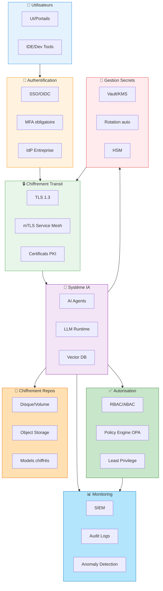

# Quel mecanisme de chiffrement, d'authentification, d'habiliation utiliser dans des processus AI

Pour des processus IA sensibles, les mécanismes de chiffrement, d'authentification et d'habilitation doivent suivre une logique Zero Trust : tout flux est chiffré, toute entité (humain ou agent) est authentifiée fortement, et chaque accès est limité au strict nécessaire.[^1][^2][^3]

## Architecture Zero Trust pour l'IA

## Chiffrement à privilégier

- En transit : TLS 1.2+ (idéalement 1.3) partout entre clients, API IA, brokers, stores de features et bases de data, avec vérification stricte des certificats et désactivation des suites faibles.[^4][^5][^1]
- Au repos : chiffrement disque/volume côté bases, object storage, files de messages, et stockage de models, avec gestion centralisée des clés (KMS, HSM ou Vault) et rotation régulière.[^6][^1][^4]
- Data très sensibles : combiner chiffrement avec tokenisation ou masquage dynamique des PII dans les inputs aux models, et logs systématiquement nettoyés des data brutes.[^7][^4][^6]

## Authentification des humains

- Utilisateurs finaux (UI, portails, IDE, outils RAG) : SSO (OIDC/SAML) connecté à l’IdP d’entreprise, MFA obligatoire pour les rôles sensibles (ops, data, security, administrateurs de models).[^2][^8][^3]
- Accès aux consoles d’admin IA (MLOps, orchestrateurs, vector DB) : authentification forte (MFA, FIDO2/Passkeys ou certificats) et interdiction des comptes partagés.[^9][^10][^2]

## Authentification des services et agents IA

- Entre microservices, pipelines, agents et backends :
    - Utiliser des identités de workload standardisées (SPIFFE/SVID, JWT signés par une PKI interne, ou OAuth2 client credentials) plutôt que des secrets statiques.[^11][^8][^12]
    - Préférer des credentials éphémères (tokens courts, rotation automatique, session‑based) et stockage uniquement dans des coffres chiffrés (Vault, KMS, Secret Manager), jamais dans le code ou les images.[^8][^13][^11]
- Pour les appels vers des API LLM externes :
    - Isolation des clés API par environnement et par application, rotation régulière, et filtrage réseau sortant pour limiter les destinations.[^13][^14][^1]

## Habilitation / autorisation

- Modèle d’accès : RBAC ou ABAC (attributs rôle, équipe, classification des data, contexte) combiné au principe de moindre privilège pour les utilisateurs et les agents IA.[^15][^16][^8]
- Data pour RAG / features :
    - Le filtrage des documents doit se faire côté backend fiable, pas par le modèle lui‑même (le LLM ne “décide” pas qui a le droit de voir quoi).[^16][^10]
    - Appliquer des filtres d’autorisations sur les requêtes au vectordb ou au data store (ex. scope utilisateur, attributs d’organisation, labels de sensibilité).[^16][^4]
- Agents IA :
    - Identité propre par agent, scopes d’API stricts, access tokens limités dans le temps et dans le périmètre, journaux d’actions complets pour audit.[^17][^11][^8]

## Controls complémentaires spécifiques IA

- Zero Trust IA / LLM :
    - Vérification systématique de l’identité à chaque requête, control dynamique selon la sensibilité du prompt et des data, monitoring en temps réel pour détecter prompt injections et comportements anormaux.[^18][^12][^2]
- Protection des pipelines :
    - Data minimization, DLP/anonymisation en amont du training, signatures ou checksums des datasets pour détecter data poisoning, et control d’accès strict au repo de models.[^19][^4][^6]

En pratique, pour une stack moderne : TLS 1.3 partout, KMS/Vault pour les clés, SSO OIDC + MFA pour les humains, SPIFFE/OAuth2 pour les workloads, RBAC/ABAC côté data et vector DB, tokens courts pour agents, et un SIEM branché sur les logs d’API IA et de pipelines.[^5][^1][^11][^16]
[^20]

⁂

[^1]: https://www.sysdig.com/learn-cloud-native/top-8-ai-security-best-practices

[^2]: https://blog.dreamfactory.com/zero-trust-for-llms-applying-security-principles-to-ai-systems

[^3]: https://www.checkpoint.com/fr/cyber-hub/cyber-security/what-is-ai-security/what-is-zero-trust-ai-access-ztai/

[^4]: https://dacodes.com/blog/safeguarding-sensitive-data-in-ai-pipelines

[^5]: https://learn.microsoft.com/en-us/azure/cloud-adoption-framework/scenarios/ai/infrastructure/security

[^6]: https://magedata.ai/whitepaper/securing-sensitive-data-in-ml-pipelines/

[^7]: https://www.sciencedirect.com/science/article/pii/S0167404823005151

[^8]: https://prefactor.tech/blog/5-best-practices-for-ai-agent-access-control

[^9]: https://blog.gitguardian.com/authentication-and-authorization/

[^10]: https://www.refontelearning.com/blog/securing-machine-learning-pipelines-best-practices-for-ai-security

[^11]: https://aembit.io/blog/how-to-secure-non-human-identities-for-ai-workloads/

[^12]: https://xage.com/unified-zero-trust-for-llms-and-ai-agents/

[^13]: https://cloudsecurityalliance.org/blog/2025/09/09/api-security-in-the-ai-era

[^14]: https://www.aikido.dev/blog/cloud-security-best-practices

[^15]: https://www.vanta.com/resources/ai-security-best-practices

[^16]: https://aws.amazon.com/blogs/security/implement-effective-data-authorization-mechanisms-to-secure-your-data-used-in-generative-ai-applications/

[^17]: https://arxiv.org/abs/2510.25819

[^18]: https://www.blackfog.com/zero-trust-approach-llm-prompt-injection-attacks/

[^19]: https://www.dsstream.com/post/security-for-mlops-how-to-safeguard-data-models-and-pipelines-against-modern-ai-threats

[^20]: https://www.aigl.blog/design-principles-for-llm-based-systems-with-zero-trust/

