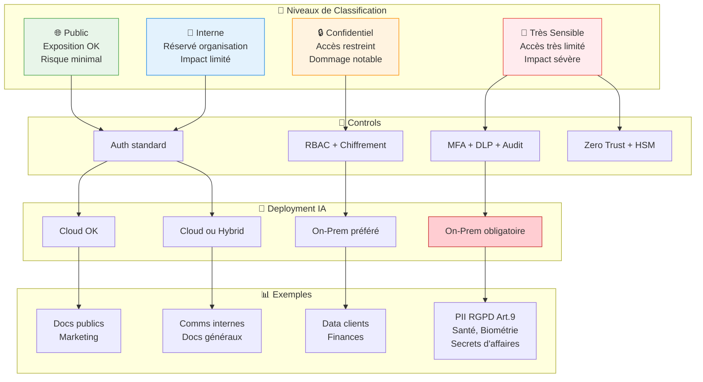

# Évaluer la sensibilité et classification des data

Pour évaluer la sensibilité des data et les classer, le plus efficace est d'adopter un modèle simple en 3–4 niveaux (Public, Interne, Confidentiel, Restreint/Très sensible) et d'y mapper les risques métier et réglementaires (RGPD, secret d'affaires, etc.).[^1][^2]

## Modèle de Classification des Data

## 1. Définir une grille de classification

La plupart des organisations utilisent 4 niveaux :

- Public : information destinée à être publiée, dont l’exposition ne crée pas de risque significatif.[^3][^4]
- Interne : data réservées à l’organisation, avec impact limité en cas de fuite (comms internes courantes, docs non sensibles).[^5][^3]
- Confidentiel : data dont l’accès non autorisé pourrait causer un dommage notable (clients, finances internes, IP non stratégique).[^6][^3]
- Restreint / Très sensible : data à impact sévère en cas de fuite (trade secrets, identifiants, data personnelles sensibles au sens RGPD, secrets défense).[^4][^7][^3]

## 2. Appliquer les critères d’évaluation

Pour chaque type de donnée, poser trois questions :

- Confidentialité : qui doit y avoir accès, et que se passe‑t‑il en cas de fuite (impact métier, réputationnel, juridique) ?[^8][^5]
- Réglementaire : la donnée est‑elle couverte par un texte spécifique (RGPD, “special category data” de l’art. 9 RGPD, PCI‑DSS, secret d’affaires, classification défense) ?[^9][^10][^11]
- Valeur / criticité : la donnée est‑elle stratégique (IP clé, algos, roadmap), ou facilement remplaçable / déjà publique ?[^3][^8]

Les data personnelles “sensibles” (origine ethnique, opinions politiques, santé, biométrie, orientation sexuelle, etc.) doivent systématiquement être placées dans le niveau le plus élevé (Restreint / Très sensible).[^12][^11][^9]

## 3. Processus pratique de classification

- Inventorier les sources : applications métier, bases de data, data lake, fichiers, mails, dépôts code, etc., en utilisant outils de découverte/scan lorsque possible.[^13][^14]
- Associer un niveau à chaque type de jeu de data (table, collection, bucket, repo), via une politique formalisée et des labels clairs (“Public”, “Interne”, “Confidentiel”, “Très sensible”).[^2][^14][^15]

L’objectif est de rester pragmatique : mieux vaut 3–4 niveaux bien compris et appliqués partout qu’un modèle trop fin qui ne sera pas utilisé.[^7][^1]

## 4. Lier classification et controls techniques

Pour chaque niveau, définir les controls minimaux :

- Public : accès large, peu de contraintes, pas forcément de chiffrement spécifique.[^4][^6]
- Interne : authentification standard, pas d’exposition externe, logs d’accès basiques.[^5][^6]
- Confidentiel : control d’accès fin (RBAC), chiffrement au repos et en transit, DLP, journalisation détaillée.[^14][^6][^5]
- Restreint / Très sensible : accès très limité, MFA obligatoire, micro‑segmentation, chiffrement fort, surveillance renforcée, éventuelles zones techniques dédiées.[^16][^7][^4]

Ces niveaux serviront ensuite de base pour décider où exécuter les workloads IA : poste, serveur on‑prem ou cloud et sous quelles conditions (anonymisation, pseudonymisation, etc.).[^2][^13]

## 5. Intégrer la sensibilité dans tes décisions IA

- Data “Restreint / Très sensible” : privilégier traitement sur poste ou on‑prem, voire interdiction d’envoi vers des LLM cloud non dédiés, sauf anonymisation forte.[^9][^7]
- Data “Confidentiel” : possible en cloud à certaines conditions (région, chiffrement, contrats), ou en mode hybride (RAG local, models génériques externes).[^6][^2]
- Data “Interne/Public” : utilisables plus librement en cloud ou via API.[^3][^5]

Si tu veux, tu peux donner quelques exemples de tes jeux de data (RH, patients, logs, code, etc.), et ils peuvent être classés concrètement dans cette grille avec recommandations de traitement associées.
[^17][^18][^19][^20]

⁂

[^1]: https://www.cyera.com/blog/four-levels-of-data-classification

[^2]: https://learn.microsoft.com/en-us/compliance/assurance/assurance-data-classification-and-labels

[^3]: https://dataclassification.fortra.com/blog/data-classification-levels-explained-enhance-data-security

[^4]: https://www.forcepoint.com/blog/insights/sensitive-data-classification 

[^5]: https://www.paloaltonetworks.com/cyberpedia/data-classification

[^6]: https://docs.aws.amazon.com/whitepapers/latest/data-classification/data-classification-models-and-schemes.html

[^7]: https://www.ceo-vision.com/en/content/data-classification-major-challenge

[^8]: https://www.spirion.com/solutions/what-is-a-data-risk-assessment

[^9]: https://verasafe.com/blog/special-categories-of-personal-data-under-the-gdpr/

[^10]: https://www.gdpreu.org/the-regulation/key-concepts/special-categories-personal-data/

[^11]: https://gdpr-info.eu/art-9-gdpr/

[^12]: http://www.dataprotection.ie/en/organisations/know-your-obligations/lawful-processing/special-category-data

[^13]: https://www.forcepoint.com/blog/insights/data-risk-assessment-guide

[^14]: https://learn.microsoft.com/en-us/compliance/assurance/assurance-create-data-classification-framework

[^15]: https://securiti.ai/data-classification-policy/

[^16]: https://www.dataguard.com/cyber-security/risk-management/

[^17]: https://www.csiro.au/en/research/technology-space/cyber/Metrics-and-frameworks-for-privacy-risk-assessments

[^18]: https://en.wikipedia.org/wiki/Classified_information

[^19]: https://ico.org.uk/for-organisations/uk-gdpr-guidance-and-resources/lawful-basis/special-category-data/what-is-special-category-data/

[^20]: https://www.indeed.com/career-advice/career-development/data-classification-types

