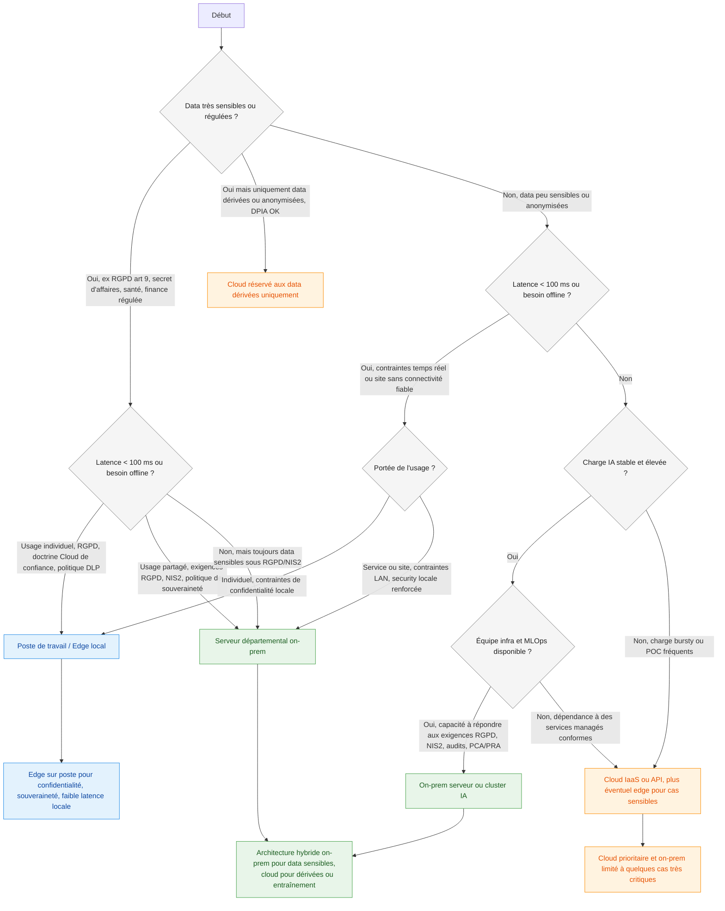

# ajoute les normes imposant du local/on-prem sur les fleches

Voici une version enrichie où les flèches qui poussent vers du local / on‑prem portent les principales références réglementaires ou exigences typiques.[^1][^2][^3][^4]

Les mentions RGPD (dont art. 9 pour catégories particulières), NIS2, politiques de souveraineté ou doctrines “cloud de confiance” sont typiquement celles qui justifient des traitements locaux/on‑prem dans les organisations européennes.[^2][^4][^5][^6]

⁂

[^1]: https://texter.ai/news/data-sovereignty-differences-betweend-eployment-on-prem-vs-cloud-based/

[^2]: https://www.kiteworks.com/gdpr-compliance/understand-and-adhere-to-gdpr-data-residency-requirements/

[^3]: https://ethon.ai/industrial-ai-on-premises-vs-cloud-based/

[^4]: https://verasafe.com/blog/special-categories-of-personal-data-under-the-gdpr/

[^5]: https://www.kyndryl.com/fr/fr/about-us/news/2025/11/data-sovereignty-and-enterprise-strategy

[^6]: https://www.ibm.com/think/topics/data-residency

