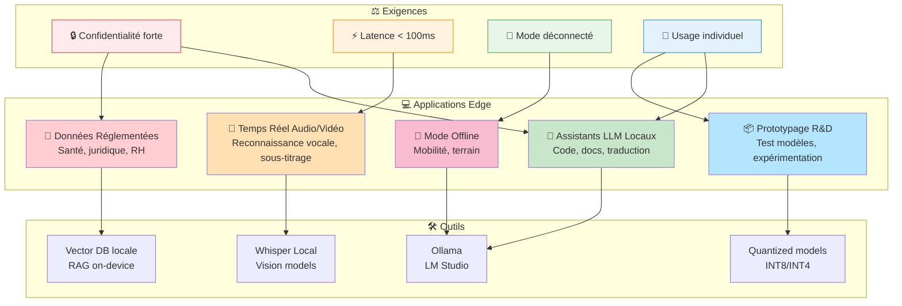

# Quels types d'applications conviennent le mieux à l'edge poste de travail

Les applications qui tirent le meilleur parti de l'edge sur poste de travail sont celles qui ont besoin de faible latence, de forte confidentialité des données ou d'un mode déconnecté, avec une charge limitée à un utilisateur ou un petit groupe.[^1][^2]

## Applications Idéales pour Edge Poste de Travail

## Assistants personnels et productivité

- Assistants LLM locaux (chat, complétion, traduction, résumé) pour développeurs ou knowledge workers, où le code source, les documents internes ou les mails ne doivent jamais sortir du poste.[^3][^4][^5]
- Copilotes dans l’IDE (VS Code, etc.), outils d’aide bureautique (résumé de docs, analyse de feuilles de calcul) ou d’assistance rédactionnelle directement sur le laptop/Mac.[^6][^3]

## Applications temps réel à faible latence

- Traitement audio/vidéo en direct : reconnaissance vocale locale, filtrage bruit, sous-titrage, vision temps réel pour webcam ou flux écran, où l’aller‑retour cloud serait trop lent ou instable.[^7][^2][^1]
- Applications interactives (UX réactive, jeux, XR) qui utilisent la vision ou la compréhension de scène en local pour conserver une bonne expérience même si la connexion varie.[^7][^1]

## Cas d’usage sensibles ou réglementés

- Analyse locale de données réglementées (santé, juridique, RH, code propriétaire) pour recherche sémantique, RAG, classification ou détection d’anomalies, afin d’éviter tout envoi vers un fournisseur externe.[^4][^8][^1]
- Diagnostics ou outils internes utilisés sur des postes durcis (admin, SOC, métiers) où la politique de sécurité impose que les données restent sur l’équipement.[^2][^1]

## Edge poste comme mini-serveur

- Micro‑services IA pour une petite équipe : un NUC / workstation avec GPU qui sert de point d’accès LLM/vision pour 2–10 personnes, tout en restant géré comme une machine utilisateur avancée.[^9][^4][^2]
- Automatisation locale (agents, scripts, assistants contextuels) pour gérer fichiers, mails, tickets ou logs sur le poste, sans dépendre d’une API externe.[^10][^4]

## Scénarios déconnectés ou intermittents

- Travail en mobilité (consultants, techniciens terrain) avec assistant, traduction, OCR/vision et RAG sur docs embarqués, utilisables même sans réseau.[^8][^1]
- Prototypage et R\&D : expérimenter rapidement des modèles quantifiés, pipelines d’inférence ou intégrations applicatives en local avant de porter en serveur ou cloud.[^5][^11][^4]

Si tu précises ton profil d’utilisateur (dev, analyste, terrain, etc.) et les ressources typiques d’un poste (CPU/GPU/RAM), une liste plus ciblée de patterns et d’outils (Ollama, LM Studio, runtimes, formats de modèles) peut être proposée.
[^12][^13][^14][^15][^16][^17][^18][^19][^20]

⁂

[^1]: https://www.imaginationtech.com/what-is-edge-ai/

[^2]: https://www.mirantis.com/blog/ai-focused-edge-inference-use-cases-and-guide-for-enterprise/

[^3]: https://www.edge-ai-vision.com/2025/07/edge-ai-today-real-world-use-cases-for-developers/

[^4]: https://brimlabs.ai/blog/personal-ai-that-runs-locally-how-small-llms-are-powering-privacy-first-experiences/

[^5]: https://www.cognativ.com/blogs/post/local-llm-models-basic-setup-and-use/258

[^6]: https://www.callstack.com/blog/local-llms-on-mobile-are-a-gimmick

[^7]: https://www.ti.com/technologies/edge-ai/edge-ai-use-cases.html

[^8]: https://www.abiresearch.com/blog/edge-ai-applications

[^9]: https://www.jaycon.com/top-10-edge-ai-hardware-for-2025/

[^10]: https://www.reddit.com/r/LocalLLM/comments/1kwq28k/what_are_your_use_cases_for_local_llms_and_which/

[^11]: https://iot.asus.com/blog/what-is-edge-ai/

[^12]: https://newsroom.arm.com/blog/seven-edge-ai-use-cases-powering-real-life

[^13]: https://perimattic.com/edge-ai-use-cases/

[^14]: https://www.st.com/content/st_com/en/st-edge-ai-suite/case-studies.html

[^15]: https://www.aiacceleratorinstitute.com/top-8-edge-computing-use-cases-examples/

[^16]: https://teguar.com/edge-ai-examples/

[^17]: https://www.ultralytics.com/blog/understanding-the-real-world-applications-of-edge-ai

[^18]: https://github.com/stevelaskaridis/awesome-mobile-llm

[^19]: https://www.databank.com/resources/blogs/ditching-ai-fantasies-for-practical-use-cases-high-performance-computing-at-the-edge-and-where-ai-fits/

[^20]: https://stlpartners.com/articles/edge-computing/10-edge-computing-use-case-examples/

