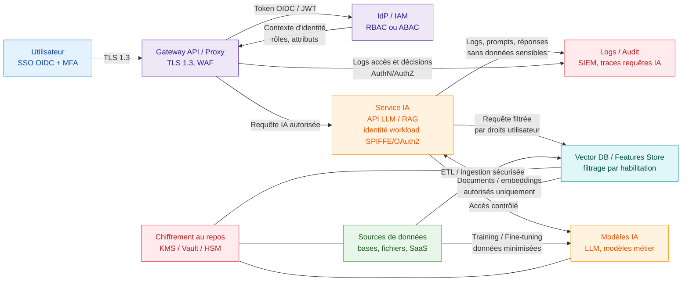

# peux-tu me faire un schema en couleur sur ce sujet

Un schéma simple couleur pour les mécanismes de chiffrement, authentification et habilitation dans un processus IA peut ressembler à ceci.[^1][^2]

Ce schéma illustre en couleurs :

- Bleu : utilisateur et entrée SSO/MFA.[^3][^4]
- Violet : AuthN/AuthZ centralisées (Gateway + IdP/IAM).[^5][^6]
- Jaune : services IA (API LLM, RAG, modèles).[^7][^1]
- Vert : données et stores (sources, vectordb/features).[^2][^8]
- Rouge : sécurité transversale (chiffrement, coffre‑fort à clés, logs/audit).[^1][^2]

Si tu veux, ce diagramme peut être adapté à ton stack concret (Ingress K8s, Istio, Vault, Keycloak, OpenSearch, etc.) avec des noms de composants précis.

⁂

[^1]: https://www.sysdig.com/learn-cloud-native/top-8-ai-security-best-practices

[^2]: https://dacodes.com/blog/safeguarding-sensitive-data-in-ai-pipelines

[^3]: https://blog.gitguardian.com/authentication-and-authorization/

[^4]: https://learn.microsoft.com/en-us/azure/cloud-adoption-framework/scenarios/ai/infrastructure/security

[^5]: https://aws.amazon.com/blogs/security/implement-effective-data-authorization-mechanisms-to-secure-your-data-used-in-generative-ai-applications/

[^6]: https://www.checkpoint.com/fr/cyber-hub/cyber-security/what-is-ai-security/what-is-zero-trust-ai-access-ztai/

[^7]: https://blog.dreamfactory.com/zero-trust-for-llms-applying-security-principles-to-ai-systems

[^8]: https://magedata.ai/whitepaper/securing-sensitive-data-in-ml-pipelines/

