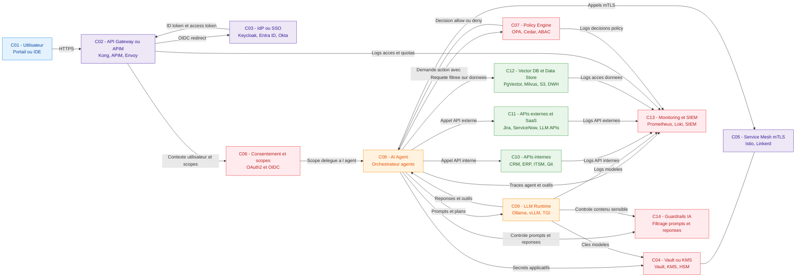

# met a jour le schema mermaod avec les ID des composants

Voici le schéma Mermaid mis à jour avec les IDs des composants (C01…C14) dans les labels.[^1][^2]

Les IDs C01–C14 correspondent aux lignes de la table précédente, ce qui facilite la navigation entre doc d’archi, diagrammes et spécifications détaillées.[^3][^1]

⁂

[^1]: https://learn.microsoft.com/en-us/azure/cloud-adoption-framework/scenarios/ai/infrastructure/security

[^2]: https://nordicapis.com/top-10-api-gateways-in-2025/

[^3]: https://liveblocks.io/blog/whats-the-best-vector-database-for-building-ai-products

